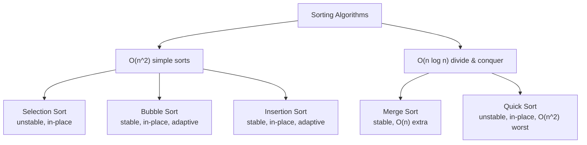
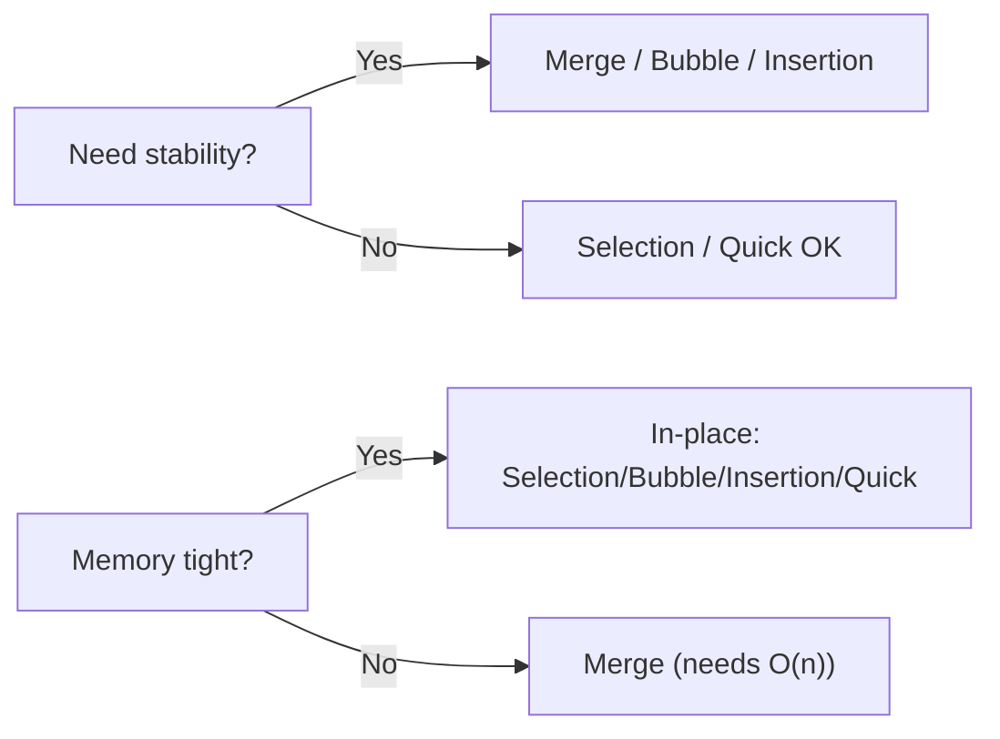
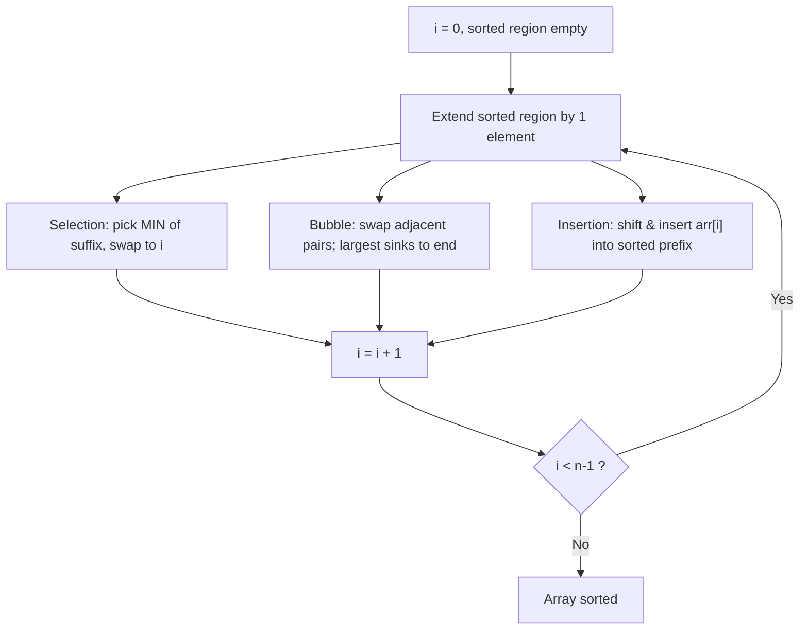
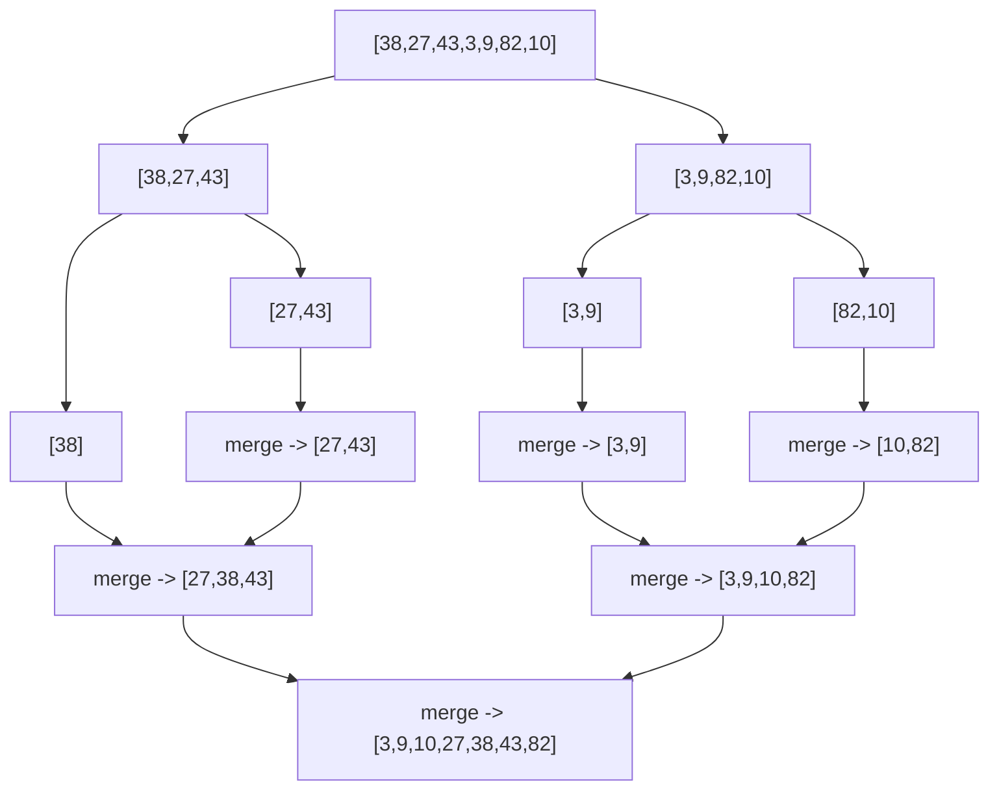
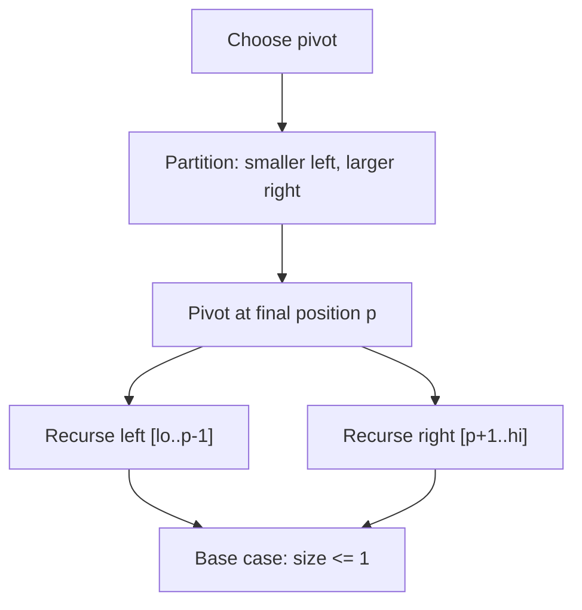
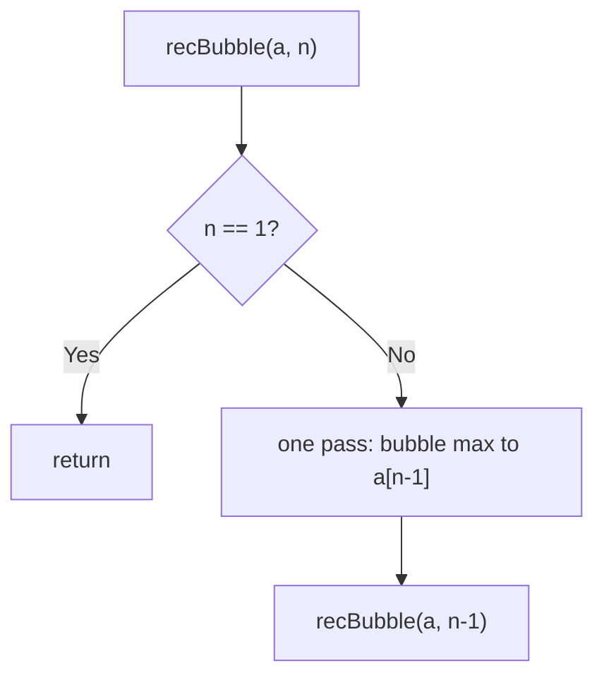

# Learn Important Sorting Techniques — Theory & Patterns

> **Nav:** [Theory & Patterns](./theory-and-patterns.md) · [Problems](./problems.md) · [Resources](./resources.md)

**Stats:** 7 problems total — 🟢 Easy: 6 · 🟡 Medium: 1 · 🔴 Hard: 0 · Patterns (sub-steps): 2 (Sorting-I, Sorting-II)

---

## Overview & Why It Matters

Sorting is the act of rearranging a collection into a defined order (usually non-decreasing). It is the *bread and butter* of DSA: once data is sorted, an enormous number of problems collapse into `O(n)` or `O(log n)` sub-routines — binary search, two-pointer, deduplication, finding k-th elements, detecting duplicates, greedy scheduling, and more.

**Where it appears in interviews:**
- Direct asks: "implement merge sort / quick sort from scratch", "make quicksort stable", "sort in O(1) extra space".
- Conceptual asks: "which sort is stable?", "when does quicksort degrade to O(n²)?", "in-place vs. not".
- As a *pre-processing step* inside harder problems (intervals, meeting rooms, kth largest, inversions count).

**Prerequisites:**
- Arrays and indexing.
- Basic recursion and the recursion call-stack.
- Big-O notation (best / average / worst case).
- Divide-and-conquer intuition (for merge & quick sort).

This step teaches the *five foundational comparison sorts* plus recursive re-derivations of two of them. Master these and you understand the vocabulary every advanced algorithm reuses.

---

## Core Concepts

### Vocabulary & Invariants

| Term | Meaning |
|------|---------|
| **Comparison sort** | Orders elements only by comparing pairs (`<`, `>`). Lower bound is `Ω(n log n)`. |
| **Stable sort** | Equal keys keep their original relative order. Critical when sorting by secondary keys. |
| **In-place sort** | Uses `O(1)` (or `O(log n)` stack) auxiliary memory; mutates the input array. |
| **Adaptive sort** | Runs faster on nearly-sorted input (e.g. insertion sort → `O(n)` on sorted data). |
| **Pass / iteration** | One sweep over the (remaining) array. |
| **Pivot** | An element chosen to partition the array (quick sort). |
| **Invariant** | A property true after each iteration that proves correctness (e.g. "prefix `[0..i]` is sorted"). |

### The two mental models

1. **Selection-family (Selection, Bubble, Insertion):** grow a *sorted region* one element per pass. Simple, `O(n²)`, in-place. Differ in *how* they extend the sorted region.
2. **Divide-and-conquer family (Merge, Quick):** split the problem, solve halves, combine. `O(n log n)` average. Differ in *where the work happens* — merge does work while combining, quick does work while splitting.



### Stability & in-place at a glance



---

## Patterns

The data groups the 7 problems into two sub-steps. **Sorting-I** = the three quadratic simple sorts. **Sorting-II** = divide-and-conquer sorts plus recursive re-formulations.

### Sorting-I — Simple Quadratic Sorts (Selection, Bubble, Insertion)

**Recognition signals:**
- You're asked to sort by hand / from scratch with minimal code.
- Array is *tiny* (n ≤ ~10–20) or *nearly sorted* (insertion shines).
- Memory is constrained (all three are in-place, `O(1)` extra).
- The interviewer probes *stability* → know that selection is unstable, bubble & insertion are stable.

**Approach — the shared skeleton:** maintain a sorted region and repeatedly extend it by one element.

- **Selection Sort:** For each position `i`, scan the unsorted suffix `[i..n)`, find the minimum, swap it into `i`. The prefix `[0..i]` is always sorted and final.
- **Bubble Sort:** Repeatedly sweep, swapping adjacent out-of-order pairs. After pass `k`, the largest `k` elements have "bubbled" to the end. Early-exit if a pass makes no swaps (adaptive → `O(n)` best).
- **Insertion Sort:** Take element `arr[i]`, shift larger elements of the sorted prefix right, and insert `arr[i]` into its slot. Prefix stays sorted; adaptive (`O(n)` on sorted input).



**Complexity & justification:**
- **Selection:** always `O(n²)` comparisons (nested loops, no early exit), `O(n)` swaps, `O(1)` space. Not adaptive; not stable (long-distance swap reorders equal keys).
- **Bubble:** `O(n²)` worst/avg; `O(n)` best (sorted, with swap-flag), `O(1)` space. Stable, adaptive.
- **Insertion:** `O(n²)` worst/avg; `O(n)` best (nearly sorted), `O(1)` space. Stable, adaptive. Best of the three in practice.

**C++ templates:**

```cpp
// Selection Sort — unstable, in-place, O(n^2)
void selectionSort(vector<int>& a) {
    int n = a.size();
    for (int i = 0; i < n - 1; ++i) {
        int mini = i;                       // index of smallest in a[i..n)
        for (int j = i + 1; j < n; ++j)
            if (a[j] < a[mini]) mini = j;
        swap(a[i], a[mini]);                // place min at position i
    }
}

// Bubble Sort — stable, in-place, adaptive (early exit)
void bubbleSort(vector<int>& a) {
    int n = a.size();
    for (int i = n - 1; i >= 1; --i) {      // last i is final after each pass
        bool swapped = false;
        for (int j = 0; j <= i - 1; ++j)
            if (a[j] > a[j + 1]) { swap(a[j], a[j + 1]); swapped = true; }
        if (!swapped) break;                // already sorted -> O(n) best case
    }
}

// Insertion Sort — stable, in-place, adaptive
void insertionSort(vector<int>& a) {
    int n = a.size();
    for (int i = 1; i < n; ++i) {
        int key = a[i], j = i - 1;
        while (j >= 0 && a[j] > key) {      // shift larger elements right
            a[j + 1] = a[j];
            --j;
        }
        a[j + 1] = key;                     // drop key into its slot
    }
}
```

---

### Sorting-II — Divide & Conquer + Recursive Sorts (Merge, Recursive Bubble, Recursive Insertion, Quick)

**Recognition signals:**
- You need guaranteed `O(n log n)` (merge) or fast average-case in-place sort (quick).
- Problem hints at *count inversions*, *external sort*, *stable large-scale sort* → merge sort.
- Problem wants in-place with best cache behaviour and randomised pivots → quick sort.
- Interviewer asks you to "re-write bubble/insertion recursively" → shrink the problem by one element per recursive call.

**Approach — Merge Sort (divide-and-conquer, work-on-combine):**
1. If the range has ≤ 1 element, it's sorted (base case).
2. Split at `mid = (lo+hi)/2`. Recursively sort `[lo..mid]` and `[mid+1..hi]`.
3. **Merge** the two sorted halves into one using a temp buffer (`<=` keeps it stable).



**Approach — Quick Sort (divide-and-conquer, work-on-split):**
1. Choose a pivot (here, first element / Lomuto or Hoare style).
2. **Partition:** rearrange so elements `< pivot` are left, `> pivot` right; pivot lands at its final index `p`.
3. Recurse on `[lo..p-1]` and `[p+1..hi]`. No merge step needed.



**Approach — Recursive Bubble / Recursive Insertion:** identical logic to the iterative versions, but the *outer loop becomes recursion*.
- **Recursive Bubble:** one pass bubbles the max to the end of the current range `[0..n)`, then recurse on `[0..n-1)`. Base case `n == 1`.
- **Recursive Insertion:** first sort `[0..i)`, then insert `a[i]` into it. Base case `i == 0` (or `i == n` for top-down).



**Complexity & justification:**
- **Merge:** `T(n)=2T(n/2)+O(n)` → `O(n log n)` in **all** cases; `O(n)` extra space for the buffer; **stable**; not in-place.
- **Quick:** average `O(n log n)` (balanced partitions), worst `O(n²)` (already-sorted with bad pivot → one side empty). Space `O(log n)` avg recursion stack, `O(n)` worst; in-place; **unstable**. Randomised/median-of-three pivot avoids the worst case in practice.
- **Recursive Bubble / Insertion:** same `O(n²)` time as iterative; additional `O(n)` recursion stack depth.

**C++ templates:**

```cpp
// Merge Sort — stable, O(n log n) always, O(n) extra
void merge(vector<int>& a, int lo, int mid, int hi) {
    vector<int> tmp; tmp.reserve(hi - lo + 1);
    int l = lo, r = mid + 1;
    while (l <= mid && r <= hi)
        tmp.push_back(a[l] <= a[r] ? a[l++] : a[r++]); // '<=' => stable
    while (l <= mid) tmp.push_back(a[l++]);
    while (r <= hi)  tmp.push_back(a[r++]);
    for (int i = lo; i <= hi; ++i) a[i] = tmp[i - lo];
}
void mergeSort(vector<int>& a, int lo, int hi) {
    if (lo >= hi) return;                 // base case: 0 or 1 element
    int mid = lo + (hi - lo) / 2;
    mergeSort(a, lo, mid);
    mergeSort(a, mid + 1, hi);
    merge(a, lo, mid, hi);
}

// Quick Sort — in-place, avg O(n log n), unstable (Lomuto partition)
int partition(vector<int>& a, int lo, int hi) {
    int pivot = a[lo], i = lo, j = hi;
    while (i < j) {
        while (i < hi && a[i] <= pivot) ++i;
        while (j > lo && a[j] >  pivot) --j;
        if (i < j) swap(a[i], a[j]);
    }
    swap(a[lo], a[j]);                    // pivot to its final place
    return j;
}
void quickSort(vector<int>& a, int lo, int hi) {
    if (lo >= hi) return;
    int p = partition(a, lo, hi);
    quickSort(a, lo, p - 1);
    quickSort(a, p + 1, hi);
}

// Recursive Bubble Sort
void recBubble(vector<int>& a, int n) {
    if (n == 1) return;                   // base case
    bool swapped = false;
    for (int j = 0; j < n - 1; ++j)
        if (a[j] > a[j + 1]) { swap(a[j], a[j + 1]); swapped = true; }
    if (!swapped) return;                 // adaptive short-circuit
    recBubble(a, n - 1);                  // largest fixed at a[n-1]
}

// Recursive Insertion Sort (top-down over index i)
void recInsertion(vector<int>& a, int i, int n) {
    if (i == n) return;                   // base case
    int key = a[i], j = i - 1;
    while (j >= 0 && a[j] > key) { a[j + 1] = a[j]; --j; }
    a[j + 1] = key;
    recInsertion(a, i + 1, n);            // extend sorted prefix
}
```

---

## Complexity Summary

| Pattern / Algorithm | Time (Best / Avg / Worst) | Space | Notes |
|---------------------|---------------------------|-------|-------|
| Selection Sort | O(n²) / O(n²) / O(n²) | O(1) | Unstable, in-place, not adaptive, min swaps |
| Bubble Sort | O(n) / O(n²) / O(n²) | O(1) | Stable, in-place, adaptive (swap flag) |
| Insertion Sort | O(n) / O(n²) / O(n²) | O(1) | Stable, in-place, adaptive; best simple sort |
| Merge Sort | O(n log n) / O(n log n) / O(n log n) | O(n) | Stable, NOT in-place, great for linked lists / external sort |
| Recursive Bubble | O(n) / O(n²) / O(n²) | O(n) stack | Same as bubble + recursion depth |
| Recursive Insertion | O(n) / O(n²) / O(n²) | O(n) stack | Same as insertion + recursion depth |
| Quick Sort | O(n log n) / O(n log n) / O(n²) | O(log n) avg | In-place, unstable; randomise pivot to dodge worst case |

---

## Interview Tips & Common Mistakes

- **Stability recall (very common):** Merge, Bubble, Insertion = **stable**. Selection, Quick = **unstable**. Be ready to explain *why* selection is unstable (the long-range swap can jump an equal key past its twin).
- **Quicksort worst case:** happens on already-sorted / reverse-sorted input with a fixed first/last pivot. Fix with **randomised pivot** or **median-of-three**. Always mention this — interviewers love it.
- **Merge sort space:** don't forget the `O(n)` auxiliary buffer. If asked for in-place `O(n log n)`, that's a much harder problem (block merge / heap sort is the practical answer).
- **Off-by-one in merge:** use `mid = lo + (hi - lo)/2` (avoids overflow) and remember the base case `lo >= hi`.
- **Bubble/Insertion adaptivity:** insertion sort is `O(n)` on nearly-sorted data — this is why TimSort (Python/Java) uses insertion sort on small runs.
- **`<=` vs `<` in merge:** using `<=` when picking from the left half preserves stability. Swapping to `<` breaks it.
- **Comparison lower bound:** any comparison sort is `Ω(n log n)`. Non-comparison sorts (counting/radix) beat this only under key-range assumptions.
- **Don't confuse "in-place" with "no stack":** quicksort is in-place for data but still uses `O(log n)`–`O(n)` recursion stack.
- **Recursive versions:** the trick is turning the *outer* loop into recursion while keeping the inner pass identical — a favourite "can you re-derive this?" question.
