# Solve Problems on Arrays [Easy → Medium → Hard] — Theory & Patterns

**Nav:** [Theory & Patterns](./theory-and-patterns.md) · [Problems](./problems.md) · [Resources](./resources.md)

**Stats:** 40 total problems — 🟢 Easy: 14 · 🟡 Medium: 18 · 🔴 Hard: 8 _(by the `difficulty` field in the data)_. Organized into 3 Striver sub-steps (Easy / Medium / Hard) across the patterns below.

---

## Overview & Why It Matters

An **array** is a contiguous block of memory holding elements of the same type, indexed `0..n-1` with **O(1)** random access. Arrays are the single most common data structure in coding interviews — they are the substrate for hashing, two-pointer, sliding window, prefix sums, sorting, and dynamic programming. Nearly every FAANG/product-based screen opens with an array question (Two Sum, Kadane, Sort Colors, Merge Intervals).

**Where it appears in interviews**
- Warm-up screens: max/second-max, remove duplicates, rotate, move zeros.
- Core rounds: Kadane, Dutch flag, Moore voting, prefix-sum counting, next permutation.
- Hard rounds: repeating/missing via math+XOR, count inversions and reverse pairs via merge sort, 3-Sum/4-Sum.
- Matrix variants: set-zeroes, rotate 90°, spiral traversal.

**Prerequisites**
- Loops, conditionals, functions in C++.
- `std::vector`, `std::sort`, `std::unordered_map`, `std::unordered_set`.
- Basic Big-O analysis; comfort with `long long` for overflow-safe sums.

---

## Core Concepts

**Vocabulary & invariants**
- **Subarray:** a contiguous slice `a[i..j]`. There are `n*(n+1)/2` of them.
- **Subsequence:** order-preserving but not necessarily contiguous.
- **Prefix sum:** `pre[i] = a[0] + ... + a[i]`. Then `sum(i..j) = pre[j] - pre[i-1]`, giving O(1) range sums after O(n) preprocessing.
- **Two pointers:** two indices moving under an invariant (both ends inward, or slow/fast).
- **In-place:** O(1) extra space; overwrite the input safely.
- **Overflow:** sums of `int` can exceed 2³¹; prefer `long long`.
- **Stable partition invariant:** during Dutch-flag, everything before `low` is 0, between `low..mid-1` is 1, after `high` is 2.

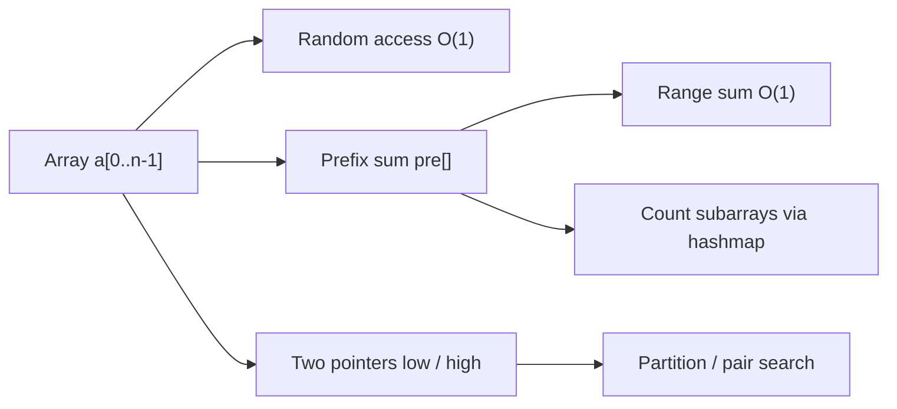

**Prefix-sum structure (mental model):**

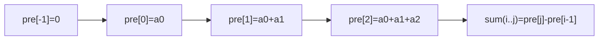

---

## Patterns

The data groups problems into three Striver sub-steps. Below, each sub-step is broken into its dominant **patterns** with recognition signals, step-by-step algorithm, a diagram, complexity, and a C++ template.

### Sub-step 1 — Easy: Scanning, Two-Pointer Overwrite & Hashing

**Recognition signals**
- "Find the largest / second largest / check sorted" → single/paired linear scan tracking best-so-far.
- "Remove duplicates in place", "move zeros to end", "left rotate" → **slow/fast two-pointer overwrite** or **reversal trick**.
- "Union of two sorted arrays", "missing number", "single number", "max consecutive ones" → merge scan, math/XOR, or a running counter.
- "Longest subarray with sum K" → **sliding window** (positives) or **prefix-sum + hashmap** (with negatives).

**Algorithm — best-so-far scan (largest / second largest / sorted check / consecutive ones)**
1. Initialize `best` (and `second`) to sentinels (`INT_MIN`).
2. Iterate once; update `best`/`second` or a running streak counter.
3. Return the tracked value. O(n)/O(1).

**Algorithm — slow/fast overwrite (remove dups / move zeros)**
1. `j` (write pointer) starts at the first "kept" index.
2. `i` (read pointer) scans; when `a[i]` should be kept, write to `a[++j]`/`a[j++]`.
3. Elements `0..j` form the answer prefix.

**Algorithm — reversal rotation (left rotate by K)**
1. `k %= n`.
2. Reverse `a[0..k-1]`, reverse `a[k..n-1]`, reverse whole array.

**Algorithm — longest subarray sum K**
- Positives only → sliding window: expand `right`, shrink `left` while `sum > k`.
- With negatives → prefix sum + hashmap of first-seen index of each prefix; if `pre - k` seen, candidate length `i - idx[pre-k]`.

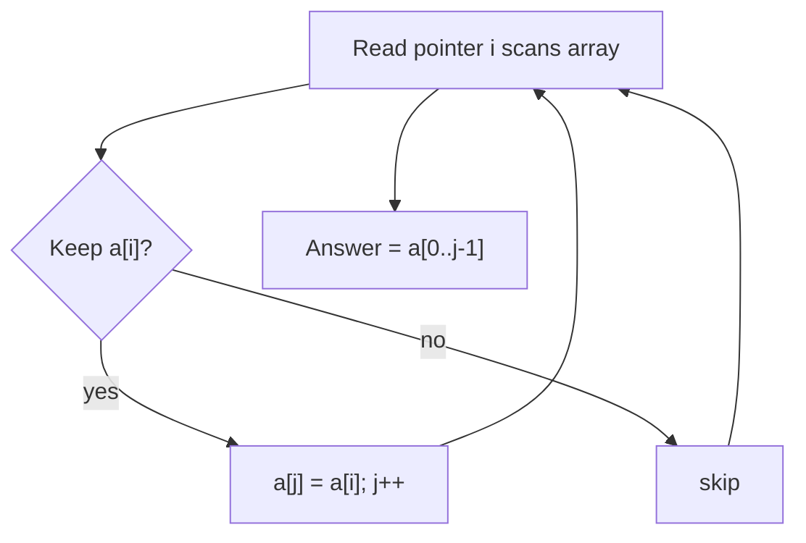

**Complexity:** Scans O(n)/O(1). Reversal rotation O(n)/O(1). Sliding window O(n)/O(1). Prefix-sum+hashmap O(n)/O(n).

```cpp
// Second largest in one pass
int secondLargest(vector<int>& a) {
    int largest = INT_MIN, second = INT_MIN;
    for (int x : a) {
        if (x > largest) { second = largest; largest = x; }
        else if (x < largest && x > second) second = x;
    }
    return second; // INT_MIN if none
}

// Remove duplicates from sorted array (slow/fast) -> new length
int removeDuplicates(vector<int>& a) {
    if (a.empty()) return 0;
    int j = 0;
    for (int i = 1; i < (int)a.size(); i++)
        if (a[i] != a[j]) a[++j] = a[i];
    return j + 1;
}

// Left rotate by k using reversal
void reverseRange(vector<int>& a, int l, int r){ while(l<r) swap(a[l++],a[r--]); }
void leftRotate(vector<int>& a, int k) {
    int n = a.size(); k %= n;
    reverseRange(a, 0, k-1);
    reverseRange(a, k, n-1);
    reverseRange(a, 0, n-1);
}

// Longest subarray with sum k (handles negatives) -> length
int longestSubarraySumK(vector<int>& a, long long k) {
    unordered_map<long long,int> first; // prefix -> earliest index
    long long pre = 0; int best = 0;
    for (int i = 0; i < (int)a.size(); i++) {
        pre += a[i];
        if (pre == k) best = i + 1;
        if (first.count(pre - k)) best = max(best, i - first[pre - k]);
        if (!first.count(pre)) first[pre] = i;
    }
    return best;
}
```

### Sub-step 2 — Medium: Two-Pointer, Kadane, Dutch Flag, Moore Voting & Matrix

This sub-step concentrates the headline patterns. Each is broken out below.

#### Two Pointers / Hashing for pairs & sums (Two Sum, 3Sum, 4Sum feel)
**Signals:** "pair/triplet/quad summing to target", "sorted array pair". 
**Approach:** hashmap complement in O(n) (unsorted, need indices) **or** sort + shrink two pointers from both ends.
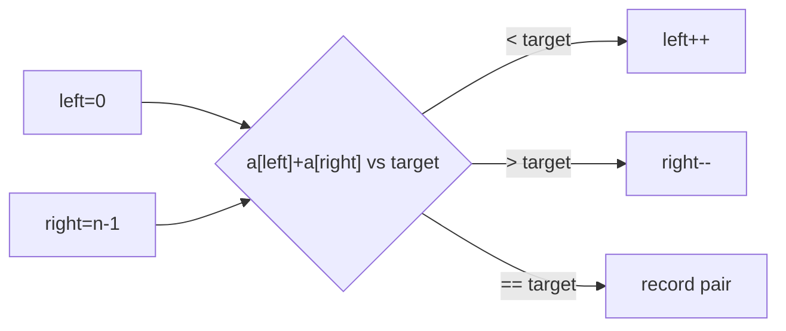
**Complexity:** hashmap O(n)/O(n); two-pointer on sorted O(n log n)/O(1).
```cpp
vector<int> twoSum(vector<int>& a, int target){
    unordered_map<int,int> seen; // value -> index
    for(int i=0;i<(int)a.size();i++){
        int need = target - a[i];
        if(seen.count(need)) return {seen[need], i};
        seen[a[i]] = i;
    }
    return {-1,-1};
}
```

#### Kadane's Algorithm (maximum subarray sum)
**Signals:** "maximum sum contiguous subarray", "max profit-like running total".
**Approach:** keep `cur` = best subarray sum ending here = `max(a[i], cur + a[i])`; track global `best`. To print the subarray, remember start when `cur` resets.
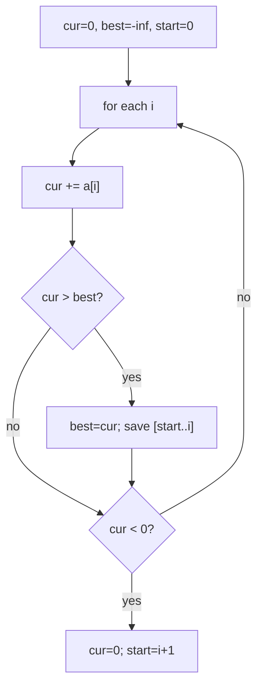
**Complexity:** O(n) time, O(1) space.
```cpp
long long kadane(vector<int>& a){
    long long cur = 0, best = LLONG_MIN;
    for(int x : a){
        cur += x;
        best = max(best, cur);
        if(cur < 0) cur = 0;
    }
    return best; // handles all-negative via best tracking
}
```

#### Dutch National Flag (sort 0s, 1s, 2s)
**Signals:** three distinct categories to partition in one pass, in-place.
**Invariant:** `[0..low-1]=0`, `[low..mid-1]=1`, `[mid..high]=unknown`, `[high+1..]=2`.
```mermaid
stateDiagram-v2
    [*] --> Scan
    Scan --> Zero: "a[mid]==0 -> swap(low,mid); low++, mid++"
    Scan --> One: "a[mid]==1 -> mid++"
    Scan --> Two: "a[mid]==2 -> swap(mid,high); high--"
    Zero --> Scan
    One --> Scan
    Two --> Scan
    Scan --> [*]: "mid > high"
```
**Complexity:** O(n) time, O(1) space, single pass.
```cpp
void sortColors(vector<int>& a){
    int low=0, mid=0, high=a.size()-1;
    while(mid <= high){
        if(a[mid]==0) swap(a[low++], a[mid++]);
        else if(a[mid]==1) mid++;
        else swap(a[mid], a[high--]);
    }
}
```

#### Boyer–Moore Voting (Majority Element > n/2)
**Signals:** "element appearing more than n/2 (or n/3) times".
**Approach:** maintain a `candidate` and `count`; increment/decrement as votes cancel; survivor is the majority (verify in a second pass if not guaranteed).
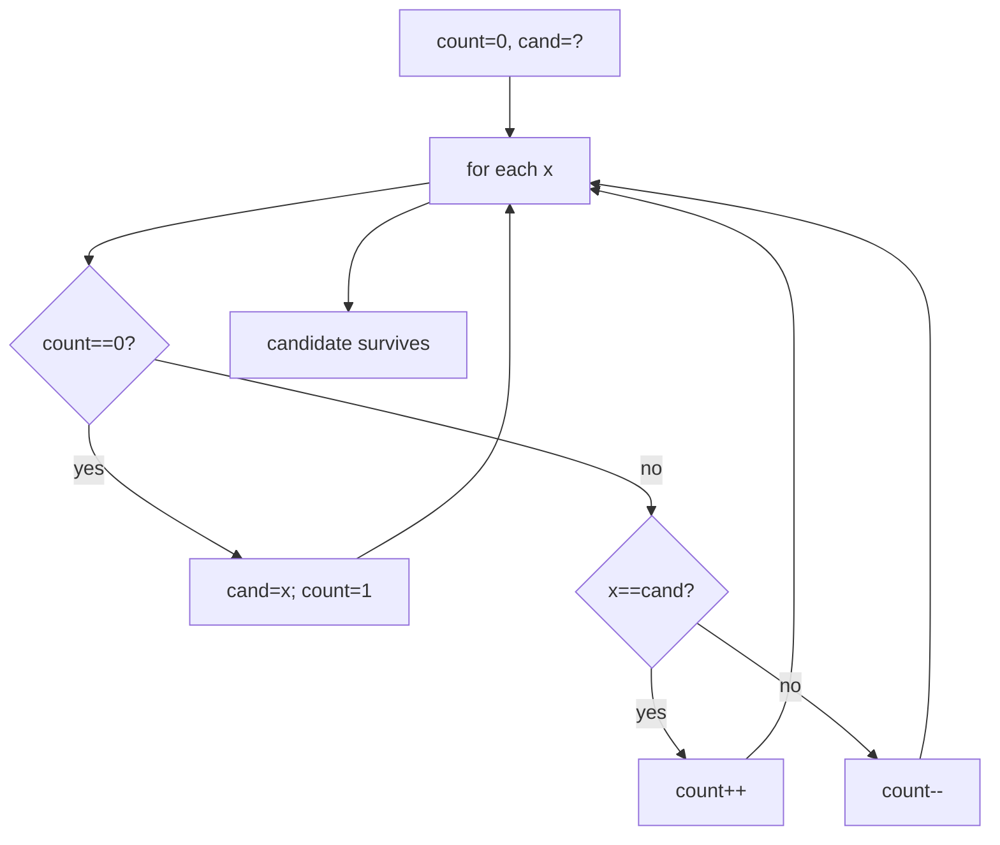
**Complexity:** O(n) time, O(1) space.
```cpp
int majorityElement(vector<int>& a){
    int cand=0, cnt=0;
    for(int x : a){
        if(cnt==0){ cand=x; cnt=1; }
        else cnt += (x==cand ? 1 : -1);
    }
    return cand; // verify with a count pass if not guaranteed
}
```

#### Matrix manipulation (set zeroes, rotate 90°, spiral)
**Signals:** 2-D grid, in-place transforms, boundary traversal.
**Rotate 90° clockwise:** transpose then reverse each row. **Spiral:** shrink four boundaries `top,bottom,left,right`.
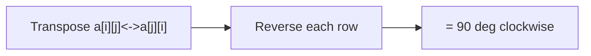
**Complexity:** O(n·m) time; set-zeroes O(1) extra using first row/col as markers.
```cpp
void rotate90(vector<vector<int>>& m){
    int n = m.size();
    for(int i=0;i<n;i++)
        for(int j=i+1;j<n;j++) swap(m[i][j], m[j][i]); // transpose
    for(auto& row : m) reverse(row.begin(), row.end());  // reverse rows
}
vector<int> spiral(vector<vector<int>>& m){
    vector<int> res; if(m.empty()) return res;
    int top=0, bottom=m.size()-1, left=0, right=m[0].size()-1;
    while(top<=bottom && left<=right){
        for(int j=left;j<=right;j++) res.push_back(m[top][j]); top++;
        for(int i=top;i<=bottom;i++) res.push_back(m[i][right]); right--;
        if(top<=bottom){ for(int j=right;j>=left;j--) res.push_back(m[bottom][j]); bottom--; }
        if(left<=right){ for(int i=bottom;i>=top;i--) res.push_back(m[i][left]); left++; }
    }
    return res;
}
```

#### Prefix-Sum + Hashmap counting (count subarrays with sum K)
**Signals:** "count subarrays with sum/xor equal to K", negatives allowed.
**Approach:** running prefix; for each index add frequency of `pre - k` seen so far; seed map with `{0:1}`.
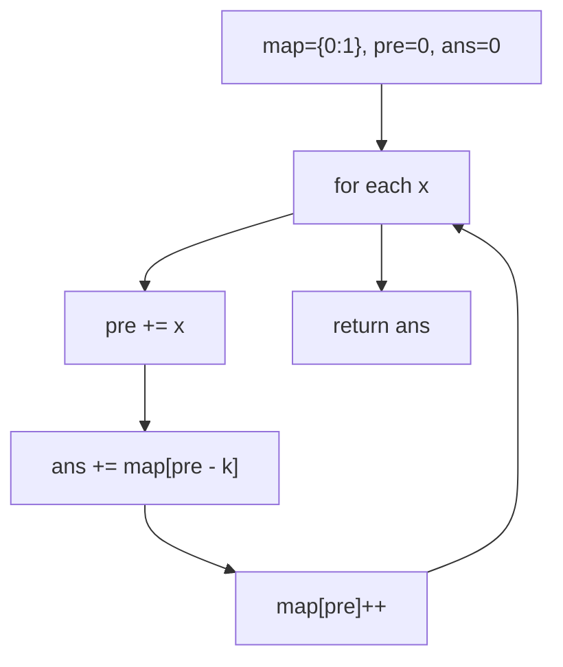
**Complexity:** O(n) time, O(n) space.
```cpp
int countSubarraysSumK(vector<int>& a, int k){
    unordered_map<long long,int> freq; freq[0]=1;
    long long pre=0; int ans=0;
    for(int x : a){ pre+=x; ans += freq[pre-k]; freq[pre]++; }
    return ans;
}
```

#### Greedy scans (Stock buy/sell, Leaders, Rearrange by sign, Longest consecutive, Next permutation)
**Signals:** "max profit single transaction" → track min-so-far; "leaders" → scan right-to-left tracking max; "rearrange by sign" → placement into even/odd indices; "longest consecutive" → hashset expand; "next permutation" → find pivot, swap, reverse suffix.
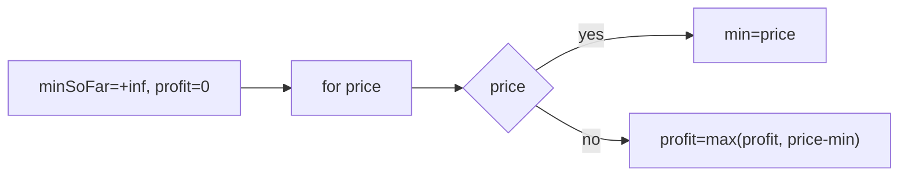
**Complexity:** all O(n) except next-permutation O(n) and longest-consecutive O(n) average with hashset.
```cpp
int maxProfit(vector<int>& p){
    int mn = INT_MAX, best = 0;
    for(int x : p){ mn = min(mn, x); best = max(best, x - mn); }
    return best;
}
```

### Sub-step 3 — Hard: Prefix-XOR, Merge-Sort Counting, Cyclic/Math & Intervals

**Recognition signals**
- "Count subarrays with XOR = K" → **prefix-XOR + hashmap** (`pre ^ k` lookup).
- "Count inversions", "reverse pairs" → **merge sort** counting during merge.
- "Repeating and missing number" → math (sum & sum of squares) or XOR bucketing.
- "Merge overlapping intervals", "merge two sorted arrays w/o extra space" → sort + sweep, or gap method / two-pointer from the back.
- "Majority > n/3", "3Sum/4Sum", "max product subarray", "largest subarray sum 0", "Pascal's triangle" → extended voting, sorted two-pointer, prefix/suffix products, prefix-sum hashmap, combinatorics.

**Algorithm — count subarrays with XOR K (prefix-XOR)**
1. Seed `map[0]=1`, `xr=0`.
2. For each element: `xr ^= a[i]`; the number of previous prefixes equal to `xr ^ k` counts subarrays ending here; add `map[xr^k]`; then `map[xr]++`.

**Algorithm — count inversions / reverse pairs (merge sort)**
1. Recursively sort halves, counting cross-pairs during the merge.
2. Inversions: while merging, when `left[i] > right[j]`, all remaining left elements are inversions.
3. Reverse pairs: an extra count pass (`left[i] > 2*right[j]`) before merging.

**Algorithm — merge intervals**
1. Sort by start.
2. Sweep: if current start ≤ last end, extend end; else push new interval.

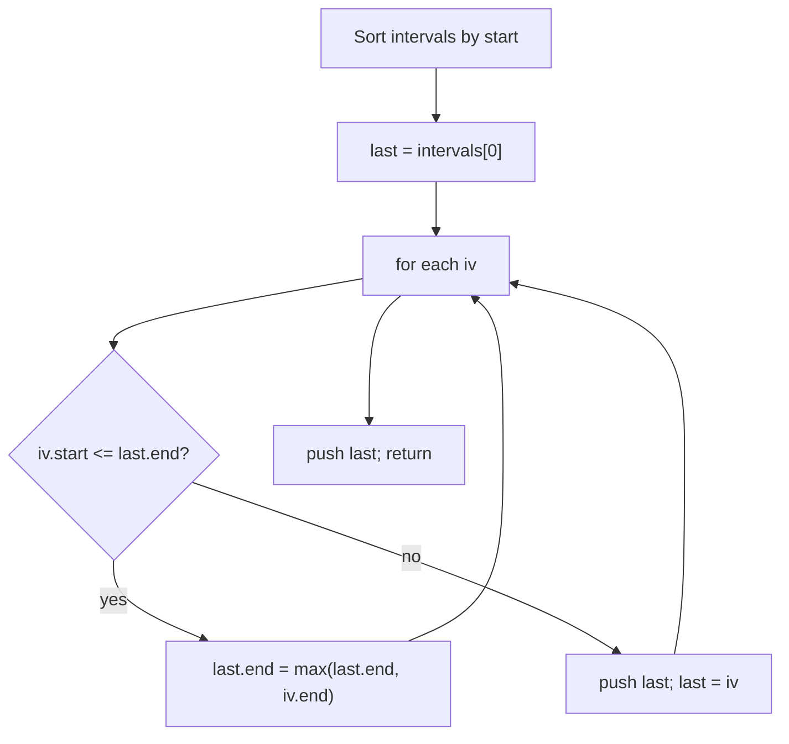

**Prefix-XOR diagram:**
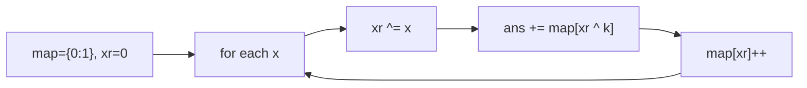

**Complexity:** prefix-XOR O(n)/O(n); merge-sort counting O(n log n)/O(n); intervals O(n log n)/O(n); repeating-missing O(n)/O(1).

```cpp
// Count subarrays with XOR = k
int subarraysWithXorK(vector<int>& a, int k){
    unordered_map<int,int> freq; freq[0]=1;
    int xr=0, ans=0;
    for(int x : a){ xr ^= x; ans += freq[xr ^ k]; freq[xr]++; }
    return ans;
}

// Count inversions via merge sort
long long mergeCount(vector<int>& a, int l, int m, int r){
    vector<int> tmp; int i=l, j=m+1; long long cnt=0;
    while(i<=m && j<=r){
        if(a[i] <= a[j]) tmp.push_back(a[i++]);
        else { cnt += (m - i + 1); tmp.push_back(a[j++]); }
    }
    while(i<=m) tmp.push_back(a[i++]);
    while(j<=r) tmp.push_back(a[j++]);
    for(int x=l;x<=r;x++) a[x] = tmp[x-l];
    return cnt;
}
long long countInv(vector<int>& a, int l, int r){
    if(l>=r) return 0;
    int m=(l+r)/2;
    long long c = countInv(a,l,m) + countInv(a,m+1,r);
    return c + mergeCount(a,l,m,r);
}

// Merge overlapping intervals
vector<vector<int>> mergeIntervals(vector<vector<int>>& iv){
    sort(iv.begin(), iv.end());
    vector<vector<int>> res;
    for(auto& x : iv){
        if(res.empty() || x[0] > res.back()[1]) res.push_back(x);
        else res.back()[1] = max(res.back()[1], x[1]);
    }
    return res;
}
```

---

## Complexity Summary

| Pattern | Time | Space | Notes |
|---|---|---|---|
| Best-so-far scan (largest, 2nd largest, sorted, consec ones) | O(n) | O(1) | Single pass, sentinel init |
| Slow/fast overwrite (remove dups, move zeros) | O(n) | O(1) | Write pointer keeps prefix |
| Reversal rotation (left rotate by K) | O(n) | O(1) | `k %= n` first |
| Sliding window (longest sum K, positives) | O(n) | O(1) | Only for non-negative |
| Prefix-sum + hashmap (longest/count sum K, largest sum 0) | O(n) | O(n) | Works with negatives |
| Two-pointer / hashing pairs (Two Sum, 3Sum, 4Sum) | O(n)–O(n²)/O(n³) | O(1)–O(n) | Sort then shrink for k-sum |
| Kadane | O(n) | O(1) | Track start for printing |
| Dutch National Flag (sort 0/1/2) | O(n) | O(1) | 3-way partition, 1 pass |
| Boyer–Moore voting (majority n/2, n/3) | O(n) | O(1) | Verify survivors |
| Matrix transforms (set zero, rotate, spiral) | O(n·m) | O(1)–O(n) | First row/col as markers |
| Prefix-XOR + hashmap (subarrays XOR K) | O(n) | O(n) | `xr ^ k` lookup |
| Merge-sort counting (inversions, reverse pairs) | O(n log n) | O(n) | Count during merge |
| Merge intervals | O(n log n) | O(n) | Sort by start, sweep |
| Repeating & missing (math/XOR) | O(n) | O(1) | Beware overflow |
| Prefix/suffix products (max product subarray) | O(n) | O(1) | Track min & max |
| Combinatorics (Pascal's triangle) | O(n²) | O(1) extra | nCr running update |

---

## Interview Tips & Common Mistakes

- **Overflow:** use `long long` for prefix sums, products, and `sum-of-squares` in repeating/missing. `int` overflows silently.
- **Kadane on all-negatives:** don't clamp `best` to 0 — track `best` before resetting `cur`, or seed `best = LLONG_MIN`.
- **Dutch flag pointer bug:** when `a[mid]==2` you swap with `high--` but **do not** advance `mid` (the swapped-in value is unexamined). When `a[mid]==0` you advance both `low` and `mid`.
- **Prefix-sum counting:** always seed the map with `{0:1}` so a prefix that itself equals `k` (or XOR `k`) is counted.
- **Rotation:** compute `k %= n` to avoid redundant full rotations and out-of-range reversals.
- **Two-pointer k-sum:** skip duplicates for `3Sum`/`4Sum` to avoid duplicate triplets/quads; use `long long` for the running sum in 4Sum.
- **Moore voting:** for `n/3` there can be at most two candidates; always run a verification pass, since a majority isn't guaranteed.
- **Merge intervals:** sort by start first; comparing unsorted intervals is the #1 mistake.
- **Set matrix zeroes:** using first row/column as markers needs a separate flag for the first column to avoid clobbering.
- **Longest consecutive sequence:** only start counting a streak from a number whose predecessor is absent — otherwise it degrades to O(n²).
- **Edge cases:** empty array, single element, all same, all negative, duplicates, and large values near `INT_MAX`.
