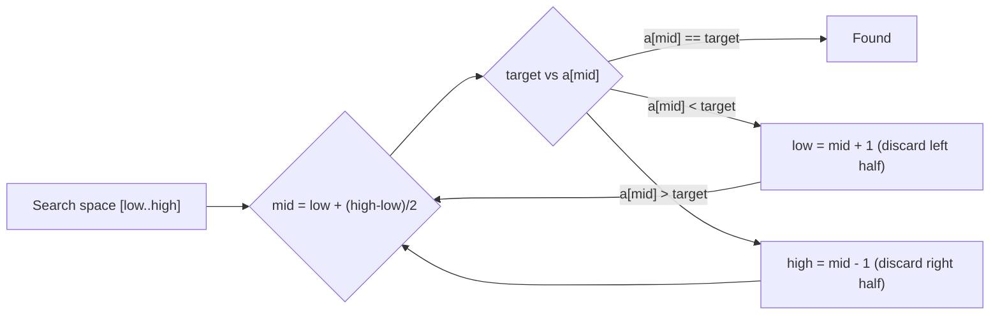
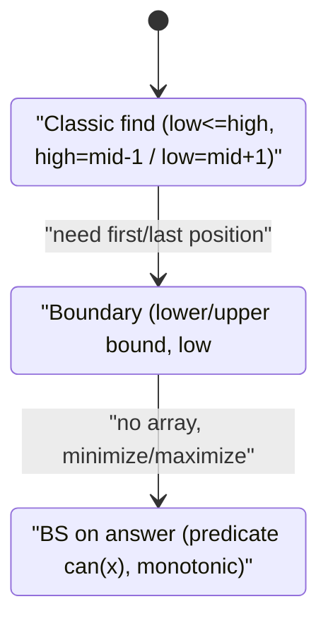
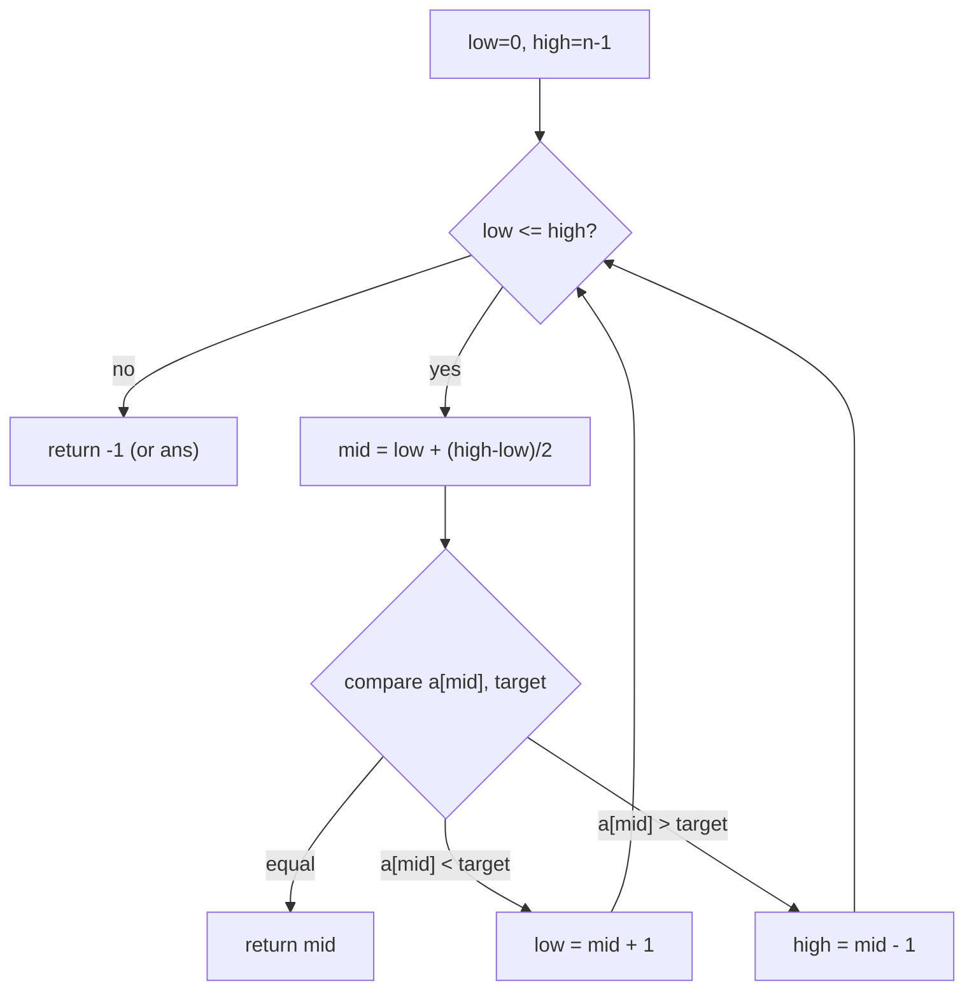
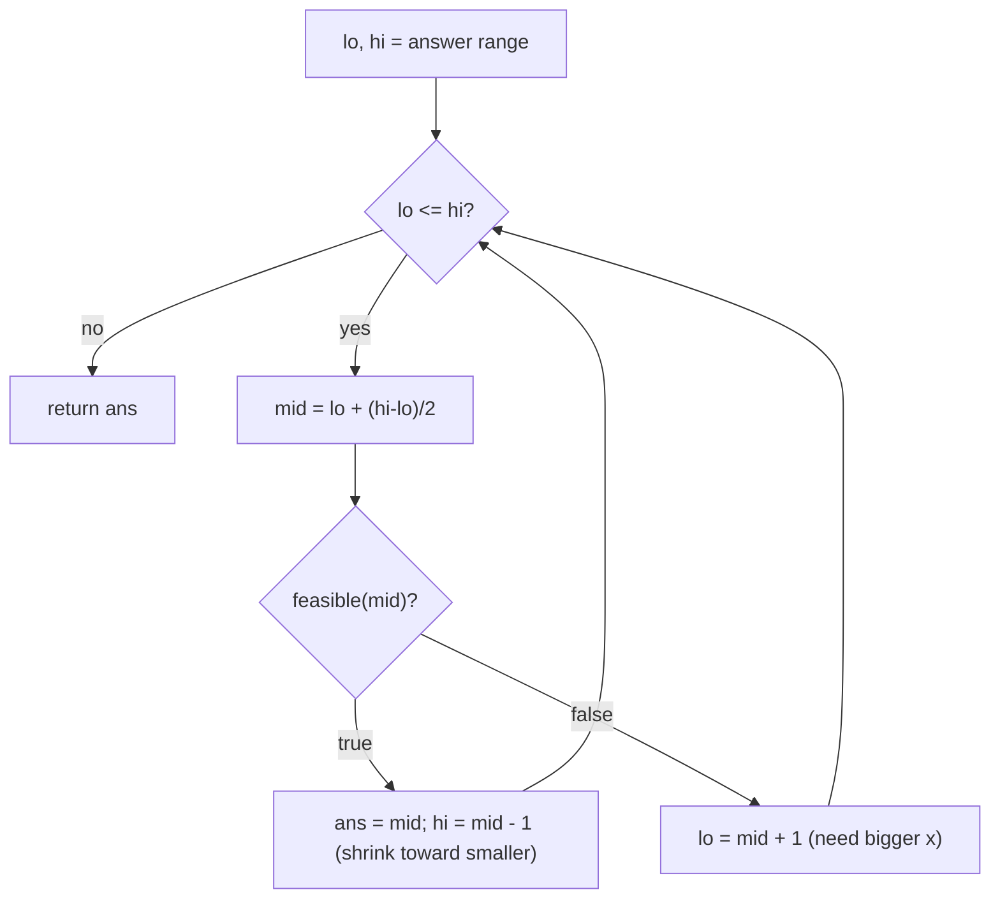
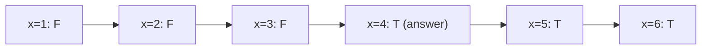
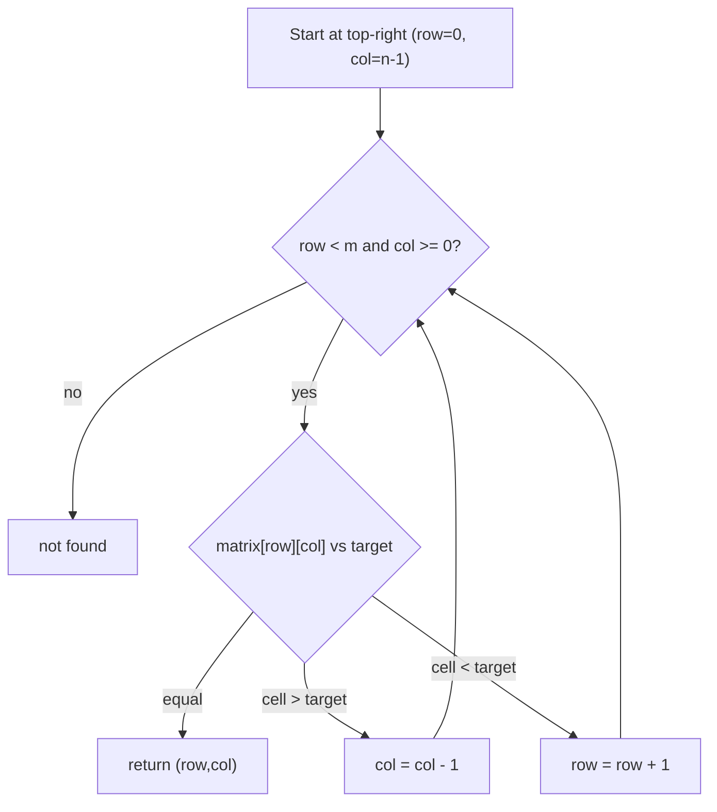

# Binary Search [1D, 2D Arrays, Search Space] — Theory & Patterns

**Navigation:** [Theory & Patterns](./theory-and-patterns.md) · [Problems](./problems.md) · [Resources](./resources.md)

**Stats:** 32 problems total — 🟢 Easy: 10 · 🟡 Medium: 14 · 🔴 Hard: 8. Patterns: 3 (BS on 1D Arrays, BS on Answers, BS on 2D Arrays).

---

## Overview & Why It Matters

Binary search is the technique of repeatedly halving a **search space** and discarding the half that cannot contain the answer. In its simplest form it finds an element in a sorted array in `O(log n)`. But its real power is the generalized idea: **any time the answer space is monotonic** (a predicate flips from `false` to `true` exactly once as you move along a range), you can binary search over it — even when there is no array to search at all.

Where it shows up in interviews:

- **Direct search** on sorted / rotated / partially-sorted arrays (FAANG staple).
- **"Binary search on answer"** — minimize/maximize problems phrased as "smallest capacity", "minimum days", "largest minimum distance". These look like optimization/greedy problems but reduce to a feasibility predicate + binary search.
- **2D search** — sorted matrices, row-with-max-1s, matrix median, 2D peak.
- **Median of two sorted arrays** — the classic hard partition problem.

Binary search appears in roughly 30–40% of coding rounds at big tech companies, often disguised.

**Prerequisites:**
- Comfort with arrays and index arithmetic.
- Understanding of **monotonicity** (a sorted or predicate-monotone range).
- Overflow-safe midpoint: `mid = low + (high - low) / 2`.
- Loop invariants and careful boundary handling (off-by-one is the #1 bug source).

---

## Core Concepts

**The invariant.** We keep a range `[low, high]` (or half-open `[low, high)`) that is **guaranteed to contain the answer** (or the insertion point). Every iteration shrinks the range while preserving that guarantee. When the range is empty (or collapses to one element), the answer is pinned down.

**Monotonic predicate.** Generalized binary search relies on a boolean function `check(x)` that is monotone: `F F F F T T T T`. We find the **boundary** — the first `T` (lower-bound style) or the last `F` (upper-bound style).

**Vocabulary:**
- **lower_bound(x):** first index `i` with `a[i] >= x`.
- **upper_bound(x):** first index `i` with `a[i] > x`.
- **Search space:** the set of candidate answers (indices, or values, or a real interval).
- **Feasibility / predicate:** a `can(x)` function returning whether `x` is a valid answer.



The three canonical templates:



**Golden rules that avoid infinite loops / off-by-one:**
1. Always use `mid = low + (high - low) / 2` to avoid overflow.
2. If you write `low = mid` anywhere, use `mid = low + (high - low + 1)/2` (bias up) or you loop forever.
3. Pick one template style and stay consistent per problem.

---

## Patterns

### Pattern 1 — BS on 1D Arrays

**Recognition signals:**
- Input array is **sorted** (fully, or rotated, or has a monotone property like a peak).
- You need a position, existence, count, floor/ceil, first/last occurrence, or a peak.
- Required complexity is `O(log n)`.

**Approach (classic search):**
1. Set `low = 0`, `high = n - 1`.
2. While `low <= high`: compute `mid`. Compare `a[mid]` with target.
3. Equal → return; `a[mid] < target` → `low = mid+1`; else `high = mid-1`.
4. For **boundary** queries (lower/upper bound, first/last, insert position) use the half-open template that stores a candidate `ans` and keeps searching.
5. For **rotated arrays**: identify which half `[low..mid]` or `[mid..high]` is sorted, then check whether target lies inside it. Duplicates (rotated-II) require shrinking `low++, high--` when `a[low]==a[mid]==a[high]`.
6. For **peak / single element**: use the monotone comparison of `a[mid]` with its neighbor (or index parity) to decide direction.



**Complexity:** Time `O(log n)` — the range halves each step. Space `O(1)` iterative (`O(log n)` if recursive due to stack). Rotated-II worst case degrades to `O(n)` when all elements are equal.

**Reusable C++ templates:**

```cpp
// --- Classic binary search ---
int binarySearch(const vector<int>& a, int target) {
    int low = 0, high = (int)a.size() - 1;
    while (low <= high) {
        int mid = low + (high - low) / 2;
        if (a[mid] == target) return mid;
        else if (a[mid] < target) low = mid + 1;
        else high = mid - 1;
    }
    return -1;
}

// --- Lower bound: first index with a[i] >= x ---
int lowerBound(const vector<int>& a, int x) {
    int low = 0, high = (int)a.size(); // half-open [low, high)
    while (low < high) {
        int mid = low + (high - low) / 2;
        if (a[mid] >= x) high = mid;   // candidate, keep left
        else low = mid + 1;
    }
    return low; // in [0, n]
}

// --- Upper bound: first index with a[i] > x ---
int upperBound(const vector<int>& a, int x) {
    int low = 0, high = (int)a.size();
    while (low < high) {
        int mid = low + (high - low) / 2;
        if (a[mid] > x) high = mid;
        else low = mid + 1;
    }
    return low;
}

// --- Search in rotated sorted array (unique) ---
int searchRotated(const vector<int>& a, int target) {
    int low = 0, high = (int)a.size() - 1;
    while (low <= high) {
        int mid = low + (high - low) / 2;
        if (a[mid] == target) return mid;
        if (a[low] <= a[mid]) {                 // left half sorted
            if (a[low] <= target && target < a[mid]) high = mid - 1;
            else low = mid + 1;
        } else {                                // right half sorted
            if (a[mid] < target && target <= a[high]) low = mid + 1;
            else high = mid - 1;
        }
    }
    return -1;
}
```

---

### Pattern 2 — BS on Answers

**Recognition signals:**
- The problem asks for a **minimum** or **maximum** value satisfying a constraint: "minimum capacity", "smallest divisor", "largest minimum distance", "minimum days".
- You can write a `can(x)` predicate that is **monotone**: once `x` works, every larger (or smaller) `x` also works.
- The answer lies in a numeric range `[lo, hi]` you can bound.

**Approach (step by step):**
1. Identify the **answer range** `[lo, hi]` (e.g., `lo = max(weights)`, `hi = sum(weights)`).
2. Write a boolean predicate `feasible(x)` — usually a greedy `O(n)` scan checking if `x` satisfies the constraint.
3. Confirm monotonicity: `feasible` is `F...F T...T` (or reverse). Decide whether you want the **first true** (minimization) or **last true** (maximization).
4. Binary search the boundary using the lower-bound style: if `feasible(mid)` store `ans=mid` and go left (`hi=mid-1`); else `lo=mid+1`.
5. For **floating answers** (sqrt, gas stations) binary search on reals with a fixed iteration count (~100) or an epsilon.



Predicate monotonicity (the mental model): as `x` grows, feasibility flips exactly once.



**Complexity:** Time `O(n * log(range))` — `log` iterations, each running an `O(n)` predicate. Space `O(1)`. For float variants, iterations are fixed (e.g., 100) so it is `O(n * 100)`.

**Reusable C++ template:**

```cpp
// Generic "binary search on answer" (minimization: smallest x with feasible(x)==true)
long long bsOnAnswer(long long lo, long long hi,
                     function<bool(long long)> feasible) {
    long long ans = hi;                 // default if only hi works
    while (lo <= hi) {
        long long mid = lo + (hi - lo) / 2;
        if (feasible(mid)) {            // mid works -> try smaller
            ans = mid;
            hi = mid - 1;
        } else {                        // mid too small -> go bigger
            lo = mid + 1;
        }
    }
    return ans;
}

// Example predicate: Koko can finish all piles at speed k within h hours
bool canFinish(const vector<int>& piles, long long k, int h) {
    long long hours = 0;
    for (int p : piles) hours += (p + k - 1) / k; // ceil(p/k)
    return hours <= h;
}
// call: bsOnAnswer(1, *max_element(piles.begin(), piles.end()),
//                   [&](long long k){ return canFinish(piles, k, h); });
```

---

### Pattern 3 — BS on 2D Arrays

**Recognition signals:**
- A matrix that is **sorted** (whole matrix as a flattened sorted array; or each row sorted; or row- and column-wise sorted).
- Queries: search a target, find row with max 1s, find a 2D peak, find matrix median.
- Need better than `O(m*n)`.

**Approach (three sub-cases):**
1. **Fully sorted (row-major) matrix** → treat as a 1D array of length `m*n`; map flat index `i` to `(i / cols, i % cols)`; do plain binary search → `O(log(m*n))`.
2. **Row- and column-wise sorted** (Search-2D-II, row-with-max-1s) → **staircase search**: start top-right; if `cell > target` move left, if `cell < target` move down → `O(m + n)`.
3. **2D peak** → binary search on **columns**: pick middle column, find its global max row, compare with left/right neighbors to decide which column-half to keep → `O(m log n)`.
4. **Matrix median** → binary search on the **value range** `[min, max]`; predicate counts elements `<= x` across all rows (each row via `upper_bound`); find smallest `x` with count `>= (m*n+1)/2` → `O(m * log n * log(range))`.



**Complexity:** Flattened search `O(log(m*n))` / `O(1)`. Staircase `O(m+n)` / `O(1)`. 2D peak `O(m log n)` / `O(1)`. Matrix median `O(m log n log(range))` / `O(1)`.

**Reusable C++ templates:**

```cpp
// --- Fully sorted matrix: search as 1D ---
bool searchMatrix(const vector<vector<int>>& mat, int target) {
    int m = mat.size(), n = mat[0].size();
    int low = 0, high = m * n - 1;
    while (low <= high) {
        int mid = low + (high - low) / 2;
        int val = mat[mid / n][mid % n];
        if (val == target) return true;
        else if (val < target) low = mid + 1;
        else high = mid - 1;
    }
    return false;
}

// --- Row & column sorted: staircase from top-right ---
bool searchMatrixII(const vector<vector<int>>& mat, int target) {
    int m = mat.size(), n = mat[0].size();
    int row = 0, col = n - 1;
    while (row < m && col >= 0) {
        if (mat[row][col] == target) return true;
        else if (mat[row][col] > target) col--;
        else row++;
    }
    return false;
}

// --- Matrix median: BS on value range ---
int countLessEqual(const vector<vector<int>>& mat, int x) {
    int cnt = 0;
    for (auto& row : mat)
        cnt += upper_bound(row.begin(), row.end(), x) - row.begin();
    return cnt;
}
int matrixMedian(vector<vector<int>>& mat) {
    int m = mat.size(), n = mat[0].size();
    int lo = INT_MAX, hi = INT_MIN;
    for (auto& row : mat) { lo = min(lo, row.front()); hi = max(hi, row.back()); }
    int need = (m * n + 1) / 2;
    while (lo < hi) {
        int mid = lo + (hi - lo) / 2;
        if (countLessEqual(mat, mid) < need) lo = mid + 1;
        else hi = mid;
    }
    return lo;
}
```

---

## Complexity Summary

| Pattern | Time | Space | Notes |
|---|---|---|---|
| BS on 1D — classic search | `O(log n)` | `O(1)` | Array must be sorted. |
| BS on 1D — lower/upper bound, first/last, count | `O(log n)` | `O(1)` | Count = `upper - lower`. |
| BS on 1D — rotated (unique) | `O(log n)` | `O(1)` | Detect the sorted half each step. |
| BS on 1D — rotated (duplicates) | `O(log n)` avg, `O(n)` worst | `O(1)` | Shrink ends when `a[lo]==a[mid]==a[hi]`. |
| BS on 1D — peak / single element | `O(log n)` | `O(1)` | Use neighbor / index-parity monotonicity. |
| BS on Answers (integer) | `O(n log(range))` | `O(1)` | `n` = predicate cost, `range` = hi-lo. |
| BS on Answers (float) | `O(n · iters)` | `O(1)` | Fixed ~100 iterations or epsilon. |
| BS on 2D — fully sorted | `O(log(m·n))` | `O(1)` | Flatten indices. |
| BS on 2D — staircase (row/col sorted) | `O(m + n)` | `O(1)` | Start top-right or bottom-left. |
| BS on 2D — 2D peak | `O(m log n)` | `O(1)` | Binary search columns. |
| BS on 2D — matrix median | `O(m log n · log(range))` | `O(1)` | Count `<= x` per row via upper_bound. |
| Median of 2 sorted arrays | `O(log(min(m,n)))` | `O(1)` | Partition the smaller array. |
| Kth of 2 sorted arrays | `O(log(min(m,n)))` | `O(1)` | Same partition idea for the k-th. |

---

## Interview Tips & Common Mistakes

**Tips**
- State the **monotone property** out loud before coding — it justifies why binary search applies and clarifies whether you want lower or upper bound.
- For "answer" problems, always articulate: *search space bounds*, *predicate*, *direction of monotonicity*. That framing solves Koko, ship capacity, aggressive cows, book allocation, split array, gas stations — they are the same problem.
- Prefer the STL: `lower_bound` / `upper_bound` when allowed; write your own when asked to demonstrate.
- Use `long long` in predicates (sums can overflow `int`).

**Common mistakes**
- `mid = (low + high) / 2` overflows for large indices — use `low + (high - low)/2`.
- Infinite loop when using `low = mid` without biasing `mid` upward.
- Mixing template styles (`low <= high` closed vs `low < high` half-open) within one function.
- Off-by-one in first/last occurrence: after finding target, forgetting to keep searching the correct side.
- Rotated-II: forgetting the duplicate case `a[low]==a[mid]==a[high]` (must shrink both ends).
- Answer problems: wrong `lo`/`hi` bounds (e.g., `lo` for ship capacity must be `max(weights)`, not `1`).
- Matrix median: comparing `count == need` instead of `count >= need` (median needs the first value whose cumulative count reaches half).
- Feasibility >= vs >: mixing up "at most D days" vs "strictly less" flips the boundary you land on.
