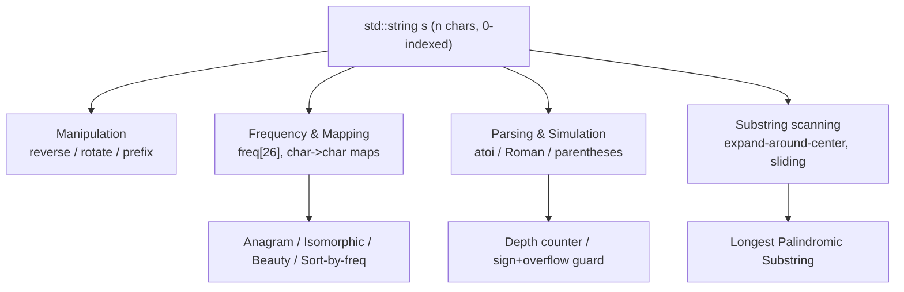
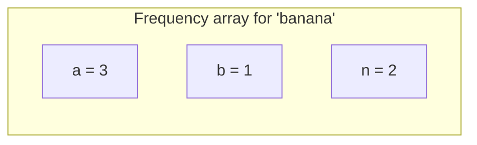
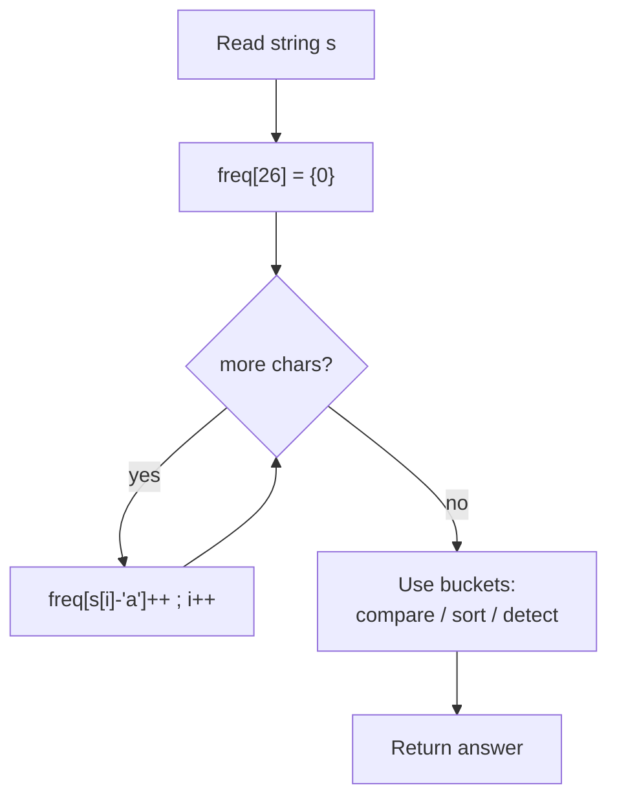
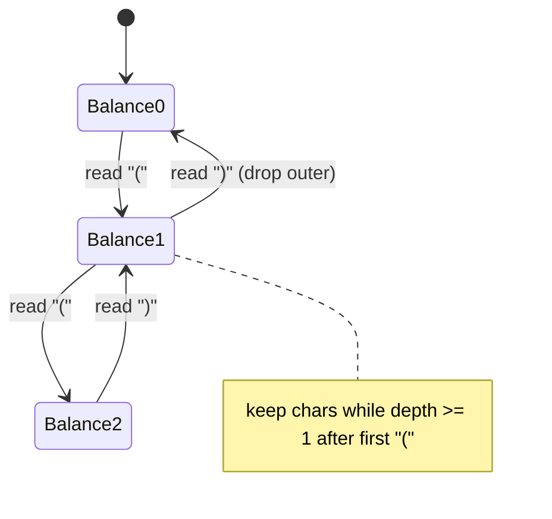
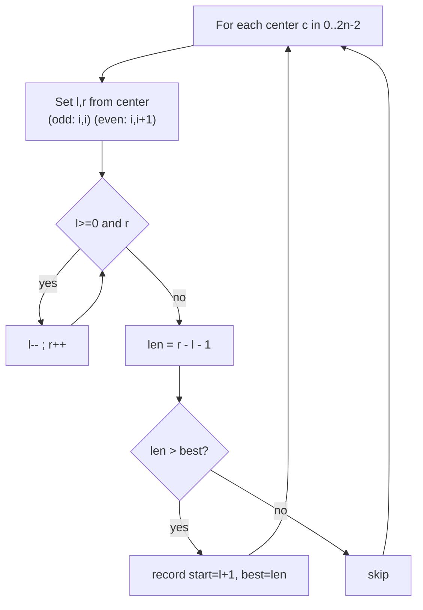
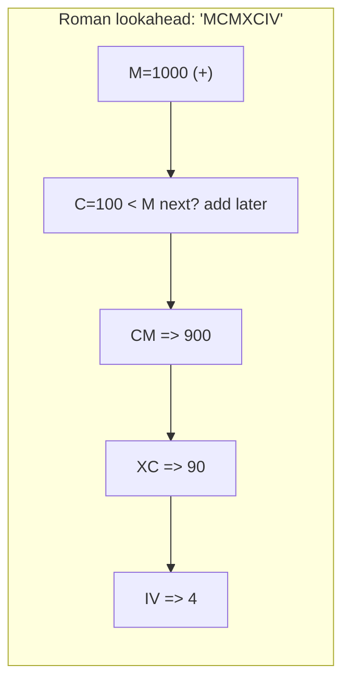

# Strings [Basic and Medium] — Theory & Patterns

**Nav:** [Theory & Patterns](./theory-and-patterns.md) · [Problems](./problems.md) · [Resources](./resources.md)

**Stats:** 15 problems total — 🟢 7 Easy · 🟡 8 Medium · 🔴 0 Hard · across 2 patterns.

---

## Overview & Why It Matters

A **string** is an ordered sequence of characters. In C++ it is `std::string` — a dynamic array of `char` with random access, so almost every array/two-pointer/hashing idea transfers directly. Strings are one of the most heavily asked interview categories because they let interviewers layer *parsing, counting, and simulation* on top of familiar array logic.

This step (Striver A2Z, Step 5) covers **basic manipulation** (reverse, rotate, prefix), **frequency & mapping** (anagram, isomorphic, sort by frequency, beauty), and **medium simulation/parsing** (parentheses depth, Roman numerals, `atoi`, longest palindromic substring). These appear constantly in phone screens and OA rounds at product companies.

**Where it appears in interviews**
- Warm-up screens: reverse words, palindrome check, longest common prefix.
- Hashing rounds: anagram / isomorphic / frequency sort (bucket counting).
- Parsing/simulation rounds: `atoi`, Roman to Integer, parentheses validation.
- Classic "medium": Longest Palindromic Substring (expand-around-center).

**Prerequisites**
- Arrays & two-pointer technique (Step 3/4).
- Hashing with arrays/maps for character counts.
- Basic ASCII arithmetic: `c - 'a'`, `c - '0'`, character ranges.
- Comfort with in-place mutation and `O(1)` extra-space thinking.

---

## Core Concepts

**Vocabulary**
- **Substring** — contiguous slice `s[i..j]`. There are `n*(n+1)/2` of them.
- **Subsequence** — order-preserving but *not necessarily contiguous* (not the focus here).
- **Prefix / Suffix** — leading / trailing substring.
- **Palindrome** — reads the same forwards and backwards.
- **Anagram** — same multiset of characters, any order.
- **Frequency array** — `int freq[26]` (lowercase) or `int freq[256]` (ASCII).

**Key invariants & tools**
- **ASCII arithmetic:** `'A'=65`, `'a'=97`, `'0'=48`. So `s[i]-'a'` maps `a..z → 0..25`.
- **Frequency bucket:** counting characters is `O(1)` space (fixed 26/256 slots) and the backbone of anagram / isomorphic / beauty / frequency-sort.
- **Two pointers:** `l` from start, `r` from end for palindrome/reverse.
- **Stack / counter for parentheses:** depth = running balance of `(` minus `)`.





---

## Patterns

The data groups these 15 problems into **2 sub-steps**. Below, each pattern gets recognition signals, a step-by-step approach, a Mermaid diagram, complexity with justification, and a reusable C++ template.

### Pattern 1 — Basic and Easy String Problems (manipulation, frequency, mapping)

**Recognition signals**
- You are asked to *reverse, rotate, trim, compare prefixes*, or *check character equivalence*.
- The problem talks about "same characters", "rearrangement", "one-to-one mapping", or "rotation".
- Constraints are small-to-moderate; brute force is often fine but a frequency array or two pointers gives the clean answer.

**Sub-techniques covered by this pattern**
1. **Two-pointer / reversal** — reverse whole string or reverse each word after trimming spaces.
2. **Prefix scan** — Longest Common Prefix: compare column by column across all strings.
3. **Frequency counting** — anagram check: `freq[26]`, increment for `s`, decrement for `t`, all zero ⇒ anagram.
4. **Bijective mapping** — isomorphic: two maps `s→t` and `t→s` must stay consistent.
5. **Rotation trick** — `b` is a rotation of `a` ⇔ `b` is a substring of `a+a` (and lengths equal).
6. **Balance counter** — remove outermost parentheses using a running depth.
7. **Greedy suffix scan** — largest odd number: walk from the right to the first odd digit and cut there.

**Approach (frequency-count backbone, the most reused)**
1. Allocate `int freq[26] = {0}` (or `freq[256]` for full ASCII).
2. Single pass over the string(s), updating counts (`++` for one string, `--` for the other in anagram).
3. Post-process the buckets (check all zero, check non-negative, sort, etc.).





**Complexity (this pattern)**
- Frequency / two-pointer / balance scans: **Time `O(n)`**, one linear pass. **Space `O(1)`** — fixed 26/256 buckets or O(k) maps bounded by alphabet.
- Longest Common Prefix across `m` strings of length up to `n`: **`O(m·n)`** worst case, **`O(1)`** extra.
- Rotation via `a+a` substring search: **`O(n²)`** naive `find`, **`O(1)`**–`O(n)` extra (KMP would make it `O(n)`).

**Reusable C++ templates**

```cpp
// --- Frequency-array anagram check ---
bool isAnagram(const string& s, const string& t) {
    if (s.size() != t.size()) return false;
    int freq[26] = {0};
    for (char c : s) freq[c - 'a']++;
    for (char c : t) {
        if (--freq[c - 'a'] < 0) return false; // more of c in t than s
    }
    return true; // sizes equal + no negatives => exact match
}

// --- Two-pointer in-place reverse of a range [l, r] ---
void reverseRange(string& s, int l, int r) {
    while (l < r) swap(s[l++], s[r--]);
}

// --- Bijective mapping (isomorphic) ---
bool isIsomorphic(const string& s, const string& t) {
    if (s.size() != t.size()) return false;
    int mp[256], rev[256];
    fill(mp, mp + 256, -1);
    fill(rev, rev + 256, -1);
    for (int i = 0; i < (int)s.size(); i++) {
        unsigned char a = s[i], b = t[i];
        if (mp[a] == -1 && rev[b] == -1) { mp[a] = b; rev[b] = a; }
        else if (mp[a] != b || rev[b] != a) return false;
    }
    return true;
}

// --- Rotation check: b is rotation of a ---
bool rotateString(const string& a, const string& b) {
    return a.size() == b.size() && (a + a).find(b) != string::npos;
}

// --- Remove outermost parentheses (balance counter) ---
string removeOuterParentheses(const string& s) {
    string res; int depth = 0;
    for (char c : s) {
        if (c == '(') { if (depth > 0) res += c; depth++; }
        else { depth--; if (depth > 0) res += c; }
    }
    return res;
}
```

### Pattern 2 — Medium String Problems (parsing, simulation, substring scanning)

**Recognition signals**
- The input is a *format to parse*: numbers with signs/whitespace (`atoi`), Roman numerals, nested brackets.
- You must *scan every substring* or *every center* (beauty of substrings, palindromic substring).
- The answer involves *simulation with edge cases* (overflow, empty input, malformed prefix).

**Sub-techniques covered by this pattern**
1. **Left-to-right parsing with state** — `atoi`: skip spaces → sign → digits → clamp to INT range.
2. **Adjacent-pair lookahead** — Roman to Integer: add value, subtract when a smaller symbol precedes a larger one.
3. **Depth counter (max)** — Maximum Nesting Depth: track running balance, keep the max.
4. **All-substrings enumeration** — count substrings starting/ending with a char; sum of beauty (max−min frequency per substring).
5. **Expand-around-center** — Longest Palindromic Substring: treat every index and every gap as a center.

**Approach — Expand Around Center (the flagship medium)**
1. For each index `i` (odd centers) and each gap `i,i+1` (even centers), set `l=r=i` (or `l=i, r=i+1`).
2. While `l>=0 && r<n && s[l]==s[r]`, expand `l--`, `r++`.
3. Length of palindrome = `r - l - 1`; update best if larger.
4. There are `2n-1` centers, each expansion is `O(n)` ⇒ `O(n²)`.





**Complexity (this pattern)**
- `atoi`, Roman to Integer, Max Nesting Depth: **Time `O(n)`** single pass, **Space `O(1)`**.
- Count substrings / Sum of beauty: enumerating all substrings is **`O(n²)`** with an incremental `freq[26]`; beauty is **`O(26·n²)` = `O(n²)`**, **Space `O(1)`** (fixed buckets).
- Longest Palindromic Substring (expand-around-center): **Time `O(n²)`**, **Space `O(1)`**. (DP variant is `O(n²)` time / `O(n²)` space; Manacher's is `O(n)`.)

**Reusable C++ templates**

```cpp
// --- Expand around center: Longest Palindromic Substring ---
string longestPalindrome(const string& s) {
    if (s.empty()) return "";
    int start = 0, best = 1, n = s.size();
    auto expand = [&](int l, int r) {
        while (l >= 0 && r < n && s[l] == s[r]) { l--; r++; }
        int len = r - l - 1;              // window is (l+1 .. r-1)
        if (len > best) { best = len; start = l + 1; }
    };
    for (int i = 0; i < n; i++) {
        expand(i, i);      // odd-length center
        expand(i, i + 1);  // even-length center
    }
    return s.substr(start, best);
}

// --- Robust atoi: skip spaces -> sign -> digits -> clamp ---
int myAtoi(const string& s) {
    int i = 0, n = s.size();
    while (i < n && s[i] == ' ') i++;
    int sign = 1;
    if (i < n && (s[i] == '+' || s[i] == '-')) sign = (s[i++] == '-') ? -1 : 1;
    long long num = 0;
    while (i < n && isdigit(s[i])) {
        num = num * 10 + (s[i++] - '0');
        if (sign * num <= INT_MIN) return INT_MIN;
        if (sign * num >= INT_MAX) return INT_MAX;
    }
    return (int)(sign * num);
}

// --- Roman to Integer: adjacent-pair lookahead ---
int romanToInt(const string& s) {
    unordered_map<char,int> v = {{'I',1},{'V',5},{'X',10},{'L',50},
                                 {'C',100},{'D',500},{'M',1000}};
    int total = 0, n = s.size();
    for (int i = 0; i < n; i++) {
        if (i + 1 < n && v[s[i]] < v[s[i+1]]) total -= v[s[i]];
        else total += v[s[i]];
    }
    return total;
}

// --- Max nesting depth (running balance) ---
int maxDepth(const string& s) {
    int cur = 0, best = 0;
    for (char c : s) {
        if (c == '(') best = max(best, ++cur);
        else if (c == ')') cur--;
    }
    return best;
}

// --- Sum of beauty of all substrings ---
int beautySum(const string& s) {
    int n = s.size(), ans = 0;
    for (int i = 0; i < n; i++) {
        int f[26] = {0};
        for (int j = i; j < n; j++) {
            f[s[j]-'a']++;
            int mx = 0, mn = INT_MAX;
            for (int k = 0; k < 26; k++)
                if (f[k]) { mx = max(mx, f[k]); mn = min(mn, f[k]); }
            ans += mx - mn;
        }
    }
    return ans;
}
```

---

## Complexity Summary

| Pattern | Time | Space | Notes |
|---|---|---|---|
| Frequency array (anagram, isomorphic, freq-sort) | `O(n)` | `O(1)` | Fixed 26/256 buckets; sort-by-freq adds `O(26 log 26)`. |
| Two-pointer reverse / reverse words | `O(n)` | `O(1)`–`O(n)` | In-place is `O(1)`; building a new string is `O(n)`. |
| Longest Common Prefix (column scan) | `O(m·n)` | `O(1)` | `m` strings, prefix length ≤ `n`. |
| Rotation via `a+a` substring | `O(n²)` naive / `O(n)` KMP | `O(n)` | `std::find` is naive; KMP makes it linear. |
| Parentheses balance (remove outer / max depth) | `O(n)` | `O(1)` | Single running counter. |
| Largest odd number (suffix scan) | `O(n)` | `O(1)` | Walk from right to first odd digit. |
| `atoi` / Roman to Integer (parse pass) | `O(n)` | `O(1)` | Watch overflow + malformed input. |
| Count substrings / Sum of beauty | `O(n²)` | `O(1)` | Incremental `freq[26]` per start index. |
| Longest Palindromic Substring (expand center) | `O(n²)` | `O(1)` | `2n-1` centers; Manacher's is `O(n)`. |

---

## Interview Tips & Common Mistakes

- **Fix your alphabet size first.** Lowercase-only ⇒ `freq[26]`; mixed ASCII ⇒ `freq[256]`. Indexing `s[i]-'a'` on an uppercase/digit char silently corrupts counts.
- **`atoi` edge cases are the interview.** Leading spaces, a lone `+`/`-`, no digits, and **overflow clamping** to `[INT_MIN, INT_MAX]` are what get tested. Accumulate in `long long` and clamp *inside* the loop.
- **Anagram: compare lengths first.** Different lengths can never be anagrams — early return avoids wrong "all zero" conclusions.
- **Isomorphic needs BOTH maps.** Mapping only `s→t` accepts `"ab" → "aa"` incorrectly; you also need `t→s` to enforce a bijection.
- **Palindrome centers: don't forget even-length.** Expanding only from single characters misses `"abba"`. Always run both `expand(i,i)` and `expand(i,i+1)`.
- **Reverse words: trim and collapse spaces.** Leading/trailing/multiple spaces are the classic failure; normalize while building the result.
- **Rotation trick requires equal length.** `(a+a).find(b)` can find a shorter `b` inside; guard with `a.size() == b.size()`.
- **Roman lookahead direction.** Subtract the current value only when it is *strictly less* than the next; otherwise add.
- **Off-by-one in palindrome length.** After expansion the valid window is `[l+1, r-1]`, so `len = r - l - 1`. Getting this wrong returns strings one char short/long.
- **Prefer `int` arrays over `unordered_map` for fixed alphabets.** Faster and cache-friendly; use a map only for arbitrary/large key sets.
