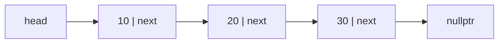
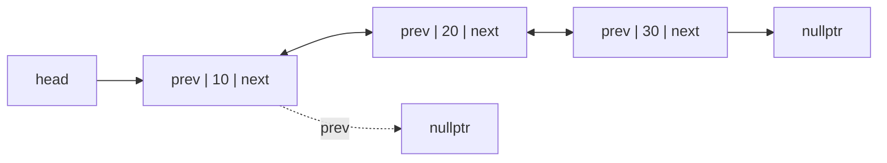
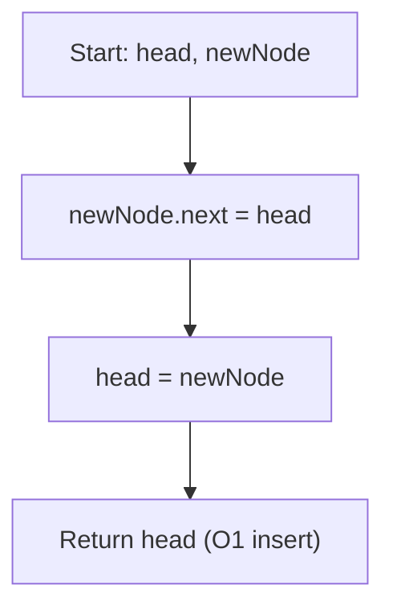
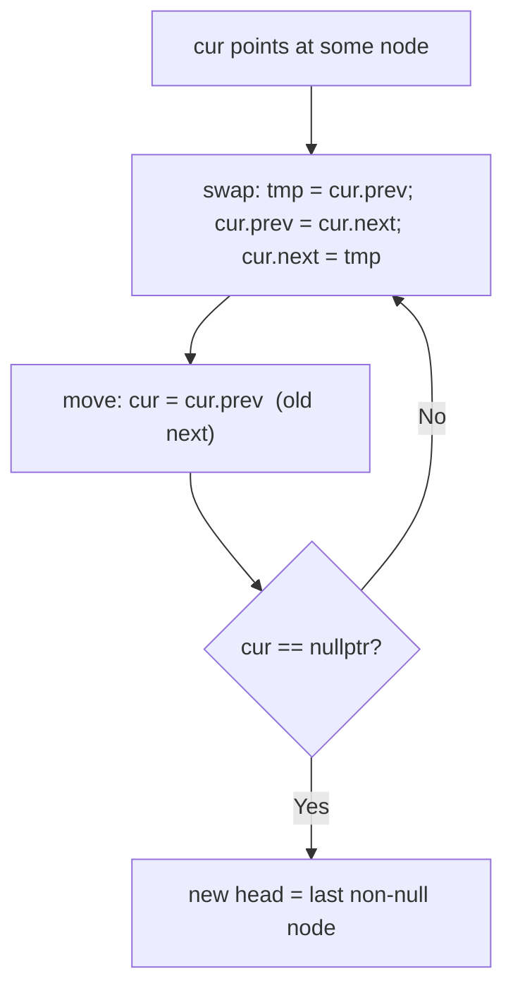
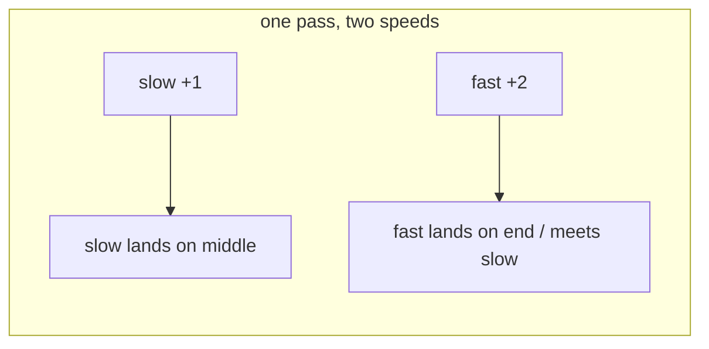
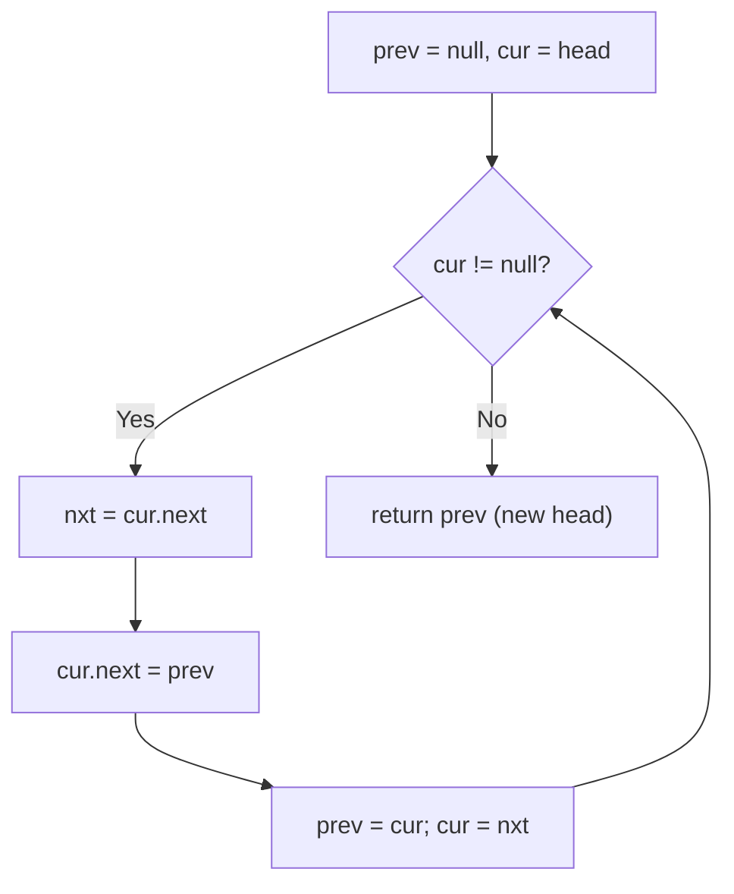
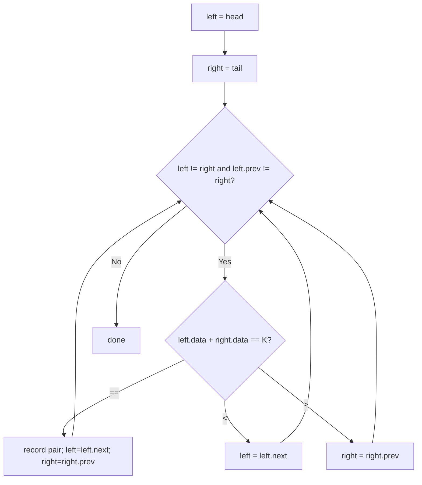
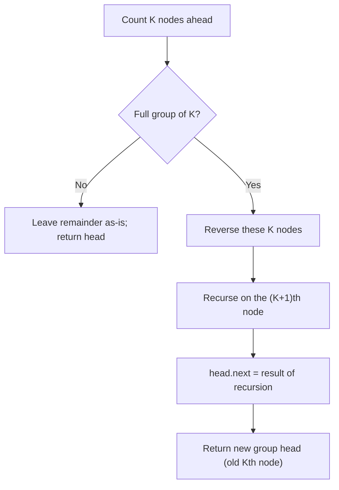

# Learn LinkedList — Theory & Patterns

**Nav:** [Theory & Patterns](./theory-and-patterns.md) · [Problems](./problems.md) · [Resources](./resources.md)

**Stats:** 31 problems total — 🟢 8 Easy · 🟡 16 Medium · 🔴 7 Hard · 5 patterns (sub-steps).

---

## Overview & Why It Matters

A **Linked List** is a linear data structure where elements (nodes) are stored in scattered memory locations and stitched together by pointers. Unlike an array, there is no contiguous block: each node knows only *where the next node lives*. This trade — losing O(1) random access in exchange for O(1) insert/delete at a known position and dynamic growth — is the heart of everything in this topic.

Why it matters for interviews:
- Linked lists are the single most common **pointer-manipulation** playground. Interviewers use them to test whether you can juggle 2–3 pointers without dropping the list or creating a cycle.
- The **fast/slow (tortoise–hare)** technique introduced here reappears in cycle detection, finding duplicates in arrays, and stream problems.
- **Reversal** is a micro-skill that underlies K-group reversal, palindrome checks, add-two-numbers, and reordering.
- They are the substrate for stacks, queues, adjacency lists, LRU caches, and hash-map buckets.

**Prerequisites:** pointers/references, `struct`/`class` in C++, dynamic memory (`new`/`delete`), recursion basics, and comfort with `nullptr`.

---

## Core Concepts

**Node.** The atom of a linked list. A singly node holds `data` + `next`. A doubly node adds `prev`.

```cpp
struct Node {                 // Singly Linked List node
    int data;
    Node* next;
    Node(int val) : data(val), next(nullptr) {}
};

struct DNode {                // Doubly Linked List node
    int data;
    DNode* next;
    DNode* prev;
    DNode(int val) : data(val), next(nullptr), prev(nullptr) {}
};
```

**Vocabulary & invariants**
- **head** — pointer to the first node; `nullptr` means empty list. Losing `head` = losing the whole list.
- **tail** — last node; `tail->next == nullptr` in a proper singly list.
- **traversal** — `for (Node* cur = head; cur != nullptr; cur = cur->next)`.
- **dummy / sentinel node** — a throwaway node placed before `head` so that head-insertions/deletions need no special casing. Return `dummy.next` at the end.
- **Invariant to protect:** before you overwrite a `next` pointer, make sure you have another pointer holding the node it currently points to — otherwise that suffix is leaked/lost.

**Singly linked list shape:**



**Doubly linked list shape (bidirectional links):**



**Array vs Linked List (mental model)**

| Operation | Array | Linked List |
|-----------|-------|-------------|
| Access i-th | O(1) | O(n) |
| Insert/delete at known node | O(n) shift | O(1) relink |
| Memory | contiguous | scattered + pointer overhead |
| Cache locality | excellent | poor |

---

## Patterns

### Pattern 1 — Learn 1D LinkedList (Singly LL fundamentals)

**Recognition signals:** "build / insert / delete / traverse / find length / search" on a singly list. Anything that only needs a single forward pass and single-direction `next` links.

**Approach (step-by-step):**
1. **Build:** allocate nodes, link `prev->next = cur`.
2. **Insert at head:** `node->next = head; head = node;` (O(1)).
3. **Delete head:** `Node* tmp = head; head = head->next; delete tmp;`.
4. **Length:** walk with a counter until `nullptr`.
5. **Search:** walk comparing `cur->data == target`.
Always keep `head` safe and null-check before dereferencing.



**Complexity:** build O(n); insert/delete at head O(1); length/search O(n). Space O(1) extra.

```cpp
// Core singly-LL utilities
Node* insertAtHead(Node* head, int val) {
    Node* node = new Node(val);
    node->next = head;
    return node;                       // new head
}
Node* deleteHead(Node* head) {
    if (!head) return nullptr;
    Node* tmp = head;
    head = head->next;
    delete tmp;
    return head;
}
int length(Node* head) {
    int cnt = 0;
    for (Node* cur = head; cur; cur = cur->next) cnt++;
    return cnt;
}
bool search(Node* head, int target) {
    for (Node* cur = head; cur; cur = cur->next)
        if (cur->data == target) return true;
    return false;
}
```

---

### Pattern 2 — Learn Doubly LinkedList (DLL fundamentals)

**Recognition signals:** need to move **both directions**, delete a node given only its pointer in O(1), or maintain something like an LRU cache/deque. Presence of a `prev` pointer.

**Approach (step-by-step):**
1. Every insertion/deletion must fix up **four** links: the new node's `prev`/`next` and the neighbors' `next`/`prev`.
2. **Insert before head:** `node->next = head; head->prev = node; head = node;` (guard empty list).
3. **Delete head:** advance head, set new `head->prev = nullptr`, delete old.
4. **Reverse:** for each node swap its `prev` and `next`; new head is the old tail.



**Complexity:** insert/delete at ends O(1); reverse O(n) time, O(1) space.

```cpp
DNode* insertBeforeHead(DNode* head, int val) {
    DNode* node = new DNode(val);
    node->next = head;
    if (head) head->prev = node;
    return node;                        // new head
}
DNode* deleteHead(DNode* head) {
    if (!head) return nullptr;
    DNode* tmp = head;
    head = head->next;
    if (head) head->prev = nullptr;
    delete tmp;
    return head;
}
DNode* reverseDLL(DNode* head) {
    DNode* cur = head; DNode* last = nullptr;
    while (cur) {
        last = cur->prev;               // will become the tail-side ref
        cur->prev = cur->next;          // swap the two pointers
        cur->next = last;
        cur = cur->prev;                // this is the old next
    }
    return last ? last->prev : head;    // last->prev is the old tail = new head
}
```

---

### Pattern 3 — Medium Problems of LL (fast/slow, reversal, Floyd, merge/sort)

**Recognition signals:** "middle without knowing length", "detect / find start / length of loop", "palindrome", "nth from end", "delete middle", "sort", "intersection", "add numbers". These are the classic **two-pointer + reversal + Floyd** combos.

**Sub-technique A — Fast & Slow (tortoise–hare):** move `slow` 1 step, `fast` 2 steps. When `fast` hits the end, `slow` is at the middle. This also drives cycle detection.



**Sub-technique B — Iterative reversal:** three pointers `prev, cur, next` walk once, flipping each link.



**Sub-technique C — Floyd starting point:** after slow/fast meet inside the loop, reset one pointer to head; advance both by 1; they meet at the cycle's entry (distance identity `head→entry == meet→entry`).

**Complexity:** almost all these are O(n) time; two-pointer/reversal are O(1) space; sort-list (merge sort) is O(n log n) time, O(log n) recursion space.

```cpp
// A) middle (returns 2nd middle for even length)
Node* middle(Node* head) {
    Node* slow = head; Node* fast = head;
    while (fast && fast->next) { slow = slow->next; fast = fast->next->next; }
    return slow;
}
// B) iterative reverse
Node* reverse(Node* head) {
    Node* prev = nullptr; Node* cur = head;
    while (cur) { Node* nxt = cur->next; cur->next = prev; prev = cur; cur = nxt; }
    return prev;
}
// C) cycle start (Floyd)
Node* cycleStart(Node* head) {
    Node* slow = head; Node* fast = head;
    while (fast && fast->next) {
        slow = slow->next; fast = fast->next->next;
        if (slow == fast) {                  // cycle confirmed
            slow = head;
            while (slow != fast) { slow = slow->next; fast = fast->next; }
            return slow;                     // entry node
        }
    }
    return nullptr;                          // no cycle
}
// merge two sorted lists (used by sort-list)
Node* mergeTwo(Node* a, Node* b) {
    Node dummy(0); Node* tail = &dummy;
    while (a && b) {
        if (a->data <= b->data) { tail->next = a; a = a->next; }
        else { tail->next = b; b = b->next; }
        tail = tail->next;
    }
    tail->next = a ? a : b;
    return dummy.next;
}
```

---

### Pattern 4 — Medium Problems of DLL (delete-by-key, pair-sum, dedup)

**Recognition signals:** operations on a **sorted or arbitrary doubly list** — remove all occurrences of a value, find pairs summing to K using two ends, or drop duplicates. The `prev` pointer is what makes these clean.

**Approach (step-by-step):**
1. **Delete all occurrences:** walk; when `cur->data == key`, splice it out by connecting `cur->prev` and `cur->next` (handle head specially), then delete.
2. **Pair with sum (sorted DLL):** put `left` at head, `right` at tail; move like a sorted-array two-pointer using `prev`/`next`.
3. **Remove duplicates (sorted DLL):** while `cur->next && cur->next->data == cur->data`, unlink the neighbor.



**Complexity:** delete-all-occ O(n)/O(1); pair-sum O(n)/O(1) on sorted DLL; dedup O(n)/O(1).

```cpp
DNode* deleteAllOccurrences(DNode* head, int key) {
    DNode* cur = head;
    while (cur) {
        if (cur->data == key) {
            DNode* nxt = cur->next;
            if (cur->prev) cur->prev->next = cur->next;
            else head = cur->next;                 // deleting head
            if (cur->next) cur->next->prev = cur->prev;
            delete cur;
            cur = nxt;
        } else cur = cur->next;
    }
    return head;
}
vector<pair<int,int>> pairsWithSum(DNode* head, int K) {
    vector<pair<int,int>> res;
    DNode* left = head; DNode* right = head;
    while (right && right->next) right = right->next;   // go to tail
    while (left && right && left != right && right->next != left) {
        int s = left->data + right->data;
        if (s == K) { res.push_back({left->data, right->data});
                      left = left->next; right = right->prev; }
        else if (s < K) left = left->next;
        else right = right->prev;
    }
    return res;
}
```

---

### Pattern 5 — Hard Problems of LL (K-group reversal, rotate, flatten, clone)

**Recognition signals:** structural surgery — reverse in **groups of K**, **rotate** by k, **flatten** a multi-level (next + bottom) list, **clone** a list with `next` + `random` pointers. These combine reversal, merge, and careful pointer bookkeeping.

**Approach (step-by-step):**
1. **Reverse K-group:** count K nodes; if a full group exists, reverse it, recursively attach the reversed remainder; if fewer than K remain, leave as-is.
2. **Rotate by k:** connect tail to head (make a ring), compute `k %= len`, walk `len - k` steps, break the ring there → new head.
3. **Flatten:** merge bottom-lists pairwise from the last column back (like merging sorted lists).
4. **Clone w/ random:** interleave copies `A→A'→B→B'…`, set `copy->random = orig->random->next`, then split.



**Complexity:** K-group O(n)/O(1) iter (or O(n/K) recursion depth); rotate O(n)/O(1); flatten O(n·m); clone O(n)/O(1) with the interleave trick.

```cpp
Node* reverseKGroup(Node* head, int k) {
    Node* node = head;
    for (int i = 0; i < k; i++) {              // check a full group exists
        if (!node) return head;                // fewer than k -> leave as is
        node = node->next;
    }
    // reverse first k
    Node* prev = reverseKGroup(node, k);       // recursively handle the rest
    Node* cur = head;
    for (int i = 0; i < k; i++) {
        Node* nxt = cur->next;
        cur->next = prev;
        prev = cur;
        cur = nxt;
    }
    return prev;                               // new head of this group
}
Node* rotateRight(Node* head, int k) {
    if (!head || !head->next || k == 0) return head;
    int len = 1; Node* tail = head;
    while (tail->next) { tail = tail->next; len++; }
    tail->next = head;                          // make ring
    k %= len;
    int steps = len - k;
    Node* newTail = head;
    for (int i = 1; i < steps; i++) newTail = newTail->next;
    Node* newHead = newTail->next;
    newTail->next = nullptr;                    // break ring
    return newHead;
}
```

---

## Complexity Summary

| Pattern | Time | Space | Notes |
|---------|------|-------|-------|
| 1D LinkedList (build/insert/delete/len/search) | O(1) head ops, O(n) len/search | O(1) | Keep `head` safe; null-check before deref |
| Doubly LinkedList (insert/delete/reverse) | O(1) end ops, O(n) reverse | O(1) | Fix four links per operation |
| Medium LL — fast/slow + reversal + Floyd | O(n) (sort O(n log n)) | O(1) (sort O(log n)) | Dummy node simplifies deletions |
| Medium DLL — delete-key / pair-sum / dedup | O(n) | O(1) | Two-pointer works because of `prev` |
| Hard LL — K-group / rotate / flatten / clone | O(n) (flatten O(n·m)) | O(1) iter / O(n/K) rec | Interleave trick avoids hash map for clone |

---

## Interview Tips & Common Mistakes

- **Use a dummy/sentinel head** for anything that can delete or insert at the front (remove-nth, sort, merge, K-group). It removes 90% of edge-case bugs.
- **Null-check `fast && fast->next`** before `fast->next->next` in every tortoise–hare loop — the #1 crash.
- **Save `next` before you overwrite it.** In reversal, `nxt = cur->next` must come first, or you lose the tail.
- **Even vs odd middle:** decide up front whether you need the *first* or *second* middle; the loop condition (`fast && fast->next` vs `fast->next && fast->next->next`) changes which you get.
- **Draw it.** For DLL and K-group, sketch 3–4 nodes and physically re-point arrows before coding.
- **Free memory** when a problem says "delete" — `delete` the unlinked node (matters in C++ interviews / MLE-sensitive judges).
- **Intersection:** the two-pointer "switch heads" trick equalizes path lengths without computing lengths explicitly.
- **Cycle start proof:** trust the identity — distance from head to entry equals distance from meeting point to entry; that's why resetting one pointer to head works.
- **Clone with random:** the O(1)-space interleave beats the hash-map approach and is the expected "optimal" answer.
- **Off-by-one in rotate:** always take `k %= len` first; rotating by a multiple of the length is a no-op.
