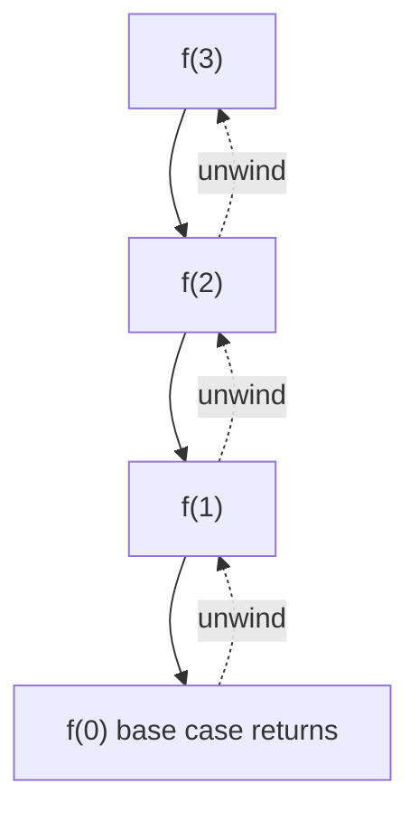
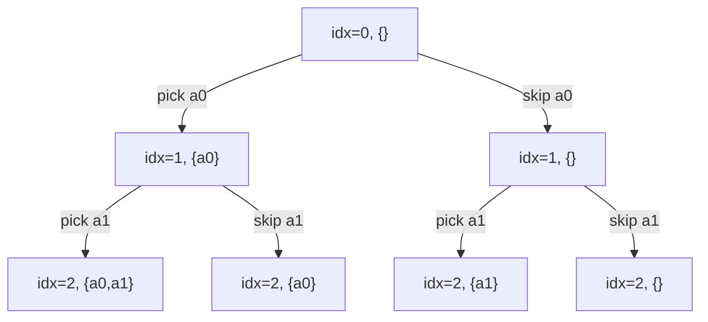
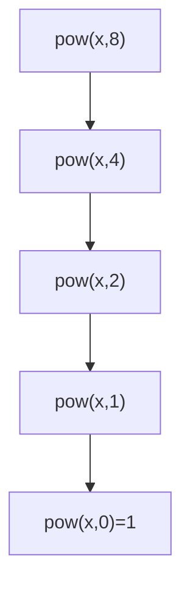
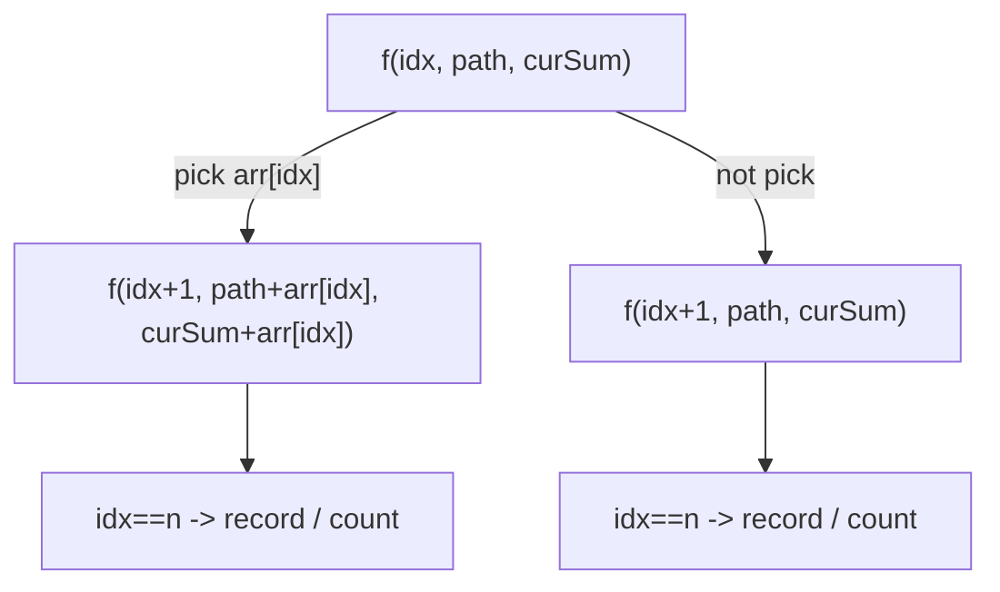
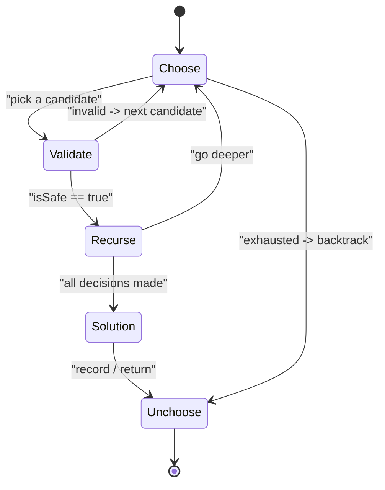
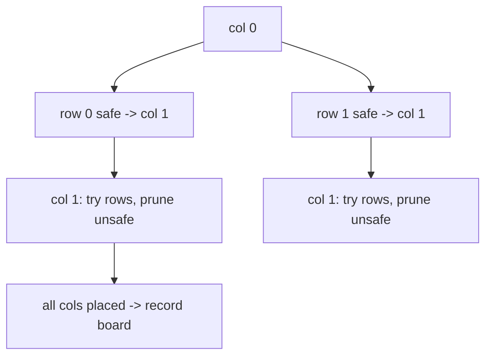

# Recursion [PatternWise] — Theory & Patterns

**Nav:** [Theory & Patterns](./theory-and-patterns.md) · [Problems](./problems.md) · [Resources](./resources.md)

**Stats:** Total problems: **25** — 🟢 Easy: **4** · 🟡 Medium: **13** · 🔴 Hard: **8** · Patterns: **3**

---

## Overview & Why It Matters

**Recursion** is the technique where a function solves a problem by calling itself on a smaller sub-problem until it reaches a **base case**. It is the single most leverage-heavy topic in the A2Z sheet: nearly every advanced topic — **Trees, Graphs (DFS), Dynamic Programming, Divide & Conquer, and Backtracking** — is recursion in disguise. If you master the *recursion tree* and the *pick / not-pick* mental models here, DP and backtracking become "recursion + memory" and "recursion + undo".

**Where it shows up in interviews:**
- Generate **all** subsets / subsequences / combinations / permutations.
- Constraint-satisfaction puzzles: **N-Queens, Sudoku, M-Coloring, Rat in a Maze**.
- String partition / parsing: **Palindrome Partitioning, Word Break, Expression Add Operators**.
- Math-flavored recursion: **Pow(x, n), Count Good Numbers, atoi**.
- "Use recursion only" constraints on classic structures: **sort/reverse a stack**.

**Prerequisites:** function call stack, basic loops & arrays, `std::vector` / `std::string`, and elementary modular arithmetic (for `Count Good Numbers`).

---

## Core Concepts

**The three pillars of any recursive solution:**
1. **Base case** — the smallest input where the answer is known directly; stops the recursion.
2. **Recursive case** — express `f(n)` in terms of `f(smaller)`; each call must move *toward* the base case.
3. **State** — the parameters carried down (index, current path, remaining target, board). Choosing the right state is 80% of the work.

**Key vocabulary:**
- **Recursion tree** — a tree where each node is one call and its children are the recursive calls it makes. The *number of nodes* ≈ time complexity; the *height* ≈ auxiliary stack space.
- **Pick / Not-pick** — at index `i` you branch: include `arr[i]` or skip it. This binary tree of depth `n` generates the `2ⁿ` subsequences.
- **Backtracking** — DFS over the tree of partial solutions, where every choice made *on the way down* is undone *on the way up* (`push` → recurse → `pop`), so one mutable path represents the whole tree.
- **Invariant** — a property true at every node (e.g., "`open ≥ close` for valid parentheses", "path is a valid partial solution").

**The call stack (how one call sits on top of another):**



**Pick / Not-pick tree for a 3-element array (generates all 2^3 subsequences):**



---

## Patterns

### Pattern 1 — Get a Strong Hold (Foundational Recursion)

**Recognition signals:**
- Problem says *"do it using recursion"* or *"without loops / without extra data structures"*.
- A quantity can be defined in terms of a smaller version of itself: `pow(x,n) = x·pow(x,n-1)`, `atoi("123") = atoi("12")*10 + 3`.
- Operating on a **stack** but you may only use recursion (the call stack *is* your temporary storage).

**Approach (step-by-step):**
1. Identify the **state** (current index / exponent / remaining string).
2. Write the **base case** (empty string, exponent 0, empty stack).
3. Write the **recursive relation** combining the sub-answer with the current element.
4. For stack problems: pop the top via recursion, recurse on the smaller stack, then re-insert the popped element at the correct position while unwinding.
5. Optimize where possible: `Pow(x,n)` → **binary/fast exponentiation** (`x^n = (x^{n/2})²`) turns O(n) into O(log n).

**Recursion tree for fast exponentiation `pow(x, 8)`:**



**Complexity:** Fast pow → **Time O(log n)**, **Space O(log n)** stack. Sort/Reverse a stack → **Time O(n²)** (each of `n` elements is re-inserted through up to `n` elements), **Space O(n)** stack.

**Reusable C++ templates:**

```cpp
// Fast exponentiation: x^n in O(log n)
double myPow(double x, long long n) {
    if (n == 0) return 1.0;
    if (n < 0) { x = 1.0 / x; n = -n; }      // handle negative exponent
    double half = myPow(x, n / 2);
    double result = half * half;
    if (n % 2 == 1) result *= x;             // odd exponent: multiply once more
    return result;
}

// Sort a stack using recursion (no extra container)
void insertSorted(stack<int>& st, int val) {
    if (st.empty() || st.top() <= val) { st.push(val); return; }
    int top = st.top(); st.pop();
    insertSorted(st, val);
    st.push(top);                            // re-insert on the way up
}
void sortStack(stack<int>& st) {
    if (st.empty()) return;
    int top = st.top(); st.pop();
    sortStack(st);
    insertSorted(st, top);
}
```

---

### Pattern 2 — Subsequences Pattern (Pick / Not-Pick, Subsets, Combinations)

**Recognition signals:**
- "Generate / count / check **all** subsequences / subsets / combinations".
- Answer size is exponential (`2ⁿ`, or bounded by target sum) and you must **enumerate**, not just compute one number.
- Words like *"all unique subsets"*, *"combinations that sum to K"*, *"all valid parentheses"*, *"letter combinations"*.

**Approach (the universal pick/not-pick recipe):**
1. State = `(index, currentPath)` plus any running aggregate (sum, count).
2. **Base case:** `index == n` → record `currentPath` (or update count/flag).
3. **Not-pick:** recurse to `index+1` without touching path.
4. **Pick:** add `arr[index]` to path, recurse (to `index+1`, or same `index` if reuse allowed as in Combination Sum I), then **pop** it (backtrack).
5. **De-duplicate** (Subsets II / Combination Sum II): sort input, and when *not-picking*, skip over equal neighbours (`while(i+1<n && arr[i]==arr[i+1]) i++;`) or in a loop-based variant `if (i>start && arr[i]==arr[i-1]) continue;`.
6. **Prune** early when a running sum exceeds target.

**Decision tree per element:**



**Complexity:** Enumerating subsequences is **Time O(2ⁿ · k)** where `k` is the cost to copy/record a path (often `O(n)`), **Space O(n)** recursion depth + output. Combination-sum variants are bounded by the number of valid combinations; Letter Combinations is `O(4ⁿ · n)` (4 letters max per digit).

**Reusable C++ template (pick / not-pick, collect all subsequences with sum K):**

```cpp
void solve(int i, int n, vector<int>& arr, int target,
           vector<int>& path, vector<vector<int>>& ans) {
    if (i == n) {
        if (target == 0) ans.push_back(path);   // record valid path
        return;
    }
    // PICK arr[i]
    if (arr[i] <= target) {
        path.push_back(arr[i]);
        solve(i + 1, n, arr, target - arr[i], path, ans);
        path.pop_back();                         // backtrack (undo choice)
    }
    // NOT PICK arr[i]
    solve(i + 1, n, arr, target, path, ans);
}
```

```cpp
// Loop-based subset/combination template with duplicate handling (sort first)
void combine(int start, vector<int>& nums, vector<int>& path,
             vector<vector<int>>& ans) {
    ans.push_back(path);                          // every node is a valid subset
    for (int i = start; i < (int)nums.size(); ++i) {
        if (i > start && nums[i] == nums[i - 1]) continue; // skip duplicates
        path.push_back(nums[i]);
        combine(i + 1, nums, path, ans);          // i+1: no reuse; use i to reuse
        path.pop_back();
    }
}
```

---

### Pattern 3 — Trying out all Combos / Hard (Backtracking on Grids, Boards & Strings)

**Recognition signals:**
- Constraint satisfaction: place items so that **no two conflict** (queens, colors), fill cells under rules (Sudoku), find a path in a grid (Rat in a Maze, Word Search).
- Partition a string so **every piece** satisfies a property (palindrome, dictionary word).
- Insert operators/choices and check if a **target** is met (Expression Add Operators, Word Break).
- Keywords: *"return all solutions"*, *"is it possible"*, *"place / color / fill"*.

**Approach (the backtracking template):**
1. **State:** the partial solution (board, path, index, visited set).
2. **Choose** a candidate for the current decision point.
3. **Validate** with an `isSafe` / feasibility check; if invalid, skip.
4. **Recurse** to the next decision point.
5. **Un-choose** (undo the placement / mark) before trying the next candidate.
6. **Base case:** all decisions made → record solution (or return `true` for existence problems).
7. Optimize `isSafe` with auxiliary arrays (column/diagonal flags for N-Queens, row/col/box sets for Sudoku).

**Backtracking state machine:**



**N-Queens partial recursion tree (place one queen per column):**



**Complexity:** Worst case is the size of the search tree. N-Queens ≈ **O(N!)**; Sudoku ≈ **O(9^(empty cells))** with heavy pruning; Word Search ≈ **O(m·n·4^L)**; Rat in a Maze ≈ **O(4^(m·n))**. **Space** = recursion depth + board/visited = typically **O(cells)**.

**Reusable C++ backtracking template:**

```cpp
bool backtrack(State& s) {
    if (isComplete(s)) {                 // base case: full solution
        record(s);                       // or: return true (existence)
        return true;                     // return false to keep searching for MORE
    }
    for (auto& choice : candidates(s)) { // enumerate options at this decision point
        if (!isSafe(s, choice)) continue;// prune invalid branches early
        apply(s, choice);                // CHOOSE
        if (backtrack(s)) return true;   // RECURSE (drop the `if` to collect all)
        undo(s, choice);                 // UN-CHOOSE (backtrack)
    }
    return false;                        // no candidate worked here
}
```

```cpp
// Concrete: N-Queens isSafe using O(1) lookups
bool isSafe(int row, int col, vector<int>& leftRow,
            vector<int>& lowerDiag, vector<int>& upperDiag, int n) {
    if (leftRow[row]) return false;
    if (lowerDiag[row + col]) return false;
    if (upperDiag[n - 1 + col - row]) return false;
    return true;
}
```

---

## Complexity Summary

| Pattern | Time | Space | Notes |
|---|---|---|---|
| Get a Strong Hold — fast pow | O(log n) | O(log n) | Binary exponentiation; naive is O(n) |
| Get a Strong Hold — sort/reverse stack | O(n²) | O(n) | Re-insert each element through the recursion stack |
| Get a Strong Hold — atoi / Count Good Numbers | O(len) / O(log n) | O(len) / O(log n) | Count Good Numbers = fast pow under modulo |
| Subsequences — enumerate all | O(2ⁿ · k) | O(n) + output | `k` = cost to copy a path (~O(n)) |
| Subsequences — combination sum variants | ~O(2^t · k) | O(target/min) | Bounded by #valid combos; prune on target |
| Subsequences — Letter Combinations | O(4ⁿ · n) | O(n) | ≤4 letters per digit, n digits |
| Trying all Combos — N-Queens | O(N!) | O(N) | Column-wise placement + O(1) safety flags |
| Trying all Combos — Sudoku | O(9^(empty)) | O(empty) | Prune with row/col/box constraint sets |
| Trying all Combos — Word Search / Rat Maze | O(m·n·4^L) / O(4^(mn)) | O(L) / O(mn) | DFS on grid + visited/backtrack |
| Trying all Combos — Palindrome Partition / Word Break | O(2ⁿ · n) | O(n) | Cut at every index; validate each piece |

---

## Interview Tips & Common Mistakes

- **Always write the base case first.** Missing or wrong base cases cause infinite recursion / stack overflow.
- **Forgetting to backtrack** (`path.pop_back()` / `undo`) is the #1 bug — the mutable path leaks state into sibling branches.
- **Pick vs loop form:** pick/not-pick (index-based) and the `for(i=start...)` loop form are equivalent; know both. The loop form is cleaner for combinations; pick/not-pick is cleaner for "each element is include/exclude".
- **De-duplication:** sort first, then skip equal siblings. Do *not* use a hash-set of results unless asked — it hides the real skill.
- **Prune aggressively:** return early when `curSum > target`, when remaining elements can't reach the goal, or when an `isSafe` check fails. Pruning is often the difference between TLE and AC.
- **Overflow:** `Pow(x,n)` — take `n` as `long long` because `-n` overflows for `INT_MIN`. `Count Good Numbers` — apply modulo `1e9+7` at every multiplication.
- **Recursion depth:** deep recursion (large `n`) can stack-overflow; mention converting to iterative or increasing stack size if pressed.
- **Complexity honesty:** state the recursion-tree reasoning ("2 branches × depth n = 2ⁿ nodes"). Interviewers reward the *why*, not just the big-O.
- **Return-once vs collect-all:** for existence problems return `true` as soon as one solution is found; for enumeration keep going and never short-circuit.
