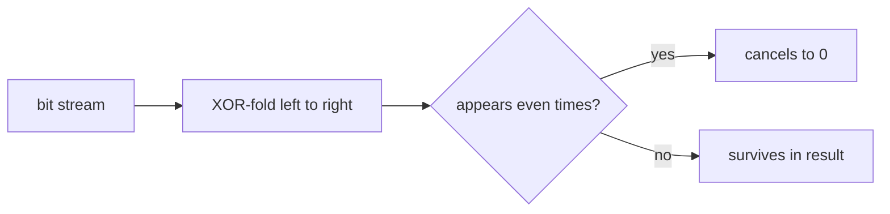
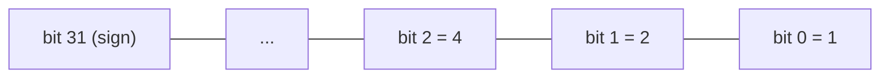
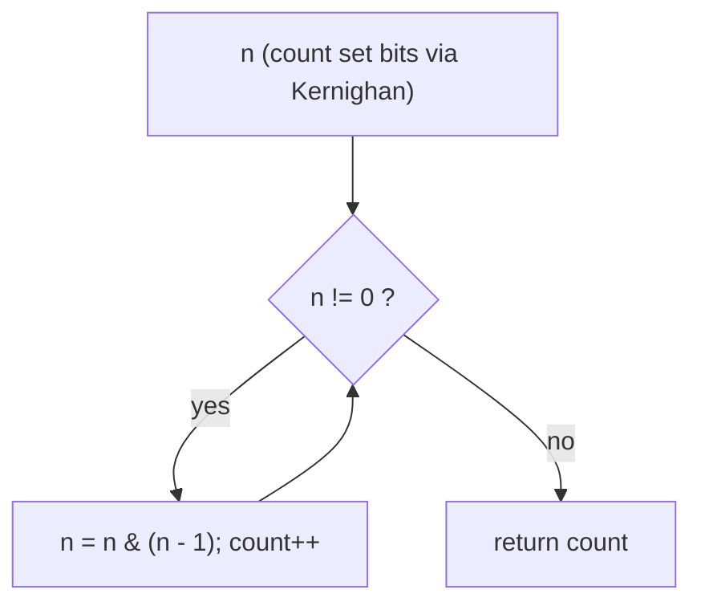
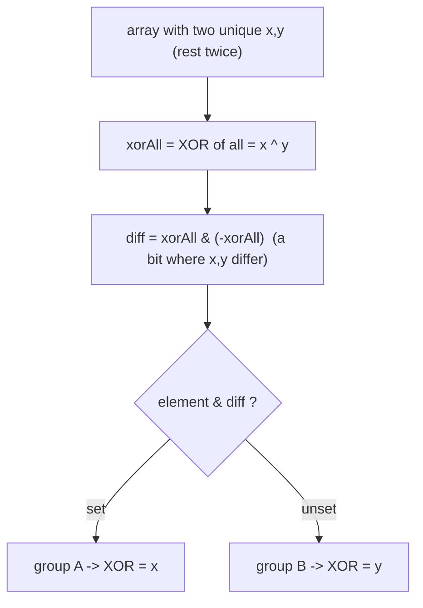
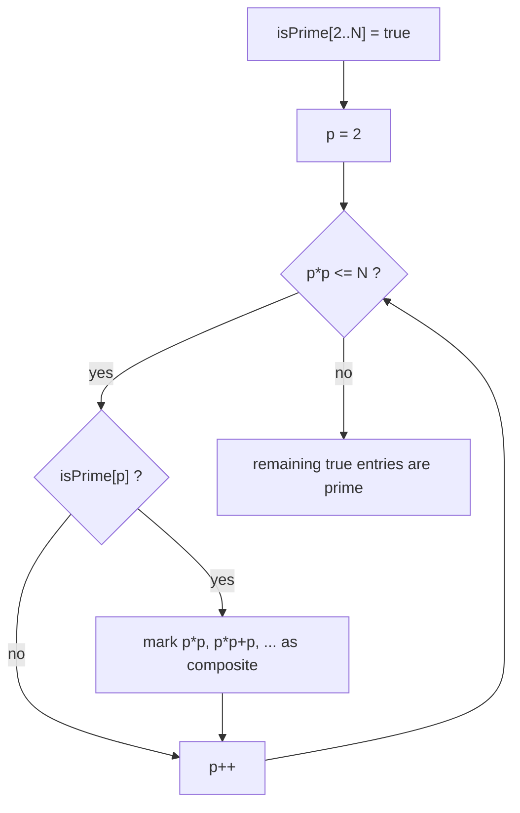

# Bit Manipulation [Concepts & Problems] — Theory & Patterns

**Nav:** [Theory & Patterns](./theory-and-patterns.md) · [Problems (by Pattern)](./problems.md) · [Resources & References](./resources.md)

**Stats:** 18 problems total — 🟢 8 Easy · 🟡 7 Medium · 🔴 3 Hard · 3 patterns.

---

## Overview & Why It Matters

Bit manipulation is the art of operating on the **individual binary digits (bits)** of a number instead of treating the number as a single atomic value. Because CPUs store integers in binary and implement bitwise operations as single-cycle hardware instructions, bit tricks are the **fastest and most memory-efficient** primitives available.

Where it shows up in interviews and CP:

- **Direct bit questions:** count set bits, check/set/clear/toggle a bit, check power of two, swap without temp.
- **XOR identities:** find the unique element, the two unique elements, XOR over a range, missing/duplicate numbers.
- **Subset / power-set enumeration:** iterate all `2^n` subsets using an `n`-bit mask (foundation of bitmask DP).
- **Fast arithmetic:** binary exponentiation (`pow(x, n)` in `O(log n)`), division without `*` `/` `%`.
- **Number theory glue:** divisors, prime factorisation, and the Sieve of Eratosthenes — which pair naturally with bit-level thinking and boolean arrays.

**Prerequisites:** binary representation of integers, two's-complement for negatives, the six bitwise operators (`& | ^ ~ << >>`), operator precedence, and integer overflow (`int` vs `long long`).

---

## Core Concepts

### The six operators

| Operator | Symbol | Rule | Typical use |
|---|---|---|---|
| AND | `&` | 1 iff both bits 1 | mask / test a bit |
| OR | `\|` | 1 iff any bit 1 | set a bit |
| XOR | `^` | 1 iff bits differ | toggle / cancel pairs |
| NOT | `~` | flips every bit | build masks |
| Left shift | `<<` | `x << k == x * 2^k` | build `1<<i`, multiply |
| Right shift | `>>` | `x >> k == x / 2^k` (unsigned) | walk bits, divide |

### The canonical one-liners (memorize these)

| Goal | Expression |
|---|---|
| Test i-th bit | `(x >> i) & 1` |
| Set i-th bit | `x \| (1 << i)` |
| Clear i-th bit | `x & ~(1 << i)` |
| Toggle i-th bit | `x ^ (1 << i)` |
| Lowest set bit (value) | `x & (-x)` |
| Remove lowest set bit | `x & (x - 1)` |
| Is power of two | `x > 0 && (x & (x - 1)) == 0` |
| Is odd | `x & 1` |
| Set lowest **unset** bit | `x \| (x + 1)` |

### XOR — the workhorse identity

XOR behaves like addition without carry over GF(2):

- `a ^ a = 0` (self-inverse)
- `a ^ 0 = a` (identity)
- Commutative & associative → order doesn't matter.

So XOR-ing a stream **cancels every value that appears an even number of times**, leaving only what appears an odd number of times.



### Bit layout of an integer (invariant)



**Invariant:** the value of bit `i` contributes `2^i` to the number. Every bit trick is just reasoning about which powers of two are present.

---

## Patterns

### Pattern 1 — Learn Bit Manipulation (core bit tricks)

**Recognition signals:** the problem asks you to inspect/modify a specific bit, count bits, detect a power of two, swap values, or do arithmetic (divide) without using `* / %`. Small, self-contained, `O(bits)` operations.

**Approach (step-by-step):**
1. Fix a **bit index `i`** and build the mask `1 << i`.
2. Use `&` to *test*, `|` to *set*, `& ~mask` to *clear*, `^` to *toggle*.
3. To **count set bits**, repeatedly do `n &= (n - 1)` (Kernighan) — each iteration removes exactly one set bit, so it loops only `popcount` times.
4. **Power of two:** a positive number is a power of two iff it has exactly one set bit → `n & (n-1) == 0`.
5. **Swap without temp:** `a ^= b; b ^= a; a ^= b;`.
6. **Divide without `/`:** subtract the largest shifted multiple of the divisor (`divisor << k`) that still fits, accumulate `1 << k` into the quotient, watch overflow and signs.



**Complexity:** testing/setting/clearing/toggling a bit = `O(1)`. Counting set bits with Kernighan = `O(number of set bits)` ≤ `O(log n)`. Divide = `O(log n)` shifts. Space `O(1)`.

**C++ template:**
```cpp
struct BitBasics {
    static bool isSet(int x, int i)  { return (x >> i) & 1; }
    static int  setBit(int x, int i) { return x | (1 << i); }
    static int  clearBit(int x,int i){ return x & ~(1 << i); }
    static int  toggle(int x, int i) { return x ^ (1 << i); }
    static bool isOdd(int x)         { return x & 1; }
    static bool isPow2(long long x)  { return x > 0 && (x & (x - 1)) == 0; }

    // Kernighan's set-bit count
    static int countSetBits(int x) {
        int c = 0;
        while (x) { x &= (x - 1); ++c; }
        return c;
    }

    static void swapXor(int &a, int &b) { a ^= b; b ^= a; a ^= b; }

    // Set the rightmost UNSET bit; if all set, x is unchanged.
    static int setRightmostUnset(int x) { return x | (x + 1); }

    // Divide without * / % ; returns clamped int (LeetCode rules).
    static int divide(int dividend, int divisor) {
        if (dividend == INT_MIN && divisor == -1) return INT_MAX;
        long long a = llabs((long long)dividend);
        long long b = llabs((long long)divisor);
        long long q = 0;
        for (int k = 31; k >= 0; --k) {
            if ((b << k) <= a) { a -= (b << k); q += (1LL << k); }
        }
        bool neg = (dividend < 0) ^ (divisor < 0);
        return (int)(neg ? -q : q);
    }
};
```

---

### Pattern 2 — Interview Problems (XOR patterns & power set)

**Recognition signals:** "every element appears twice except one/two", "minimum flips to convert A to B", "generate all subsets", "XOR of all numbers from L to R". These reduce to XOR identities or subset enumeration.

**Approach (step-by-step):**
1. **Single Number I** — XOR the whole array; pairs cancel, the lone element survives.
2. **Minimum bit flips** — flips needed = number of differing bits = `popcount(a ^ b)`.
3. **Single Number III** — XOR everything to get `x ^ y`; isolate any differing bit `d = xy & (-xy)`; partition the array by that bit and XOR each group separately.
4. **XOR of 1..n pattern** — `f(n)` depends only on `n % 4`: `{n, 1, n+1, 0}`; range answer = `f(R) ^ f(L-1)`.
5. **Power set** — for a set of size `n`, each mask in `[0, 2^n)` selects a subset: bit `j` set ⇒ include element `j`.



**Complexity:** XOR scans are `O(n)` time, `O(1)` space. Power set is `O(n * 2^n)` time to build all subsets, `O(2^n)` output space. XOR-of-range is `O(1)`.

**C++ template:**
```cpp
int singleNumberI(const vector<int>& a) {         // O(n), O(1)
    int x = 0; for (int v : a) x ^= v; return x;
}

int minBitFlips(int start, int goal) {            // O(1)-ish
    int d = start ^ goal, c = 0;
    while (d) { d &= (d - 1); ++c; }
    return c;
}

vector<int> singleNumberIII(const vector<int>& a) { // O(n), O(1)
    long long xy = 0; for (int v : a) xy ^= v;
    int diff = (int)(xy & (-xy));
    int x = 0, y = 0;
    for (int v : a) (v & diff) ? x ^= v : y ^= v;
    return {x, y};
}

int xorUptoN(int n) {                              // XOR of 0..n
    switch (n & 3) { case 0: return n; case 1: return 1;
                     case 2: return n + 1; default: return 0; }
}
int xorRange(int L, int R) { return xorUptoN(R) ^ xorUptoN(L - 1); }

vector<vector<int>> powerSet(const vector<int>& s) { // O(n * 2^n)
    int n = s.size();
    vector<vector<int>> res;
    for (int mask = 0; mask < (1 << n); ++mask) {
        vector<int> sub;
        for (int j = 0; j < n; ++j)
            if (mask & (1 << j)) sub.push_back(s[j]);
        res.push_back(sub);
    }
    return res;
}
```

---

### Pattern 3 — Advanced Maths (divisors, primes, sieve, fast power)

**Recognition signals:** "print all divisors / prime factors", "count primes up to N or in [L,R]", "compute x^n / a^b mod p". These blend `O(√n)` trial factorisation, the Sieve of Eratosthenes, and binary exponentiation.

**Approach (step-by-step):**
1. **Divisors in `O(√n)`:** iterate `i` from `1` to `√n`; if `i | n`, record both `i` and `n/i`.
2. **Prime factorisation in `O(√n)`:** for each `i` up to `√n`, while `i | n` divide out and record `i`; if `n > 1` at the end it is itself prime.
3. **Sieve of Eratosthenes:** boolean array `isPrime[0..N]`; for each prime `p`, mark multiples starting at `p*p`. `O(N log log N)`.
4. **Smallest Prime Factor (SPF) sieve:** store the smallest prime dividing each number → factorise any `x ≤ N` in `O(log x)`.
5. **Count primes in [L,R]:** precompute a prefix count from the sieve; answer = `cnt[R] - cnt[L-1]`.
6. **Binary exponentiation (`pow`):** read the exponent bit by bit; square the base each step and multiply into the result when the current bit is 1 → `O(log n)`.



**Complexity:** divisors & factorisation `O(√n)`; sieve `O(N log log N)` build + `O(N)` space; SPF factorisation `O(log x)` per query; binary exponentiation `O(log n)`.

**C++ template:**
```cpp
vector<int> divisors(int n) {                    // O(sqrt n)
    vector<int> d;
    for (int i = 1; (long long)i * i <= n; ++i)
        if (n % i == 0) { d.push_back(i); if (i != n / i) d.push_back(n / i); }
    sort(d.begin(), d.end());
    return d;
}

vector<int> primeFactors(int n) {                // O(sqrt n)
    vector<int> f;
    for (int i = 2; (long long)i * i <= n; ++i)
        while (n % i == 0) { f.push_back(i); n /= i; }
    if (n > 1) f.push_back(n);
    return f;
}

vector<char> sieve(int N) {                       // O(N log log N)
    vector<char> isPrime(N + 1, 1);
    if (N >= 0) isPrime[0] = 0;
    if (N >= 1) isPrime[1] = 0;
    for (long long p = 2; p * p <= N; ++p)
        if (isPrime[p])
            for (long long m = p * p; m <= N; m += p) isPrime[m] = 0;
    return isPrime;
}

// count primes in [L, R] using a prefix count over the sieve
int countPrimesInRange(int L, int R) {
    auto p = sieve(R);
    int cnt = 0;
    for (int i = max(2, L); i <= R; ++i) cnt += p[i];
    return cnt;
}

double myPow(double x, long long n) {             // O(log n)
    if (n < 0) { x = 1 / x; n = -n; }
    double res = 1.0;
    while (n) {
        if (n & 1) res *= x;
        x *= x;
        n >>= 1;
    }
    return res;
}
```

---

## Complexity Summary

| Pattern | Time | Space | Notes |
|---|---|---|---|
| Learn Bit Manipulation (test/set/clear/toggle) | `O(1)` | `O(1)` | single hardware ops |
| Count set bits (Kernighan) | `O(#set bits)` ≤ `O(log n)` | `O(1)` | `n &= n-1` per loop |
| Divide without `* / %` | `O(log n)` | `O(1)` | shift-and-subtract |
| XOR (Single I / min flips) | `O(n)` | `O(1)` | pairs cancel |
| Single Number III | `O(n)` | `O(1)` | split by a diff bit |
| XOR of range [L,R] | `O(1)` | `O(1)` | `n%4` pattern |
| Power set | `O(n · 2^n)` | `O(2^n)` | mask enumeration |
| Divisors / prime factorise | `O(√n)` | `O(√n)` output | pair `i`, `n/i` |
| Sieve / count primes | `O(N log log N)` | `O(N)` | mark from `p*p` |
| Binary exponentiation | `O(log n)` | `O(1)` | square-and-multiply |

---

## Interview Tips & Common Mistakes

- **Precedence traps:** `&`, `|`, `^` have **lower** precedence than `==`. Always parenthesize: write `(x >> i) & 1`, not `x >> i & 1 == 1`.
- **Shift overflow:** `1 << 31` overflows a signed 32-bit `int` (UB). Use `1u << 31` or `1LL << k` when the index can be large.
- **Negative numbers & `>>`:** right-shifting negatives is implementation-defined for signed types; prefer unsigned or `long long` when walking bits of possibly-negative values.
- **Power-of-two check needs `x > 0`:** `0 & (0-1) == 0` would falsely report 0 as a power of two.
- **`INT_MIN` in divide:** `-INT_MIN` overflows — special-case `INT_MIN / -1 → INT_MAX`.
- **Kernighan vs naive counting:** `n & (n-1)` loops only over set bits; a per-bit loop always does 32 iterations.
- **Sieve should mark from `p*p`, not `2p`** (smaller multiples already crossed off), and use `long long` for `p*p` to avoid overflow near `N ~ 2^31`.
- **XOR-of-range** uses `f(L-1)`, not `f(L)` — off-by-one is the classic bug.
- Use `__builtin_popcount` / `__builtin_popcountll` in contests, but be ready to write Kernighan by hand in interviews.
