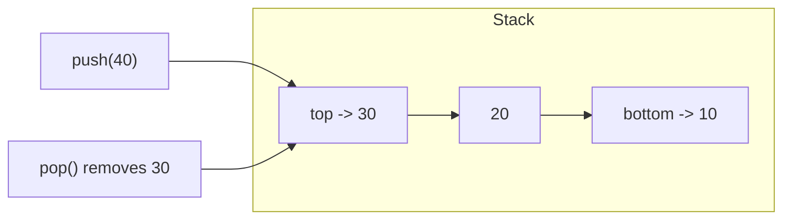
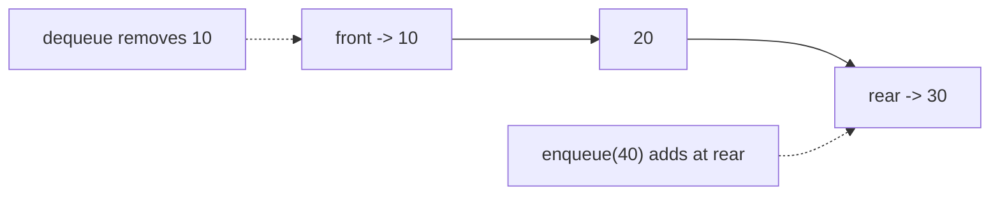
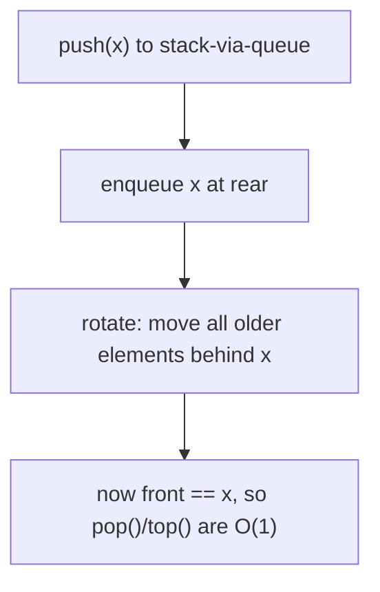
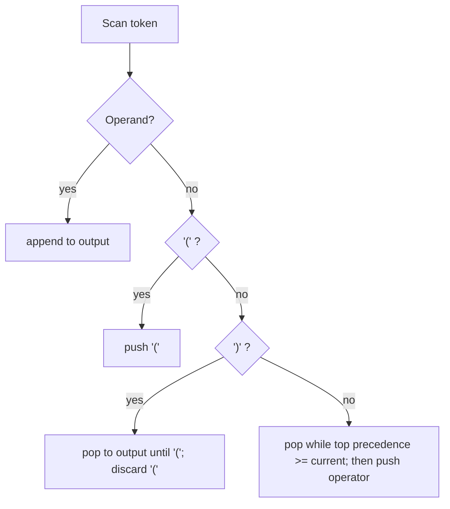
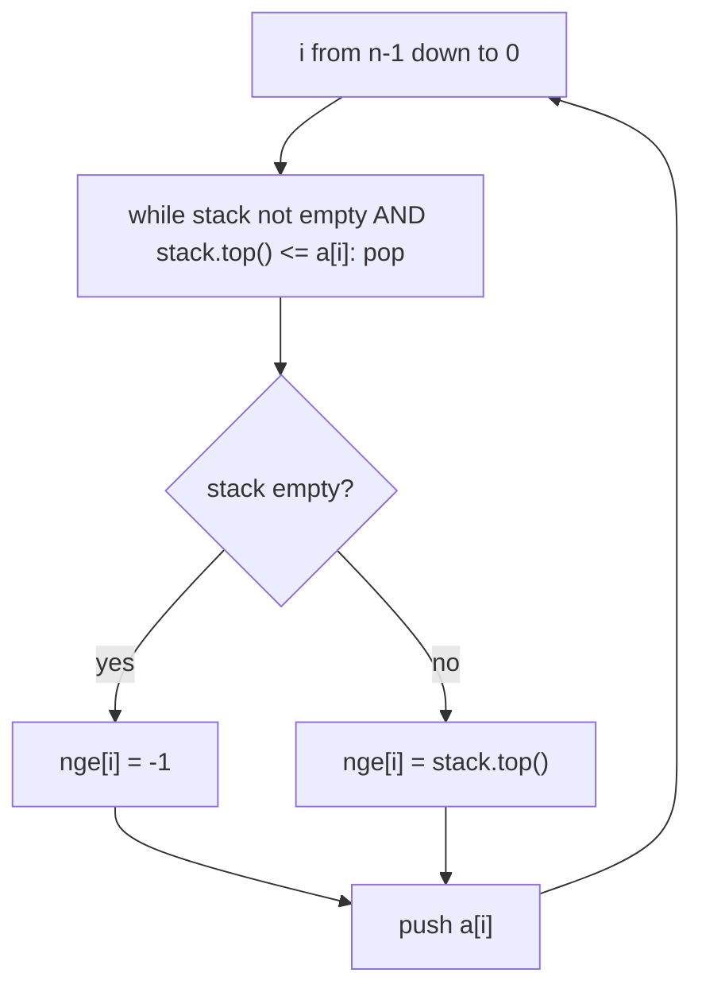
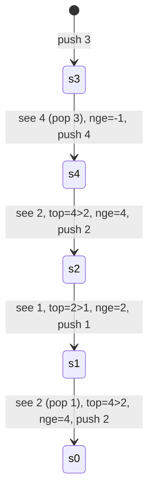
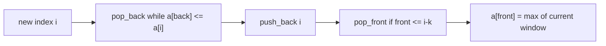
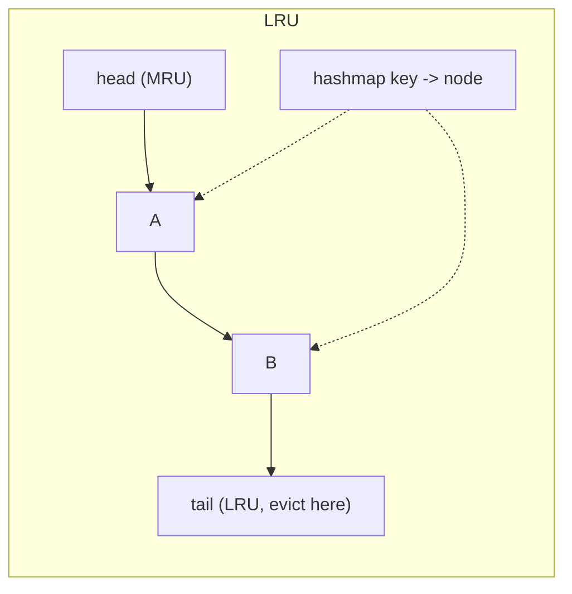

# Stack and Queues — Theory & Patterns

**Navigation:** [Theory & Patterns](./theory-and-patterns.md) · [Problems](./problems.md) · [Resources](./resources.md)

**Stats:** 30 problems total — 🟢 9 Easy · 🟡 13 Medium · 🔴 8 Hard. Four patterns: *Learning (implementations)*, *Prefix/Infix/Postfix Conversion*, *Monotonic Stack/Queue*, *Implementation problems*.

---

## Overview & Why It Matters

A **stack** is a LIFO (Last-In-First-Out) container: the last thing pushed is the first thing popped. A **queue** is a FIFO (First-In-First-Out) container: the first thing enqueued is the first thing dequeued. These two primitives are the backbone of an enormous slice of interview problems because "the most recent thing that is still unresolved" (stack) and "the oldest thing still waiting" (queue) are recurring shapes in real algorithms.

Where they appear in interviews:
- **Parsing & expression evaluation** — compilers, calculators, JSON validators (balanced parentheses, infix↔postfix↔prefix).
- **Monotonic stack** — the single highest-leverage pattern in this step: *next/previous greater/smaller element* in O(n), which powers histogram area, trapping rainwater, subarray min/max sums, stock span, and more.
- **Monotonic deque** — sliding window maximum in O(n).
- **System design flavored problems** — LRU / LFU caches (used at FAANG constantly).
- **Function call stacks, undo/redo, backtracking, DFS** — stacks are everywhere under the hood.

Prerequisites: arrays, basic pointers/linked lists, `std::stack`, `std::queue`, `std::deque`, hash maps, and comfort with amortized analysis (why a loop that pushes/pops each element once is O(n), not O(n²)).

---

## Core Concepts

**Vocabulary & operations**

| Structure | Insert | Remove | Peek | Notes |
|-----------|--------|--------|------|-------|
| Stack | `push` (top) | `pop` (top) | `top` | LIFO |
| Queue | `push`/`enqueue` (rear) | `pop`/`dequeue` (front) | `front` | FIFO |
| Deque | push front/back | pop front/back | front/back | Double-ended; basis of monotonic queue |

**Invariants that make problems easy**
- *Balanced-bracket invariant*: at any prefix, every closing bracket matches the most recent unmatched opening bracket → a stack.
- *Monotonic invariant*: keep the stack strictly (or non-strictly) increasing/decreasing. When a new element violates it, popping resolves relationships (each pop tells you "this element's next/previous greater/smaller is X").
- *Amortization*: each element is pushed once and popped at most once → total work O(n) even with nested `while` loops.

**LIFO stack (top on the right):**



**FIFO queue (front on the left):**



---

## Patterns

### 1. Learning — Implementations & Basic Applications

**Recognition signals:** "implement a stack/queue using X", "design a data structure with O(1) getMin", "validate brackets". These test whether you know the mechanics and can build a container from other primitives.

**Approach (per sub-topic):**
- **Array-backed stack:** keep an index `top` (start `-1`). `push` = `arr[++top]=x`; `pop` = `arr[top--]`; `top()` = `arr[top]`.
- **Array-backed queue (circular):** keep `front`, `rear`, `size`, and wrap indices with `% capacity` to reuse freed slots.
- **Stack via queue(s):** push in O(n) by rotating the queue so the newest element sits at the front (single-queue trick), or use two queues.
- **Queue via stacks:** two stacks `in` and `out`; move `in`→`out` (reversing order) only when `out` is empty → amortized O(1).
- **Linked-list stack/queue:** stack pushes/pops at head; queue keeps `head` (front) and `tail` (rear) pointers.
- **Balanced parentheses:** push openers, pop and match on closers, stack must be empty at end.
- **Min stack:** store `(value, currentMin)` pairs, or encode a "modified value" (`2*val - min`) to hit O(1) time and O(1) extra space.



**Complexity:** array/LL stack & queue → O(1) per op, O(n) space. Stack-via-queue push O(n) (or pop O(n)). Queue-via-stack amortized O(1). Balanced parens O(n)/O(n). Min stack O(1)/O(1) with the encoding trick.

**C++ template (array stack + circular queue + min stack):**

```cpp
// ---- Array-backed stack ----
struct ArrayStack {
    vector<int> a; int topIdx = -1;
    ArrayStack(int cap) { a.resize(cap); }
    void push(int x) { a[++topIdx] = x; }
    int  pop()       { return a[topIdx--]; }
    int  top()       { return a[topIdx]; }
    bool empty()     { return topIdx == -1; }
};

// ---- Circular array queue ----
struct ArrayQueue {
    vector<int> a; int front = 0, rear = -1, sz = 0, cap;
    ArrayQueue(int c): cap(c) { a.resize(c); }
    void push(int x){ rear = (rear + 1) % cap; a[rear] = x; sz++; }
    int  pop()      { int x = a[front]; front = (front + 1) % cap; sz--; return x; }
    bool empty()    { return sz == 0; }
};

// ---- Min stack: O(1) time & O(1) extra space (encoding trick) ----
class MinStack {
    stack<long long> st; long long mn;
public:
    void push(int val) {
        if (st.empty()) { st.push(val); mn = val; }
        else if (val >= mn) st.push(val);
        else { st.push(2LL*val - mn); mn = val; } // encode
    }
    void pop() {
        long long t = st.top(); st.pop();
        if (t < mn) mn = 2*mn - t;                // decode previous min
    }
    int top()    { long long t = st.top(); return t < mn ? (int)mn : (int)t; }
    int getMin() { return (int)mn; }
};
```

---

### 2. Prefix, Infix, Postfix Conversion

**Recognition signals:** "convert expression from X notation to Y", "evaluate a postfix expression", operators + operands + parentheses + precedence. This is the classic **Shunting-Yard** family (Dijkstra, 1961). A shunting yard is literally a railyard where cars are re-ordered using a siding — the perfect stack analogy.

**Notation cheat-sheet:**
- **Infix:** `a + b` (operator between operands; needs precedence + parentheses).
- **Postfix (RPN):** `a b +` (operator after operands; no parentheses needed).
- **Prefix (Polish):** `+ a b` (operator before operands).

**Key rules:**
- Precedence: `^` > `*`,`/` > `+`,`-`. `^` is right-associative; the rest are left-associative.
- **Infix→Postfix:** scan left→right. Operand → output. `(` → push. `)` → pop until `(`. Operator → pop while stack top has ≥ precedence (strictly > for right-assoc `^`), then push.
- **Infix→Prefix:** reverse the string (swap `(`↔`)`), run infix→postfix (with `^` treated as strictly-greater), then reverse the result.
- **Postfix→Infix / Prefix:** scan; push operands; on operator pop two, combine, push back. Prefix is the same but scan right→left.
- **Prefix→Infix / Postfix:** scan right→left; push operands; on operator pop two (first popped is the left operand for prefix), combine, push.



**Complexity:** O(n) time (each token pushed/popped O(1) amortized), O(n) space for the stack + output.

**C++ template (infix→postfix; the rest reuse this skeleton):**

```cpp
int prec(char c){ if(c=='^')return 3; if(c=='*'||c=='/')return 2; if(c=='+'||c=='-')return 1; return -1; }

string infixToPostfix(string s){
    stack<char> st; string out;
    for(char c : s){
        if(isalnum(c)) out += c;
        else if(c=='(') st.push(c);
        else if(c==')'){ while(!st.empty() && st.top()!='(') { out+=st.top(); st.pop(); } st.pop(); }
        else { // operator
            while(!st.empty() && prec(st.top())>=prec(c) && c!='^'){ out+=st.top(); st.pop(); }
            st.push(c);
        }
    }
    while(!st.empty()){ out+=st.top(); st.pop(); }
    return out;
}
```

---

### 3. Monotonic Stack / Queue  [Very Important]

**Recognition signals:** "for each element find the *next/previous* *greater/smaller* element", "how far until a bigger value", "area/sum bounded by neighbors", "sliding window max". Whenever the answer for index `i` depends on the *nearest* element to left/right satisfying an ordering, think monotonic stack. When you need the extreme over a moving window, think monotonic deque.

**The monotonic stack invariant:** you keep indices (or values) so the stack is always increasing or decreasing. When the incoming element breaks the order, you pop — and *each pop resolves an answer*.

- **Next Greater (right):** iterate right→left, keep a **decreasing** stack; pop everything `<=` current; top is the answer.
- **Next Smaller (right):** iterate right→left, keep an **increasing** stack.
- **Previous Greater/Smaller:** same idea iterating left→right.
- **Circular arrays (NGE-II):** run the loop `2n` times using `i % n`.



**State diagram of the stack while scanning [2, 1, 2, 4, 3] right→left for NGE:**



**Monotonic deque (sliding window max):** maintain a **decreasing** deque of indices. Pop from back while it holds smaller values; pop from front when it exits the window; front is the window max.



**Complexity:** O(n) time (amortized — each index pushed/popped once), O(n) space for stack/deque.

**C++ templates:**

```cpp
// Next Greater Element to the right (values). -1 if none.
vector<int> nextGreater(vector<int>& a){
    int n=a.size(); vector<int> res(n,-1); stack<int> st; // stores values, decreasing
    for(int i=n-1;i>=0;i--){
        while(!st.empty() && st.top()<=a[i]) st.pop();
        if(!st.empty()) res[i]=st.top();
        st.push(a[i]);
    }
    return res;
}

// Next Smaller Element to the right.
vector<int> nextSmaller(vector<int>& a){
    int n=a.size(); vector<int> res(n,-1); stack<int> st; // increasing
    for(int i=n-1;i>=0;i--){
        while(!st.empty() && st.top()>=a[i]) st.pop();
        if(!st.empty()) res[i]=st.top();
        st.push(a[i]);
    }
    return res;
}

// Sliding Window Maximum with a monotonic deque of indices.
vector<int> maxSlidingWindow(vector<int>& a, int k){
    deque<int> dq; vector<int> res;
    for(int i=0;i<(int)a.size();i++){
        if(!dq.empty() && dq.front()<=i-k) dq.pop_front();
        while(!dq.empty() && a[dq.back()]<=a[i]) dq.pop_back();
        dq.push_back(i);
        if(i>=k-1) res.push_back(a[dq.front()]);
    }
    return res;
}
```

---

### 4. Implementation Problems

**Recognition signals:** "design a cache with O(1) get/put", "compute stock span online", "find the celebrity", "sliding window maximum". These combine the primitives above with hash maps and linked lists to hit strict time bounds — very "systems" flavored and interview-favorite.

**Approaches:**
- **Sliding Window Maximum:** monotonic deque (see pattern 3).
- **Stock Span:** monotonic stack of indices holding previous-greater; span = `i - prevGreaterIndex`.
- **Celebrity Problem:** two-pointer elimination — if `knows(a,b)` then `a` can't be celebrity (advance `a`), else `b` can't (advance `b`); verify the survivor. O(n) with O(1) space (stack variant also works).
- **LRU Cache:** hash map (key→node) + doubly linked list ordered by recency; move-to-front on access, evict tail. O(1).
- **LFU Cache:** hash map (key→node) + hash map (freq→doubly linked list) + `minFreq` tracker; O(1) get/put.



**Complexity:** Sliding window max O(n)/O(k). Stock span amortized O(1) per query, O(n) total. Celebrity O(n)/O(1). LRU O(1) per op with O(capacity) space. LFU O(1) per op with O(capacity) space.

**C++ template (LRU with list + unordered_map):**

```cpp
class LRUCache {
    int cap;
    list<pair<int,int>> dll;                     // front = MRU, back = LRU
    unordered_map<int, list<pair<int,int>>::iterator> mp;
public:
    LRUCache(int capacity): cap(capacity) {}
    int get(int key){
        if(!mp.count(key)) return -1;
        dll.splice(dll.begin(), dll, mp[key]);   // move to front
        return mp[key]->second;
    }
    void put(int key, int val){
        if(mp.count(key)){ mp[key]->second = val; dll.splice(dll.begin(), dll, mp[key]); return; }
        if((int)dll.size()==cap){ mp.erase(dll.back().first); dll.pop_back(); }
        dll.push_front({key,val}); mp[key]=dll.begin();
    }
};
```

---

## Complexity Summary

| Pattern | Time | Space | Notes |
|---------|------|-------|-------|
| Learning — array/LL stack & queue | O(1) per op | O(n) | Circular indexing for queue |
| Learning — stack via queue | O(n) push (or pop) | O(n) | Single-queue rotation |
| Learning — queue via stacks | Amortized O(1) | O(n) | Two-stack lazy transfer |
| Learning — balanced parentheses | O(n) | O(n) | Stack must end empty |
| Learning — min stack | O(1) | O(1) extra | Encoding trick `2*val-min` |
| Prefix/Infix/Postfix conversion | O(n) | O(n) | Shunting-yard; precedence & associativity |
| Monotonic stack (NGE/NSE/etc.) | O(n) | O(n) | Each index pushed/popped once |
| Monotonic deque (sliding window) | O(n) | O(k) | Decreasing deque of indices |
| Histogram / max rectangle | O(n) / O(n·m) | O(n) | NSE both sides; rows as histograms |
| LRU / LFU cache | O(1) per op | O(capacity) | Hashmap + doubly linked list |

---

## Interview Tips & Common Mistakes

- **Store indices, not values, in a monotonic stack** when you need distances or widths (histogram, stock span, subarray counts). Values alone lose position.
- **Decide `<` vs `<=` carefully.** For "sum of subarray minimums" you must break ties consistently (strict on one side, non-strict on the other) to avoid double counting subarrays with equal elements.
- **Off-by-one in circular queue.** Track `size` explicitly rather than trying to distinguish full/empty from `front`/`rear` alone.
- **Associativity of `^`.** It is right-associative — use strictly-greater comparison so `2^3^2` groups as `2^(3^2)`.
- **Don't forget the leftover stack** at the end of expression conversion — flush remaining operators to output.
- **Amortized reasoning.** Interviewers love asking "why is the nested while loop still O(n)?" — answer: every element is pushed once and popped at most once.
- **LRU vs LFU.** LRU evicts least *recently* used (one linked list); LFU evicts least *frequently* used (buckets per frequency + `minFreq`). Mixing them up is a common slip.
- **Sentinels help histograms.** Append a `0` height (or pad both ends) so the stack fully drains and every bar's rectangle is finalized.
- **Two-pointer beats stack for celebrity** — same O(n) but O(1) space; mention both.
