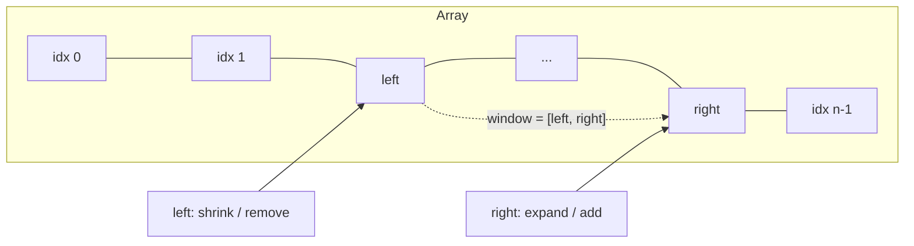
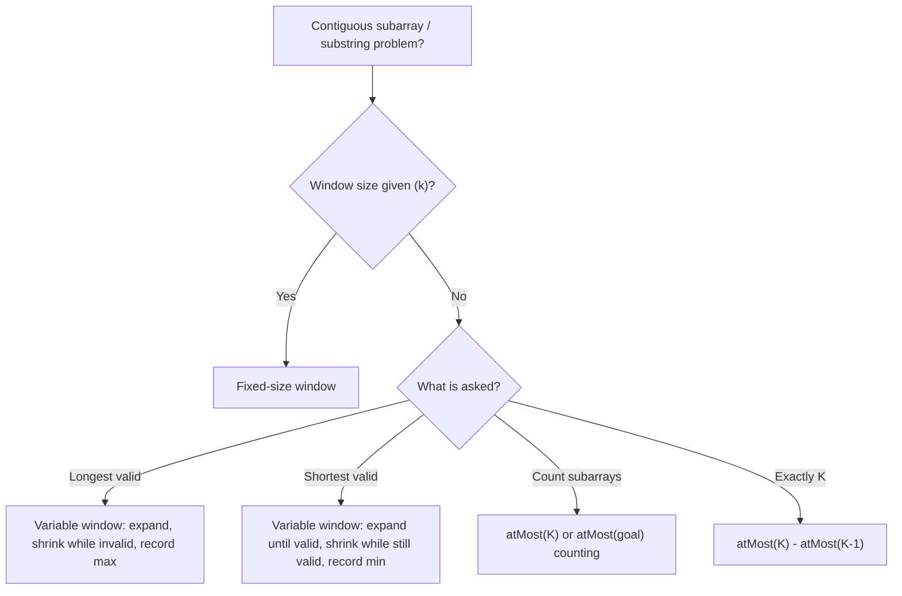
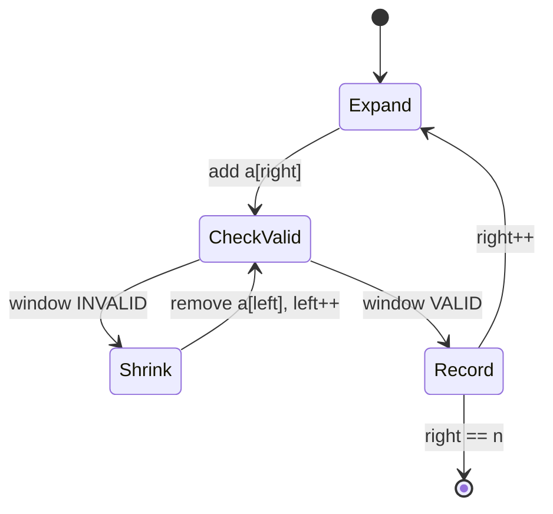
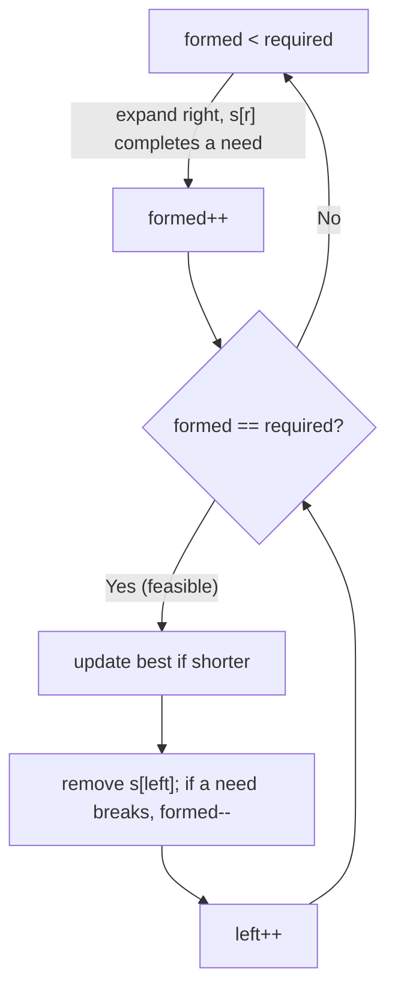

# Sliding Window & Two Pointer — Theory & Patterns

> **Nav:** [Theory & Patterns](./theory-and-patterns.md) · [Problems](./problems.md) · [Resources](./resources.md)
>
> **Stats:** 12 problems total — 🟢 Easy: 0 · 🟡 Medium: 5 · 🔴 Hard: 7 · Patterns (sub-steps): 2

---

## Overview & Why It Matters

The **Sliding Window** and **Two Pointer** techniques are the go-to tools for questions that ask about a **contiguous subarray or substring** satisfying some condition — "longest", "shortest", "number of", "at most K", "exactly K". Brute force enumerates every `(l, r)` pair in `O(n²)` (and re-scans in `O(n³)`). Both techniques collapse this to a **single linear sweep** by *reusing work*: as the window moves one step, we add the element entering on the right and remove the element leaving on the left instead of recomputing from scratch.

- **Two Pointer** — two indices (`left`, `right`) move over the data, either from opposite ends toward each other, or in the same direction at different speeds. There is not always a "window" being validated.
- **Sliding Window** — a *special case* of same-direction two pointers where the region `[left, right]` is a maintained window whose aggregate (sum, count, char-frequency, distinct-count) we keep updated incrementally.

**Where it appears in interviews:** extremely common. Amazon, Google, Meta, Microsoft love "longest substring without repeating characters", "minimum window substring", "subarrays with sum K", "at most / exactly K distinct". If a problem mentions *contiguous* + *substring/subarray* + *longest/shortest/count* + *some constraint*, reach for a window first.

**Prerequisites:**
- Arrays & strings, hashing (`unordered_map`, frequency arrays).
- Basic prefix-sum intuition (for the "exactly K = atMost(K) − atMost(K−1)" trick).
- Comfort with loop invariants — the whole method is built on maintaining one invariant.

---

## Core Concepts

**The window** is the half-open or closed index range `[left, right]` currently under consideration. We track a **summary** of that window (a running sum, a hash map of char counts, a count of zeros, a distinct-count, etc.).

**The monotonic (feasibility) property** — the reason a window works at all:
- If window `[l, r]` is **invalid**, then extending it to `[l, r+1]` is also invalid → we must shrink from the left.
- If window `[l, r]` is **valid**, then `[l+1, r]` is also valid → shrinking never breaks validity.

When this property holds, `left` and `right` each move forward at most `n` times → **O(n)** total. Neither pointer ever moves backward.

**Vocabulary:**
- **Expand** — advance `right`, bring a new element into the window, update the summary.
- **Shrink** — advance `left`, remove an element from the window, update the summary.
- **Fixed window** — `right − left + 1 == k` is held constant; both ends move in lockstep.
- **Variable window** — window grows/shrinks based on a condition.





---

## Patterns

The data file groups these as two sub-steps — **Medium Problems** and **Hard Problems** — but every problem is one of a small family of window shapes. Below, each sub-step is a `###` section with the recognition signals, algorithm, a diagram, complexity, and a reusable C++ template that covers the problems inside it.

### Medium Problems

This bucket contains the **core window shapes** you will reuse everywhere: *longest variable window* (Longest Substring Without Repeating, Max Consecutive Ones III, Fruit Into Baskets, Longest Repeating Character Replacement), *count-by-atMost* (Binary Subarrays With Sum, Count Nice Subarrays, Number of Substrings Containing All Three), and the *fixed-window-by-complement* trick (Maximum Points From Cards).

**Recognition signals:**
- "Longest / maximum length subarray/substring such that <condition holds>" → **longest variable window**.
- "Number of subarrays with sum/goal exactly = K" over 0/1 or non-negative data → **atMost(K) − atMost(K−1)** or **atMost(goal)** counting.
- "At most K replacements / flips / distinct" → the condition inside the shrink test is `window_cost > K`.
- "Pick from either end, total k picks, maximize" → convert to a **fixed window of size n−k** on the *middle* to minimize (Maximum Points From Cards).

**Approach — Longest variable window (the workhorse):**
1. `left = 0`, initialize summary empty, `best = 0`.
2. For `right = 0 .. n−1`: add `a[right]` to the summary (**expand**).
3. **While** the window is invalid, remove `a[left]` and `left++` (**shrink**).
4. Now the window is valid → `best = max(best, right − left + 1)`.
5. Return `best`.

**Approach — Count subarrays via atMost:**
`exactly(K) = atMost(K) − atMost(K−1)`. `atMost(K)` uses a variable window: for each `right`, shrink until the window's cost `≤ K`; every valid window ending at `right` contributes `(right − left + 1)` new subarrays.



**Complexity:** Time **O(n)** — each of `left`, `right` advances at most `n` times; hashmap ops are amortized O(1) (or O(1) with a 128/256-size char array). Space **O(1)** for fixed alphabets (frequency array) or **O(k)** for a hash map of distinct keys. The counting variants call `atMost` twice → still O(n).

Reusable **longest variable window** template (with a frequency map — the exact validity check swaps per problem):

```cpp
#include <bits/stdc++.h>
using namespace std;

// Longest window satisfying isValid(). Swap the state + isValid per problem.
int longestVariableWindow(const string &s) {
    int n = s.size(), left = 0, best = 0;
    unordered_map<char,int> cnt;              // window summary
    for (int right = 0; right < n; ++right) {
        cnt[s[right]]++;                      // EXPAND: add a[right]
        while ((int)cnt.size() > /* K */ 2) { // WHILE invalid -> SHRINK
            if (--cnt[s[left]] == 0) cnt.erase(s[left]);
            ++left;
        }
        best = max(best, right - left + 1);   // window is valid here
    }
    return best;
}
```

Reusable **count-by-atMost / exactly-K** template:

```cpp
// Number of subarrays with at most K "costly" elements (0/1 or distinct etc.)
long long atMost(const vector<int>& a, int K) {
    if (K < 0) return 0;                       // guard for exactly(K)-atMost(K-1)
    int left = 0; long long ans = 0, cost = 0;
    for (int right = 0; right < (int)a.size(); ++right) {
        cost += (a[right] == /* costly? */ 0); // update summary on expand
        while (cost > K) {                      // shrink to restore invariant
            cost -= (a[left] == 0);
            ++left;
        }
        ans += (right - left + 1);              // all windows ending at right
    }
    return ans;
}
// exactly K:
long long exactlyK(const vector<int>& a, int K) { return atMost(a,K) - atMost(a,K-1); }
```

### Hard Problems

This bucket sharpens two ideas: **generalized distinct-count windows** (Longest Substring With At Most K Distinct, Subarrays with K Different Integers) and the **shortest-valid window** shape (Minimum Window Substring, Minimum Window Subsequence).

**Recognition signals:**
- "At most / exactly K distinct integers/characters" → distinct-count window; "exactly K" again = `atMost(K) − atMost(K−1)`.
- "Smallest / minimum window that *contains* all of T" → **shortest valid window**: expand until the window becomes feasible, then shrink greedily while it stays feasible, recording the minimum length.
- "Minimum window **subsequence**" (order matters, gaps allowed) → *not* a pure window; use a two-pass two-pointer scan or DP, because feasibility is not monotone in the simple contiguous sense.

**Approach — Shortest valid window (Minimum Window Substring):**
1. Build `need[c]` = counts required from `t`; `required` = number of distinct chars still to satisfy; `formed = 0`.
2. Expand `right`: add `s[right]`; if its count reaches `need[c]`, `formed++`.
3. **While** `formed == required` (window is feasible): try to update the answer with `[left, right]`, then remove `s[left]`, and if that drops a char below its need, `formed--`; `left++`.
4. Return the best window found.

**Approach — Minimum Window Subsequence (order matters):**
- Advance `right` over `s` matching characters of `t` in order; when all of `t` is matched, walk `left` *backwards* to tighten the start, then record the window. Repeat. This is O(m·n) worst case (or O(m·n) DP), because it is a subsequence match, not a set-containment window.



**Complexity:** Distinct-count windows and Minimum Window Substring are **O(n)** time (each pointer moves ≤ n), **O(Σ)** space for the alphabet map. Minimum Window Subsequence is **O(m·n)** time (subsequence matching / DP), **O(1)** or **O(m·n)** space depending on approach.

Reusable **shortest valid window** template:

```cpp
// Minimum window of s that contains all chars of t (with multiplicity).
string minWindow(const string &s, const string &t) {
    if (s.size() < t.size() || t.empty()) return "";
    vector<int> need(128, 0);
    for (char c : t) need[c]++;
    int required = 0;
    for (int c = 0; c < 128; ++c) if (need[c] > 0) required++;

    int left = 0, formed = 0, bestLen = INT_MAX, bestL = 0;
    vector<int> have(128, 0);
    for (int right = 0; right < (int)s.size(); ++right) {
        char c = s[right];
        have[c]++;
        if (need[c] > 0 && have[c] == need[c]) formed++;   // EXPAND
        while (formed == required) {                        // feasible -> SHRINK
            if (right - left + 1 < bestLen) { bestLen = right - left + 1; bestL = left; }
            char d = s[left++];
            have[d]--;
            if (need[d] > 0 && have[d] < need[d]) formed--;
        }
    }
    return bestLen == INT_MAX ? "" : s.substr(bestL, bestLen);
}
```

Reusable **distinct-count atMost** template (drives "at most K distinct" and "exactly K = atMost(K) − atMost(K−1)"):

```cpp
long long atMostKDistinct(const vector<int>& a, int K) {
    unordered_map<int,int> cnt;
    int left = 0; long long ans = 0;
    for (int right = 0; right < (int)a.size(); ++right) {
        cnt[a[right]]++;
        while ((int)cnt.size() > K) {
            if (--cnt[a[left]] == 0) cnt.erase(a[left]);
            ++left;
        }
        ans += (right - left + 1);
    }
    return ans;
}
```

---

## Complexity Summary

| Pattern | Time | Space | Notes |
|---|---|---|---|
| Longest variable window | O(n) | O(Σ) or O(K) | Expand always, shrink only while invalid; each pointer moves ≤ n. |
| Fixed-size window / complement | O(n) | O(1) | Both ends lockstep; "pick k from ends" → min window of n−k. |
| Count-by-atMost (0/1, non-neg) | O(n) | O(1) | `exactly(K)=atMost(K)−atMost(K−1)`; each `atMost` is one O(n) pass. |
| At most / exactly K distinct | O(n) | O(K) | Hash map of distinct keys; shrink while `distinct > K`. |
| Shortest valid window (contains T) | O(n + \|t\|) | O(Σ) | Expand to feasible, greedily shrink while feasible, record min. |
| Minimum window subsequence | O(m·n) | O(1) / O(m·n) | Order matters → two-pass scan or DP, not a pure O(n) window. |

---

## Interview Tips & Common Mistakes

- **Prove the monotonic property first.** If growing an invalid window can make it valid (e.g., negative numbers in a sum problem), a naive window is wrong — use prefix sums + hash map instead. Sliding window sum tricks assume **non-negative** values.
- **"Exactly K" is almost never done directly.** Use `atMost(K) − atMost(K−1)`. Trying to count "exactly" in one pass is a classic trap.
- **Shrink with `while`, not `if`,** in variable-length windows — multiple left removals may be needed to restore the invariant.
- **Longest-valid vs shortest-valid differ in *when* you record.** Longest: record *after* restoring validity (window is as big as allowed). Shortest: record *while* the window is still feasible, then shrink.
- **Use a fixed-size frequency array** (`int cnt[26]` / `[128]` / `[256]`) instead of a hash map when the alphabet is small — it's O(1) per op and faster.
- **Off-by-one on window length:** it is `right − left + 1` for the closed range `[left, right]`.
- **Longest Repeating Character Replacement subtlety:** you may keep `maxFreq` stale (never decrease it) — the answer still holds because the window only grows when a longer valid window is possible.
- **Maximum Points From Cards:** don't try all end-combinations; take total sum and subtract the minimum-sum window of size `n − k`.
- **Reset state carefully** between `atMost` calls; a `K < 0` guard prevents `atMost(K−1)` from misbehaving when `K = 0`.
- **Subsequence ≠ substring.** Minimum Window *Subsequence* allows gaps and cares about order — do not force it into the contiguous-window template.
