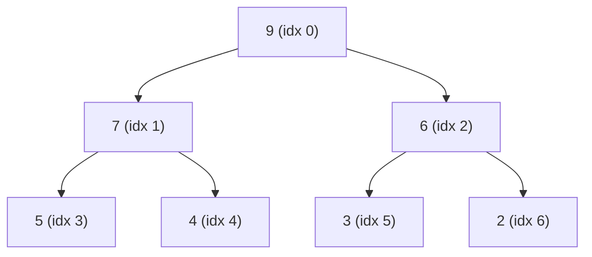
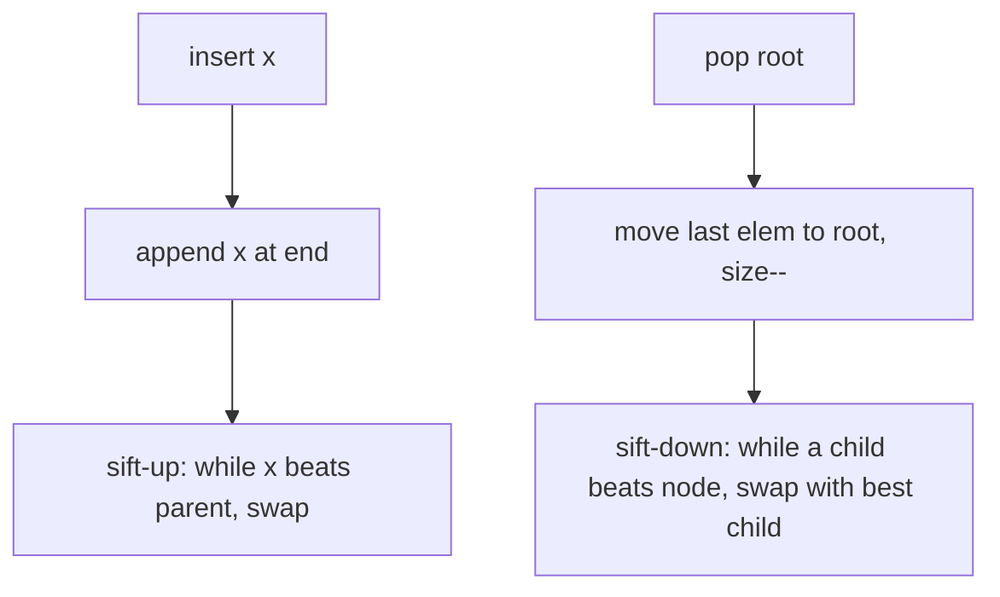
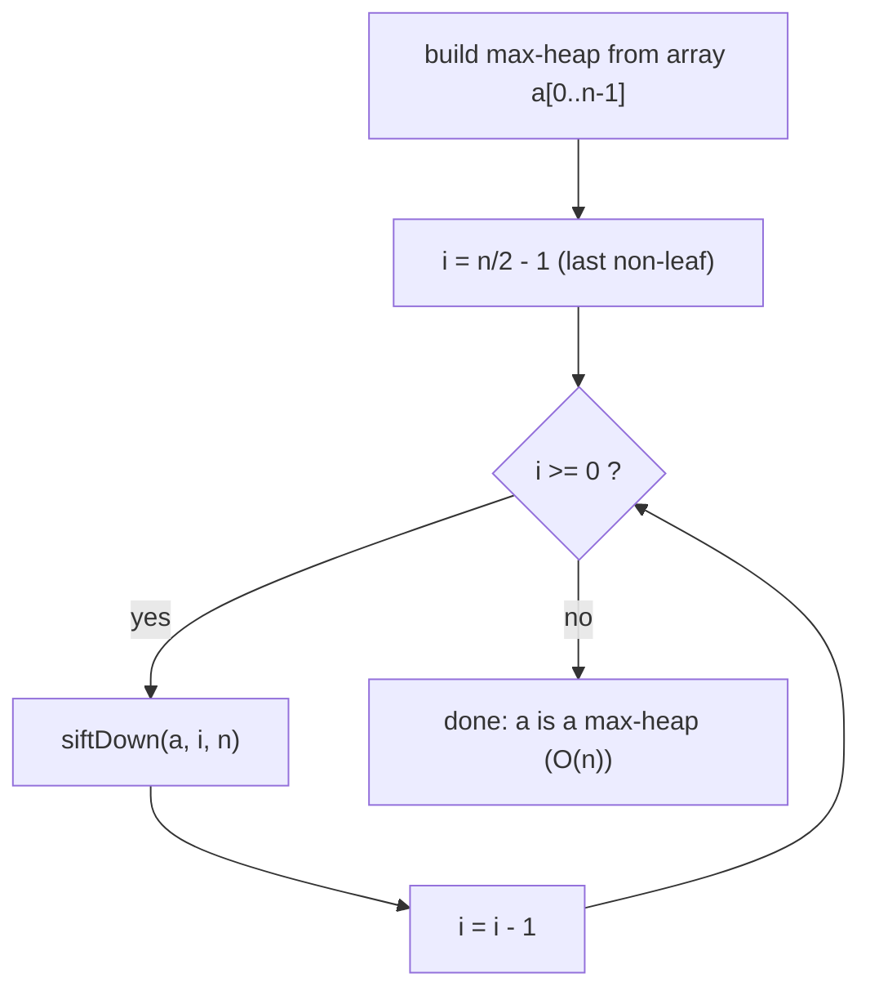
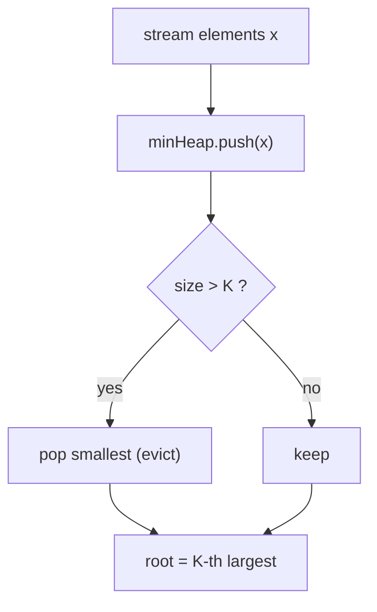
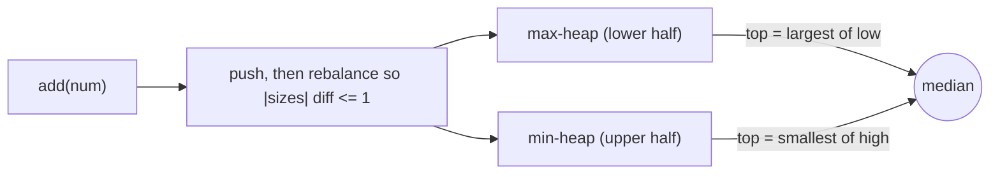

# Heaps — Theory & Patterns

**Nav:** [Theory & Patterns](./theory-and-patterns.md) · [Problems](./problems.md) · [Resources](./resources.md)

**Stats:** 17 problems total — 🟢 Easy: 3 · 🟡 Medium: 10 · 🔴 Hard: 4 · Patterns: 3 (Learning, Medium Problems, Hard Problems)

---

## Overview & Why It Matters

A **heap** is a specialized tree-based data structure that gives you *fast access to the most extreme element* (minimum or maximum) while keeping insertion and deletion cheap. In practice it is realized as a **complete binary tree stored in an array** and exposed through the abstract data type called a **priority queue**.

Heaps answer one recurring question with logarithmic cost: *"What is the current smallest/largest, and can I remove it and add new items efficiently?"* If you sorted the whole collection you would pay `O(n log n)` up front and re-pay it on every change. A heap lets you peek in `O(1)`, and insert/pop in `O(log n)`.

Where it shows up in interviews:
- **Top-K** problems (K-th largest/smallest, top K frequent).
- **Streaming / running statistics** (running median via two heaps, K-th largest in a stream).
- **K-way merge** (merge K sorted lists/arrays).
- **Greedy scheduling** (task scheduler, connect ropes/sticks, hand of straights).
- Backbone of **Dijkstra**, **Prim's MST**, **Huffman coding**, and **heapsort**.

Prerequisites: arrays, complete binary trees, recursion, basic Big-O, and comfort with `std::priority_queue` in C++.

---

## Core Concepts

**Heap property (the invariant):**
- **Max-heap:** every parent ≥ its children ⇒ maximum sits at the root.
- **Min-heap:** every parent ≤ its children ⇒ minimum sits at the root.
- The property is *partial order* — siblings are unordered. A heap is **not** a sorted array.

**Shape property:** a heap is a **complete binary tree** — every level is full except possibly the last, which fills left to right. This lets us store it contiguously in an array with **no pointers**.

**Array index math (0-indexed):** for node at index `i`
- parent = `(i - 1) / 2`
- left child = `2*i + 1`
- right child = `2*i + 2`
- last non-leaf node = `n/2 - 1`



The tree above is the array `[9, 7, 6, 5, 4, 3, 2]` viewed as a **max-heap**. Node `7` at index 1 has children at indices 3 (`5`) and 4 (`4`).

**Two core operations that maintain the invariant:**
- **sift-up (bubble up / percolate up):** used after `insert`. Place the new element at the end, then swap it upward while it violates the property with its parent. Cost `O(log n)`.
- **sift-down (heapify / percolate down):** used after `pop` (delete root). Move the last element to the root, then swap it downward with the larger (max-heap) / smaller (min-heap) child until the property holds. Cost `O(log n)`.



**Build-heap (heapify an array):** call sift-down on every internal node from `n/2 - 1` down to `0`. Naive analysis suggests `O(n log n)`, but a tighter sum over level heights gives **`O(n)`** — building a heap is *linear*, an important and often-tested fact.

**Vocabulary cheat-sheet:**
- **Priority Queue (PQ):** ADT; heap is its usual implementation.
- **`extract-min/max`:** peek + pop the root.
- **`decrease-key`:** lower a key then sift-up (used in Dijkstra/Prim).
- **d-ary heap:** each node has `d` children — shallower tree, faster inserts, slower deletes.

**C++ toolbox:**
```cpp
priority_queue<int> maxHeap;                              // default = max-heap
priority_queue<int, vector<int>, greater<int>> minHeap;  // min-heap
// custom comparator (min-heap on .first):
auto cmp = [](const pair<int,int>& a, const pair<int,int>& b){ return a.first > b.first; };
priority_queue<pair<int,int>, vector<pair<int,int>>, decltype(cmp)> pq(cmp);
// STL algorithms on a raw vector<int> v:
make_heap(v.begin(), v.end());   // O(n) build (max-heap)
push_heap(v.begin(), v.end());   // after push_back
pop_heap(v.begin(), v.end());    // moves max to back; then v.pop_back()
```

---

## Patterns

### Pattern 1 — Learning: Heap structure, heapify & conversions

**Recognition signals:** You must *implement* a heap from scratch, *validate* whether an array already satisfies the heap property, or *transform* one heap type into another. These are the foundational mechanics before any applied problem.

**Approach (implementing a heap / heapify):**
1. Store elements in a `vector`; use the parent/child index formulas.
2. `insert(x)`: `push_back(x)`, then **sift-up** from the last index.
3. `getMin/getMax()`: return element at index 0 (`O(1)`).
4. `extract()`: swap root with last, `pop_back`, then **sift-down** from root.
5. **Check-if-heap:** every internal node `i` (from `0` to `n/2 - 1`) must satisfy `a[i] <= a[2i+1]` and `a[i] <= a[2i+2]` (min-heap). Only internal nodes need checking.
6. **Min→Max conversion:** the ordering is completely different, so *rebuild*: run `heapify` (sift-down) from `n/2 - 1` to `0` under the new comparator. This is `O(n)`, not `O(n log n)`.



**Complexity:** insert/extract `O(log n)`; peek `O(1)`; build/convert `O(n)`; check-if-heap `O(n)`. Space `O(1)` extra (in-place on the array), `O(n)` to hold data.

**C++ template — Min Heap + heapify + conversion + validation:**
```cpp
class MinHeap {
    vector<int> a;
    void siftUp(int i){
        while(i > 0){
            int p = (i - 1) / 2;
            if(a[p] <= a[i]) break;   // parent already smaller -> ok
            swap(a[p], a[i]); i = p;
        }
    }
    void siftDown(int i){            // min-heap sift-down within a[0..n-1]
        int n = a.size();
        while(true){
            int l = 2*i+1, r = 2*i+2, small = i;
            if(l < n && a[l] < a[small]) small = l;
            if(r < n && a[r] < a[small]) small = r;
            if(small == i) break;
            swap(a[i], a[small]); i = small;
        }
    }
public:
    void insert(int x){ a.push_back(x); siftUp(a.size()-1); }
    int  getMin(){ return a[0]; }
    int  extractMin(){
        int top = a[0];
        a[0] = a.back(); a.pop_back();
        if(!a.empty()) siftDown(0);
        return top;
    }
    bool empty(){ return a.empty(); }
};

// Build a min-heap in O(n) from a raw array (static heapify):
void heapifyMin(vector<int>& a){
    int n = a.size();
    for(int i = n/2 - 1; i >= 0; --i){        // only internal nodes
        int j = i;
        while(true){
            int l = 2*j+1, r = 2*j+2, small = j;
            if(l < n && a[l] < a[small]) small = l;
            if(r < n && a[r] < a[small]) small = r;
            if(small == j) break;
            swap(a[j], a[small]); j = small;
        }
    }
}

// Check if an array is a valid min-heap: O(n)
bool isMinHeap(const vector<int>& a){
    int n = a.size();
    for(int i = 0; i <= n/2 - 1; ++i){
        int l = 2*i+1, r = 2*i+2;
        if(l < n && a[i] > a[l]) return false;
        if(r < n && a[i] > a[r]) return false;
    }
    return true;
}

// Convert a min-heap array into a max-heap array in O(n):
void minToMax(vector<int>& a){
    int n = a.size();
    for(int i = n/2 - 1; i >= 0; --i){        // sift-down under MAX comparator
        int j = i;
        while(true){
            int l = 2*j+1, r = 2*j+2, big = j;
            if(l < n && a[l] > a[big]) big = l;
            if(r < n && a[r] > a[big]) big = r;
            if(big == j) break;
            swap(a[j], a[big]); j = big;
        }
    }
}
```

---

### Pattern 2 — Medium Problems: Top-K, K-way merge & greedy priority

**Recognition signals:** Phrases like *"K-th largest/smallest"*, *"top K"*, *"merge K sorted …"*, *"nearly/K-sorted array"*, *"schedule with cooldown"*, or *"group/consecutive cards"*. Anytime you repeatedly need the current extreme, or must interleave many sorted streams, reach for a heap.

**Key sub-techniques:**
- **K-th largest with a MIN-heap of size K:** keep only the K largest seen so far; the root is the answer. (Symmetrically, K-th smallest uses a **max-heap of size K**.) This is the counter-intuitive but crucial trick: to *keep the largest*, evict the *smallest*, so the guard heap is the *opposite* type.
- **K-way merge with a MIN-heap of size K:** push the head of every sorted list; repeatedly pop the global minimum and push the next element from the same list.
- **Sort a K-sorted array:** each element is at most K positions from its sorted spot → maintain a min-heap of size `K+1` and stream out the min.
- **Greedy with a heap:** Task Scheduler (always run the most frequent available task), Hand of Straights (repeatedly form runs starting from the smallest card).



**Complexity:** Top-K over `n` items with size-K heap → `O(n log K)` time, `O(K)` space. K-way merge of total `N` elements across `k` lists → `O(N log k)` time, `O(k)` heap space.

**C++ template — Top-K (K-th largest) + K-way merge core:**
```cpp
// K-th largest element: min-heap of size K, root is the answer.  O(n log K)
int kthLargest(vector<int>& nums, int k){
    priority_queue<int, vector<int>, greater<int>> minHeap; // size-K guard
    for(int x : nums){
        minHeap.push(x);
        if((int)minHeap.size() > k) minHeap.pop();  // evict smallest
    }
    return minHeap.top();
}

// K-way merge of k sorted arrays into one sorted array.  O(N log k)
vector<int> mergeKSorted(vector<vector<int>>& lists){
    // node = {value, listIndex, elemIndex}
    using T = array<int,3>;
    priority_queue<T, vector<T>, greater<T>> pq;    // min-heap by value
    for(int i = 0; i < (int)lists.size(); ++i)
        if(!lists[i].empty()) pq.push({lists[i][0], i, 0});
    vector<int> out;
    while(!pq.empty()){
        auto [val, li, ei] = pq.top(); pq.pop();
        out.push_back(val);
        if(ei + 1 < (int)lists[li].size())
            pq.push({lists[li][ei+1], li, ei+1});
    }
    return out;
}
```

---

### Pattern 3 — Hard Problems: Two-heaps (median), streaming & advanced greedy

**Recognition signals:** *"find the median of a data stream"*, *"balance two halves"*, *"K-th largest in a running stream"*, *"design a feed / most recent items"*, *"maximum/minimum combination of pairs"*, *"repeatedly combine two smallest"*. These layer heaps with balancing invariants or lazy expansion.

**Key sub-techniques:**
- **Two heaps (median):** a **max-heap** for the smaller half and a **min-heap** for the larger half. Keep sizes balanced (differ by ≤ 1). Median = top of the larger heap, or the average of the two tops when equal-sized.
- **Streaming top-K:** keep a min-heap of size K permanently; every new value pushes and (if over K) pops → root is always the K-th largest.
- **Lazy/best-first expansion (max sum combination):** push the single best candidate, then each pop *generates* its neighbours — avoids materializing `n²` combinations.
- **Greedy combine (connect sticks):** repeatedly pop the two smallest, push their sum — a Huffman-style min-heap greedy.
- **Design Twitter:** per-user tweet lists + a K-way merge over followees' most recent tweets to build the feed.



**Complexity:** two-heaps median → `add` `O(log n)`, `findMedian` `O(1)`; streaming top-K → `O(log K)` per element. Connect-sticks/Huffman → `O(n log n)`. Space `O(n)`.

**C++ template — Two-heaps running median + streaming K-th largest:**
```cpp
// Running median with two heaps.
class MedianFinder {
    priority_queue<int> lo;                                   // max-heap: lower half
    priority_queue<int, vector<int>, greater<int>> hi;        // min-heap: upper half
public:
    void addNum(int num){
        if(lo.empty() || num <= lo.top()) lo.push(num);
        else hi.push(num);
        // rebalance: lo may hold one extra element
        if(lo.size() > hi.size() + 1){ hi.push(lo.top()); lo.pop(); }
        else if(hi.size() > lo.size()){ lo.push(hi.top()); hi.pop(); }
    }
    double findMedian(){
        if(lo.size() > hi.size()) return lo.top();
        return (lo.top() + hi.top()) / 2.0;
    }
};

// K-th largest in a running stream: permanent min-heap of size K.
class KthLargest {
    int k;
    priority_queue<int, vector<int>, greater<int>> pq;
public:
    KthLargest(int k, vector<int>& nums): k(k){
        for(int x : nums) add(x);
    }
    int add(int val){
        pq.push(val);
        if((int)pq.size() > k) pq.pop();
        return pq.top();
    }
};
```

---

## Complexity Summary

| Pattern | Time | Space | Notes |
|---|---|---|---|
| Heap ops: insert / extract | `O(log n)` | `O(1)` extra | sift-up / sift-down along tree height |
| Peek (getMin/getMax) | `O(1)` | `O(1)` | root is index 0 |
| Build-heap (heapify) / min↔max convert | `O(n)` | `O(1)` in-place | tight height-sum bound, not `O(n log n)` |
| Check-if-array-is-heap | `O(n)` | `O(1)` | test internal nodes only |
| Top-K / K-th largest / K-th smallest | `O(n log K)` | `O(K)` | size-K heap of the *opposite* type |
| Sort K-sorted array | `O(n log K)` | `O(K)` | heap of size `K+1` |
| K-way merge (K lists, N elems) | `O(N log K)` | `O(K)` | one head per list in the heap |
| Two-heaps running median | add `O(log n)`, query `O(1)` | `O(n)` | balance max-heap + min-heap |
| Streaming K-th largest | `O(log K)` per add | `O(K)` | permanent size-K min-heap |
| Greedy combine (connect sticks / Huffman) | `O(n log n)` | `O(n)` | repeatedly pop two smallest |
| Best-first expansion (max sum combination) | `O((n+k) log n)` | `O(n)` | pop generates neighbours lazily |
| Heapsort | `O(n log n)` | `O(1)` | build then repeatedly extract |

---

## Interview Tips & Common Mistakes

- **Pick the *opposite* heap type for Top-K.** For the K *largest*, use a size-K **min-heap** (evict the smallest); for K *smallest*, a size-K **max-heap**. Mixing this up is the #1 bug.
- **Bound the heap to K, not N.** Pushing everything then popping gives `O(n log n)`; capping at K gives `O(n log K)` — the whole point.
- **Build-heap is `O(n)`, not `O(n log n)`.** State this if asked; a common follow-up.
- **A heap is not sorted.** You cannot binary-search it or read the K-th element by index; only the root is guaranteed extreme.
- **Two-heaps balancing:** define the invariant precisely (`|lo| - |hi| ∈ {0, 1}`), always push then rebalance, and decide up front which heap holds the extra element for odd counts.
- **Custom comparators in C++ are inverted intuition:** `priority_queue` with `greater<>` gives a *min*-heap, and a comparator returning `a > b` orders the *smaller* on top. Double-check by testing 2 elements.
- **Overflow:** summing sticks/costs can exceed `int` — use `long long`.
- **Stability/ties:** when priorities tie (task scheduler, top-K frequent), decide the tie-break explicitly; store secondary keys in the heap element.
- **Don't forget to push the *next* element** in K-way merge after popping — a classic omission that silently drops data.
- **`decrease-key` isn't native** in `std::priority_queue`; use lazy deletion (push new, skip stale on pop) or an indexed heap.
