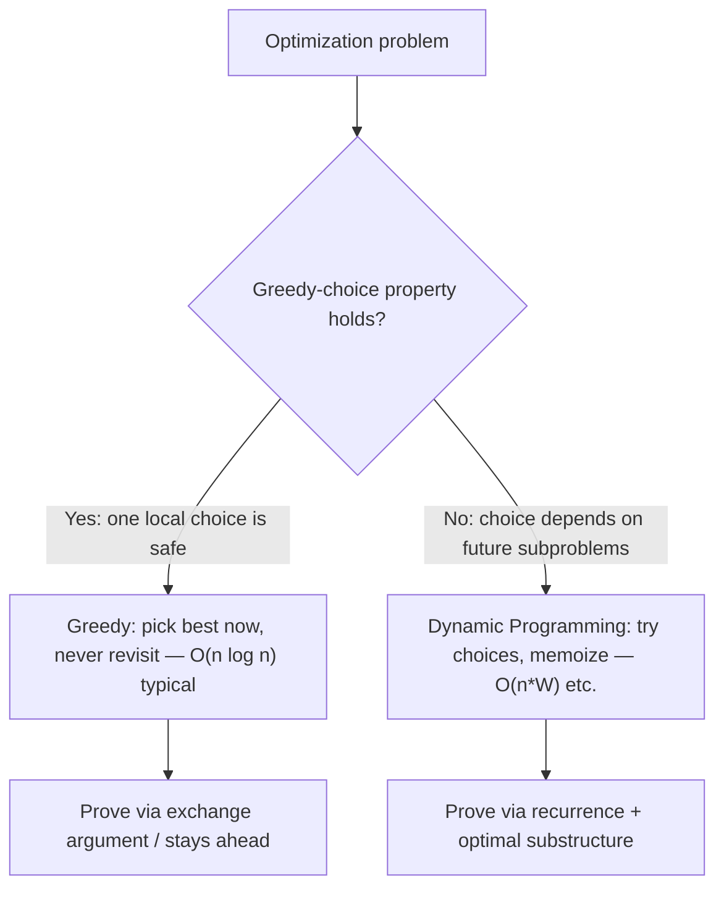
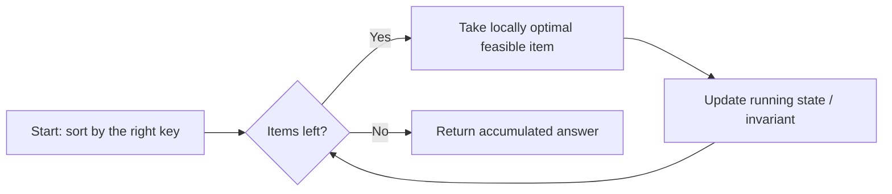
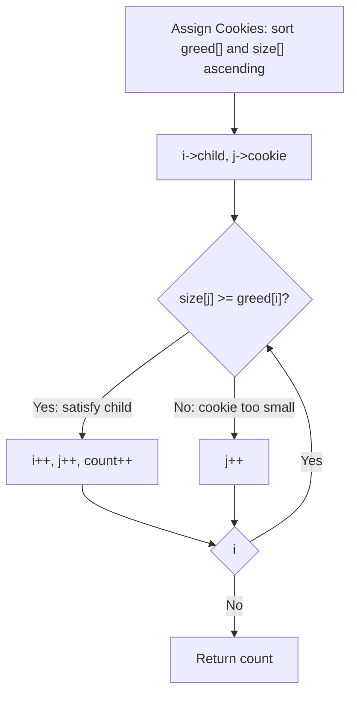
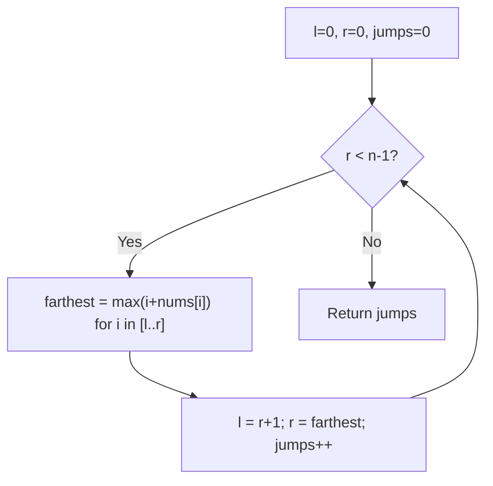
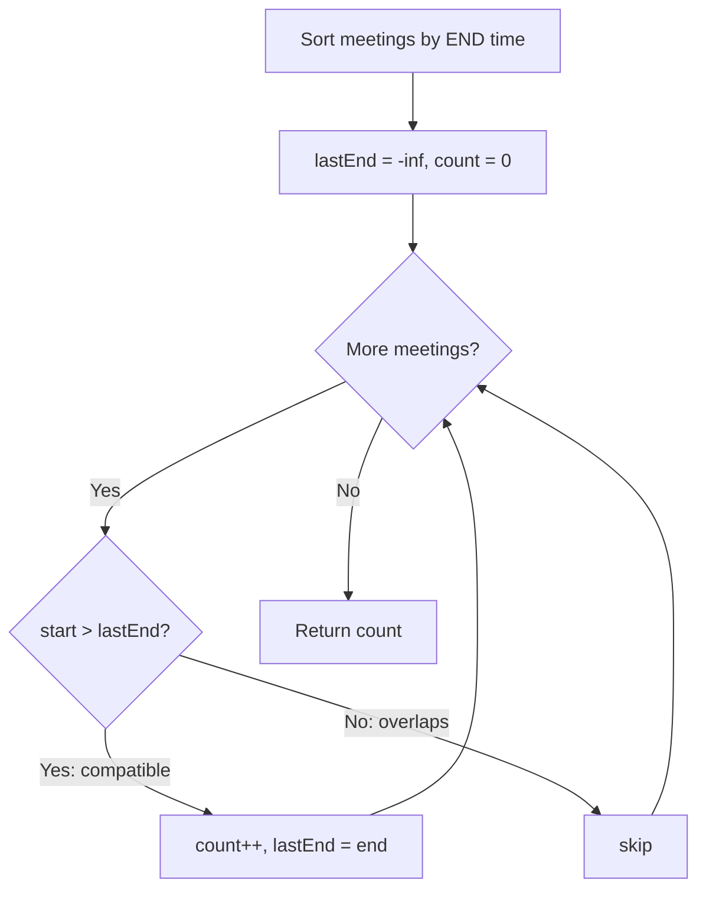
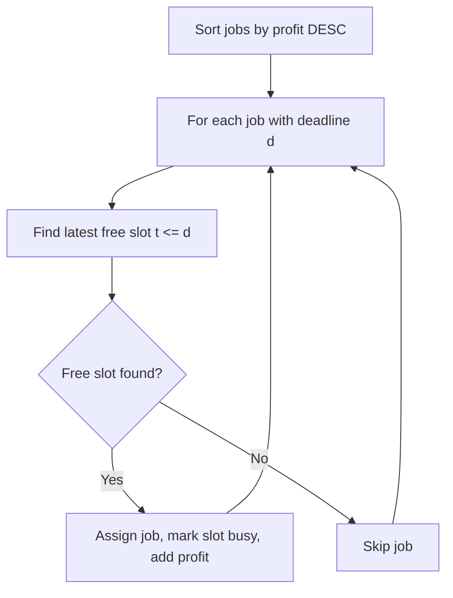
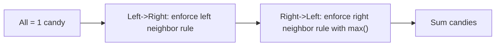

# Greedy Algorithms — Theory & Patterns

**Nav:** [Theory & Patterns](./theory-and-patterns.md) · [Problems](./problems.md) · [Resources](./resources.md)

**Stats:** 15 problems total — 🟢 Easy: 3 · 🟡 Medium: 10 · 🔴 Hard: 2. Two pattern groups: *Easy Problems* and *Medium/Hard*.

---

## Overview & Why It Matters

A **greedy algorithm** builds a solution one step at a time, always taking the choice that looks best *right now* (the **locally optimal** choice) and never reconsidering it. When the problem has the right structure, this myopic strategy still lands on the **globally optimal** answer — and it does so far faster and simpler than dynamic programming.

Greedy is one of the highest-yield interview topics because:

- **Interval / scheduling problems** (meetings, platforms, non-overlapping intervals, job sequencing) appear constantly at FAANG and product companies.
- The problems are short to state and quick to code, so interviewers can probe your *reasoning about optimality*, not just coding.
- The classic trap — "why greedy and not DP?" — separates candidates who memorize from those who understand.

**Where it shows up:** LeetCode Greedy tag, OS/CPU-scheduling questions (SJF, LRU), array traversal (Jump Game), resource allocation (Fractional Knapsack, Assign Cookies), and string validation (Valid Parenthesis String).

**Prerequisites:**

- **Sorting** and custom comparators (most greedy solutions sort first).
- **Priority queues / heaps** (min-heap and max-heap).
- Basic **proof intuition**: the *greedy-choice property* and the *exchange argument*.
- Comfort with arrays, intervals, and the difference between greedy and DP (0/1 vs fractional knapsack is the canonical divide).

---

## Core Concepts

### The two pillars of a correct greedy

A greedy algorithm is provably optimal **iff** the problem exhibits both:

1. **Greedy-choice property** — a globally optimal solution can be reached by making a locally optimal (greedy) choice. You never need to look ahead or undo a choice.
2. **Optimal substructure** — an optimal solution to the whole contains optimal solutions to its subproblems.

If the greedy-choice property fails, you almost always need **Dynamic Programming** instead (e.g., 0/1 Knapsack, general Coin Change).

### Vocabulary & invariants

- **Feasible choice:** a choice that keeps the partial solution valid.
- **Greedy invariant:** the property maintained after every choice (e.g., "the set of chosen meetings is always compatible").
- **Exchange argument:** the standard *proof of correctness*. Take any optimal solution `O`, and show you can swap one of its elements for greedy's choice **without making it worse**. Repeat until `O` becomes the greedy solution → greedy is optimal.
- **"Greedy stays ahead":** an inductive proof style — after each step, greedy's partial solution is at least as good as any other partial solution on the chosen metric (e.g., earliest finish time).

### Greedy vs Dynamic Programming (the key mental model)



### The universal greedy skeleton



The single most important decision in a greedy problem is **"sort by what?"** — start time, finish time, ratio, deadline, or something derived.

---

## Patterns

The data groups the 15 problems into two sub-steps. Below, each sub-step is a pattern group; I break the recurring greedy *techniques* inside them with recognition signals, algorithms, diagrams, complexity, and reusable C++ templates.

### Pattern 1 — Easy Greedy: Match / Simulate / Ratio

**Sub-step in data: "Easy Problems"** (Assign Cookies, Fractional Knapsack, Lemonade Change, Valid Parenthesis Checker).

**Recognition signals:**

- You are asked to **maximize matches** between two sorted groups (Assign Cookies).
- You may take **fractions** of items → sort by value/weight **ratio** (Fractional Knapsack).
- You **simulate** a running state and greedily hand back the best available resource (Lemonade Change).
- You validate a string where a wildcard can flex within a **range** (Valid Parenthesis String).

**Approach (two-pointer / ratio / simulation):**

1. **Match:** sort both arrays ascending, use two pointers; give the smallest sufficient resource to the smallest need.
2. **Ratio:** sort items by `value/weight` descending; take whole items greedily, then a fraction of the next.
3. **Simulate:** keep counts of resources; always give change using the *largest* denominations first to preserve flexibility.
4. **Range:** track a `[low, high]` window of possible open-bracket counts as you scan.



**Complexity:** sort-dominated `O(n log n)` time; `O(1)` extra (or `O(n)` for the sort). Simulation variants are `O(n)` time / `O(1)` space.

**Reusable C++ template — two-pointer greedy match (Assign Cookies):**

```cpp
int findContentChildren(vector<int>& greed, vector<int>& size) {
    sort(greed.begin(), greed.end());
    sort(size.begin(), size.end());
    int i = 0, j = 0, n = greed.size(), m = size.size();
    while (i < n && j < m) {
        if (size[j] >= greed[i]) i++;   // child satisfied
        j++;                             // move to next cookie either way
    }
    return i;                            // children satisfied
}
```

**Reusable C++ template — ratio greedy (Fractional Knapsack):**

```cpp
double fractionalKnapsack(int W, vector<pair<int,int>>& items /*{value,weight}*/) {
    sort(items.begin(), items.end(), [](auto& a, auto& b){
        return (double)a.first / a.second > (double)b.first / b.second; // ratio desc
    });
    double total = 0.0;
    for (auto& [val, wt] : items) {
        if (W >= wt) { total += val; W -= wt; }
        else { total += val * ((double)W / wt); break; } // take fraction
    }
    return total;
}
```

---

### Pattern 2 — Reachability / Minimum-Jumps Greedy (Array Range Coverage)

**In data:** Jump Game - I, Jump Game II (inside "Medium/Hard").

**Recognition signals:** each index gives a *range* you can jump; asked *"can you reach the end?"* or *"minimum jumps to reach the end?"* → maintain the **farthest reachable index** greedily instead of DP over all indices.

**Approach:**

- **Jump Game I (reachability):** track `maxReach`. If the current index `i > maxReach`, you're stuck → `false`. Otherwise `maxReach = max(maxReach, i + nums[i])`.
- **Jump Game II (min jumps):** BFS-like level expansion. Maintain the current jump's window `[l, r]`; the farthest you can reach from anywhere in it becomes the next window. Each window boundary = one jump.



**Complexity:** `O(n)` time, `O(1)` space — the greedy window is what beats the `O(n^2)` DP.

**Reusable C++ template — Jump Game II (min jumps):**

```cpp
int jump(vector<int>& nums) {
    int n = nums.size(), jumps = 0, l = 0, r = 0;
    while (r < n - 1) {
        int farthest = 0;
        for (int i = l; i <= r; i++)
            farthest = max(farthest, i + nums[i]);
        l = r + 1;
        r = farthest;
        jumps++;
    }
    return jumps;
}
```

---

### Pattern 3 — Interval Scheduling & Sweep (Sort-by-Endpoint)

**In data:** N meetings in one room, Minimum platforms, Insert Interval, Merge Intervals, Non-overlapping Intervals.

**Recognition signals:** you're given `[start, end]` pairs and asked to **maximize count of compatible intervals**, **count overlaps**, **merge**, or **find minimum resources**. The greedy key is almost always **sort by finish time** (for selection) or **sort by start** + a running "sweep" (for merging / platforms).

**Approach:**

- **Max non-overlapping / N meetings:** sort by **end time**; greedily pick a meeting if its start `>` last chosen end. (Earliest-finish-first maximizes remaining room.)
- **Min platforms:** sort starts and ends separately; sweep both with two pointers, `+1` platform on a start, `-1` on an end; track the max concurrent.
- **Merge intervals:** sort by start; extend the current merged interval while the next start `<=` current end.
- **Insert interval:** the array is pre-sorted; push all before, merge all overlapping, push all after.
- **Non-overlapping (min removals):** sort by end; count how many you *keep* (compatible), removals = `n - kept`.



**Why sort by finish time?** *Exchange argument:* the meeting that finishes earliest leaves the most room for the rest; swapping any optimal solution's first pick for the earliest-finishing one never reduces the count.

**Complexity:** `O(n log n)` (sort) + `O(n)` sweep; `O(n)` space for sorting/merging.

**Reusable C++ template — max non-overlapping / activity selection:**

```cpp
int maxMeetings(vector<pair<int,int>>& meet /*{start,end}*/) {
    sort(meet.begin(), meet.end(), [](auto& a, auto& b){
        return a.second < b.second;          // sort by end time
    });
    int count = 0, lastEnd = INT_MIN;
    for (auto& [s, e] : meet) {
        if (s > lastEnd) { count++; lastEnd = e; } // compatible → take it
    }
    return count;
}
```

**Reusable C++ template — minimum platforms (two-pointer sweep):**

```cpp
int minPlatforms(vector<int>& arr, vector<int>& dep) {
    sort(arr.begin(), arr.end());
    sort(dep.begin(), dep.end());
    int n = arr.size(), plat = 0, ans = 0, i = 0, j = 0;
    while (i < n) {
        if (arr[i] <= dep[j]) { plat++; i++; ans = max(ans, plat); }
        else { plat--; j++; }
    }
    return ans;
}
```

---

### Pattern 4 — Deadline / Priority Greedy (Heap + Sort-by-Profit)

**In data:** Job Sequencing Problem, Shortest Job First (SJF), LRU Page Replacement.

**Recognition signals:** each item has a **profit + deadline**, or you must serve items by a **priority/ordering rule**, or you must **evict the least-useful** resource. Sort by the payoff and place each item as **late as possible** before its deadline; use a heap or ordered structure to manage eviction/ordering.

**Approach:**

- **Job Sequencing:** sort jobs by **profit descending**; for each, place it in the latest free slot `<= deadline`. A DSU or boolean slot array finds free slots.
- **SJF (non-preemptive):** sort by burst time ascending; average waiting time is minimized by serving the shortest job first (classic greedy on completion time).
- **LRU:** greedily evict the **least recently used** page (hashmap + doubly linked list, or a queue) — the locally "stalest" item.



**Complexity:** Job Sequencing `O(n log n + n·maxDeadline)` (or `O(n log n · α)` with DSU); SJF `O(n log n)`; LRU `O(1)` per op with hashmap + linked list.

**Reusable C++ template — Job Sequencing (slot array):**

```cpp
struct Job { int id, deadline, profit; };
pair<int,int> jobScheduling(vector<Job>& jobs) {   // returns {count, totalProfit}
    sort(jobs.begin(), jobs.end(), [](const Job& a, const Job& b){
        return a.profit > b.profit;                // highest profit first
    });
    int maxD = 0;
    for (auto& j : jobs) maxD = max(maxD, j.deadline);
    vector<int> slot(maxD + 1, -1);
    int count = 0, profit = 0;
    for (auto& j : jobs) {
        for (int t = j.deadline; t >= 1; t--) {    // latest free slot
            if (slot[t] == -1) { slot[t] = j.id; count++; profit += j.profit; break; }
        }
    }
    return {count, profit};
}
```

---

### Pattern 5 — Two-Pass Constraint Greedy (Local Neighbor Rules)

**In data:** Candy (satisfy left & right neighbor constraints greedily in two sweeps).

**Recognition signals:** each element must satisfy a rule relative to its **neighbors** (more candy than a lower-rated neighbor). A single pass can't see both sides → do a **left-to-right** pass then a **right-to-left** pass, taking the `max`.

**Approach:**

1. Init every child with 1 candy.
2. Left→right: if `rating[i] > rating[i-1]`, `candy[i] = candy[i-1] + 1`.
3. Right→left: if `rating[i] > rating[i+1]`, `candy[i] = max(candy[i], candy[i+1] + 1)`.
4. Sum. (A slope-tracking O(1)-space variant exists too.)



**Complexity:** `O(n)` time, `O(n)` space (two arrays) or `O(1)` with the slope method.

**Reusable C++ template — Candy (two-pass):**

```cpp
int candy(vector<int>& ratings) {
    int n = ratings.size();
    vector<int> c(n, 1);
    for (int i = 1; i < n; i++)
        if (ratings[i] > ratings[i-1]) c[i] = c[i-1] + 1;
    for (int i = n - 2; i >= 0; i--)
        if (ratings[i] > ratings[i+1]) c[i] = max(c[i], c[i+1] + 1);
    return accumulate(c.begin(), c.end(), 0);
}
```

---

## Complexity Summary

| Pattern | Time | Space | Notes |
|---|---|---|---|
| Easy: Match / Ratio / Simulate | `O(n log n)` (sort) or `O(n)` (simulate) | `O(1)`–`O(n)` | Two-pointer match, ratio sort, or state simulation |
| Reachability / Min-jumps | `O(n)` | `O(1)` | Track `maxReach` / expanding jump window |
| Interval scheduling & sweep | `O(n log n)` | `O(n)` | Sort by **end** (selection) or **start** (merge/platforms) |
| Deadline / priority (heap+sort) | `O(n log n)` to `O(n·D)` | `O(n)` or `O(D)` | Sort by profit; place latest slot; heap for eviction |
| Two-pass neighbor constraint | `O(n)` | `O(n)` / `O(1)` | Left pass then right pass, take max |

---

## Interview Tips & Common Mistakes

**Tips**

- **Say the sort key out loud.** Verbalizing "I'll sort by finish time because it maximizes remaining room" is the single strongest signal of greedy understanding.
- **Justify with an exchange argument.** Interviewers love "swap any optimal solution's choice for greedy's — it never gets worse."
- **Contrast with DP.** Fractional Knapsack is greedy; 0/1 Knapsack is DP. Knowing *why* (you can't take a fraction of an item) earns points.
- **Prefer `O(1)`/`O(n)` follow-ups.** After the sort-based solution, mention the sweep or slope optimizations.

**Common mistakes**

- **Wrong sort key** — sorting intervals by *start* when the problem needs *finish* (activity selection) gives wrong answers.
- **Assuming greedy always works** — coin change with arbitrary denominations and 0/1 knapsack break greedy; recognize when to fall back to DP.
- **Off-by-one on overlap** — deciding whether `start == lastEnd` counts as overlapping (meetings usually treat touching endpoints as non-conflicting; confirm the problem's convention).
- **Forgetting the second pass** in neighbor-constraint problems (Candy) — a single direction violates the other side.
- **Integer overflow / wrong types** — Fractional Knapsack must use `double` for the fraction; profits may overflow `int`.
- **Not proving optimality** when asked — reciting the code without the greedy-choice argument is the top rejection reason on greedy questions.
