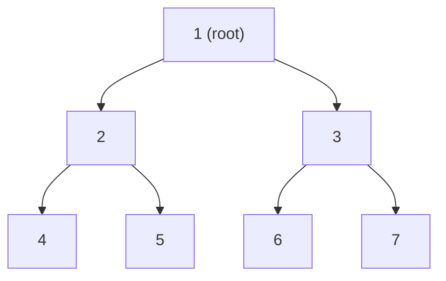
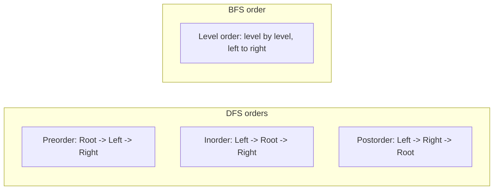
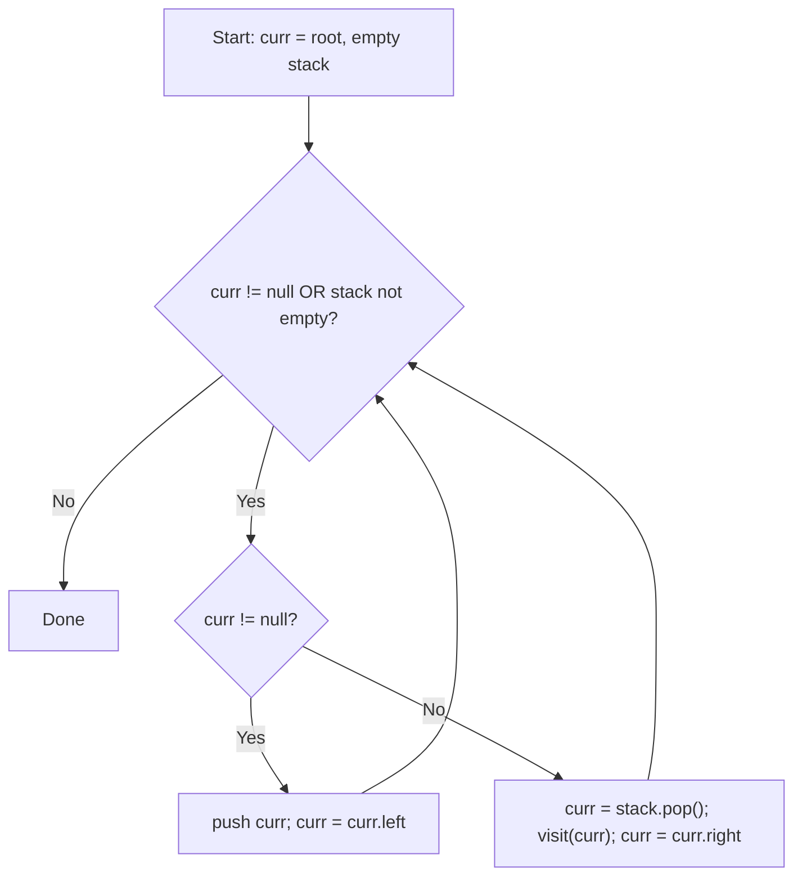
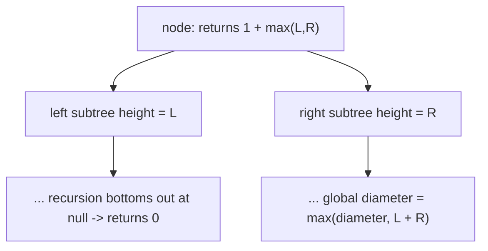
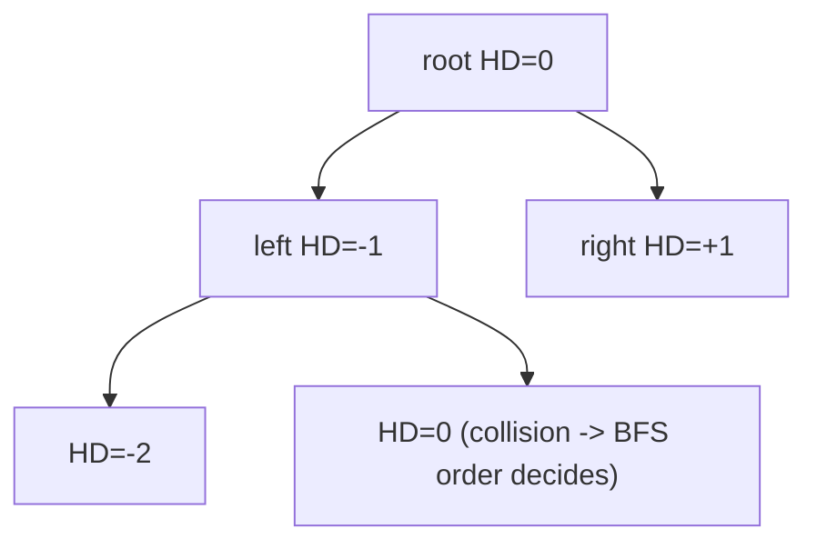
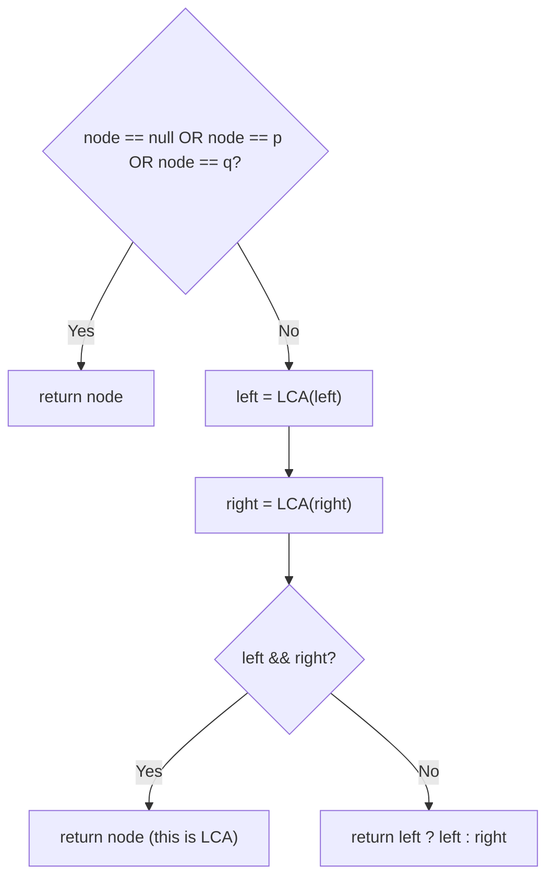
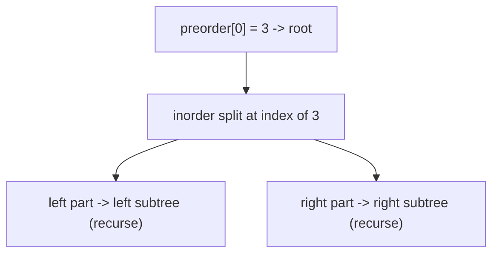

# Binary Trees — Theory & Patterns

> **Nav:** [Theory & Patterns](./theory-and-patterns.md) · [Problems](./problems.md) · [Resources](./resources.md)
>
> **Stats:** 38 problems total — 🟢 14 Easy · 🟡 16 Medium · 🔴 8 Hard · Patterns: 3 (Traversals, Medium Problems, Hard Problems)

---

## Overview & Why It Matters

A **binary tree** is a hierarchical, non-linear data structure where every node has at most two children — a **left** child and a **right** child. Unlike arrays or linked lists (linear), a tree branches, so data is stored and retrieved by *walking* the hierarchy rather than by index.

Binary trees are one of the most heavily-tested interview topics because a single tree gives interviewers a compact playground to probe **recursion**, **BFS/DFS**, **divide-and-conquer**, **stack/queue usage**, and **space optimization** (Morris). Almost every FAANG interview loop contains at least one tree problem: traversals, views, LCA, diameter, path sums, and construction from traversals are perennial favorites.

**Where it appears:** file systems, DOM trees, expression parsing, decision trees, Huffman coding, database indexes (B-trees are a generalization), and as the backbone of BSTs, segment trees, tries, and heaps.

**Prerequisites:**
- Recursion and the call stack (essential — most tree code is recursive).
- Basic queue (BFS) and stack (iterative DFS) usage.
- Comfort with pointers/references (`TreeNode*` in C++).
- Time/space analysis of recursive functions.

---

## Core Concepts

**Node:** holds a value plus pointers to `left` and `right` children.

```cpp
struct TreeNode {
    int val;
    TreeNode* left;
    TreeNode* right;
    TreeNode(int x) : val(x), left(nullptr), right(nullptr) {}
};
```

**Vocabulary & invariants:**
- **Root:** the topmost node (no parent).
- **Leaf:** a node with no children.
- **Height of a node:** number of edges on the longest downward path to a leaf. Height of a leaf = 0.
- **Depth of a node:** number of edges from the root to that node. Root depth = 0.
- **Level:** all nodes at the same depth.
- **Subtree:** any node together with all its descendants.
- **Full tree:** every node has 0 or 2 children.
- **Complete tree:** all levels filled except possibly the last, which is filled left-to-right.
- **Perfect tree:** all internal nodes have 2 children and all leaves are on the same level; has `2^(h+1) - 1` nodes.
- **Balanced tree:** for every node, the heights of its two subtrees differ by at most 1.
- **Skewed tree:** every node has only one child → degenerates to a linked list (height `n-1`).

**The key structure:**



**Traversal orders** — the vocabulary that unlocks everything:



**Two mega-patterns to internalize:**
1. **Top-down (pass state down):** carry information from the root into recursive calls (e.g., path-so-far, current level, vertical column).
2. **Bottom-up (return info up):** each call returns a summary of its subtree that the parent combines (e.g., height, diameter, balance, max path sum). This *bottom-up* pattern is the single most reused idea in tree interviews.

---

## Patterns

### Pattern 1 — Traversals

**Recognition signals:** "Return the inorder/preorder/postorder/level-order list", "do it iteratively / without recursion", "in O(1) extra space" (→ Morris), "visit each node exactly once". Any problem that ultimately needs to *see every node* is built on a traversal.

**Approach (step-by-step):**
- **Recursive DFS:** base case `if (!node) return;`, then order the three actions (visit-root, recurse-left, recurse-right) according to pre/in/post.
- **Iterative DFS:** simulate the call stack with an explicit `stack`. Inorder: push all lefts, pop, visit, go right. Preorder: push root, pop → visit → push right then left. Postorder: use 2 stacks (reverse of "root-right-left") or 1 stack with a `prev` pointer.
- **BFS (level order):** a `queue`; process level-size nodes per iteration, enqueue children.
- **Morris (O(1) space):** thread each node to its inorder predecessor's right pointer, walk without a stack, and un-thread on the way back.

**Diagram — iterative inorder using a stack:**



**Complexity:** all traversals are **O(n)** time (each node visited O(1) times). Space: recursive/iterative DFS **O(h)** stack (h = height, O(n) worst, O(log n) balanced); BFS **O(w)** queue (w = max width); **Morris O(1)** extra (modifies then restores tree).

**Reusable C++ templates:**

```cpp
// ---- Recursive DFS ----
void inorder(TreeNode* r, vector<int>& out) {
    if (!r) return;
    inorder(r->left, out);
    out.push_back(r->val);       // move this line for pre/post
    inorder(r->right, out);
}

// ---- Iterative Inorder ----
vector<int> inorderIt(TreeNode* root) {
    vector<int> res; stack<TreeNode*> st; TreeNode* curr = root;
    while (curr || !st.empty()) {
        while (curr) { st.push(curr); curr = curr->left; }
        curr = st.top(); st.pop();
        res.push_back(curr->val);
        curr = curr->right;
    }
    return res;
}

// ---- Iterative Preorder ----
vector<int> preorderIt(TreeNode* root) {
    vector<int> res; if (!root) return res;
    stack<TreeNode*> st; st.push(root);
    while (!st.empty()) {
        TreeNode* n = st.top(); st.pop();
        res.push_back(n->val);
        if (n->right) st.push(n->right);   // right first so left pops first
        if (n->left)  st.push(n->left);
    }
    return res;
}

// ---- Iterative Postorder (2 stacks) ----
vector<int> postorder2(TreeNode* root) {
    vector<int> res; if (!root) return res;
    stack<TreeNode*> s1, s2; s1.push(root);
    while (!s1.empty()) {
        TreeNode* n = s1.top(); s1.pop(); s2.push(n);
        if (n->left)  s1.push(n->left);
        if (n->right) s1.push(n->right);
    }
    while (!s2.empty()) { res.push_back(s2.top()->val); s2.pop(); }
    return res;
}

// ---- BFS Level Order ----
vector<vector<int>> levelOrder(TreeNode* root) {
    vector<vector<int>> res; if (!root) return res;
    queue<TreeNode*> q; q.push(root);
    while (!q.empty()) {
        int sz = q.size(); vector<int> level;
        for (int i = 0; i < sz; i++) {
            TreeNode* n = q.front(); q.pop();
            level.push_back(n->val);
            if (n->left)  q.push(n->left);
            if (n->right) q.push(n->right);
        }
        res.push_back(level);
    }
    return res;
}

// ---- Morris Inorder (O(1) space) ----
vector<int> morrisInorder(TreeNode* root) {
    vector<int> res; TreeNode* curr = root;
    while (curr) {
        if (!curr->left) { res.push_back(curr->val); curr = curr->right; }
        else {
            TreeNode* pred = curr->left;
            while (pred->right && pred->right != curr) pred = pred->right;
            if (!pred->right) { pred->right = curr; curr = curr->left; }      // thread
            else { pred->right = nullptr; res.push_back(curr->val); curr = curr->right; } // unthread
        }
    }
    return res;
}
```

---

### Pattern 2 — Medium Problems (Bottom-up DFS & BFS views)

**Recognition signals:** "height / depth / balanced / diameter / max path sum" → **bottom-up** (return a summary up). "Top / bottom / left / right view", "vertical / zig-zag / boundary order" → **BFS-with-metadata** (track level, horizontal distance, or direction). "Is it symmetric / identical?" → **paired recursion** on two nodes.

**Approach (bottom-up template):** write a helper that returns *one number (or struct)* per subtree; the parent combines children's returns in **O(1)** and, if the problem asks for a global answer (diameter, max path sum), updates a reference variable while returning the "extendable-through-this-node" value.

**Approach (view/order template):** BFS with a queue of `(node, meta)` where `meta` is the vertical column (top/bottom/vertical view) or level index. Use the *first* node seen at a column for top view, the *last* for bottom view, and a `map<col, ...>` to sort columns left-to-right.

**Diagram — bottom-up height/diameter fold:**



**Diagram — vertical / top / bottom view via BFS + horizontal distance (HD):**



**Complexity:** bottom-up traversals are **O(n)** time, **O(h)** space. View/order problems that use a `map<int,...>` are **O(n log n)** time (map ordering by column), **O(n)** space for the queue + map.

**Reusable C++ templates:**

```cpp
// ---- Bottom-up: height (and diameter as a side effect) ----
int diameter = 0;
int height(TreeNode* node) {
    if (!node) return 0;
    int L = height(node->left);
    int R = height(node->right);
    diameter = max(diameter, L + R);      // path through this node (in edges)
    return 1 + max(L, R);
}

// ---- Balanced check in O(n): return -1 sentinel when unbalanced ----
int check(TreeNode* node) {
    if (!node) return 0;
    int L = check(node->left);  if (L == -1) return -1;
    int R = check(node->right); if (R == -1) return -1;
    if (abs(L - R) > 1) return -1;
    return 1 + max(L, R);
}

// ---- Paired recursion: symmetric / identical ----
bool sameTree(TreeNode* a, TreeNode* b) {
    if (!a || !b) return a == b;
    return a->val == b->val && sameTree(a->left, b->left) && sameTree(a->right, b->right);
}

// ---- BFS with horizontal distance: top / bottom / vertical view ----
map<int, int> topView(TreeNode* root) {           // col -> value (first seen)
    map<int, int> col;
    queue<pair<TreeNode*, int>> q;
    if (root) q.push({root, 0});
    while (!q.empty()) {
        auto [n, hd] = q.front(); q.pop();
        if (!col.count(hd)) col[hd] = n->val;      // first at column = top view
        if (n->left)  q.push({n->left,  hd - 1});
        if (n->right) q.push({n->right, hd + 1});
    }
    return col;                                    // iterate map left->right
}
```

---

### Pattern 3 — Hard Problems (Path/LCA, Parent-mapping BFS, Construction, Morris)

**Recognition signals:** "root-to-node path / LCA / distance-K / burn the tree" → **DFS to find a node + parent pointers / BFS from a source**. "Construct the tree from two traversals" → **recursive index-splitting using inorder + a hashmap**. "Serialize/deserialize" → **preorder or BFS with null markers**. "Flatten to linked list" → **reverse-preorder or Morris-style threading**. "O(1) space traversal" → **Morris**.

**Approach — LCA (single pass):** recurse; if the node equals `p` or `q` return it; if both subtrees return non-null, the current node is the LCA; otherwise bubble up whichever side is non-null.

**Approach — distance-K / burn:** first build a `child → parent` map via BFS/DFS so the tree becomes an undirected graph, then BFS outward from the target node counting levels.

**Approach — construction from inorder+preorder:** the first preorder element is the root; find it in inorder (via a hashmap) to split left/right subtree sizes; recurse on the sub-ranges.

**Diagram — LCA bubbling:**



**Diagram — construct from preorder + inorder:**



**Complexity:** LCA / path / children-sum / count-nodes-naive are **O(n)** time, **O(h)** space. Count-nodes-optimal is **O(log^2 n)** using left/right heights. Distance-K / burn are **O(n)** (build map + BFS). Construction with a hashmap is **O(n)** time, **O(n)** space. Serialize/deserialize **O(n)**. Morris **O(n)** time, **O(1)** extra space.

**Reusable C++ templates:**

```cpp
// ---- LCA (single pass) ----
TreeNode* lca(TreeNode* root, TreeNode* p, TreeNode* q) {
    if (!root || root == p || root == q) return root;
    TreeNode* L = lca(root->left, p, q);
    TreeNode* R = lca(root->right, p, q);
    if (L && R) return root;
    return L ? L : R;
}

// ---- Parent map (BFS) for distance-K / burn ----
void mapParents(TreeNode* root, unordered_map<TreeNode*, TreeNode*>& par) {
    queue<TreeNode*> q; q.push(root);
    while (!q.empty()) {
        TreeNode* n = q.front(); q.pop();
        if (n->left)  { par[n->left]  = n; q.push(n->left); }
        if (n->right) { par[n->right] = n; q.push(n->right); }
    }
}

// ---- Construct from preorder + inorder ----
TreeNode* build(vector<int>& pre, int ps, int pe,
                vector<int>& in, int is, int ie,
                unordered_map<int,int>& idx) {
    if (ps > pe || is > ie) return nullptr;
    TreeNode* root = new TreeNode(pre[ps]);
    int inRoot = idx[pre[ps]];
    int numLeft = inRoot - is;
    root->left  = build(pre, ps+1, ps+numLeft, in, is, inRoot-1, idx);
    root->right = build(pre, ps+numLeft+1, pe, in, inRoot+1, ie, idx);
    return root;
}

// ---- Count nodes in a complete tree in O(log^2 n) ----
int lh(TreeNode* n){int h=0;while(n){h++;n=n->left;}return h;}
int rh(TreeNode* n){int h=0;while(n){h++;n=n->right;}return h;}
int countNodes(TreeNode* root){
    if(!root) return 0;
    int l=lh(root), r=rh(root);
    if(l==r) return (1<<l)-1;                 // perfect subtree
    return 1 + countNodes(root->left) + countNodes(root->right);
}

// ---- Morris Preorder (O(1) space) ----
vector<int> morrisPre(TreeNode* root){
    vector<int> res; TreeNode* curr=root;
    while(curr){
        if(!curr->left){ res.push_back(curr->val); curr=curr->right; }
        else{
            TreeNode* pred=curr->left;
            while(pred->right && pred->right!=curr) pred=pred->right;
            if(!pred->right){ res.push_back(curr->val); pred->right=curr; curr=curr->left; }
            else{ pred->right=nullptr; curr=curr->right; }
        }
    }
    return res;
}
```

---

## Complexity Summary

| Pattern | Time | Space | Notes |
|---|---|---|---|
| Recursive DFS traversal | O(n) | O(h) | h = height; O(n) skewed, O(log n) balanced |
| Iterative DFS (stack) | O(n) | O(h) | explicit stack replaces recursion |
| Postorder (2 stacks) | O(n) | O(n) | second stack holds full result |
| BFS / level order | O(n) | O(w) | w = max width of tree |
| Morris traversal | O(n) | O(1) | threads & restores tree; no stack |
| Bottom-up (height/diameter/balance/max-path) | O(n) | O(h) | one number returned per subtree |
| Views (top/bottom/vertical/zig-zag/boundary) | O(n) or O(n log n) | O(n) | log factor when using ordered `map` |
| Symmetric / identical (paired) | O(n) | O(h) | compare two nodes in lockstep |
| LCA / root-to-node path / children-sum | O(n) | O(h) | single DFS pass |
| Distance-K / burn tree | O(n) | O(n) | parent map + BFS from source |
| Count nodes (complete tree) | O(log²n) | O(log n) | exploit perfect-subtree shortcut |
| Construct from 2 traversals | O(n) | O(n) | inorder hashmap for O(1) splits |
| Serialize / deserialize | O(n) | O(n) | preorder or BFS with null markers |
| Flatten to linked list | O(n) | O(1)* | Morris-style; *O(h) if recursive |

---

## Interview Tips & Common Mistakes

- **Always handle `nullptr` first.** The single most common bug is dereferencing a null child. Base case up top.
- **Height = 0 at leaf vs 1?** Pin down the definition before coding; off-by-one on height breaks balanced/diameter.
- **Diameter is counted in edges, not nodes** in the LeetCode version — `L + R`, not `L + R + 1`.
- **Prefer the O(n) balanced-check** (return `-1` sentinel) over the O(n²) "compute height at every node" approach.
- **For views/vertical order**, remember a `map` sorts columns automatically; for vertical order *with ties*, sort by (row, value) as LeetCode requires — a plain BFS-first-seen rule is *not* enough there.
- **LCA single-pass** returns the node itself when it equals p or q; don't search for full paths unless the tree lacks parent pointers *and* you specifically need the path.
- **Construction:** always build an inorder value→index hashmap first; scanning inorder each call turns O(n) into O(n²).
- **Morris:** you must *restore* the thread (set `pred->right = nullptr`) or you corrupt the tree; the difference between Morris preorder and inorder is *when* you record the value (at threading vs at un-threading).
- **Level order + "for each level, size = q.size()"** — capture the size *before* the inner loop, or you will read children of the same level.
- **Recursion depth:** deeply skewed trees can stack-overflow; mention iterative/Morris alternatives when asked about robustness.
