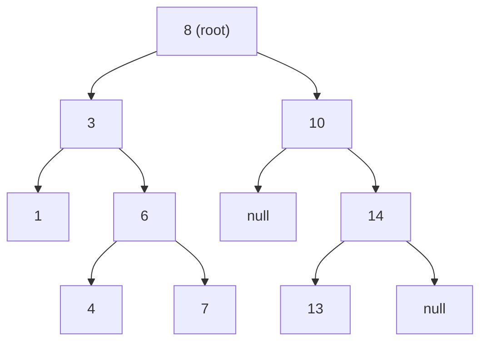
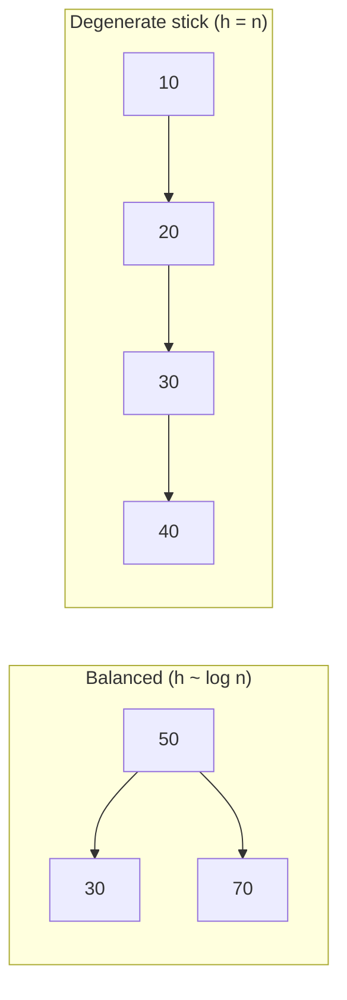
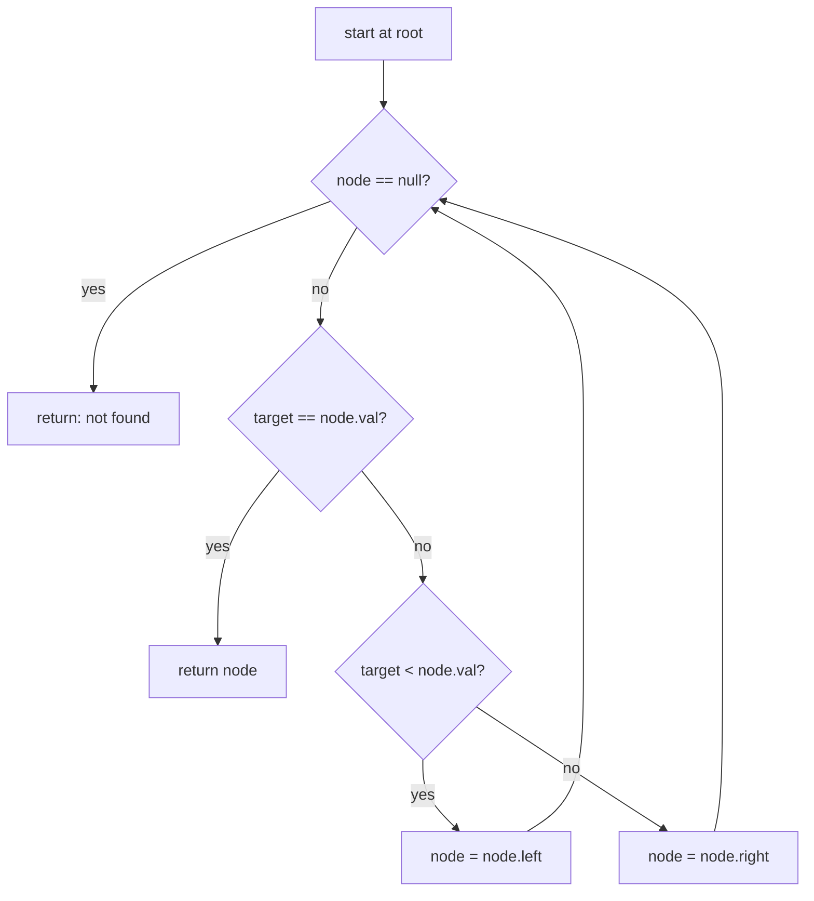
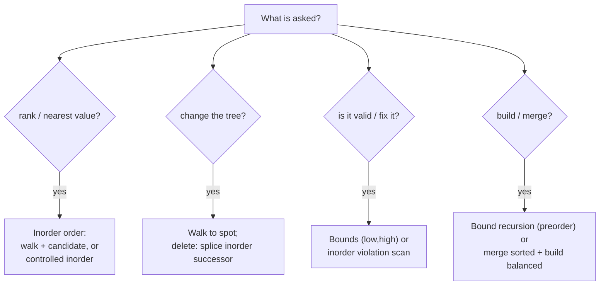

# Binary Search Trees — Theory & Patterns

**Nav:** [Theory & Patterns](./theory-and-patterns.md) · [Problems (by Pattern)](./problems.md) · [Resources & References](./resources.md)

**Stats:** 16 problems total — 🟢 Easy: 5 · 🟡 Medium: 7 · 🔴 Hard: 4 · Patterns (sub-steps): 2

---

## Overview & Why It Matters

A **Binary Search Tree (BST)** is a binary tree that keeps its keys in a *sorted*, *searchable* order. For every node, all keys in its left subtree are smaller and all keys in its right subtree are larger. This single invariant turns a tree into a self-organizing "sorted structure" that supports **search, insert, and delete in O(h)** time, where `h` is the height (O(log n) when balanced, O(n) when degenerate).

**Where it appears in interviews:**
- Direct BST operations: search / insert / delete / find min-max.
- Ordered queries: floor, ceil, k-th smallest/largest, inorder successor/predecessor.
- Validation & repair: "is this a valid BST?", "two nodes swapped, fix it".
- Construction: build a BST from preorder, merge two BSTs, largest BST subtree.
- Design: BST iterator (controlled inorder traversal with O(h) memory).

**Prerequisites:** binary trees (structure, recursion, DFS traversals), the three DFS orders (preorder/inorder/postorder), recursion & the call stack, and basic complexity analysis. The one fact you must internalize: **an inorder traversal of a BST yields keys in strictly increasing order.** Almost every BST trick descends from this.

---

## Core Concepts

**Node.** A node holds a `key` (value) plus pointers to `left` and `right` children.

**BST invariant (recursive).** For a node `x`:
- every key in `left(x)` < `key(x)`, and
- every key in `right(x)` > `key(x)`, and
- both subtrees are themselves BSTs.

The invariant is **global**, not just about immediate children — a common trap (see Common Mistakes).

**Height `h`.** Longest root-to-leaf path. Balanced ⇒ `h ≈ log₂ n`; a sorted insertion sequence produces a "stick" ⇒ `h = n`.

**The golden property.** Inorder traversal (Left → Node → Right) visits keys in ascending order. Reverse inorder (Right → Node → Left) visits them in descending order.

**Vocabulary.**
- **Floor(x):** largest key ≤ x. **Ceil(x):** smallest key ≥ x.
- **Inorder successor of x:** next-larger key. **Predecessor:** next-smaller key.
- **LCA:** lowest node that has both target keys in its subtrees.



Inorder of the tree above: `1 3 4 6 7 8 10 13 14` — sorted, as promised.



---

## Patterns

The data groups this topic into two ordered sub-steps. **Pattern 1 (Concepts)** covers the building-block operations you compose everywhere. **Pattern 2 (Practice Problems)** is a collection of applied problems, each an instance of a reusable micro-pattern (ordered queries, validation, construction, two-pointer-on-inorder). Below, each sub-step gets recognition signals, algorithm, a diagram, complexity, and a C++ template.

A shared node definition used by all templates:

```cpp
struct TreeNode {
    int val;
    TreeNode *left, *right;
    TreeNode(int x) : val(x), left(nullptr), right(nullptr) {}
};
```

### Pattern 1 — Concepts (Search · Min/Max · the BST walk)

**Recognition signals.** You are asked to *locate* a value, or the smallest/largest value, or to reason about ordering. Any time you can decide "go left or go right" by a single comparison, you are in this pattern. This is the atom that every other BST algorithm is built from.

**Approach (the BST walk).**
1. Start at `root`.
2. Compare `target` with `node->val`.
3. If equal → found. If `target < node->val` → go **left**. Else → go **right**.
4. Stop at `nullptr` (not found).
- **Min** = walk `left` until `left == nullptr`. **Max** = walk `right` until `right == nullptr`.



**Complexity.** Time **O(h)** — each step drops one level; `h = log n` balanced, `n` degenerate. Space **O(1)** iterative (no recursion stack) or **O(h)** recursive.

```cpp
// Search in BST — iterative, O(h) time, O(1) space
TreeNode* searchBST(TreeNode* root, int target) {
    while (root && root->val != target)
        root = (target < root->val) ? root->left : root->right;
    return root; // nullptr if not present
}

// Min and Max — leftmost / rightmost node
int findMin(TreeNode* root) {                 // assumes non-empty
    while (root->left) root = root->left;
    return root->val;
}
int findMax(TreeNode* root) {
    while (root->right) root = root->right;
    return root->val;
}
```

### Pattern 2 — Practice Problems (Ordered queries · Modify · Validate · Construct)

This sub-step bundles the applied problems. They cluster into four reusable micro-patterns; recognizing which one you face is the whole game.

**Recognition signals.**
- *Ordered query* (floor/ceil, k-th, successor/predecessor, two-sum): you need a value defined by rank or nearest-neighbor → **exploit inorder order**; carry a candidate as you walk, or do a controlled inorder.
- *Modify* (insert/delete): change structure while preserving the invariant → walk to the spot; for delete-with-two-children, splice in the inorder successor.
- *Validate/repair* (is-BST, recover swapped, largest BST subtree): verify the *global* invariant → pass down `(min,max)` bounds, or scan inorder for order violations, or return `{min,max,size,isBST}` bottom-up.
- *Construct/merge* (from preorder, merge two BSTs): rebuild structure from a sequence → bound-based recursion, or merge two sorted inorders then build a balanced BST.

**Approach — the four workhorse recipes.**

1. **Bounded validation:** recurse with an allowed open interval `(low, high)`; a node is valid iff `low < val < high`, then recurse left with `(low,val)` and right with `(val,high)`.
2. **Inorder-as-sorted:** any "sorted array" trick (find k-th, detect the two out-of-order elements, two-sum with two pointers) works directly on the inorder sequence.
3. **Walk-carrying-candidate:** for floor/ceil/successor, walk down updating a best candidate — O(h), no full traversal.
4. **Bottom-up aggregation:** for "largest BST subtree", return `{min, max, size, valid}` from each node in postorder.



**Complexity.** Ordered-query walks and insert/delete are **O(h)**. Validation, k-th (worst), recover, largest-BST, and merge are **O(n)** time; recursion/stack space **O(h)**.

```cpp
// --- Validate BST (bounded recursion) --- O(n) time, O(h) space
bool isValid(TreeNode* node, long lo, long hi) {
    if (!node) return true;
    if (node->val <= lo || node->val >= hi) return false;
    return isValid(node->left, lo, node->val) &&
           isValid(node->right, node->val, hi);
}
bool isValidBST(TreeNode* root) { return isValid(root, LONG_MIN, LONG_MAX); }

// --- Insert (walk to null spot) --- O(h)
TreeNode* insertBST(TreeNode* root, int key) {
    if (!root) return new TreeNode(key);
    TreeNode* cur = root;
    while (true) {
        if (key < cur->val) {
            if (!cur->left) { cur->left = new TreeNode(key); break; }
            cur = cur->left;
        } else {
            if (!cur->right) { cur->right = new TreeNode(key); break; }
            cur = cur->right;
        }
    }
    return root;
}

// --- Delete (splice inorder successor for two-child case) --- O(h)
TreeNode* deleteBST(TreeNode* root, int key) {
    if (!root) return nullptr;
    if (key < root->val)      root->left  = deleteBST(root->left, key);
    else if (key > root->val) root->right = deleteBST(root->right, key);
    else {
        if (!root->left)  return root->right;
        if (!root->right) return root->left;
        TreeNode* succ = root->right;          // inorder successor = min of right
        while (succ->left) succ = succ->left;
        root->val = succ->val;
        root->right = deleteBST(root->right, succ->val);
    }
    return root;
}

// --- Floor / candidate-carrying walk --- O(h)
int floorBST(TreeNode* root, int key) {
    int ans = -1;
    while (root) {
        if (root->val == key) return root->val;
        if (key > root->val) { ans = root->val; root = root->right; }
        else root = root->left;
    }
    return ans; // -1 if no key <= given
}
```

---

## Complexity Summary

| Pattern | Time | Space | Notes |
|---|---|---|---|
| Concepts: search / min / max | O(h) | O(1) iter, O(h) rec | `h = log n` balanced, `n` degenerate |
| Ordered query: floor / ceil / successor / predecessor | O(h) | O(1)/O(h) | walk carrying a best candidate |
| Insert | O(h) | O(h) rec | walk to a null child, attach leaf |
| Delete | O(h) | O(h) | two children → splice inorder successor |
| k-th smallest / largest | O(h + k) → O(n) worst | O(h) | controlled inorder / reverse inorder |
| Validate BST | O(n) | O(h) | pass `(low,high)` bounds, or inorder scan |
| LCA in BST | O(h) | O(1)/O(h) | split point where paths to the two keys diverge |
| Construct from preorder | O(n) | O(h) | recurse with upper-bound |
| Two-Sum in BST | O(n) | O(h) | two BST iterators (asc + desc), two-pointer |
| Merge two BSTs / BST iterator | O(n₁+n₂) | O(h) | merge sorted inorders, build balanced |
| Recover swapped nodes | O(n) | O(h) | find two inorder-order violations, swap |
| Largest BST subtree | O(n) | O(h) | postorder returns `{min,max,size,valid}` |

---

## Interview Tips & Common Mistakes

- **The invariant is global.** A node whose immediate children obey the rule can still be invalid (e.g., a deep-left node larger than an ancestor). Always validate with `(low, high)` bounds or an inorder scan — never just compare parent-to-child.
- **Use INT overflow-safe bounds.** In validation, initial bounds `INT_MIN/INT_MAX` break when a node equals them; use `long`/`LONG_MIN`,`LONG_MAX` or nullable pointers.
- **Inorder = sorted** is your Swiss-army knife: k-th, two-sum, recover, and validate all reduce to a 1-D sorted-array problem.
- **Delete carefully.** For a two-child node, replace value with the **inorder successor** (min of right subtree) and delete that successor — don't forget to recurse into the right subtree to remove it.
- **Prefer O(h) over O(n).** Floor/ceil/successor/LCA don't need a full traversal; a single downward walk suffices. Reaching for a full inorder when a walk works signals a weaker answer.
- **k-th smallest with a Morris/controlled inorder** gives O(h) extra space; augmenting nodes with subtree sizes gives O(log n) if updates are frequent — mention this trade-off.
- **Successor edge cases:** if the node has a right child, successor = min of right subtree; otherwise it's the lowest ancestor for which the node lies in the left subtree.
- **Duplicates:** decide a convention (usually disallow, or keep a count) and state it — BSTs by definition have distinct keys.
- **Balance matters:** unbalanced BSTs degrade to O(n). If asked for guaranteed O(log n), name AVL / Red-Black / `std::set`(`std::map`).
