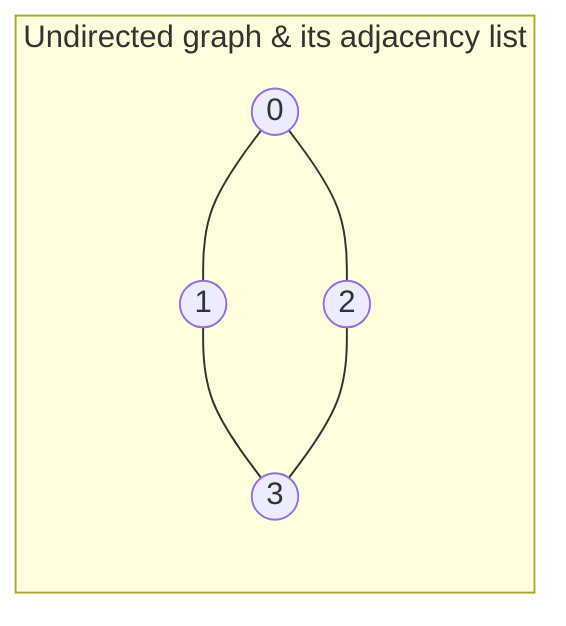
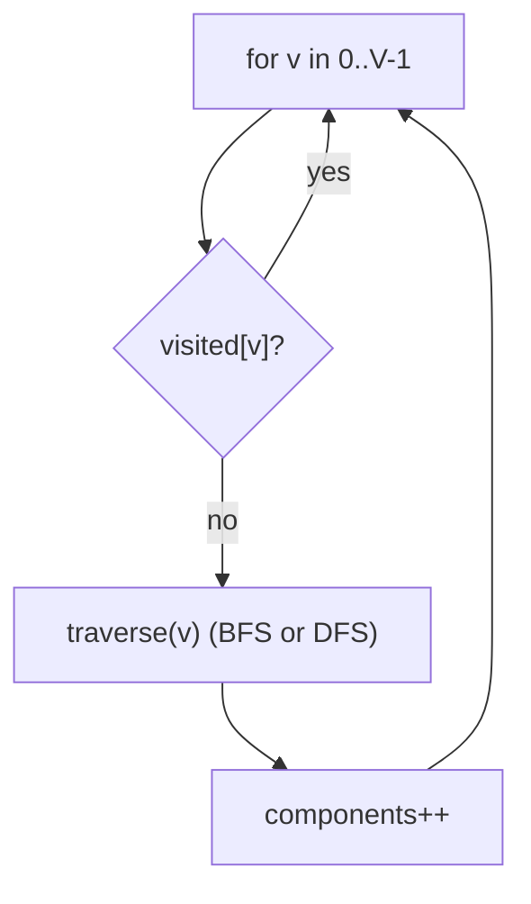
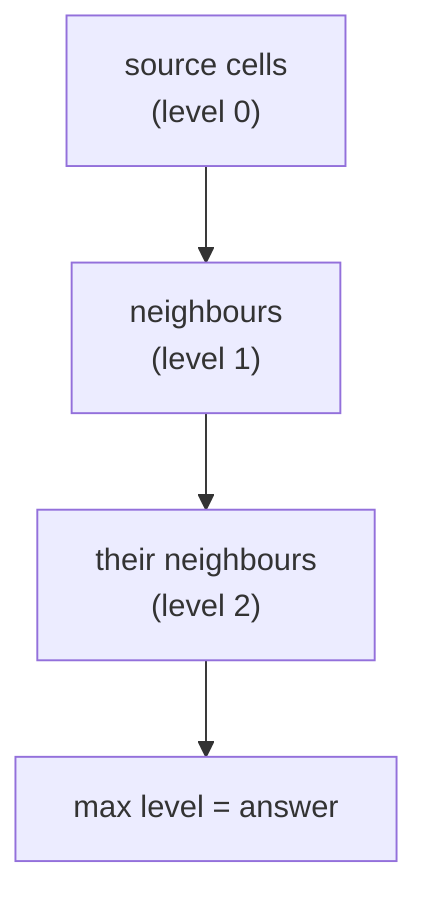
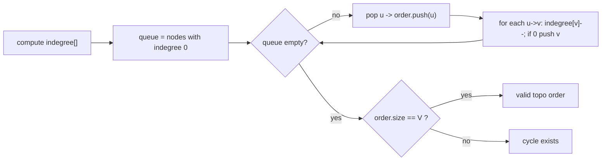
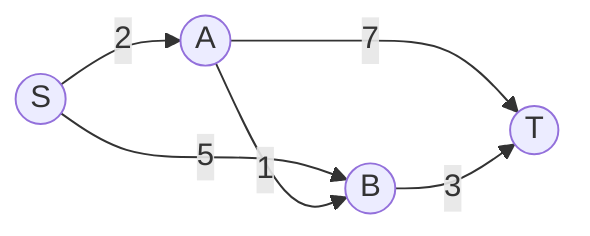
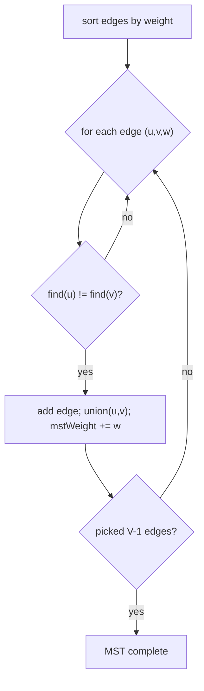

# Graphs — Theory & Patterns

**Nav:** [Theory & Patterns](./theory-and-patterns.md) · [Problems](./problems.md) · [Resources](./resources.md)

**Stats:** 53 problems total — 🟢 Easy: 4 · 🟡 Medium: 15 · 🔴 Hard: 34.

---

## Overview & Why It Matters

A **graph** is a set of **vertices** (nodes) connected by **edges**. It is the most general data structure in this sheet: trees, linked lists, and grids are all special cases of graphs. Almost every real system maps to a graph — road networks (Google Maps), social networks (friend suggestions), dependency resolvers (build systems, `npm`), the internet (routing), and state machines.

**Where it appears in interviews.** Graphs are among the highest-frequency FAANG topics. You will be asked to: model a problem as a graph, traverse it (BFS/DFS), order it (topological sort), find shortest paths (Dijkstra / Bellman-Ford / Floyd-Warshall), connect it minimally (MST), or group/merge things (Disjoint Set Union). Many "grid" problems (islands, rotten oranges, matrices) are graphs in disguise.

**Prerequisites.** Comfort with recursion, `queue`/`stack`/`priority_queue`, arrays and hash maps, and basic complexity analysis. Trees (Step 14) help because DFS/BFS generalise directly.

**The single most important interview skill:** *recognising that a problem is a graph problem*, then picking the right traversal or algorithm. This file builds that recognition pattern by pattern.

---

## Core Concepts

**Vocabulary**

- **Vertex / Node** — an entity. **Edge** — a connection between two vertices.
- **Directed vs Undirected** — an edge `u→v` (one-way) vs `u—v` (both ways).
- **Weighted vs Unweighted** — edges carry a cost or not.
- **Degree** — number of edges touching a vertex (in-degree / out-degree for directed).
- **Path** — sequence of vertices connected by edges. **Cycle** — a path that returns to its start.
- **Connected component** — a maximal set of mutually reachable vertices.
- **DAG** — Directed Acyclic Graph (no cycles); only DAGs have a topological ordering.
- **Tree** — connected, undirected, acyclic graph with `V-1` edges.
- **Spanning tree** — a tree touching all `V` vertices using `V-1` edges; **MST** minimises total weight.

**Two ways to store a graph**

| Representation | Space | Check edge (u,v) | Iterate neighbours of u | Best for |
|---|---|---|---|---|
| Adjacency **matrix** | O(V²) | O(1) | O(V) | dense graphs, Floyd-Warshall |
| Adjacency **list** | O(V+E) | O(deg) | O(deg) | sparse graphs (most problems) |

**Invariants to internalise**

- BFS from a source visits vertices in non-decreasing order of edge-count distance → BFS gives shortest paths in **unweighted** graphs.
- DFS explores as deep as possible before backtracking → natural for cycle detection, topo sort, connectivity, bridges/articulation points.
- A `visited[]` array (or set) is mandatory in graph traversal to avoid infinite loops on cycles — unlike trees.



Adjacency list for the graph above: `0:[1,2]`, `1:[0,3]`, `2:[0,3]`, `3:[1,2]`.

```cpp
// Building an adjacency list from an edge list (0-indexed, V vertices).
vector<vector<int>> buildGraph(int V, vector<pair<int,int>>& edges, bool directed=false){
    vector<vector<int>> adj(V);
    for(auto& [u,v] : edges){
        adj[u].push_back(v);
        if(!directed) adj[v].push_back(u);
    }
    return adj;
}
// Weighted variant: vector<vector<pair<int,int>>> adj;  adj[u].push_back({v,w});
```

---

## Patterns

### Learning — Representations & Basic Traversal

**Recognition signals.** Anything that says "graph with V nodes and edges", asks you to store a graph, count connected components, or simply walk every node. This is the foundation for all later patterns.

**Approach.**
1. Read the graph into an adjacency list (`O(V+E)` space).
2. To visit everything, loop over all vertices; start a **DFS or BFS** from each unvisited one. Each launch discovers one connected component.
3. Maintain `visited[]`. **BFS** uses a queue (level order); **DFS** uses recursion or an explicit stack.



**Complexity.** Both BFS and DFS are **O(V+E)** time (each vertex and edge processed once) and **O(V)** space for `visited` plus the queue/recursion stack.

```cpp
// BFS and DFS templates over an adjacency list.
void bfs(int src, vector<vector<int>>& adj, vector<int>& vis){
    queue<int> q; q.push(src); vis[src]=1;
    while(!q.empty()){
        int node = q.front(); q.pop();
        // process(node);
        for(int nb : adj[node])
            if(!vis[nb]){ vis[nb]=1; q.push(nb); }
    }
}
void dfs(int node, vector<vector<int>>& adj, vector<int>& vis){
    vis[node]=1;
    // process(node);
    for(int nb : adj[node])
        if(!vis[nb]) dfs(nb, adj, vis);
}
int countComponents(int V, vector<vector<int>>& adj){
    vector<int> vis(V,0); int c=0;
    for(int i=0;i<V;i++) if(!vis[i]){ dfs(i,adj,vis); c++; }
    return c;
}
```

---

### Problems on BFS/DFS

**Recognition signals.** Grid/matrix problems (islands, oranges, flood fill, 0/1 matrix), "count regions/provinces", "shortest steps in unweighted graph", cycle detection in undirected/directed graphs, bipartite check, multi-source spread. If edges are unweighted and you need *fewest steps*, reach for **BFS**; if you need *reachability / cycles / coloring*, **DFS** is natural.

**Approach (grid as graph).** Treat each cell as a node; neighbours are the 4 (sometimes 8) adjacent cells. Guard bounds and `visited`.

- **Multi-source BFS**: push all sources at once (rotten oranges, nearest 1) and expand level by level — the level number is the answer distance.
- **Cycle detection (undirected)**: DFS/BFS carrying the `parent`; seeing a visited neighbour that is *not* the parent ⇒ cycle.
- **Cycle detection (directed, DFS)**: keep a `pathVisited[]` (recursion stack); revisiting a node on the current stack ⇒ cycle.
- **Bipartite**: 2-color the graph; conflict on adjacent same-color ⇒ not bipartite.



**Complexity.** Grid of `n×m`: **O(n·m)** time and space. General graph: **O(V+E)**.

```cpp
// Multi-source BFS on a grid (e.g. rotten oranges / nearest 1).
int multiSourceBFS(vector<vector<int>>& g){
    int n=g.size(), m=g[0].size();
    queue<pair<int,int>> q; vector<vector<int>> dist(n, vector<int>(m,-1));
    for(int i=0;i<n;i++) for(int j=0;j<m;j++)
        if(g[i][j]==1){ q.push({i,j}); dist[i][j]=0; }        // sources
    int dr[]={-1,1,0,0}, dc[]={0,0,-1,1}, best=0;
    while(!q.empty()){
        auto [r,c]=q.front(); q.pop();
        for(int k=0;k<4;k++){
            int nr=r+dr[k], nc=c+dc[k];
            if(nr>=0&&nr<n&&nc>=0&&nc<m&&dist[nr][nc]==-1){
                dist[nr][nc]=dist[r][c]+1; best=max(best,dist[nr][nc]);
                q.push({nr,nc});
            }
        }
    }
    return best;
}

// Directed cycle detection with DFS (recursion-stack coloring).
bool dfsCycle(int node, vector<vector<int>>& adj, vector<int>& vis, vector<int>& path){
    vis[node]=1; path[node]=1;
    for(int nb: adj[node]){
        if(!vis[nb]){ if(dfsCycle(nb,adj,vis,path)) return true; }
        else if(path[nb]) return true;   // back-edge to node on current stack
    }
    path[node]=0;                        // pop from recursion stack
    return false;
}
```

---

### Topo Sort and Problems

**Recognition signals.** "Ordering with dependencies / prerequisites", "is scheduling possible", "build order", "course schedule", "alien dictionary". Only valid on a **DAG**. If a cycle exists, no ordering exists (and Kahn's algorithm detects it).

**Approach — Kahn's algorithm (BFS on in-degrees).**
1. Compute `indegree[]` for every node.
2. Push all nodes with `indegree == 0` into a queue.
3. Repeatedly pop a node, append it to the order, and decrement its neighbours' in-degrees; push any that hit 0.
4. If the produced order has fewer than `V` nodes ⇒ there was a cycle.

**DFS variant.** Do a DFS and push each node onto a stack *after* exploring all its descendants; the reversed finish order is a topo order.



**Complexity.** **O(V+E)** time, **O(V)** space (queue + indegree array).

```cpp
// Kahn's algorithm: returns topo order; empty-ish check reveals a cycle.
vector<int> topoSort(int V, vector<vector<int>>& adj){
    vector<int> indeg(V,0);
    for(int u=0;u<V;u++) for(int v: adj[u]) indeg[v]++;
    queue<int> q;
    for(int i=0;i<V;i++) if(indeg[i]==0) q.push(i);
    vector<int> order;
    while(!q.empty()){
        int u=q.front(); q.pop(); order.push_back(u);
        for(int v: adj[u]) if(--indeg[v]==0) q.push(v);
    }
    // if (int)order.size() != V  =>  graph has a cycle (not a DAG)
    return order;
}
```

---

### Shortest Path Algorithms and Problems

**Recognition signals.** "Minimum cost/time/distance from A to B (or to all)". Choose by graph type:

- **Unweighted** (or all weights equal) → **BFS**.
- **Weighted DAG** → topo-sort then relax in topo order (linear).
- **Non-negative weights, single source** → **Dijkstra** (min-heap).
- **Negative weights allowed / detect negative cycle, single source** → **Bellman-Ford**.
- **All-pairs shortest paths / dense small graph** → **Floyd-Warshall**.
- Constraints like "≤ K stops" often mean **BFS/Bellman-Ford-style level-bounded relaxation**.

**Dijkstra approach.** Maintain `dist[]` (∞ init, `dist[src]=0`) and a min-priority-queue of `(dist,node)`. Pop the smallest; for each neighbour, if `dist[u]+w < dist[v]` relax it and push. A node may enter the heap multiple times — skip stale pops. Fails with negative edges because the greedy "finalise the closest" invariant breaks.



**Complexity.**

| Algorithm | Time | When |
|---|---|---|
| BFS (unweighted) | O(V+E) | unit weights |
| Topo-relax (DAG) | O(V+E) | weighted DAG |
| Dijkstra (heap) | O(E log V) | non-negative weights |
| Bellman-Ford | O(V·E) | negative edges / neg-cycle detection |
| Floyd-Warshall | O(V³) | all pairs, small V |

```cpp
// Dijkstra with a min-heap. dist[i] = shortest distance from src to i.
vector<int> dijkstra(int V, vector<vector<pair<int,int>>>& adj, int src){
    vector<int> dist(V, INT_MAX); dist[src]=0;
    priority_queue<pair<int,int>, vector<pair<int,int>>, greater<>> pq; // (dist,node)
    pq.push({0,src});
    while(!pq.empty()){
        auto [d,u]=pq.top(); pq.pop();
        if(d>dist[u]) continue;                 // stale entry
        for(auto [v,w]: adj[u])
            if(dist[u]+w < dist[v]){ dist[v]=dist[u]+w; pq.push({dist[v],v}); }
    }
    return dist;
}

// Bellman-Ford: handles negatives; edges = {u,v,w}. Returns dist or detects neg cycle.
vector<int> bellmanFord(int V, vector<vector<int>>& edges, int src){
    vector<int> dist(V, 1e9); dist[src]=0;
    for(int i=0;i<V-1;i++)                        // relax V-1 times
        for(auto& e: edges){
            int u=e[0],v=e[1],w=e[2];
            if(dist[u]!=1e9 && dist[u]+w<dist[v]) dist[v]=dist[u]+w;
        }
    for(auto& e: edges){                          // V-th pass => neg cycle if it still relaxes
        int u=e[0],v=e[1],w=e[2];
        if(dist[u]!=1e9 && dist[u]+w<dist[v]) return {-1}; // negative cycle
    }
    return dist;
}

// Floyd-Warshall: all-pairs. d[i][j] init with edge weights, 0 on diagonal, INF otherwise.
void floydWarshall(vector<vector<int>>& d){
    int n=d.size();
    for(int k=0;k<n;k++)
        for(int i=0;i<n;i++)
            for(int j=0;j<n;j++)
                if(d[i][k]<1e9 && d[k][j]<1e9)
                    d[i][j]=min(d[i][j], d[i][k]+d[k][j]);
}
```

---

### MinimumSpanningTree / Disjoint Set and Problems

**Recognition signals.** "Connect all nodes at minimum total cost" (MST → Prim/Kruskal). "Group things / are these in the same set / merge accounts / count components under online union queries / dynamic connectivity" (→ **DSU / Union-Find**). Many grid problems (making a large island, islands II, swim in water) become elegant with DSU.

**DSU.** Two operations: `find(x)` (representative of x's set) and `union(a,b)` (merge). With **path compression** + **union by rank/size**, both run in near-**O(α(N)) ≈ O(1)** amortised.

**Kruskal's MST.** Sort edges by weight; scan them; add an edge if its two endpoints are in different DSU sets (no cycle), unioning them. Stop after `V-1` edges. **O(E log E)**.

**Prim's MST.** Grow the tree from any node using a min-heap of frontier edges; repeatedly add the cheapest edge leaving the tree. **O(E log V)**.



**Complexity.** DSU ops ~O(α(N)); Kruskal O(E log E); Prim O(E log V); space O(V+E).

```cpp
struct DSU {
    vector<int> parent, size;
    DSU(int n){ parent.resize(n); size.assign(n,1); iota(parent.begin(),parent.end(),0); }
    int find(int x){ return parent[x]==x ? x : parent[x]=find(parent[x]); } // path compression
    bool unite(int a,int b){
        a=find(a); b=find(b);
        if(a==b) return false;                 // already connected -> would form cycle
        if(size[a]<size[b]) swap(a,b);         // union by size
        parent[b]=a; size[a]+=size[b];
        return true;
    }
};

// Kruskal's MST using DSU.
int kruskal(int V, vector<array<int,3>>& edges){ // edges: {w,u,v}
    sort(edges.begin(), edges.end());
    DSU dsu(V); int mst=0, used=0;
    for(auto& [w,u,v]: edges)
        if(dsu.unite(u,v)){ mst+=w; if(++used==V-1) break; }
    return mst;
}

// Prim's MST using a min-heap.
int prim(int V, vector<vector<pair<int,int>>>& adj){
    vector<int> inMST(V,0); int mst=0;
    priority_queue<pair<int,int>, vector<pair<int,int>>, greater<>> pq; // (weight,node)
    pq.push({0,0});
    while(!pq.empty()){
        auto [w,u]=pq.top(); pq.pop();
        if(inMST[u]) continue;
        inMST[u]=1; mst+=w;
        for(auto [v,wt]: adj[u]) if(!inMST[v]) pq.push({wt,v});
    }
    return mst;
}
```

---

### Other Algorithms

**Recognition signals.** "Critical connections / bridges" (an edge whose removal disconnects the graph), "articulation points" (such a vertex), "strongly connected components" (maximal mutually reachable sets in a *directed* graph). These are advanced DFS techniques using **discovery times** and **low-link** values (Tarjan) or two passes on the graph and its transpose (Kosaraju).

**Bridges / Articulation points (Tarjan).** DFS assigning each node a discovery time `tin[]` and a `low[]` = lowest `tin` reachable via the subtree (and at most one back-edge). Edge `(u,v)` is a **bridge** if `low[v] > tin[u]`. Vertex `u` is an **articulation point** if some child `v` has `low[v] >= tin[u]` (root special-cased on child count).

**Kosaraju's SCC.** (1) DFS pushing nodes onto a stack by finish time. (2) Transpose the graph (reverse all edges). (3) Pop nodes from the stack; each DFS on the transpose that starts a new tree is one SCC.


**Complexity.** All three run in **O(V+E)** time, **O(V+E)** space.

```cpp
// Tarjan bridges: fills 'bridges' with critical edges.
int timer=0;
void bridgeDfs(int u,int parent,vector<vector<int>>& adj,vector<int>& tin,
               vector<int>& low,vector<int>& vis,vector<pair<int,int>>& bridges){
    vis[u]=1; tin[u]=low[u]=timer++;
    for(int v: adj[u]){
        if(v==parent) continue;
        if(vis[v]) low[u]=min(low[u],tin[v]);      // back-edge
        else{
            bridgeDfs(v,u,adj,tin,low,vis,bridges);
            low[u]=min(low[u],low[v]);
            if(low[v]>tin[u]) bridges.push_back({u,v}); // bridge condition
        }
    }
}

// Kosaraju SCC count.
void dfs1(int u,vector<vector<int>>& adj,vector<int>& vis,stack<int>& st){
    vis[u]=1;
    for(int v: adj[u]) if(!vis[v]) dfs1(v,adj,vis,st);
    st.push(u);
}
void dfs2(int u,vector<vector<int>>& radj,vector<int>& vis){
    vis[u]=1; for(int v: radj[u]) if(!vis[v]) dfs2(v,radj,vis);
}
int kosaraju(int V,vector<vector<int>>& adj){
    vector<int> vis(V,0); stack<int> st;
    for(int i=0;i<V;i++) if(!vis[i]) dfs1(i,adj,vis,st);
    vector<vector<int>> radj(V);
    for(int u=0;u<V;u++) for(int v: adj[u]) radj[v].push_back(u);
    fill(vis.begin(),vis.end(),0); int scc=0;
    while(!st.empty()){
        int u=st.top(); st.pop();
        if(!vis[u]){ dfs2(u,radj,vis); scc++; }
    }
    return scc;
}
```

---

## Complexity Summary

| Pattern | Time | Space | Notes |
|---|---|---|---|
| Representation / Traversal (BFS, DFS) | O(V+E) | O(V) | Adjacency list preferred for sparse graphs |
| Grid BFS/DFS (islands, oranges, flood fill) | O(n·m) | O(n·m) | Multi-source BFS for spread/nearest-cell |
| Undirected cycle detection | O(V+E) | O(V) | Track parent (DFS/BFS) |
| Directed cycle detection | O(V+E) | O(V) | Recursion-stack coloring or Kahn |
| Topological sort (Kahn / DFS) | O(V+E) | O(V) | Only DAGs; detects cycles |
| BFS shortest path (unweighted) | O(V+E) | O(V) | Unit weights |
| Shortest path in DAG | O(V+E) | O(V) | Topo order + relaxation |
| Dijkstra | O(E log V) | O(V) | Non-negative weights, min-heap |
| Bellman-Ford | O(V·E) | O(V) | Negative edges; detects neg cycles |
| Floyd-Warshall | O(V³) | O(V²) | All-pairs; small dense graphs |
| DSU (union/find) | ~O(α(N)) | O(V) | Path compression + union by size |
| Kruskal MST | O(E log E) | O(V+E) | Sort edges + DSU |
| Prim MST | O(E log V) | O(V+E) | Min-heap frontier |
| Bridges / Articulation (Tarjan) | O(V+E) | O(V+E) | tin/low discovery times |
| Kosaraju SCC | O(V+E) | O(V+E) | Two DFS passes + transpose |

---

## Interview Tips & Common Mistakes

- **Always use `visited[]`.** Forgetting it in a graph (unlike a tree) causes infinite loops on cycles.
- **Pick the right traversal.** Fewest steps in an unweighted graph = **BFS**, not DFS. Reachability / cycles / ordering = **DFS**.
- **Grid = graph.** Precompute direction arrays `dr[]={-1,1,0,0}, dc[]={0,0,-1,1}`; check bounds before indexing.
- **Undirected vs directed cycle detection differ.** Undirected uses `parent`; directed uses a **recursion stack** (`pathVisited`), not just `visited`.
- **Dijkstra ≠ negatives.** With any negative edge, use Bellman-Ford. Also skip **stale heap entries** (`if(d>dist[u]) continue;`) or you get TLE.
- **Bellman-Ford runs `V-1` relaxations**; a further relaxation in pass `V` signals a negative cycle.
- **Floyd-Warshall loop order** must be `k` (intermediate) outermost. Swapping loops gives wrong answers.
- **Topo sort only on DAGs.** If Kahn's order has `< V` nodes, the graph has a cycle — this is a common two-in-one trick (schedule feasibility).
- **DSU pitfalls:** always compare **roots** in `union`, apply path compression, and remember `find` is `O(α)` only *with* both optimisations.
- **MST needs a connected graph** for a single spanning tree; otherwise you get a spanning forest. Kruskal naturally handles edge selection via DSU cycle checks.
- **Off-by-one and 0/1 indexing.** Confirm whether nodes are 0- or 1-indexed; size arrays accordingly.
- **State-space graphs.** "Word ladder", "minimum multiplications", "cheapest flights" — the vertices are *states*, edges are *transitions*. Modelling correctly is half the solution.
