# Dynamic Programming — Theory & Patterns

**Nav:** [Theory & Patterns](./theory-and-patterns.md) · [Problems](./problems.md) · [Resources](./resources.md)

**Stats:** 57 problems across 9 patterns — 🟢 Easy: 3 · 🟡 Medium: 28 · 🔴 Hard: 26

---

## Overview & Why It Matters

**Dynamic Programming (DP)** is an optimization technique for problems that have two properties:

1. **Optimal substructure** — the optimal answer to the whole can be built from optimal answers to sub-problems.
2. **Overlapping sub-problems** — the same sub-problem is solved many times, so caching its answer pays off.

DP turns exponential brute-force recursion into polynomial-time solutions by **storing** (memoizing) answers so each unique sub-problem is computed exactly once. It is the single most common "hard" topic in tech interviews (Google, Amazon, Meta, Microsoft) and competitive programming. Almost every "count the ways / find the min-max / can we reach a target" question is a DP in disguise.

**Where it appears in interviews:** stairs/jumps, grids/paths, knapsack & coin problems, string matching (LCS, edit distance, wildcard), stock trading, longest increasing subsequence, interval/partition problems (MCM, burst balloons), and matrix-of-squares problems.

**Prerequisites:** recursion & backtracking (you must be fluent at writing a recursive "try all options" function), basic combinatorics, arrays/2D arrays, and complexity analysis. **If you cannot write the recursion, you cannot write the DP.**

---

## Core Concepts

### The three-step DP framework (the spine of this entire topic)

Striver's method — every problem is solved by climbing this ladder:

1. **Memoization (Top-Down):** write the recursion, then add a `dp[]` cache. Recursion + storage. Easy to derive, uses recursion stack.
2. **Tabulation (Bottom-Up):** convert the recursion into an iterative loop that fills a table from base cases up to the answer. No recursion stack.
3. **Space Optimization:** if `dp[i]` only depends on `dp[i-1]`, `dp[i-2]` (or previous row), replace the whole table with a few variables/rows.

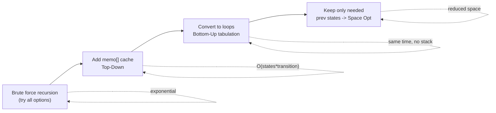

### How to write ANY DP (the recipe)

1. **Express everything in terms of an index / state.** (e.g. "answer for first `i` items with capacity `j`".)
2. **Do all possible stuff on that index** (take / not-take, or try all split points).
3. **Take the best / sum / count** of those choices as required by the problem.
4. **Base cases** = smallest sub-problems (index out of range, target reached, etc.).
5. **Return** the top-level state.

### Vocabulary & invariants

- **State:** the parameters that uniquely identify a sub-problem — this defines the dimensions of your `dp` table.
- **Transition / recurrence:** how a state is computed from smaller states.
- **Base case:** the sub-problem answered without recursion.
- **Order of evaluation (tabulation):** you must fill smaller states before larger ones — the loop direction is dictated by the recurrence dependency.
- **Take / Not-take:** the canonical two-choice pattern for subsequence/subset DP.
- **Partition DP:** try every "cut point" `k` between `i` and `j` — the outer state is an interval.

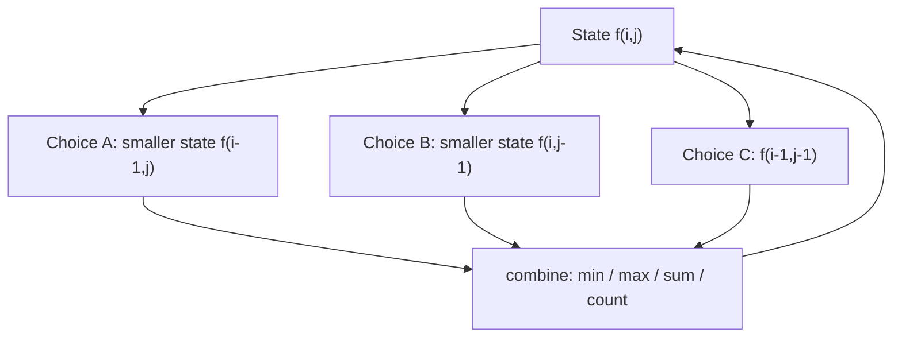

---

## Patterns

### 1. Introduction to DP

**Recognition signals:** Any problem whose recursion recomputes the same call (classic: Fibonacci). If you draw the recursion tree and see repeated nodes → memoize.

**Approach (step-by-step) using Fibonacci as the archetype:**
1. Recurrence: `f(n) = f(n-1) + f(n-2)`, base `f(0)=0, f(1)=1`.
2. **Memoize:** cache `dp[n]`.
3. **Tabulate:** fill `dp[0..n]` iteratively.
4. **Space optimize:** keep only `prev`, `prev2`.

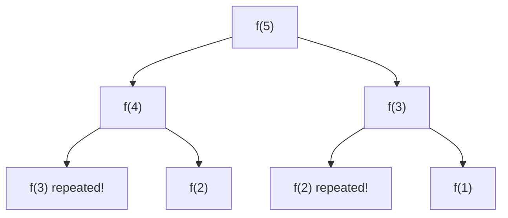

**Complexity:** memo/tab O(n) time; O(n) table → O(1) space optimized. Naive recursion is O(2^n).

```cpp
// Space-optimized Fibonacci — the DP mindset in 5 lines
int fib(int n) {
    if (n <= 1) return n;
    int prev2 = 0, prev1 = 1;      // f(0), f(1)
    for (int i = 2; i <= n; i++) {
        int cur = prev1 + prev2;   // recurrence
        prev2 = prev1;
        prev1 = cur;               // slide the window
    }
    return prev1;
}
```

---

### 2. 1D DP

**Recognition signals:** The answer at position `i` depends on a fixed number of **earlier positions** (`i-1`, `i-2`, up to `i-k`). Linear array, "reach the end", "pick with a constraint on neighbours".

**Approach:** define `dp[i]` = best answer considering index `i`. At each `i`, enumerate the allowed moves/choices (jump 1 or 2, take or skip adjacent), take min/max/sum. Base case at `dp[0]`.

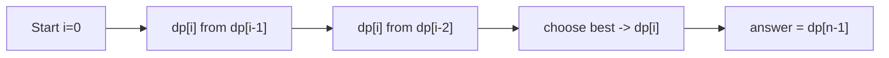

**Complexity:** O(n) time (or O(n·k) for k-jumps); O(n) → O(1) space optimized.

```cpp
// Template: house-robber style 1D DP (pick non-adjacent, maximize)
int solve1D(vector<int>& a) {
    int n = a.size();
    int prev1 = a[0];   // dp[0]
    int prev2 = 0;      // dp[-1]
    for (int i = 1; i < n; i++) {
        int pick    = a[i] + prev2;   // take i, skip i-1
        int notPick = prev1;          // skip i
        int cur = max(pick, notPick);
        prev2 = prev1;
        prev1 = cur;
    }
    return prev1;
}
```

---

### 3. 2D/3D DP and DP on Grids

**Recognition signals:** A grid/matrix; you move in restricted directions (down, right, diagonals); "count paths", "min/max path sum", or an extra dimension like "which task yesterday" (2D) or "two players moving" (3D).

**Approach:** `dp[i][j]` = best answer to reach cell `(i,j)` (or from it). Transition = combine the cells you could have come from. For 3D add the third state (e.g. two column positions).

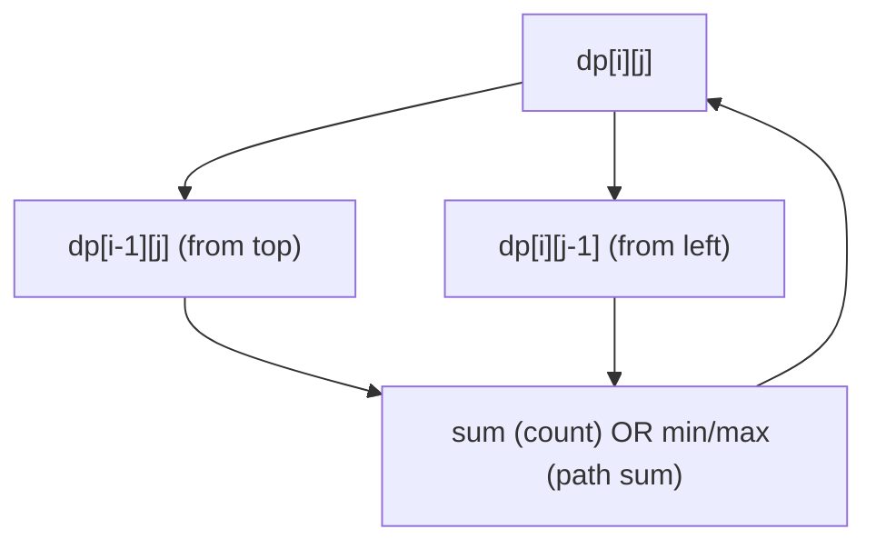

**Complexity:** O(rows·cols) time and space; O(cols) space optimized by keeping one/two rows. 3D grids are O(rows·cols·cols).

```cpp
// Template: min path sum in a grid (tabulation + space optimizable)
int gridDP(vector<vector<int>>& g) {
    int n = g.size(), m = g[0].size();
    vector<vector<int>> dp(n, vector<int>(m, 0));
    for (int i = 0; i < n; i++)
        for (int j = 0; j < m; j++) {
            if (i == 0 && j == 0) { dp[i][j] = g[i][j]; continue; }
            int up   = (i > 0) ? dp[i-1][j] : INT_MAX;
            int left = (j > 0) ? dp[i][j-1] : INT_MAX;
            dp[i][j] = g[i][j] + min(up, left);
        }
    return dp[n-1][m-1];
}
```

---

### 4. DP on Subsequences (Knapsack family)

**Recognition signals:** "Pick a subset/subsequence such that sum = target / count subsets / min coins / max value under capacity". The universal signal is a **take / not-take** decision on each element, often with a running `target`/`capacity` as a second state.

**Approach:** `dp[i][t]` = answer using items `0..i` with remaining target/capacity `t`.
- **not-take:** `dp[i-1][t]`
- **take** (if `a[i] <= t`): `dp[i-1][t - a[i]]` (0/1) or `dp[i][t - a[i]]` (unbounded, stay on same item).
- Combine by OR (feasibility), `+` (count), or `min/max` (optimization).

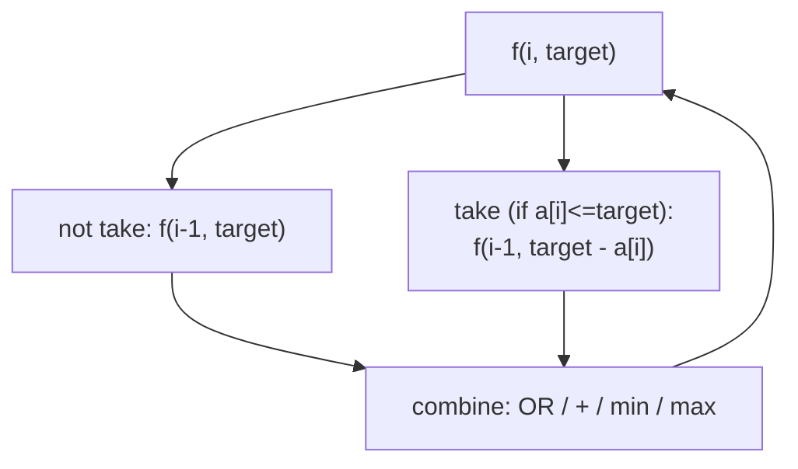

**Complexity:** O(n·target) time; O(n·target) → O(target) space (two 1D rows). Unbounded knapsack: same shape, "take" stays on the same index.

```cpp
// Template: 0/1 subset-sum feasibility (space-optimized to 1D)
bool subsetSum(vector<int>& a, int target) {
    int n = a.size();
    vector<char> prev(target + 1, false), cur(target + 1, false);
    prev[0] = true;                 // sum 0 always achievable
    if (a[0] <= target) prev[a[0]] = true;
    for (int i = 1; i < n; i++) {
        cur[0] = true;
        for (int t = 1; t <= target; t++) {
            bool notTake = prev[t];
            bool take    = (a[i] <= t) ? prev[t - a[i]] : false;
            cur[t] = notTake || take;
        }
        prev = cur;
    }
    return prev[target];
}
```

---

### 5. DP on Strings (LCS / Edit family)

**Recognition signals:** Two strings (or one), asking for common subsequence/substring, edit/insert/delete counts, matching with wildcards, or palindrome transformations. State = pair of indices `(i, j)`.

**Approach:** `dp[i][j]` = answer for prefixes `s1[0..i-1]`, `s2[0..j-1]`.
- If `s1[i-1] == s2[j-1]`: `1 + dp[i-1][j-1]` (match & shrink both).
- Else: combine `dp[i-1][j]`, `dp[i][j-1]`, `dp[i-1][j-1]` per problem (max for LCS, `1+min(...)` for edit distance). **1-based indexing** avoids negative-index base cases.

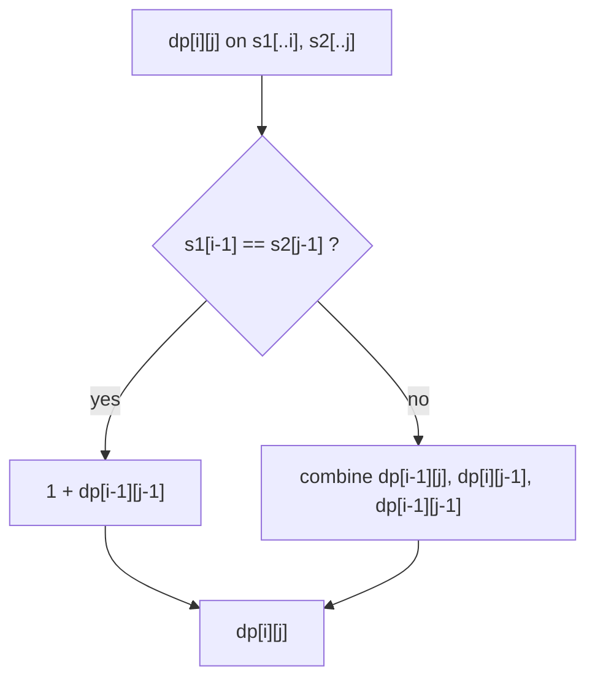

**Complexity:** O(n·m) time and space; O(m) space optimized with two rows.

```cpp
// Template: Longest Common Subsequence (tabulation, 1-based)
int lcs(string s1, string s2) {
    int n = s1.size(), m = s2.size();
    vector<vector<int>> dp(n + 1, vector<int>(m + 1, 0)); // row/col 0 = empty prefix
    for (int i = 1; i <= n; i++)
        for (int j = 1; j <= m; j++) {
            if (s1[i-1] == s2[j-1]) dp[i][j] = 1 + dp[i-1][j-1];
            else dp[i][j] = max(dp[i-1][j], dp[i][j-1]);
        }
    return dp[n][m];
}
```

---

### 6. DP on Stocks

**Recognition signals:** Prices array + rule about buying/selling (unlimited, at most K transactions, cooldown, fee). State = `(day, holding?, transactionsLeft)`.

**Approach:** `dp[i][buy][cap]` — at day `i`, are we allowed to buy (`buy=1`) or must sell, with `cap` transactions left. Two choices each day: **do nothing** (move to `i+1` same state) or **act** (buy: subtract price, flip; sell: add price, flip & decrement cap).

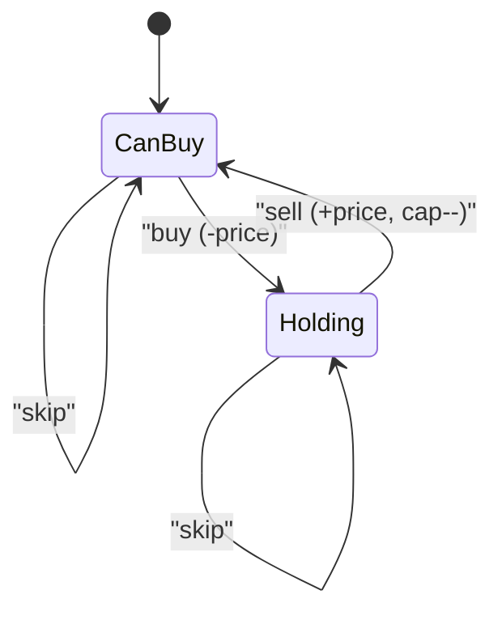

**Complexity:** O(n·2·K) time; space O(2·K) after optimization (unlimited-transaction variants are O(n)→O(1)).

```cpp
// Template: unlimited transactions (Stock II) — space optimized
int stockII(vector<int>& price) {
    int n = price.size();
    // state: [buy] -> best profit
    vector<long> ahead(2, 0), cur(2, 0);   // day n: 0 profit
    for (int i = n - 1; i >= 0; i--) {
        for (int buy = 0; buy <= 1; buy++) {
            long profit;
            if (buy)  profit = max(-price[i] + ahead[0], ahead[1]); // buy or skip
            else      profit = max( price[i] + ahead[1], ahead[0]); // sell or skip
            cur[buy] = profit;
        }
        ahead = cur;
    }
    return ahead[1];
}
```

---

### 7. DP on LIS (Longest Increasing Subsequence)

**Recognition signals:** "Longest / count subsequences where each next element satisfies a relation" (increasing, divisible, string-chain predecessor). Classic LIS and its cousins.

**Approach:** `dp[i]` = length of best subsequence **ending at** `i`. For each `i`, look at all `j < i`; if `a[j] < a[i]` then `dp[i] = max(dp[i], 1 + dp[j])`. Answer = max over all `i`. For O(n log n), maintain a "tails" array and binary-search the insertion point.

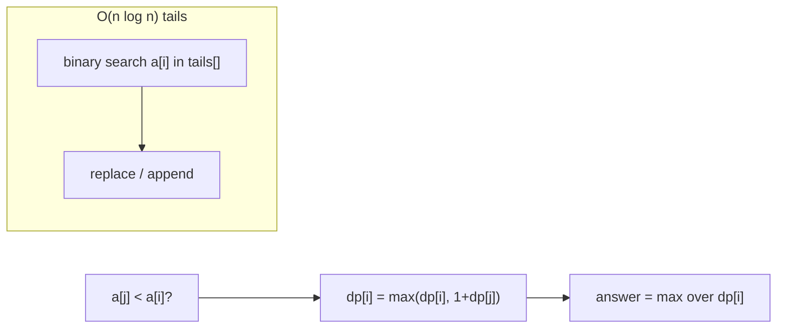

**Complexity:** DP O(n²) time, O(n) space; binary-search variant O(n log n).

```cpp
// Template: LIS length O(n^2) with reconstruction hooks
int lis(vector<int>& a) {
    int n = a.size(), best = 1;
    vector<int> dp(n, 1);
    for (int i = 0; i < n; i++)
        for (int j = 0; j < i; j++)
            if (a[j] < a[i]) dp[i] = max(dp[i], 1 + dp[j]);
    for (int i = 0; i < n; i++) best = max(best, dp[i]);
    return best;
}

// O(n log n) variant (length only)
int lisFast(vector<int>& a) {
    vector<int> tails;
    for (int x : a) {
        auto it = lower_bound(tails.begin(), tails.end(), x);
        if (it == tails.end()) tails.push_back(x);
        else *it = x;
    }
    return tails.size();
}
```

---

### 8. MCM DP | Partition DP

**Recognition signals:** "Partition an array/expression optimally", "cost of combining", "try every split point". You choose a **last operation** (which matrix multiply last, which balloon burst last, where to cut). State is an **interval `(i, j)`**.

**Approach:** `f(i, j)` = best cost over segment `[i..j]`. Try every partition point `k` in `[i, j-1]` (or `[i, j]` depending on formulation): `f(i,j) = min/max over k of ( f(i,k) + f(k+1,j) + cost(i,k,j) )`. **Front partition** variants iterate a start index and cut a prefix.

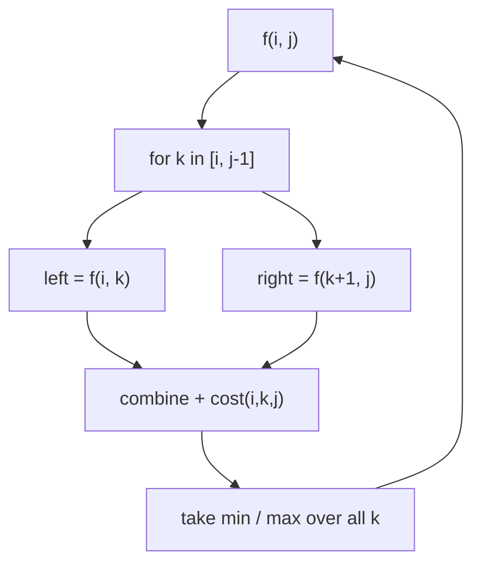

**Complexity:** O(n³) time (O(n²) states × O(n) partition), O(n²) space.

```cpp
// Template: interval / MCM partition DP (memoized)
int solve(int i, int j, vector<int>& arr, vector<vector<int>>& dp) {
    if (i == j) return 0;                    // single element -> no cost
    if (dp[i][j] != -1) return dp[i][j];
    int best = INT_MAX;
    for (int k = i; k < j; k++) {            // try every split
        int cost = solve(i, k, arr, dp) + solve(k + 1, j, arr, dp)
                 + arr[i-1] * arr[k] * arr[j];   // problem-specific cost
        best = min(best, cost);
    }
    return dp[i][j] = best;
}
```

---

### 9. DP on Squares

**Recognition signals:** Binary matrix (0/1), count/find largest **square (or rectangle) submatrix of all 1s**. Answer at a cell depends on its top, left, and top-left neighbours.

**Approach:** For squares: `dp[i][j]` = side of the largest all-1 square whose **bottom-right corner** is `(i,j)`. If `matrix[i][j]==1`: `dp[i][j] = 1 + min(dp[i-1][j], dp[i][j-1], dp[i-1][j-1])`. Sum of all `dp[i][j]` = count of all-1 squares; max = largest square. For maximal rectangle: reduce each row to a histogram and run "largest rectangle in histogram" per row.

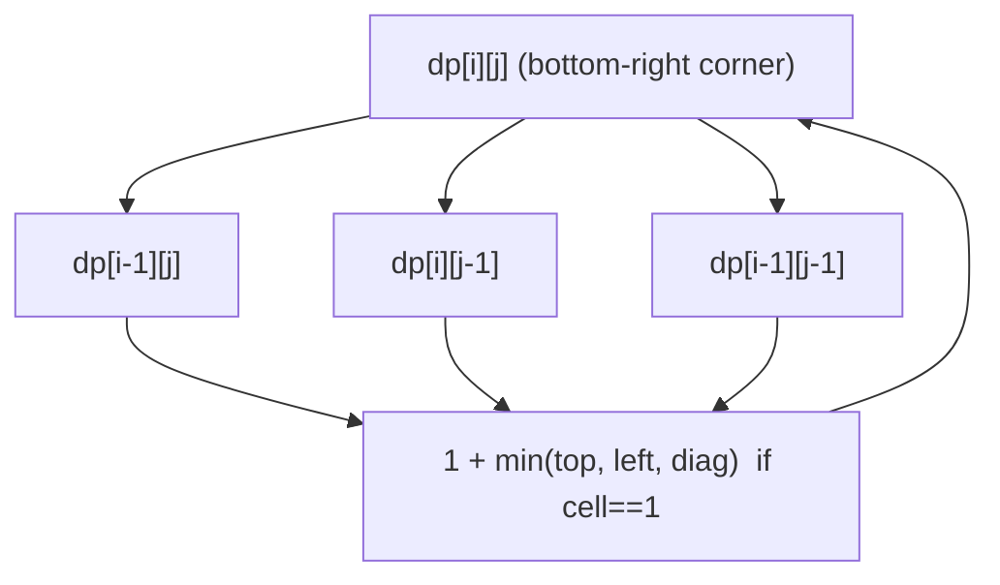

**Complexity:** Squares: O(n·m) time and space. Maximal rectangle (histogram): O(n·m) time with a stack.

```cpp
// Template: count all-1 square submatrices
int countSquares(vector<vector<int>>& mat) {
    int n = mat.size(), m = mat[0].size(), total = 0;
    vector<vector<int>> dp(n, vector<int>(m, 0));
    for (int i = 0; i < n; i++)
        for (int j = 0; j < m; j++) {
            if (mat[i][j] == 0) { dp[i][j] = 0; continue; }
            if (i == 0 || j == 0) dp[i][j] = 1;
            else dp[i][j] = 1 + min({dp[i-1][j], dp[i][j-1], dp[i-1][j-1]});
            total += dp[i][j];
        }
    return total;
}
```

---

## Complexity Summary

| Pattern | Time | Space | Notes |
|---|---|---|---|
| Introduction to DP | O(n) | O(1) opt | Fibonacci archetype; memo→tab→space-opt |
| 1D DP | O(n) or O(n·k) | O(1) opt | Depends on last 1–2 (or k) states |
| 2D/3D DP & Grids | O(r·c) / O(r·c²) | O(c) opt / O(r·c) | Combine top/left/diagonal cells |
| DP on Subsequences (Knapsack) | O(n·target) | O(target) opt | Take/not-take; OR/sum/min-max |
| DP on Strings (LCS/Edit) | O(n·m) | O(m) opt | 1-based indexing; match vs mismatch |
| DP on Stocks | O(n·K) | O(K) opt / O(1) | State = day, holding, txns left |
| DP on LIS | O(n²) or O(n log n) | O(n) | dp[i] ends at i; tails + binary search |
| MCM / Partition DP | O(n³) | O(n²) | Try every split point k on interval [i,j] |
| DP on Squares | O(n·m) | O(n·m) / O(m) | Corner recurrence min(top,left,diag)+1 |

---

## Interview Tips & Common Mistakes

- **Always start from recursion.** State the recurrence out loud, then add memo. Interviewers care about the derivation, not a memorized table.
- **Nail the state definition.** 90% of DP bugs are a wrong or incomplete state. Ask: "what parameters uniquely define a sub-problem?"
- **Base cases first.** Off-by-one and un-initialized base cases cause most wrong answers. For string DP, use 1-based indexing so the empty prefix is row/col 0.
- **Tabulation loop direction must follow dependencies.** If `dp[i]` needs `dp[i-1]`, loop increasing; if it needs future states (stocks going backward), loop decreasing.
- **0/1 vs unbounded knapsack "take" transition:** 0/1 moves to `i-1` after taking; unbounded stays on `i`. Mixing these up is the classic coin-change bug.
- **Space optimization is the last step, not the first.** Get a correct O(n·m) table, then compress. Don't optimize a broken solution.
- **Overflow:** counting DPs (count subsets, target sum, coin change 2, #LIS) can overflow `int` — use `long long` or take modulo when asked.
- **Distinguish subsequence vs substring/subarray.** Substring/subarray requires contiguity → the recurrence resets on mismatch (e.g. longest common substring resets to 0).
- **Partition DP:** the split index range and the "cost" term are the tricky parts; add sentinels (e.g. `1` before/after the balloons array) to avoid boundary special-cases.
- **Don't over-optimize prematurely in the interview** — a clear memoized solution that compiles beats a buggy space-optimized one.
