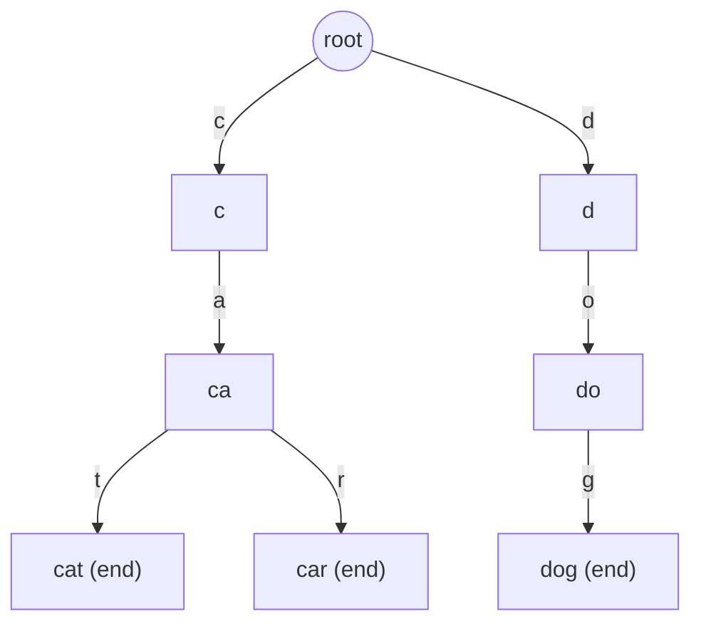
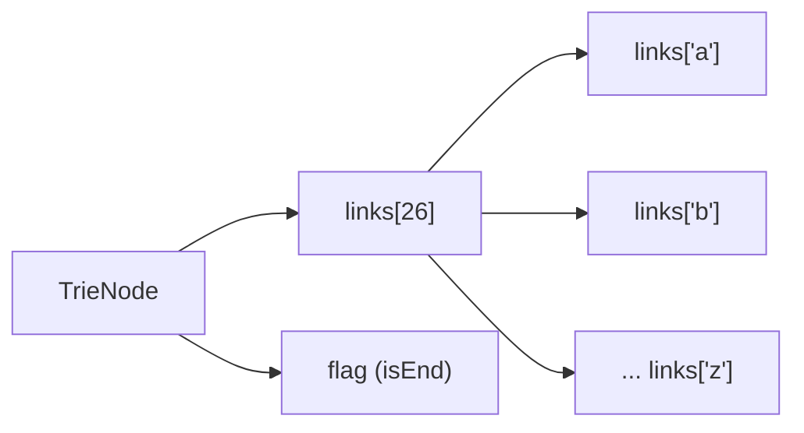
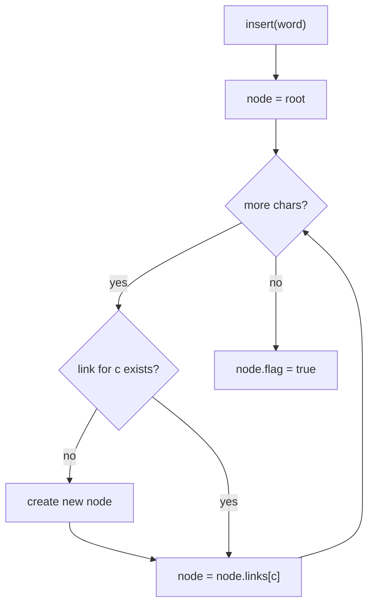
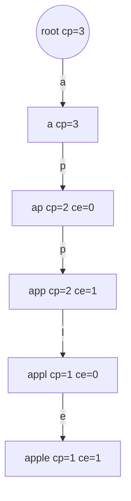
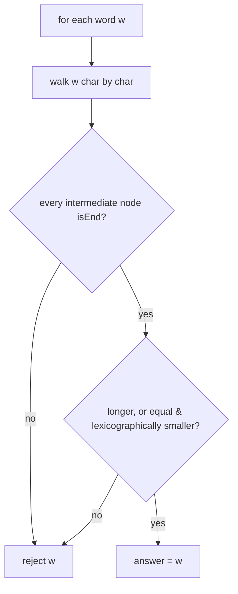
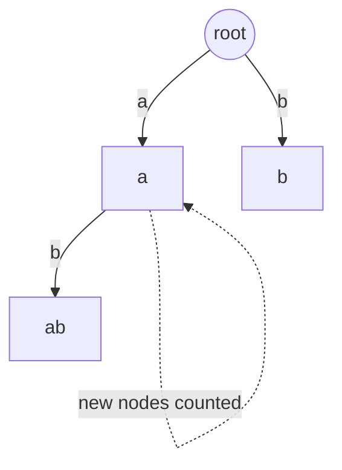
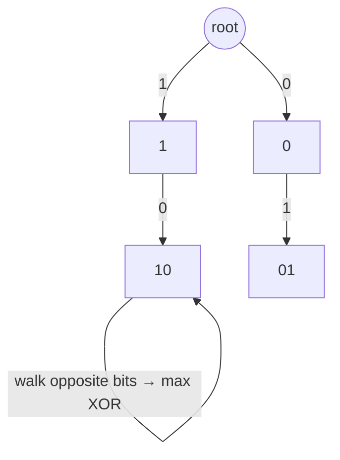

# Tries — Theory & Patterns

**Nav:** [Theory & Patterns](./theory-and-patterns.md) · [Problems](./problems.md) · [Resources](./resources.md)

**Stats:** 7 problems total — 🟢 Easy: 1 · 🟡 Medium: 2 · 🔴 Hard: 4 · Patterns (sub-steps): 2 (Theory, Problems)

---

## Overview & Why It Matters

A **Trie** (pronounced "try", from re**trie**val), also called a **prefix tree** or **digital tree**, is a rooted tree that stores a dynamic set of strings where **shared prefixes share nodes**. Instead of holding whole keys in a node, the *path* from the root to a node spells a prefix, and edges are labelled by characters.

Why it matters:

- **Prefix queries are its superpower.** Answering "does any stored word start with `app`?" is `O(prefix length)` regardless of how many words are stored — a hash set cannot do this.
- **Search / insert cost = length of the key**, independent of dictionary size `N`. That is why tries beat balanced BSTs (`O(L·log N)`) and hash maps for prefix work.
- **Interview frequency:** extremely common at FAANG. Direct problems (Implement Trie), applied ones (autocomplete, word search II, replace words, search suggestions), and the whole family of **bit-trie / XOR maximization** problems.

Where it appears in interviews:
- Autocomplete / typeahead, spell-check, IP routing (longest-prefix match), dictionaries.
- Word games (Boggle / Word Search II), streaming maximum-XOR, distinct substrings.

**Prerequisites:** recursion & tree traversal, dynamic memory / pointers in C++, arrays, and — for the XOR family — **bit manipulation** (shifts, masks, `^`, checking the i-th bit).

---

## Core Concepts

**Node structure.** Each trie node holds:
- `links[R]` — array (or map) of child pointers, one slot per alphabet symbol (`R = 26` for lowercase, `R = 2` for a bit-trie).
- `flag` (a.k.a. `isEnd`) — boolean marking that a word terminates here.
- Optionally `countEnd` (how many words end here) and `countPrefix` (how many words pass through), used for the "advanced" trie with `erase`, `countWordsEqualTo`, `countWordsStartingWith`.

**Vocabulary:**
- *Prefix* — any path starting from the root.
- *Terminal node* — a node with `flag = true`.
- *Branching factor* `R` — alphabet size.

**Invariants:**
1. The root represents the empty prefix and stores no character.
2. A word `w` is *present* iff walking its characters from the root never hits a null link **and** the final node has `flag = true`.
3. A prefix `p` *exists* iff walking `p` never hits a null link (the terminal flag is irrelevant).

### Trie storing {"cat", "car", "dog"}



### One node's anatomy



---

## Patterns

### 1. Theory — Trie Node Structure, Insert / Search / Prefix (String Trie)

**Recognition signals:**
- You need to store many strings and repeatedly answer: *is this exact word present?* / *does any word start with this prefix?*
- Autocomplete, dictionary, spell-check, or "words sharing prefixes".
- Naive answer would be `O(N·L)` scanning all words; a trie makes each query `O(L)`.

**Approach (step-by-step):**
1. Define a `Node` with `links[26]` and a boolean `flag`.
2. **Insert(word):** start at root; for each char `c`, if `links[c]` is null create a new node, then descend. After the last char, set `flag = true`.
3. **Search(word):** descend char by char; if any link is missing return `false`; at the end return the final node's `flag`.
4. **StartsWith(prefix):** identical to search but return `true` at the end regardless of `flag` (we only need the path to exist).



**Complexity:** Insert / Search / StartsWith = `O(L)` time (`L` = word length), because we touch one node per character. Space = `O(total chars · R)` in the worst case (each node keeps an `R`-slot array), or `O(total chars)` amortized with a hash-map of children.

**C++ template:**

```cpp
struct Node {
    Node* links[26] = {nullptr};
    bool flag = false;                    // marks end of a word

    bool containsKey(char ch)  { return links[ch - 'a'] != nullptr; }
    Node* get(char ch)         { return links[ch - 'a']; }
    void put(char ch, Node* n) { links[ch - 'a'] = n; }
    void setEnd()              { flag = true; }
    bool isEnd()               { return flag; }
};

class Trie {
    Node* root;
public:
    Trie() { root = new Node(); }

    void insert(const string& word) {
        Node* node = root;
        for (char ch : word) {
            if (!node->containsKey(ch)) node->put(ch, new Node());
            node = node->get(ch);
        }
        node->setEnd();
    }

    bool search(const string& word) {
        Node* node = root;
        for (char ch : word) {
            if (!node->containsKey(ch)) return false;
            node = node->get(ch);
        }
        return node->isEnd();
    }

    bool startsWith(const string& prefix) {
        Node* node = root;
        for (char ch : prefix) {
            if (!node->containsKey(ch)) return false;
            node = node->get(ch);
        }
        return true;                       // path exists — flag ignored
    }
};
```

---

### 2. Problems — Advanced Trie, Prefix Chains, Distinct Substrings & Bit-Trie XOR

This sub-step bundles the harder trie applications. They split into three sub-families; each is treated with its own diagram + template below.

#### 2a. Advanced Trie with counts (insert / countWordsEqualTo / countWordsStartingWith / erase)

**Recognition signals:** you must support **deletion** and **frequency** queries ("how many times was `w` inserted?", "how many words start with `p`?"). A plain boolean `flag` is not enough — you need counters.

**Approach:** each node stores `countPrefix` (words passing through) and `countEnd` (words ending here). Insert increments both along the path / at the end. `erase` decrements them, mirroring insert.



**Complexity:** every operation `O(L)`; space `O(total chars · R)`.

```cpp
struct Node {
    Node* links[26] = {nullptr};
    int countEnd = 0;      // words ending here
    int countPre = 0;      // words passing through
    bool contains(char c){ return links[c-'a']; }
    Node* get(char c){ return links[c-'a']; }
    void put(char c, Node* n){ links[c-'a'] = n; }
};
class AdvancedTrie {
    Node* root = new Node();
public:
    void insert(const string& w){
        Node* n = root;
        for(char c: w){ if(!n->contains(c)) n->put(c,new Node());
                        n=n->get(c); n->countPre++; }
        n->countEnd++;
    }
    int countWordsEqualTo(const string& w){
        Node* n=root;
        for(char c: w){ if(!n->contains(c)) return 0; n=n->get(c); }
        return n->countEnd;
    }
    int countWordsStartingWith(const string& p){
        Node* n=root;
        for(char c: p){ if(!n->contains(c)) return 0; n=n->get(c); }
        return n->countPre;
    }
    void erase(const string& w){                 // assumes w was inserted
        Node* n=root;
        for(char c: w){ n=n->get(c); n->countPre--; }
        n->countEnd--;
    }
};
```

#### 2b. Longest word where every prefix exists

**Recognition signals:** "longest word such that all its prefixes are also words in the list." Build the trie, then check each word char-by-char requiring `flag=true` at every step.



**Complexity:** build `O(sum of lengths)`, scan `O(sum of lengths)`; space `O(total chars·26)`.

```cpp
bool allPrefixesExist(Trie& t, const string& w){
    Node* n = t.rootNode();               // expose root via getter
    for(char c: w){
        n = n->get(c);
        if(!n || !n->isEnd()) return false; // each prefix must be a full word
    }
    return true;
}
```

#### 2c. Number of distinct substrings via trie

**Recognition signals:** count distinct substrings of a string `s`. Insert every suffix of `s`; each **new node created** corresponds to exactly one new distinct substring.



**Complexity:** `O(n^2)` (insert `n` suffixes, each up to length `n`); space `O(n^2)` nodes worst case. (A suffix automaton / suffix array does it in `O(n)`/`O(n log n)`, but the trie approach is the interview-friendly one here.)

```cpp
int countDistinctSubstrings(const string& s){
    Node* root = new Node();
    int cnt = 0;                          // count nodes = count distinct substrings
    for(int i=0;i<(int)s.size();++i){
        Node* n = root;
        for(int j=i;j<(int)s.size();++j){
            char c=s[j];
            if(!n->containsKey(c)){ n->put(c,new Node()); cnt++; }
            n=n->get(c);
        }
    }
    return cnt;                           // +1 if empty substring is counted
}
```

#### 2d. Bit-Trie for XOR (prerequisite bits, Max XOR of two numbers, Max XOR with query constraint)

**Recognition signals:** "maximize `a ^ b`", "maximum XOR of a pair", "maximum XOR of `x` with any array element `≤ m`". Convert each number to its **fixed-width binary** (usually 31/32 bits, MSB first) and store it in a trie with **branching factor 2** (child `0` and child `1`).

**Greedy insight:** to maximize XOR, at each bit from the MSB down, we *prefer the opposite bit* (`1 - current bit`). If that child exists, take it (this bit contributes `1` to the result); otherwise take the same-bit child. MSBs dominate, so greedy is optimal.

For the **query-with-constraint** variant (`Max XOR with an element ≤ m`), sort queries by `m` **offline**, insert array elements only while they are `≤ m`, then answer each query on the current trie.



**Complexity:** each insert / query = `O(B)` where `B` = number of bits (≈32); total `O(n·B)`. Space `O(n·B)`.

```cpp
struct BitNode { BitNode* nxt[2] = {nullptr,nullptr}; };

class XorTrie {
    BitNode* root = new BitNode();
    static const int B = 31;              // bits, MSB..0  (use 32 for full unsigned)
public:
    void insert(int num){
        BitNode* n = root;
        for(int i=B;i>=0;--i){
            int b = (num >> i) & 1;
            if(!n->nxt[b]) n->nxt[b] = new BitNode();
            n = n->nxt[b];
        }
    }
    int getMax(int num){                  // max (num ^ y) over inserted y
        BitNode* n = root; int res = 0;
        for(int i=B;i>=0;--i){
            int b = (num >> i) & 1;
            if(n->nxt[1-b]){ res |= (1<<i); n = n->nxt[1-b]; } // take opposite bit
            else            n = n->nxt[b];
        }
        return res;
    }
};
```

---

## Complexity Summary

| Pattern | Time | Space | Notes |
|---|---|---|---|
| String Trie insert/search/startsWith | `O(L)` per op | `O(ΣL · R)` | `L`=word len, `R`=alphabet (26) |
| Advanced Trie (counts + erase) | `O(L)` per op | `O(ΣL · R)` | `countEnd` & `countPre` counters |
| Longest word all prefixes | `O(ΣL)` build+scan | `O(ΣL · 26)` | every prefix must be `isEnd` |
| Distinct substrings (trie) | `O(n²)` | `O(n²)` | count nodes created; suffix automaton is `O(n)` |
| Bit-Trie XOR (pair / query) | `O(n·B)` | `O(n·B)` | `B≈31/32` bits; greedy opposite-bit; offline sort for constraints |

---

## Interview Tips & Common Mistakes

- **Fix the alphabet & bit-width first.** For strings decide `R` (26 vs 128 vs a map). For bit-tries fix `B` (31 for `int` up to ~2·10⁹, 32 for unsigned) — an off-by-one here silently breaks XOR answers.
- **`startsWith` must NOT check `isEnd`.** A common bug is returning `node->isEnd()` for prefix queries. Prefix existence only needs the path.
- **Bit order matters: always go MSB → LSB.** Higher bits dominate the XOR value, so the greedy only works top-down.
- **Deletion needs counters, not just flag flips.** With shared prefixes you cannot free nodes blindly; decrement `countPre`/`countEnd` (and only free when both hit zero if you reclaim memory).
- **Empty string / empty trie edge cases.** `search("")` returns the root's `flag`; querying an empty XOR trie should be handled (return 0 or skip).
- **Memory.** Array-of-26 nodes are fast but heavy; use a `unordered_map<char,Node*>` for sparse/large alphabets. For bit-tries, `nxt[2]` is tiny and fast — prefer it.
- **Offline trick for constrained XOR.** Sort queries and array by the limit `m`; insert incrementally. Don't rebuild the trie per query.
- **Prefer iterative walks** over recursion for insert/search to avoid stack overhead and keep the `O(L)` obvious.
