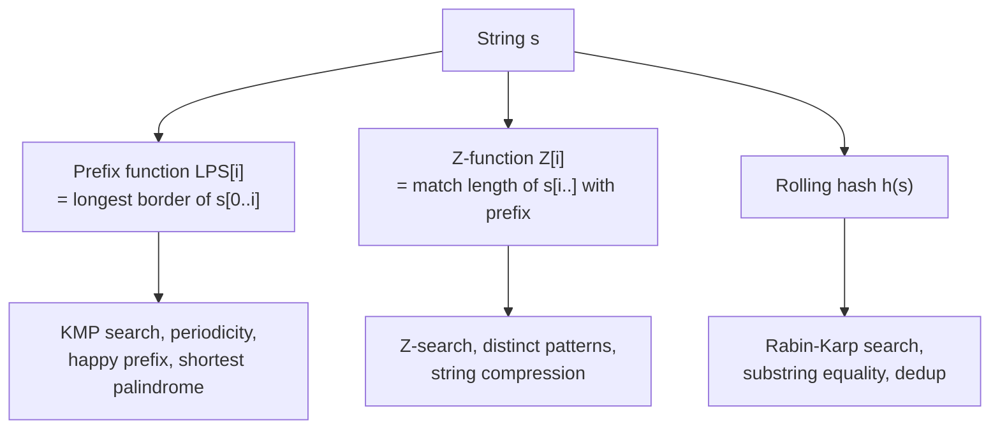
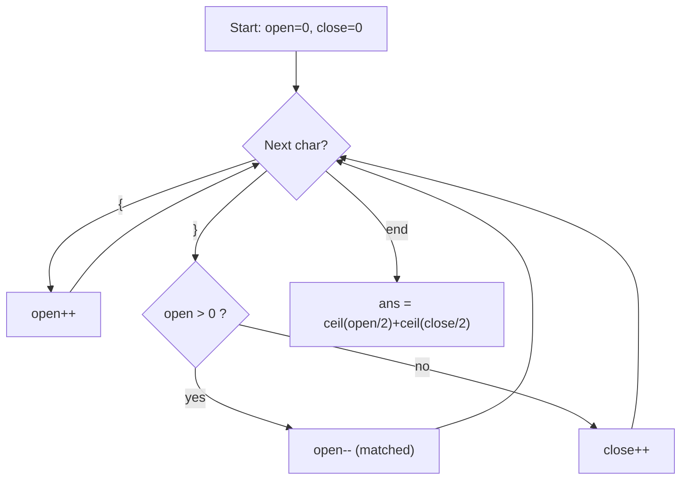
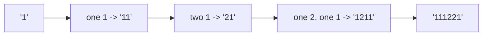
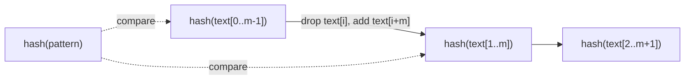
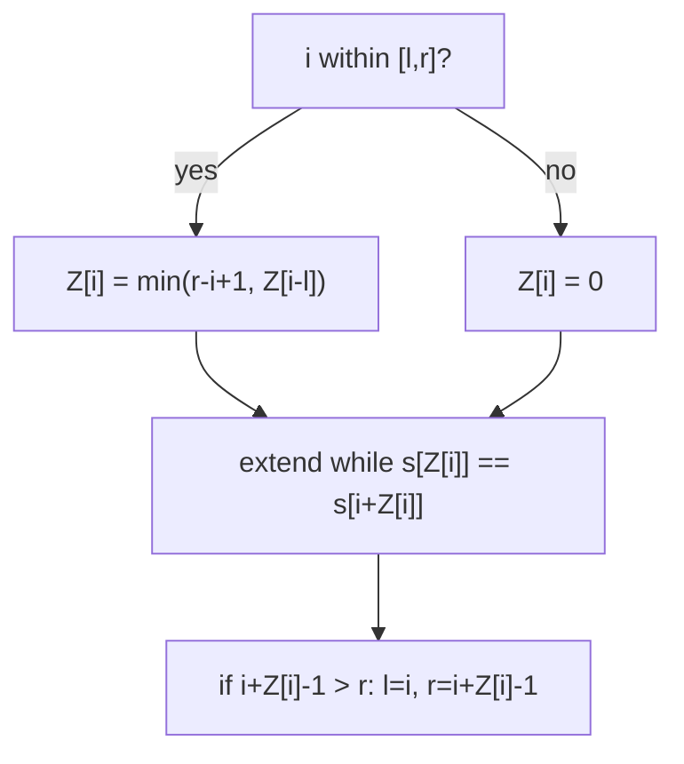
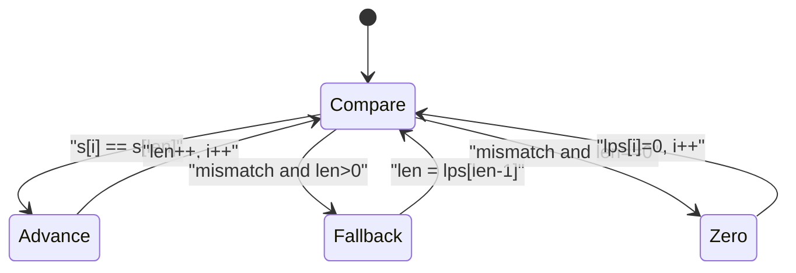
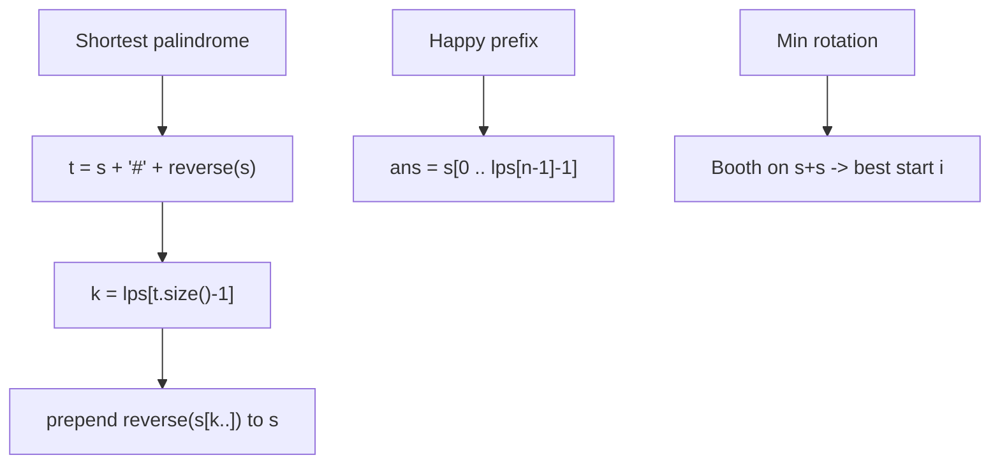
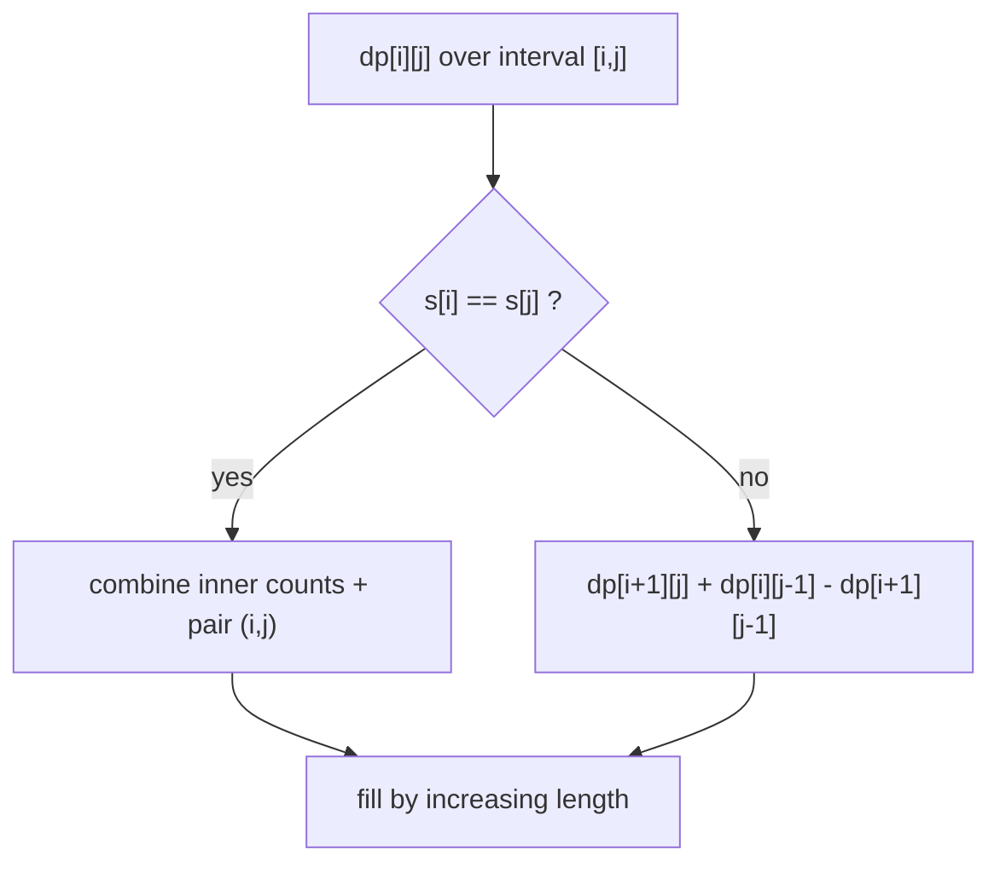

# Strings [Advanced] — Theory & Patterns

**Nav:** [Theory & Patterns](./theory-and-patterns.md) · [Problems](./problems.md) · [Resources](./resources.md)

**Stats:** Total problems: **9** · 🟢 Easy: **1** · 🟡 Medium: **1** · 🔴 Hard: **7**

> This is Step 18 of Striver's A2Z sheet — the "Hard Problems" bucket on strings. Despite being a single sub-step in the data, it packs the four foundational advanced-string techniques asked in interviews and competitive programming: **KMP / LPS (prefix function)**, the **Z-function**, **Rabin–Karp (rolling hash)**, and prefix-function applications (**longest happy prefix, shortest palindrome, minimum rotation**), plus two stack/simulation classics (**bracket reversals, count-and-say**) and a DP counting problem (**count palindromic subsequences**).

---

## Overview & Why It Matters

Advanced string algorithms answer one deceptively simple question fast: **"where and how often does one string appear inside another?"** The naïve substring search is `O(n·m)`. The techniques here bring that down to **linear `O(n + m)`** by *preprocessing* the pattern to never re-examine characters unnecessarily.

Where it shows up:

- **Interviews:** `implement strStr()`, `shortest palindrome`, `longest happy prefix`, `repeated substring pattern`, `count-and-say`, valid-parentheses variants. FAANG loves KMP/Z as a "do you know the linear trick" filter.
- **Competitive programming:** pattern matching, periodicity, hashing-based deduplication, string equality under rotation, suffix/prefix structure.
- **Real systems:** `grep`/`ripgrep`, plagiarism detection, DNA sequence alignment, log scanning, deduplication.

**Prerequisites:** comfort with arrays and indexing, modular arithmetic (for hashing), basic recursion/DP, and stacks. You should already know the brute-force substring search and *why* it is quadratic before appreciating why these are linear.

---

## Core Concepts

The unifying idea across KMP, Z, and Booth's rotation algorithm is the **border / prefix-that-is-also-a-suffix**.

- **Proper prefix:** a prefix that is not the whole string.
- **Proper suffix:** a suffix that is not the whole string.
- **Border:** a string that is both a proper prefix and a proper suffix of `s`. The *longest* border of every prefix is the heart of KMP.
- **LPS[i] / π[i] (prefix function):** length of the longest proper prefix of `s[0..i]` that is also a suffix of `s[0..i]`.
- **Z[i]:** length of the longest substring starting at `i` that matches a prefix of `s`.
- **Rolling hash:** treat a string as a base-`b` number modulo a large prime so a window's hash updates in `O(1)`.

Two equivalent lenses on the same information:



**Key invariants to keep in your head:**

- `LPS[0] = 0` and `Z[0]` is undefined/`n` by convention.
- `0 ≤ LPS[i] ≤ i`.
- A string `s` of length `n` has period `p = n − LPS[n−1]`; it is fully periodic iff `n % p == 0`.
- The prefix function of `pattern + separator + text` locates all matches; the Z-function of the same concatenation does too.

Example of both arrays on `s = "aabaab"`:

| i | 0 | 1 | 2 | 3 | 4 | 5 |
|---|---|---|---|---|---|---|
| s | a | a | b | a | a | b |
| LPS | 0 | 1 | 0 | 1 | 2 | 3 |
| Z | – | 1 | 0 | 3 | 1 | 0 |

`LPS[5] = 3` ⇒ period `= 6 − 3 = 3` ⇒ `"aab"` repeated twice. ✔

---

## Patterns

Below, each `###` block is a reusable *technique* drawn from the "Hard Problems" sub-step. Every block has recognition signals, a step-by-step approach, a Mermaid diagram, complexity with justification, and a correct C++ template.

### Pattern A — Balanced Brackets by Counting / Stack

**Recognition signals:** "make the expression balanced", "minimum insertions/reversals", "valid parentheses". You only care about *counts of unmatched open/close*, not positions.

**Approach (minimum reversals to balance `{}`):**
1. If length is odd → impossible (return `-1`).
2. Scan left→right. Keep a stack (or two counters) of unmatched `{` (`open`) and unmatched `}` (`close`).
3. On `}`: if there is an unmatched `{`, pop it (they match); else it is an unmatched close → increment `close`.
4. On `{`: increment `open`.
5. Answer `= ceil(open/2) + ceil(close/2)`.



**Complexity:** Time `O(n)` single pass; Space `O(1)` with counters (or `O(n)` with a stack).

```cpp
// Minimum reversals to balance a bracket string of '{' and '}'
int minReversals(string s) {
    int n = s.size();
    if (n % 2 != 0) return -1;               // odd length can never balance
    int open = 0, close = 0;                 // unmatched '{' and '}'
    for (char c : s) {
        if (c == '{') open++;
        else {                               // c == '}'
            if (open > 0) open--;            // matches a pending '{'
            else close++;                    // unmatched '}'
        }
    }
    // each pair of unmatched same-type needs (count+1)/2 reversals
    return (open + 1) / 2 + (close + 1) / 2;
}
// For LeetCode 921 (min add to make valid): answer = open + close (no reversals).
```

### Pattern B — Run-Length Simulation ("Count and Say")

**Recognition signals:** describe the previous term aloud, group consecutive equal characters, iterative sequence generation.

**Approach:**
1. Start with `"1"`.
2. To generate term `i` from term `i−1`: walk the string, count runs of identical digits, and emit `count` followed by the `digit`.
3. Repeat `n−1` times.



**Complexity:** Time roughly `O(L)` where `L` is total generated length (grows ~1.3^n, Conway's constant); Space `O(L)`.

```cpp
string countAndSay(int n) {
    string res = "1";
    for (int t = 1; t < n; t++) {
        string next;
        int i = 0, m = res.size();
        while (i < m) {
            int j = i;
            while (j < m && res[j] == res[i]) j++;   // run of equal chars
            next += to_string(j - i);                // count
            next += res[i];                          // the digit
            i = j;
        }
        res = move(next);
    }
    return res;
}
```

### Pattern C — String Hashing / Rabin–Karp (Rolling Hash)

**Recognition signals:** "find pattern in text", "compare many substrings", "detect duplicate substrings", need `O(1)` substring equality checks.

**Approach:**
1. Choose base `b` (e.g. 31 or 131) and a large prime modulus `M` (e.g. `1e9+7`).
2. Compute hash of the pattern of length `m`.
3. Compute hash of the first window of the text; slide the window updating the hash in `O(1)`: remove the leading char's contribution, multiply by base, add the new char.
4. On a hash match, verify character-by-character (guards against collisions). Use double hashing to make collisions astronomically unlikely.



**Complexity:** Average/expected Time `O(n + m)`; worst case `O(n·m)` if every window collides (mitigated by good modulus). Space `O(1)` (plus optional prefix-hash array `O(n)`).

```cpp
// Rabin-Karp: return all start indices where pattern occurs in text.
vector<int> rabinKarp(const string& text, const string& pat) {
    const long long b = 31, M = 1e9 + 9;
    int n = text.size(), m = pat.size();
    vector<int> res;
    if (m == 0 || m > n) return res;

    long long pHash = 0, wHash = 0, power = 1;
    for (int i = 0; i < m; i++) {
        pHash = (pHash * b + (pat[i] - 'a' + 1)) % M;
        wHash = (wHash * b + (text[i] - 'a' + 1)) % M;
        if (i) power = (power * b) % M;          // b^(m-1)
    }
    for (int i = 0; i + m <= n; i++) {
        if (pHash == wHash && text.compare(i, m, pat) == 0)
            res.push_back(i);                    // verify to kill collisions
        if (i + m < n) {                         // roll the window
            wHash = (wHash - (text[i]-'a'+1) * power % M + M) % M;
            wHash = (wHash * b + (text[i+m]-'a'+1)) % M;
        }
    }
    return res;
}
```

### Pattern D — Z-Function (Z-Array Pattern Matching)

**Recognition signals:** "longest match with prefix", "count occurrences", "distinct substrings via prefix matches", want a simple linear matcher without the KMP failure-jump logic.

**Approach:**
1. `Z[i]` = length of longest substring starting at `i` equal to a prefix of `s`.
2. Maintain a `[l, r]` window — the rightmost segment `s[l..r]` known to match a prefix.
3. If `i ≤ r`, initialize `Z[i] = min(r − i + 1, Z[i − l])` (reuse earlier computation).
4. Extend `Z[i]` by naive comparison past `r`; update `[l, r]` if it stretches further right.
5. For matching: build Z of `pattern + '#' + text`; any `Z[i] == m` marks an occurrence.



**Complexity:** Time `O(n)` (each character extends `r` at most once, amortized linear); Space `O(n)` for the Z-array.

```cpp
vector<int> zFunction(const string& s) {
    int n = s.size();
    vector<int> z(n, 0);
    z[0] = n;                                  // convention
    int l = 0, r = 0;
    for (int i = 1; i < n; i++) {
        if (i < r) z[i] = min(r - i, z[i - l]);
        while (i + z[i] < n && s[z[i]] == s[i + z[i]]) z[i]++;
        if (i + z[i] > r) { l = i; r = i + z[i]; }
    }
    return z;
}
// Search pat in txt: build z of (pat + '#' + txt); z[i]==pat.size() => match.
```

### Pattern E — KMP / LPS (Prefix Function & Search)

**Recognition signals:** "search substring in O(n)", "avoid re-scanning", "find period", "does string A repeat to form B". The workhorse of Step 18.

**Approach — build LPS:**
1. `lps[0] = 0`. Keep `len` = length of current longest border.
2. For each `i`: while `len > 0` and `s[i] != s[len]`, fall back `len = lps[len-1]`.
3. If they match, `len++`. Set `lps[i] = len`.

**Approach — KMP search:** run the same fallback on the text; when `len == m` a full match ends at the current index, then set `len = lps[len-1]` to continue.



**Complexity:** Building LPS `O(n)`; search `O(n + m)`; Space `O(m)` for the LPS array. Linear because `len` increases at most `n` times total, so total decreases (fallbacks) are also bounded by `n`.

```cpp
vector<int> buildLPS(const string& p) {
    int m = p.size();
    vector<int> lps(m, 0);
    int len = 0;
    for (int i = 1; i < m; i++) {
        while (len > 0 && p[i] != p[len]) len = lps[len - 1];
        if (p[i] == p[len]) len++;
        lps[i] = len;
    }
    return lps;
}

int strStr(const string& txt, const string& pat) {   // first index or -1
    if (pat.empty()) return 0;
    vector<int> lps = buildLPS(pat);
    int i = 0, j = 0, n = txt.size(), m = pat.size();
    while (i < n) {
        if (txt[i] == pat[j]) { i++; j++; if (j == m) return i - m; }
        else if (j > 0) j = lps[j - 1];
        else i++;
    }
    return -1;
}
```

### Pattern F — Prefix-Function Applications (Happy Prefix, Shortest Palindrome, Min Rotation)

**Recognition signals:** "longest prefix that is also a suffix" (happy prefix = `lps[n-1]`), "make palindrome by prepending" (shortest palindrome), "smallest rotation" (Booth's algorithm = KMP failure on `s+s`).

**Approach:**
- **Longest happy prefix:** `answer = s.substr(0, lps[n-1])`. Directly the longest non-trivial border.
- **Shortest palindrome:** build `t = s + '#' + reverse(s)`, compute LPS; `lps[t.size()-1]` = longest palindromic prefix of `s`; prepend `reverse(s.substr(that))`.
- **Minimum rotation (Booth):** run a modified failure function over `s + s` to find the start index of the lexicographically least rotation in `O(n)`.



**Complexity:** All `O(n)` time; happy prefix / palindrome `O(n)` space; Booth `O(n)` time, `O(1)` extra beyond a failure array.

```cpp
// Shortest palindrome (LeetCode 214) via KMP.
string shortestPalindrome(string s) {
    string rev(s.rbegin(), s.rend());
    string t = s + "#" + rev;
    vector<int> lps = buildLPS(t);
    int k = lps.back();                        // longest palindromic prefix len
    return rev.substr(0, (int)s.size() - k) + s;
}

// Longest happy prefix (LeetCode 1392).
string longestPrefix(string s) {
    vector<int> lps = buildLPS(s);
    return s.substr(0, lps.back());
}

// Booth's algorithm: index of least lexicographic rotation.
int leastRotation(const string& s) {
    string t = s + s;
    int n = t.size();
    vector<int> f(n, -1);
    int k = 0;                                 // candidate start
    for (int j = 1; j < n; j++) {
        char sj = t[j];
        int i = f[j - k - 1];
        while (i != -1 && sj != t[k + i + 1]) {
            if (sj < t[k + i + 1]) k = j - i - 1;
            i = f[i];
        }
        if (sj != t[k + i + 1]) {
            if (sj < t[k]) k = j;
            f[j - k] = -1;
        } else {
            f[j - k] = i + 1;
        }
    }
    return k;                                   // s.substr(k) + s.substr(0,k)
}
```

### Pattern G — Counting Palindromic Subsequences (DP)

**Recognition signals:** "count subsequences that are palindromes", small alphabet, `n` up to a few thousand → interval DP or count-by-ends DP.

**Approach (count palindromic *subsequences* of a given length / all lengths):**
1. Use interval DP `dp[i][j]` = number of palindromic subsequences in `s[i..j]`.
2. Transition: `dp[i][j] = dp[i+1][j] + dp[i][j-1] − dp[i+1][j-1]`; if `s[i]==s[j]` add `dp[i+1][j-1] + 1`, else subtract the overlap.
3. LeetCode 730 (count *distinct* palindromic subsequences) adds inner-boundary handling for duplicate end characters, all under a modulus.



**Complexity:** Time `O(n^2)` states each `O(1)` (or `O(n)` for distinct-with-dedup variant → `O(n^2)`); Space `O(n^2)`.

```cpp
// Count palindromic subsequences (all, with overlap formula, mod 1e9+7).
int countPalindromicSubseq(const string& s) {
    const long long MOD = 1e9 + 7;
    int n = s.size();
    vector<vector<long long>> dp(n, vector<long long>(n, 0));
    for (int i = 0; i < n; i++) dp[i][i] = 1;          // single char
    for (int len = 2; len <= n; len++) {
        for (int i = 0, j = len - 1; j < n; i++, j++) {
            if (s[i] == s[j])
                dp[i][j] = (dp[i+1][j] + dp[i][j-1] + 1) % MOD;
            else
                dp[i][j] = ((dp[i+1][j] + dp[i][j-1] - dp[i+1][j-1]) % MOD + MOD) % MOD;
        }
    }
    return (int)dp[0][n-1];
}
```

---

## Complexity Summary

| Pattern | Time | Space | Notes |
|---|---|---|---|
| A. Bracket balance / stack | `O(n)` | `O(1)`–`O(n)` | Odd length ⇒ impossible; count unmatched, `ceil` pairs |
| B. Count-and-say (RLE) | `O(L)` | `O(L)` | `L` grows ~1.3^n (Conway's constant) |
| C. Rabin–Karp (rolling hash) | `O(n+m)` avg, `O(n·m)` worst | `O(1)`/`O(n)` | Verify on hash match; use double hashing |
| D. Z-function | `O(n)` | `O(n)` | `[l,r]` window reuse; `Z[i]==m` ⇒ match |
| E. KMP / LPS | `O(n+m)` | `O(m)` | Failure links; period `= n − lps[n−1]` |
| F. Prefix-fn applications | `O(n)` | `O(n)`/`O(1)` | Happy prefix, shortest palindrome, Booth rotation |
| G. Count palindromic subseq (DP) | `O(n²)` | `O(n²)` | Interval DP; inclusion–exclusion |

---

## Interview Tips & Common Mistakes

- **LPS vs Z confusion.** LPS[i] is a *border length ending at i*; Z[i] is a *match length starting at i*. Both are linear; pick whichever the interviewer knows. For shortest-palindrome/happy-prefix, LPS is cleaner.
- **Off-by-one in LPS fallback.** Always fall back with `len = lps[len-1]` (not `lps[len]`) and loop with `while`, not `if`.
- **Hash collisions.** Never trust a hash match alone — verify the substring, or use two independent moduli. Interviewers *will* ask "what if two different strings hash the same?".
- **Rolling-hash negatives.** After subtracting the leading char, add `+M` before taking `%` to avoid negative values in C++.
- **Separator choice.** In `pat + '#' + txt` (KMP/Z), the separator must not appear in either string, else you get false full-length matches.
- **Odd-length bracket strings.** Return `-1` immediately for reversal problems; forgetting this is a classic bug.
- **Period vs repetition.** A string repeats iff `n % (n − lps[n-1]) == 0` **and** `lps[n-1] > 0`. Don't forget the divisibility check.
- **DP overlap sign.** In palindromic-subsequence DP, remember inclusion–exclusion (`− dp[i+1][j-1]`) and add `MOD` before `%` to stay non-negative.
- **Empty pattern edge case.** `strStr("", "")`/empty pattern conventionally returns `0`; state your assumption.
- **Booth vs naive rotation.** Concatenate `s+s` and use a linear failure function; the naïve compare-all-rotations is `O(n²)` and will TLE on large inputs.
