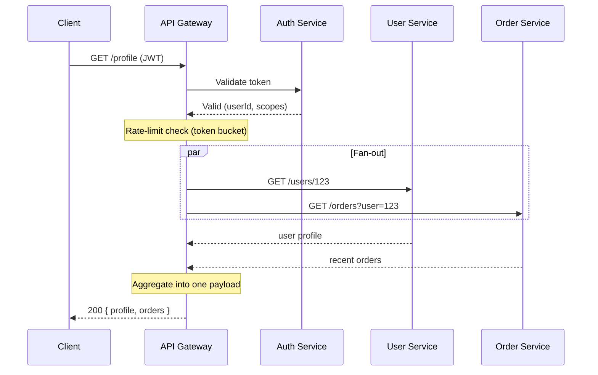
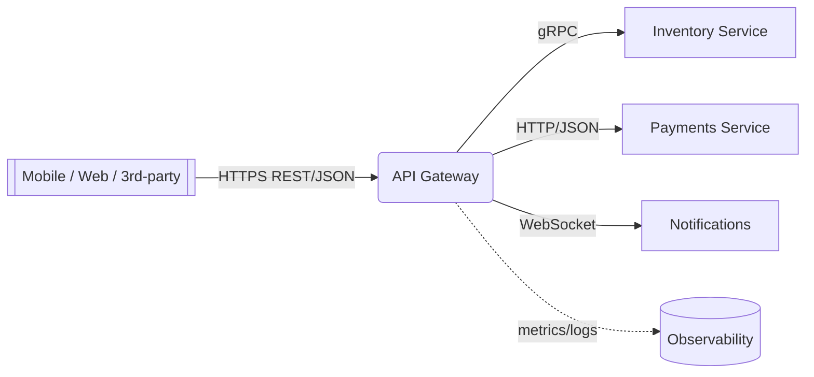

# API Gateway

> Difficulty: 🟢 Easy

## TL;DR

An API Gateway is a single entry point that sits in front of your backend services and handles cross-cutting concerns—routing, authentication, rate limiting, request aggregation, and protocol translation—so individual services don't have to. It decouples clients from the internal service topology and centralizes edge policy, at the cost of being a potential bottleneck and single point of failure if not designed carefully.

## Overview

In a microservices architecture, a client (mobile app, browser, third-party integrator) would otherwise need to know the address of every service, handle auth against each one, and stitch together responses from multiple calls. That leaks internal structure to clients, duplicates concerns like TLS and auth across services, and creates chatty, high-latency communication—especially painful over mobile networks.

An **API Gateway** solves this by providing one façade in front of many services. Clients talk to the gateway; the gateway routes to the right backend, enforces security and quotas, and can compose several backend calls into one client response. It is the practical implementation of the *Gateway* and *Backend-for-Frontend (BFF)* patterns, and it lets backend teams evolve, split, or relocate services without breaking clients.

Why it matters for interviews: the gateway is where many system-design "edge concerns" converge (security, observability, resilience, versioning). Being able to reason about *what belongs at the gateway vs. in the services* and *how to keep the gateway from becoming a bottleneck* signals maturity.

## Key Concepts

- **API Gateway**: A reverse-proxy-based server that is the single entry point for API traffic and enforces cross-cutting policy.
- **Routing**: Mapping an inbound request (by path, host, header, or method) to a specific upstream service.
- **Authentication (AuthN) / Authorization (AuthZ)**: Verifying *who* the caller is (e.g., validating a JWT or API key) and *what* they may do (scopes/roles).
- **Rate limiting / throttling**: Capping request volume per client/API/route to protect backends and enforce fair use (e.g., token bucket, fixed/sliding window).
- **Request aggregation (fan-out/fan-in)**: One client request triggers multiple backend calls that the gateway composes into a single response.
- **Protocol translation**: Bridging protocols/formats at the edge (e.g., external REST/JSON ↔ internal gRPC/Protobuf, or HTTP ↔ WebSocket).
- **Backend-for-Frontend (BFF)**: A dedicated gateway per client type (web, iOS, Android) tailored to that client's needs.
- **Circuit breaking / retries / timeouts**: Resilience controls the gateway applies to upstream calls.
- **Load balancer / reverse proxy**: Lower-level building blocks the gateway builds upon (see comparison below).

## How It Works

A request enters the gateway and flows through an ordered chain of filters/middleware before being proxied upstream, and the response flows back through a return chain. A typical pipeline: TLS termination → routing match → authentication → authorization → rate limiting → transformation/aggregation → upstream call → response transformation → logging/metrics.

The gateway also handles protocol translation: it can accept external REST/JSON from a browser and call an internal gRPC service, translating the request and response on the fly.

## Types / Patterns / Strategies

| Pattern | What it is | When it fits |
|---|---|---|
| **Single/edge gateway** | One gateway for all clients and APIs | Small-to-mid systems; simple ops |
| **Backend-for-Frontend (BFF)** | One gateway per client type (web/iOS/Android) | Divergent client needs; avoids "one-size-fits-none" payloads |
| **Micro-gateway / sidecar** | Lightweight gateway per service or in service mesh data plane | Fine-grained, decentralized policy; mesh (e.g., Envoy sidecars) |
| **Managed gateway** | Cloud-provided (AWS API Gateway, Apigee) | Fast time-to-market, offload ops |
| **Self-hosted gateway** | Kong, NGINX, Envoy, Spring Cloud Gateway | Control, custom plugins, cost at scale |

Rate-limiting strategies worth naming: **token bucket** (allows bursts), **leaky bucket** (smooths output), **fixed window** (simple, boundary spikes), and **sliding window** (accurate, more state).

## When to Use / When to Avoid

**Use it when:**
- You have multiple services and multiple client types needing a unified entry point.
- You want to centralize auth, TLS, rate limiting, and observability instead of duplicating them.
- Clients are chatty/latency-sensitive (mobile) and benefit from aggregation.
- You need to hide internal topology, version APIs, or translate protocols at the edge.

**Avoid or minimize when:**
- You have a single service or monolith—an ordinary reverse proxy/load balancer is enough.
- The gateway would accumulate business logic (it should stay policy/edge-focused, not become a "distributed monolith" hub).
- Ultra-low-latency internal service-to-service calls—prefer direct calls or a service mesh rather than routing everything through a central gateway.

## Trade-offs

| Pros | Cons |
|---|---|
| Single entry point; hides internal topology | Potential single point of failure (must be HA) |
| Centralizes auth, rate limiting, TLS, logging | Can become a performance bottleneck |
| Reduces client chattiness via aggregation | Extra network hop adds latency |
| Enables protocol translation & API versioning | Risk of becoming a bloated "god object" with business logic |
| Decouples clients from backend changes | Operational complexity; another component to scale/patch |

## Real-World Examples

- **Kong** and **NGINX** / **NGINX Plus** — popular self-hosted gateways/reverse proxies.
- **Envoy** — high-performance proxy powering gateways and the **Istio** service mesh data plane.
- **AWS API Gateway**, **Google Apigee**, **Azure API Management** — managed cloud gateways.
- **Spring Cloud Gateway** and **Netflix Zuul** — JVM-ecosystem gateways (Netflix historically used Zuul at the edge, later Zuul 2/Envoy-style approaches).
- **Tyk** and **KrakenD** — open-source gateways; KrakenD specializes in aggregation.

## Common Pitfalls

- **Making it a single point of failure**: running one instance instead of a horizontally scaled, health-checked cluster behind a load balancer.
- **Stuffing business logic into the gateway**: it should handle edge policy, not domain rules—otherwise it becomes a deployment bottleneck.
- **Inconsistent rate-limit state**: per-instance counters let clients exceed limits; use a shared store (e.g., Redis) for distributed limiting.
- **Doing auth twice or not at all**: failing to define trust boundaries—services should still not blindly trust traffic ("zero trust").
- **Ignoring timeouts/circuit breakers**: a slow upstream during aggregation can cascade and exhaust gateway threads/connections.
- **Chatty aggregation**: fanning out sequentially instead of in parallel, adding latency.

## Interview Questions & Answers

**Q:** What's the difference between an API Gateway, a load balancer, and a reverse proxy?
**A:** All three sit in front of servers, but at different layers of concern. A **reverse proxy** forwards client requests to backend servers and can do TLS termination, caching, and basic path routing (e.g., NGINX). A **load balancer** distributes traffic across multiple instances of a service for scalability and availability, operating at L4 (TCP) or L7 (HTTP). An **API Gateway** is an application-aware, API-specific reverse proxy that adds cross-cutting API concerns: authentication/authorization, rate limiting, request aggregation, protocol translation, and API versioning. In practice a gateway *is* a specialized reverse proxy and often uses a load balancer to spread traffic across upstream instances.

**Q:** How do you prevent the API Gateway from being a single point of failure?
**A:** Run multiple stateless gateway instances behind a load balancer (or DNS/anycast), spread across availability zones. Keep the gateway stateless—store shared state (rate-limit counters, sessions) in an external store like Redis. Add health checks, autoscaling, timeouts, retries, and circuit breakers. For managed gateways the provider handles most HA; for self-hosted you own it.

**Q:** Where should rate limiting live, and how do you enforce it across many gateway instances?
**A:** Rate limiting belongs at the gateway so backends are protected before load hits them. With multiple instances, per-instance in-memory counters undercount, so use a centralized/shared counter (e.g., Redis with atomic INCR + TTL, or a token-bucket implementation). Choose an algorithm by need: token bucket for burst tolerance, sliding window for accuracy. Return `429 Too Many Requests` with `Retry-After`. You can layer local limits (fast path) plus global limits (accurate) for scale.

**Q:** What is request aggregation and when is it worth it?
**A:** Aggregation is when one client request triggers multiple backend calls that the gateway composes into a single response (fan-out/fan-in). It reduces round trips for chatty clients—huge on high-latency mobile networks. It's worth it when a screen needs data from several services. Do the fan-out in parallel, set per-call timeouts, and handle partial failures gracefully (return what you have). Caveat: heavy aggregation can turn the gateway into a coupling point—consider a BFF per client instead.

**Q:** Should authentication happen only at the gateway?
**A:** The gateway is the right place for the *first* line of AuthN/AuthZ (validate JWT/API key, check scopes) so unauthenticated traffic never reaches services. But under a zero-trust model, services shouldn't blindly trust internal traffic; they should still validate identity (e.g., re-verify a signed token or use mTLS in a mesh). A common pattern: gateway validates the external token and forwards a signed internal token/claims that services verify cheaply.

**Q:** What is protocol translation at the gateway and give an example?
**A:** It's converting between the protocol/format the client speaks and what the backend speaks. Example: a browser sends REST/JSON over HTTP/1.1; the gateway translates it to a **gRPC** call over HTTP/2 to an internal service and translates the Protobuf response back to JSON. Other examples: HTTP ↔ WebSocket, or exposing GraphQL externally while calling REST internally. This lets internal teams use efficient protocols without exposing them to clients.

**Q:** What is a Backend-for-Frontend (BFF) and why use it over one gateway?
**A:** A BFF is a dedicated gateway per client experience (web, iOS, Android). Different clients need different payload shapes and aggregation; a single gateway forces compromise. BFFs let each client team own its edge layer and optimize responses (fewer fields for mobile, richer for web). Trade-off: more gateways to run and some duplicated logic, so use BFFs when client needs genuinely diverge.

**Q:** How do you keep the gateway from becoming a performance bottleneck?
**A:** Keep it stateless and horizontally scalable; do CPU-heavy work (auth crypto, transformation) efficiently and cache validation results (e.g., JWKS keys, token introspection). Use connection pooling and HTTP/2 to upstreams, parallelize aggregation, set aggressive timeouts and circuit breakers, and offload caching for idempotent GETs. Monitor p99 latency and saturation, and avoid putting heavy business logic in the gateway.

## Further Reading

- Sam Newman, *Building Microservices* (2nd ed.) — API gateways, BFF pattern, and edge concerns.
- Chris Richardson, *Microservices Patterns* — "API Gateway" and "Backend for Frontend" patterns (also microservices.io).
- microservices.io — [API Gateway pattern](https://microservices.io/patterns/apigateway.html).
- NGINX Blog — "Deploying NGINX as an API Gateway" series.
- Netflix Technology Blog — Zuul / edge gateway posts on routing and resilience at scale.
- Envoy Proxy documentation — architecture of a modern L7 proxy/gateway.
