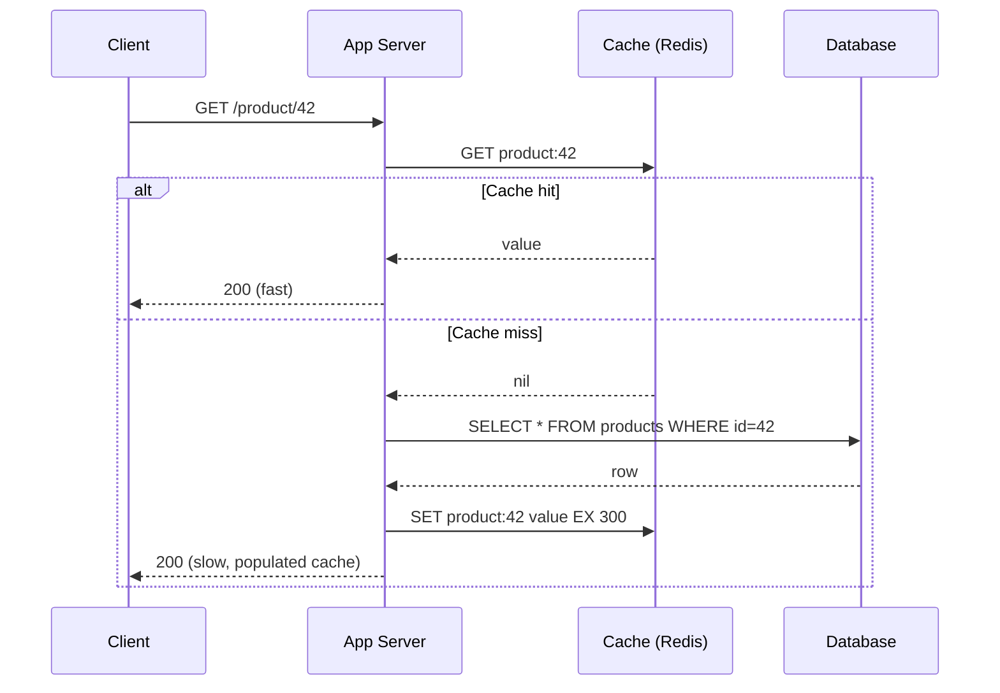
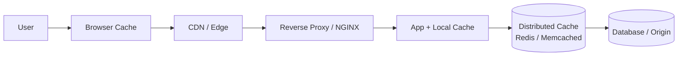

# Caching

> Difficulty: 🟢 Easy

## TL;DR

Caching stores copies of data in a fast, nearby layer so that repeated reads (and sometimes writes) avoid slow, expensive origins like databases or remote services. The hard parts are not the lookup — they're the write strategy, eviction policy, and keeping cached data acceptably fresh. Master cache-aside vs. write-through/write-back/write-around, LRU/LFU/TTL eviction, cache stampede protection, and consistency trade-offs and you can reason about most caching interview questions.

## Overview

Every layer of a system has a speed/cost gradient: CPU registers are faster than RAM, RAM is faster than SSD, local disk is faster than the network, and a colocated cache is faster than a cross-region database. Caching exploits **temporal locality** (recently accessed data is likely to be accessed again) and **spatial locality** to serve hot data from the fast layer.

The problems caching solves:

- **Latency** — a Redis GET is sub-millisecond; a complex SQL join or a downstream API call can be tens to hundreds of milliseconds.
- **Load / cost** — offloading reads from the primary datastore lets it scale further and cheaper. A 90% cache hit rate means the database sees only 10% of read traffic.
- **Throughput** — in-memory stores handle millions of ops/sec per node.

The cost of caching is **complexity and staleness**: there are now two copies of the truth, and Phil Karlton's famous line applies — "There are only two hard things in Computer Science: cache invalidation and naming things." Everything below is about managing that second copy responsibly.

## Key Concepts

- **Cache hit / miss** — whether the requested key was found in the cache. **Hit ratio** = hits / (hits + misses) is the primary health metric.
- **Cache layer / tier** — where the cache lives: client/browser, CDN/edge, reverse proxy, application-local (in-process), or a distributed cache (Redis/Memcached).
- **Origin / source of truth** — the authoritative store the cache fronts (database, object store, upstream service).
- **TTL (Time To Live)** — how long an entry is considered valid before it expires.
- **Eviction policy** — which entry to remove when the cache is full (LRU, LFU, FIFO, random, TTL-based).
- **Write policy** — how writes propagate to cache and origin (write-through, write-back, write-around).
- **Cache-aside (lazy loading)** — the application reads/writes the cache and origin explicitly; the cache does not talk to the origin itself.
- **Read-through / write-through** — the cache library or service itself loads from / persists to the origin transparently.
- **Cache stampede (dogpile / thundering herd)** — many concurrent requests miss the same expired/hot key at once and all hit the origin simultaneously.
- **Staleness** — the window during which cached data differs from the origin.
- **Invalidation** — actively removing or updating a cache entry when the underlying data changes.
- **Hot key** — a single key with disproportionately high traffic, which can overload one shard.

## How It Works

A read-heavy service checks the cache first. On a hit, it returns immediately. On a miss, it fetches from the origin, populates the cache with a TTL, and returns. The diagram below shows the classic **cache-aside** read path plus the stampede risk on expiry.

Cache layers stack: a request may be served from the browser cache, then a CDN edge node, then a reverse proxy, then an in-process cache, before finally reaching the distributed cache and the database. Each layer that answers earlier saves everything downstream.

## Types / Patterns / Strategies

**Write & population patterns**

| Pattern | How it works | Read path | Write path | Trade-off |
|---|---|---|---|---|
| **Cache-aside (lazy loading)** | App manages cache explicitly; loads on miss | App checks cache → DB on miss → populate | App writes DB, then invalidates/updates cache | Only caches what's read; risk of stale entries; most common |
| **Read-through** | Cache library loads from origin on miss | App asks cache; cache fetches DB itself | (paired with write-through/around) | Cleaner app code; couples cache to origin |
| **Write-through** | Write goes to cache and origin synchronously | Data always present after write | Write cache + DB together, then ack | Strong freshness, higher write latency |
| **Write-back (write-behind)** | Write to cache, flush to origin asynchronously | Fast reads | Ack after cache write; async batch to DB | Lowest write latency; risk of data loss on crash |
| **Write-around** | Write goes straight to origin, bypassing cache | Cache populated only on later read | Write DB only; cache filled lazily | Avoids polluting cache with write-once data; first read is a miss |

**Eviction policies**

| Policy | Evicts | Best for | Notes |
|---|---|---|---|
| **LRU** (Least Recently Used) | The entry unused for the longest time | General-purpose; strong temporal locality | Redis `allkeys-lru`; approximated with sampling |
| **LFU** (Least Frequently Used) | The entry with the fewest accesses | Skewed popularity, stable hot set | Redis 4.0+ `allkeys-lfu`; resists one-off scans polluting cache |
| **FIFO** | Oldest inserted entry | Simple, order-based needs | Ignores access frequency |
| **TTL / expiry** | Entries past their time limit | Data with a natural freshness window | Not really an eviction under memory pressure; a staleness bound |
| **Random** | A random entry | Very cheap, surprisingly OK at scale | Memcached uses variants; low overhead |

TTL and an eviction policy are complementary: TTL bounds *staleness*, eviction bounds *memory*.

**Cache stampede mitigations**

- **Locking / request coalescing (single-flight)** — only one request recomputes a missing key; others wait for the result.
- **Probabilistic early expiration** — recompute a value slightly before its TTL with increasing probability, spreading refreshes over time.
- **Stale-while-revalidate** — serve the stale value and refresh in the background.
- **TTL jitter** — add randomness to TTLs so keys don't all expire in the same instant.

## When to Use / When to Avoid

**Use caching when:**

- Read-heavy workloads with a high read/write ratio.
- Data is expensive to compute or fetch (joins, aggregations, remote calls).
- There is skew — a small hot set serves most traffic.
- Some staleness is acceptable (feeds, catalogs, config, session data).

**Avoid or be cautious when:**

- Data must be strictly consistent and correct on every read (bank balances at the point of a transaction, inventory decrements) — cache carefully or not at all on the critical path.
- Write-heavy or rarely-reread data — the cache churns without paying off (consider write-around).
- Very large values with poor reuse — they waste memory and lower overall hit ratio.
- The added complexity of invalidation outweighs the latency saved (premature caching).

## Trade-offs

| Pros | Cons |
|---|---|
| Dramatically lower read latency (sub-ms hits) | Adds a second copy → staleness and invalidation complexity |
| Offloads and protects the origin datastore | Cache stampede / thundering herd risk on hot-key expiry |
| Improves throughput and reduces cost | Extra operational surface (memory, evictions, failover) |
| Smooths traffic spikes | Cold cache after restart → latency spike + origin load |
| Enables scaling reads horizontally | Hot keys can overload a single shard |
| Cheap memory vs. scaling the database | Consistency reasoning across layers is hard to get right |

## Real-World Examples

- **Redis** — the de facto distributed cache/data-structure store; supports LRU/LFU eviction, TTLs, and `SETNX`-based locks for stampede control.
- **Memcached** — simple, multithreaded, slab-allocated key/value cache; used heavily at **Facebook/Meta** (see their scaling paper).
- **CDNs — Cloudflare, Amazon CloudFront, Akamai, Fastly** — cache static and cacheable dynamic content at the edge; support `stale-while-revalidate` and cache-control headers.
- **NGINX / Varnish** — reverse-proxy caches for HTTP responses.
- **Netflix EVCache** — a Memcached-based, replicated caching tier layered over the AWS footprint.
- **DynamoDB Accelerator (DAX)** — a read-through/write-through in-memory cache in front of DynamoDB.
- **Application frameworks** — Guava/Caffeine (in-process, Java), Ehcache, Spring Cache; browsers and HTTP itself (`Cache-Control`, `ETag`, `Last-Modified`).

## Common Pitfalls

- **No TTL / no eviction policy** — memory fills, and the cache starts rejecting writes or the OS starts swapping.
- **Caching then forgetting to invalidate** — writes update the DB but not the cache, serving stale data indefinitely.
- **Synchronized expirations** — many keys share one TTL and expire together, causing a stampede; fix with jitter.
- **Ignoring stampede on hot keys** — a single popular key expiring can send thousands of concurrent requests to the DB. Use single-flight or stale-while-revalidate.
- **Read-modify-write races** — concurrent updates leave a stale value in cache; prefer *invalidate on write* over *update on write* when in doubt.
- **Cold-start thundering herd** — a fresh/restarted cache node with 0% hit ratio hammers the origin. Warm caches or ramp traffic gradually.
- **Caching per-user data with a global key** — leaks data across users; scope keys correctly.
- **Treating the cache as durable** — write-back without persistence loses recent writes on crash.
- **Unbounded key cardinality** — caching by highly unique keys (e.g., full query strings) yields near-zero hit ratio.

## Interview Questions & Answers

**Q: What's the difference between cache-aside and read-through?**
**A:** In *cache-aside*, the application is responsible for the logic: it checks the cache, and on a miss it reads the origin and populates the cache itself. The cache is a dumb key/value store. In *read-through*, the cache sits inline and loads from the origin transparently on a miss, so the app only ever talks to the cache. Cache-aside is more flexible and the most common pattern; read-through centralizes loading logic but couples the cache to the data source. Cache-aside also gracefully degrades if the cache is down (you just hit the DB), whereas read-through hides that path.

**Q: Compare write-through, write-back, and write-around.**
**A:** *Write-through* writes to cache and origin synchronously — reads are always fresh, but writes are slower. *Write-back* (write-behind) writes to cache and acknowledges immediately, flushing to the origin asynchronously — fastest writes and great for write-heavy bursts, but you risk data loss if the cache node dies before flushing. *Write-around* writes straight to the origin and skips the cache — good for data that's written but rarely re-read, since it avoids polluting the cache; the downside is the first read after a write is always a miss. Choice depends on read/write ratio and durability needs.

**Q: How do you keep a cache consistent with the database?**
**A:** True strong consistency across a cache and a DB is expensive; most systems settle for *eventual consistency* with a bounded staleness window. Practical approaches: (1) *invalidate on write* — delete the key after committing the DB write so the next read repopulates fresh data (safer than updating the cache, which can race); (2) *write-through* for stronger freshness on the critical path; (3) short TTLs to bound staleness; (4) change-data-capture (e.g., reading the DB binlog) to invalidate keys reliably. The classic race is: reader loads old value, writer updates DB and deletes key, reader writes the stale value back — mitigated with techniques like delayed double-delete or versioning. I'd pick the weakest consistency the product can tolerate.

**Q: What is a cache stampede and how do you prevent it?**
**A:** A stampede (dogpile / thundering herd) happens when a popular key expires or is missing and many concurrent requests all miss simultaneously, so they all hit the origin at once — potentially overwhelming it. Mitigations: *single-flight / request coalescing* so only one request recomputes while others wait; *stale-while-revalidate* to serve the old value while refreshing asynchronously; *probabilistic early recomputation* (XFetch) so one request refreshes just before expiry; and *TTL jitter* so keys don't expire in lockstep. For cold starts, warm the cache or ramp traffic.

**Q: LRU vs. LFU — when would you choose each?**
**A:** *LRU* evicts the least recently used entry; it's the sensible default and adapts quickly to changing hot sets, but a large one-time scan can flush the useful working set. *LFU* evicts the least frequently used entry; it's better when popularity is stable and skewed (a fixed set of hot items) and it resists scan pollution, but it can cling to items that were popular in the past ("cache pollution by aging"), which modern LFU counters with decay. Redis offers both (`allkeys-lru`, `allkeys-lfu`) and uses sampling to approximate them cheaply.

**Q: A single key gets 100k requests/sec and overloads one Redis shard. What do you do?**
**A:** That's a *hot-key* problem. Options: (1) add a small *local/in-process cache* in front of Redis (near cache) so most reads never leave the app server; (2) *replicate* the key across multiple shards/replicas and read from a random one to spread load; (3) append a random suffix to create N copies of the key and read one at random; (4) use *client-side caching* (Redis 6 tracking); (5) if it's write-hot, consider whether the value even needs to be that consistent. The general principle is to move traffic to a wider fan-out or a closer, cheaper layer.

**Q: How do you decide what TTL to set?**
**A:** TTL is a staleness/hit-ratio dial. Longer TTL → higher hit ratio and less origin load, but more stale data; shorter TTL → fresher data but more misses and origin traffic. I'd base it on how tolerant the feature is to staleness (a product catalog can be minutes; a stock ticker seconds), the write frequency, and whether I also invalidate on write. I'd add jitter to avoid synchronized expiry and, for critical data, combine a modest TTL with explicit invalidation so I get freshness without a huge miss rate.

**Q: What happens when the cache goes down, and how do you design for it?**
**A:** If the app degrades to hitting the origin directly (cache-aside), a cache outage causes a sudden load spike on the DB that can cascade into a full outage. Design for it with: request coalescing and rate limiting toward the origin, circuit breakers, a warm standby / replicated cache (e.g., EVCache-style), graceful degradation (serve stale or reduced functionality), and capacity planning so the DB can survive a partial cache loss. Never assume the cache is always available on the critical path.

## Further Reading

- **"Designing Data-Intensive Applications"** — Martin Kleppmann (chapters on storage, replication, and consistency).
- **"Scaling Memcache at Facebook"** — Nishtala et al., NSDI 2013 (canonical paper on large-scale caching, leases, and stampede control).
- **AWS Caching Best Practices** and the **Amazon ElastiCache / DynamoDB DAX** developer guides.
- **Redis documentation** — eviction policies (`maxmemory-policy`), client-side caching, and key expiration internals.
- **"Optimal Probabilistic Cache Stampede Prevention"** — Vattani, Chierichetti, Lowenstein (the XFetch early-recomputation technique).

---

## 🛠️ Open-Source Tools & Projects (Used in Production)

| Project | GitHub | What it does / Why it's used |
|---|---|---|
| **Redis** | [redis/redis](https://github.com/redis/redis) | The de facto in-memory data-structure store and cache (~68k★). Rich types, TTLs, LRU/LFU eviction, client-side caching, cluster/Sentinel. Used almost everywhere (Twitter, GitHub, Stack Overflow, Snap). |
| **Valkey** | [valkey-io/valkey](https://github.com/valkey-io/valkey) | Linux Foundation fork of Redis 7.2 after the license change (~19k★). Drop-in compatible; adopted by AWS ElastiCache, Google Cloud, and others wanting a fully-OSS Redis. |
| **Memcached** | [memcached/memcached](https://github.com/memcached/memcached) | Classic multithreaded, slab-allocated key/value cache (~14k★). Simple and extremely fast; famously scaled by Facebook/Meta and used by Pinterest, Wikipedia. |
| **Dragonfly** | [dragonflydb/dragonfly](https://github.com/dragonflydb/dragonfly) | Modern Redis/Memcached-compatible in-memory store (~28k★). Multi-threaded shared-nothing design targeting far higher throughput per node on multi-core boxes. |
| **KeyDB** | [Snapchat/KeyDB](https://github.com/Snapchat/KeyDB) | Multithreaded fork of Redis (~11k★) with active replication; maintained by Snap for higher single-node throughput while staying Redis-compatible. |
| **Caffeine** | [ben-manes/caffeine](https://github.com/ben-manes/caffeine) | High-performance in-process Java caching library (~16k★) with a near-optimal W-TinyLFU eviction policy. The successor to Guava Cache; used widely across the JVM ecosystem. |
| **Ehcache** | [ehcache/ehcache3](https://github.com/ehcache/ehcache3) | Mature, full-featured Java (JSR-107) cache with tiered on-heap/off-heap/disk storage and distributed clustering. Long-standing default in many Java/Spring stacks. |
| **Varnish Cache** | [varnishcache/varnish-cache](https://github.com/varnishcache/varnish-cache) | HTTP reverse-proxy / accelerator (~4k★). Caches web responses with the powerful VCL config language; runs in front of huge news and media sites. |
| **Netflix EVCache** | [Netflix/EVCache](https://github.com/Netflix/EVCache) | Memcached-based, replicated, multi-AZ caching tier built and open-sourced by Netflix for low-latency reads across AWS regions. |
| **Twemproxy (nutcracker)** | [twitter/twemproxy](https://github.com/twitter/twemproxy) | Fast, lightweight proxy for Memcached/Redis (~12k★) by Twitter. Enables sharding and connection pooling to scale a cache tier horizontally. |

## 📖 Blogs, Articles & Learning Resources

- [Redis documentation — Eviction & key expiration](https://redis.io/docs/latest/develop/reference/eviction/) — How `maxmemory-policy`, LRU/LFU sampling, and TTL expiration actually work internally.
- [Redis — Client-side caching](https://redis.io/docs/latest/develop/reference/client-side-caching/) — The tracking/invalidation protocol for near caches, directly relevant to hot-key and latency problems.
- [Scaling Memcache at Facebook (NSDI '13, PDF)](https://www.usenix.org/system/files/conference/nsdi13/nsdi13-final170_update.pdf) — The canonical large-scale caching paper: leases, memcache clusters, regional pools, and stampede control.
- [MIT 6.824 — Scaling Memcache reading notes / FAQ](https://pdos.csail.mit.edu/6.824/papers/memcache-faq.txt) — Course-quality companion that clarifies the tricky consistency and staleness points of the Facebook paper.
- [Cloudflare — Rethinking Cache Purge: fast & scalable global invalidation](https://blog.cloudflare.com/part1-coreless-purge/) — Real engineering-blog deep dive into distributed cache invalidation at edge scale.
- [AWS — Caching Best Practices](https://aws.amazon.com/caching/best-practices/) — Vendor-neutral overview of cache-aside, write-through/back/around, TTL, and layering with ElastiCache/DAX examples.
- [AWS Database Blog — Caching patterns with ElastiCache](https://aws.amazon.com/blogs/database/caching-patterns/) — Concrete lazy-loading vs. write-through walkthroughs with pros/cons and code.
- ["Optimal Probabilistic Cache Stampede Prevention" (Vattani et al., VLDB, PDF)](https://cseweb.ucsd.edu/~avattani/papers/cache_stampede.pdf) — The foundational XFetch paper on probabilistic early recomputation to avoid dogpiles.
- [Caffeine Wiki — Efficiency & W-TinyLFU](https://github.com/ben-manes/caffeine/wiki/Efficiency) — Why modern in-process caches beat plain LRU, with hit-ratio benchmarks across policies.
- [MDN — HTTP caching](https://developer.mozilla.org/en-US/docs/Web/HTTP/Caching) — Authoritative reference for `Cache-Control`, `ETag`, `Last-Modified`, and `stale-while-revalidate` at the HTTP layer.
- ["Designing Data-Intensive Applications" — Martin Kleppmann](https://dataintensive.net/) — Storage, replication, and consistency chapters give the theory behind cache/DB freshness trade-offs.
- [MIT 6.824 lecture (video) on caching / Memcache](https://www.youtube.com/watch?v=6uc8Vz_-3ic) — A recorded distributed-systems lecture walking through the Facebook memcache design and its consistency choices.

## 🗺️ Learning Plan — Google & Learn (Step by Step)

1. **Why caches exist — the latency/cost hierarchy and locality.** Search: `` `why caching improves performance latency cost hierarchy` ``
2. **Cache hit ratio, miss, and the fundamental metrics.** Search: `` `cache hit ratio how to calculate why it matters` ``
3. **Cache layers/tiers: browser → CDN → reverse proxy → app-local → distributed.** Search: `` `caching layers CDN application distributed cache explained` ``
4. **Cache-aside vs. read-through — who owns the load-on-miss logic.** Search: `` `cache aside vs read through pattern difference` ``
5. **Write strategies: write-through, write-back, write-around.** Search: `` `write through vs write back vs write around cache` ``
6. **Eviction policies: LRU, LFU, FIFO, random, and TTL.** Search: `` `LRU vs LFU cache eviction policy when to use` ``
7. **TTL design and staleness/freshness trade-offs.** Search: `` `how to choose cache TTL staleness tradeoff` ``
8. **Cache invalidation — invalidate-on-write, double-delete, CDC.** Search: `` `cache invalidation strategies database consistency` ``
9. **Cache stampede / thundering herd and mitigations.** Search: `` `cache stampede dogpile prevention single flight stale while revalidate` ``
10. **Hot keys and how to spread load (near cache, replication, key splitting).** Search: `` `redis hot key problem solutions` ``
11. **HTTP & CDN caching: Cache-Control, ETag, stale-while-revalidate.** Search: `` `HTTP cache control etag stale-while-revalidate explained` ``
12. **Study the canonical scale story: Scaling Memcache at Facebook.** Search: `` `scaling memcache at facebook paper summary leases` ``
13. **Hands-on: run Redis locally and implement a cache-aside layer.** Search: `` `redis docker run cache aside example tutorial` ``
14. **Hands-on: reproduce and fix a cache stampede with single-flight + TTL jitter.** Search: `` `implement single flight cache stampede protection code` ``
15. **Hands-on: benchmark eviction policies (LRU vs W-TinyLFU) with Caffeine.** Search: `` `caffeine cache hit ratio benchmark W-TinyLFU` ``

**✅ You'll know you understand this when:** you can (1) pick the right write + eviction strategy for a given read/write ratio and staleness budget and justify it; (2) explain and code a fix for a cache stampede and a hot-key problem; and (3) reason clearly about the cache↔database consistency window and how invalidation bounds it.
