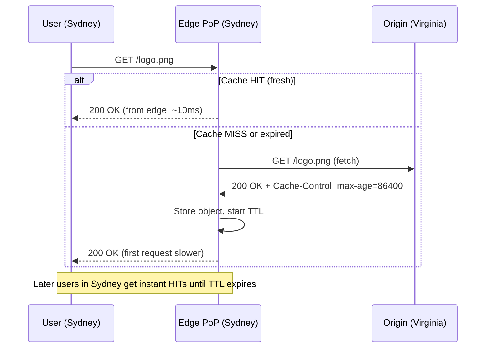
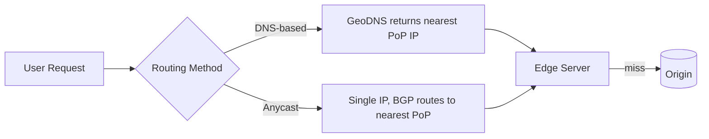

# CDN (Content Delivery Network)

> Difficulty: 🟢 Easy

## TL;DR

A CDN is a geographically distributed network of caching servers that sits between your users and your origin infrastructure, serving content from a Point of Presence (PoP) physically close to each user. It slashes latency, offloads traffic from your origin, and absorbs traffic spikes and DDoS attacks. The core mental model: cache what you can at the edge, keep it fresh with TTLs and invalidation, and only fall back to origin on a miss.

## Overview

The speed of light is a hard limit. A user in Sydney requesting an image from a server in Virginia pays an unavoidable round-trip penalty (~200ms+) plus TCP/TLS handshake overhead — before a single byte of content arrives. Repeat that for every asset on a page and the experience feels sluggish.

A **CDN** solves this by replicating (caching) your content across hundreds of edge locations worldwide. When a user requests a file, they connect to the nearest edge server instead of your distant origin. This delivers three big wins:

1. **Lower latency** — content served from a nearby PoP, with warm TCP/TLS connections and often HTTP/2/3.
2. **Origin offload** — the origin only handles cache misses, so you serve millions of users with modest backend capacity.
3. **Resilience & security** — the CDN absorbs traffic surges (flash sales, viral events), provides DDoS mitigation, WAF, and TLS termination at the edge.

CDNs are one of the highest-leverage, lowest-effort optimizations in system design — which is exactly why interviewers reach for them early in "design a scalable X" questions.

## Key Concepts

- **Origin server** — the authoritative source of truth for your content (your app servers, an S3 bucket, an object store). The CDN pulls from here on a miss.
- **Edge server / edge node** — a caching server in a PoP that stores copies of content close to users.
- **PoP (Point of Presence)** — a physical data-center location housing many edge servers, peered with local ISPs. Big CDNs have hundreds of PoPs across the globe.
- **Cache hit / miss** — a *hit* is served from the edge; a *miss* forces a fetch from origin (or an upstream cache tier).
- **Cache hit ratio** — the fraction of requests served from cache. Higher = better offload and lower latency. A key CDN health metric.
- **TTL (Time To Live)** — how long an edge may serve a cached object before revalidating with origin. Controlled by `Cache-Control: max-age` / `s-maxage` or `Expires` headers.
- **Cache invalidation / purge** — explicitly telling the CDN to drop a cached object before its TTL expires.
- **Cache key** — the identifier used to look up a cached object (usually URL + selected headers/query params).
- **Pull vs Push CDN** — pull = lazy fetch on first request; push = you proactively upload content to the CDN.
- **Static vs Dynamic content** — static is identical for all users (images, CSS, JS); dynamic is generated per-request/per-user.
- **Anycast** — a routing technique where one IP maps to many PoPs; BGP routes each user to the nearest one.
- **Stale-while-revalidate** — serve stale content instantly while asynchronously refreshing it in the background.

## How It Works

On a request, the user is routed (via DNS or Anycast) to the nearest PoP. The edge checks its cache: on a **hit**, it returns the object immediately; on a **miss**, it fetches from origin (possibly through a regional mid-tier cache to further shield the origin), stores the object per its TTL, then serves it. Subsequent nearby users get hits until the TTL expires or the object is purged.

The routing layer that gets a user to the right PoP typically uses one of:

## Types / Patterns / Strategies

| Dimension | Options | Notes |
|-----------|---------|-------|
| **Provisioning** | Pull vs Push | Pull is default & low-effort; Push suits large/rarely-changing assets |
| **Content** | Static vs Dynamic | Static caches trivially; dynamic needs edge compute or micro-caching |
| **Routing** | DNS-based vs Anycast | Anycast reacts faster to failures; DNS is simpler but bound by TTL |
| **Cache tiers** | Single-tier vs Multi-tier (edge + shield/mid-tier) | Shield PoPs raise hit ratio and cut origin load |
| **Freshness** | TTL expiry, purge/invalidation, versioned URLs | Versioned URLs (`app.abc123.js`) sidestep invalidation entirely |

**Pull CDN:** The edge fetches from origin on the first miss and caches it. You do nothing but set correct headers. Best for sites with lots of assets and unpredictable access patterns. Downside: the first user per PoP eats the miss latency ("cold cache").

**Push CDN:** You upload/replicate content to the CDN ahead of time (e.g., via API or storage sync). Best for large files (video, software downloads) or infrequently changing content where you want guaranteed availability and control over what's stored. Downside: you manage the content lifecycle and storage.

**Static content:** Images, CSS, JS, fonts, video segments — same bytes for everyone, ideal for long TTLs and high hit ratios.

**Dynamic content:** Personalized/API responses. Techniques: **micro-caching** (cache for 1–5s to absorb spikes), **Edge-Side Includes (ESI)**, **edge compute** (Cloudflare Workers, Lambda@Edge), and caching by cache key that includes relevant headers/cookies. Truly personalized responses often bypass the cache but still benefit from the CDN's optimized network path (persistent origin connections, TLS at edge).

## When to Use / When to Avoid

**Use a CDN when:**
- You serve static assets (images, JS/CSS, fonts, downloads) to a geographically distributed audience.
- You stream video or serve large files at scale.
- You need to offload origin traffic, absorb spikes, or add DDoS/WAF protection at the edge.
- You want TLS termination and modern protocols (HTTP/2, HTTP/3, QUIC) close to users.

**Be cautious / avoid when:**
- Content is highly personalized and uncacheable, *and* users are colocated with the origin — the extra hop adds little (though edge TLS/routing can still help).
- Data has strict data-residency/compliance constraints that conflict with global replication.
- Content is so infrequently accessed that objects always expire before reuse (low hit ratio, no benefit).
- You're serving a tiny internal tool to a single office — the operational overhead may not be worth it.

## Trade-offs

| Pros | Cons |
|------|------|
| Dramatically lower latency (nearest PoP) | Cache invalidation is genuinely hard ("one of the two hard problems") |
| Massive origin offload → cheaper backend | Risk of serving stale content if TTLs/purges misconfigured |
| Absorbs traffic spikes & DDoS | Added architectural complexity & another vendor to operate |
| Built-in TLS, HTTP/2/3, compression, WAF | Cost at very high egress volumes can be significant |
| Higher availability (origin can be down for cache hits) | Debugging is harder (which PoP? cached or fresh? which header set the TTL?) |
| Reduces bandwidth costs from origin | Cold-cache first-request latency for pull CDNs |

## Real-World Examples

- **Cloudflare** — huge Anycast network, Workers (edge compute), free tier, DDoS/WAF focus.
- **Amazon CloudFront** — deep AWS integration (S3, ALB, Lambda@Edge), origin shield.
- **Akamai** — the original enterprise CDN, massive PoP footprint, media delivery.
- **Fastly** — developer-centric, instant (~150ms) purge, VCL configurability, powers many large sites.
- **Google Cloud CDN / Azure Front Door** — cloud-native CDNs tied to their respective platforms.
- **Netflix Open Connect** — a custom push CDN; Netflix places its own appliances inside ISP networks and pre-positions popular video during off-peak hours.
- **Origins**: **NGINX** and **Varnish** are commonly used as reverse-proxy caches / origin shields; object stores like **Amazon S3** frequently serve as CDN origins.

## Common Pitfalls

- **Caching without proper `Cache-Control` headers** — objects either aren't cached (missed offload) or cached too aggressively (stale data). Set `max-age`/`s-maxage` deliberately.
- **Relying on purge for routine updates** — purges can be slow/rate-limited. Prefer **versioned/fingerprinted URLs** (`main.9f2a.js`) so new content = new cache key, and set long TTLs.
- **Caching personalized responses under a shared key** — leaking one user's data to others. Always include auth/personalization dimensions in the cache key, or set `Cache-Control: private`.
- **Ignoring the `Vary` header** — serving the wrong encoding/language variant (e.g., gzip content to a client that didn't request it).
- **Query-string cache fragmentation** — treating `?utm_source=...` marketing params as part of the cache key destroys hit ratio. Strip or normalize irrelevant params.
- **Forgetting cache stampede/thundering herd** — when a hot object expires, many concurrent misses hammer the origin. Use request coalescing and `stale-while-revalidate`.
- **No origin shielding** — every PoP independently pulls from origin, multiplying origin load. Add a mid-tier/shield PoP.

## Interview Questions & Answers

**Q:** What's the difference between origin and edge servers, and how does a cache miss flow?
**A:** The origin is the authoritative source of truth (your app servers or object store). Edge servers are CDN caches in PoPs near users. On a request, the user hits the nearest edge; if the object is cached and fresh (a hit), it's returned immediately. On a miss (or expired TTL), the edge fetches from origin — often through a regional shield cache — stores it per the response's TTL, then serves it. Only misses reach the origin, which is what gives the CDN its offload benefit.

**Q:** Explain pull vs push CDNs and when you'd choose each.
**A:** A pull CDN lazily fetches from origin on the first request and caches the result — you just set correct headers, so it's low-effort and self-managing; ideal for typical websites with many assets. A push CDN requires you to upload content ahead of time; you control exactly what's stored, which suits large or business-critical files (video libraries, software releases) where you want guaranteed pre-positioned availability and don't want cold-cache misses. Netflix Open Connect is essentially a push model — popular titles are pre-loaded into ISP-embedded appliances off-peak.

**Q:** How do you handle cache invalidation?
**A:** Three main strategies. (1) **TTL expiry** — set `Cache-Control: max-age`/`s-maxage` so content self-expires; simplest but bounded by how stale you can tolerate. (2) **Explicit purge/invalidation** — call the CDN's API to evict an object; precise but can be slow, rate-limited, and doesn't scale to constant updates. (3) **Versioned URLs / cache busting** — fingerprint filenames (`app.abc123.js`); new content gets a new cache key so you can set effectively infinite TTLs and never purge. In practice, use long TTLs + versioned URLs for static assets, and short TTLs + `stale-while-revalidate` for content that changes but tolerates brief staleness.

**Q:** How do you cache dynamic or personalized content?
**A:** Fully personalized responses generally shouldn't share a cache — mark them `Cache-Control: private` or bypass caching, but still route through the CDN for optimized network paths and edge TLS. For semi-dynamic content, use **micro-caching** (TTL of 1–5s) to absorb bursts of identical requests, or **edge compute** (Cloudflare Workers, Lambda@Edge) to assemble/personalize responses at the edge. When caching per-variant, ensure the cache key or `Vary` header captures the relevant dimensions (device, language, auth state) so users don't get each other's data.

**Q:** How does a CDN improve availability, and what happens if the origin goes down?
**A:** For cached objects, the CDN can keep serving from the edge even while the origin is unreachable — many CDNs support "serve stale on error" (`stale-if-error`), returning expired-but-cached content rather than an error. This decouples read availability from origin health for cacheable content. Uncacheable/dynamic requests still fail if origin is down, so a CDN raises availability but doesn't eliminate the need for a resilient origin.

**Q:** What is a cache stampede (thundering herd) and how do you prevent it?
**A:** When a popular object's TTL expires, many concurrent requests all miss simultaneously and stampede the origin, potentially overloading it. Mitigations: **request coalescing** (the CDN sends only one origin fetch and fans the result out to waiting clients), **stale-while-revalidate** (serve the stale copy instantly while one background request refreshes it), and staggered/jittered TTLs so hot objects don't all expire at once.

**Q:** What determines the cache key, and why does it matter for hit ratio?
**A:** The cache key is what the edge uses to look up an object — typically the URL path plus selected query params and headers. If you include high-cardinality or irrelevant dimensions (like tracking query params or per-user cookies), you fragment the cache into millions of near-duplicate entries, tanking your hit ratio and defeating the point. Good practice: normalize/strip irrelevant params, and only vary on dimensions that actually change the response.

**Q:** How does a user get routed to the nearest PoP?
**A:** Two common approaches. **DNS-based (GeoDNS)** resolves the CDN hostname to the IP of a nearby PoP based on the resolver's location — simple but reaction to outages is bounded by DNS TTL. **Anycast** advertises the same IP from every PoP, and BGP naturally routes the user to the topologically nearest one; it fails over faster and simplifies configuration, which is why providers like Cloudflare rely on it heavily.

## Further Reading

- MDN Web Docs — *HTTP Caching* (`Cache-Control`, `Vary`, `stale-while-revalidate`).
- AWS Documentation — *Amazon CloudFront Developer Guide* (origins, cache behaviors, invalidations, origin shield).
- Cloudflare Learning Center — *What is a CDN?* and *Cache invalidation / Anycast* articles.
- *Designing Data-Intensive Applications* by Martin Kleppmann — background on caching, replication, and consistency trade-offs.
- Fastly Documentation — *Caching and cache freshness* (surrogate keys, instant purge, VCL).
