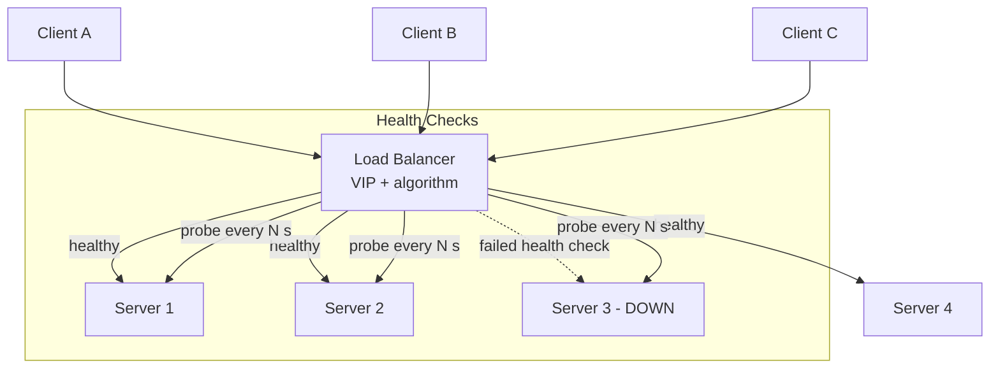
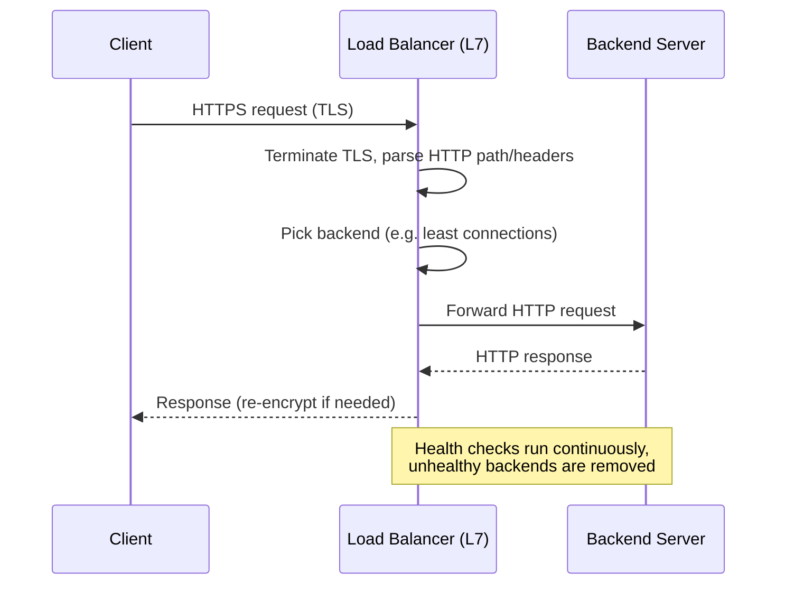
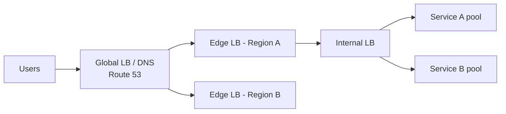

# Load Balancing

> Difficulty: 🟢 Easy

## TL;DR

A load balancer distributes incoming traffic across multiple backend servers so no single server becomes a bottleneck or single point of failure. The two big decisions are *what layer* you balance at (L4 transport vs L7 application) and *which algorithm* you use to pick a server (round robin, least connections, IP hash, weighted). Get health checks and session handling right, and you have horizontal scalability plus high availability almost for free.

## Overview

As soon as one server can no longer handle your traffic — or you cannot tolerate that server dying — you need more than one. Load balancing is the mechanism that spreads client requests across a pool of servers so you can **scale horizontally** and stay **available** when individual machines fail.

Without a load balancer, you are stuck with vertical scaling (a bigger box), which has a hard ceiling, is expensive, and still leaves a single point of failure. A load balancer solves three problems at once:

- **Scalability** — add servers to absorb more traffic.
- **Availability** — route around dead or unhealthy servers.
- **Operability** — do rolling deploys, drain traffic, and run health checks without downtime.

It also becomes a natural place to terminate TLS, enforce rate limits, and collect metrics. This is one of the most common building blocks in system design interviews because *almost every* scalable architecture has one.

## Key Concepts

- **Backend / Upstream / Server pool** — the set of servers the LB distributes traffic to.
- **L4 (Layer 4) load balancing** — routing based on transport-layer info (TCP/UDP, source/destination IP and port). The LB does not inspect payload.
- **L7 (Layer 7) load balancing** — routing based on application-layer content (HTTP path, headers, cookies, hostname). Requires understanding the protocol.
- **Health check** — a periodic probe (TCP connect, HTTP GET, gRPC) that decides whether a backend is eligible to receive traffic.
- **Sticky session (session affinity)** — pinning a given client to the same backend for the duration of a session.
- **Virtual IP (VIP)** — the single address clients hit; the LB fans it out to real backends.
- **Connection draining / de-registration delay** — letting in-flight requests finish before removing a server.
- **DSR (Direct Server Return)** — an L4 optimization where responses bypass the LB and go straight to the client.
- **SSL/TLS termination** — decrypting TLS at the LB so backends deal with plaintext.

## How It Works

A client resolves a DNS name to the load balancer's virtual IP. The LB accepts the connection, selects a healthy backend using its configured algorithm, and forwards the request. Health checks run continuously in the background so the pool only ever contains servers believed to be alive.

The request path for an L7 HTTP load balancer looks like this:

At **L4**, the LB largely shuffles packets/connections and makes decisions on IP+port — it is fast and protocol-agnostic. At **L7**, the LB acts as a reverse proxy: it terminates the connection, reads the HTTP request, and can route `/api` to one pool and `/images` to another. That intelligence costs CPU and latency.

## Types / Patterns / Strategies

### L4 vs L7

| Dimension | L4 (Transport) | L7 (Application) |
|-----------|----------------|------------------|
| Routes on | IP, port, TCP/UDP | HTTP path, host, headers, cookies |
| Payload inspection | No | Yes |
| Performance | Higher throughput, lower latency | More CPU, slightly higher latency |
| Features | Basic distribution | Path routing, TLS termination, WAF, rewrites, retries |
| Example | AWS NLB, IPVS, HAProxy (TCP mode) | AWS ALB, NGINX, Envoy, HAProxy (HTTP mode) |

### Distribution algorithms

| Algorithm | How it picks | Best for | Watch out for |
|-----------|-------------|----------|---------------|
| **Round Robin** | Next server in rotation | Homogeneous servers, uniform requests | Ignores actual load / request cost |
| **Weighted Round Robin** | Rotation biased by capacity weights | Mixed hardware sizes | Manual weight tuning drifts over time |
| **Least Connections** | Server with fewest active connections | Long-lived / variable-duration requests | Connection count ≠ CPU load |
| **Weighted Least Connections** | Fewest connections adjusted by weight | Mixed capacity + variable requests | More state to track |
| **IP Hash** | Hash of client IP → server | Cheap stickiness without cookies | Uneven buckets; breaks on rebalance |
| **Least Response Time / EWMA** | Fastest-responding backend | Latency-sensitive services | Needs good latency telemetry |
| **Consistent Hashing** | Hash ring maps keys to nodes | Caches, sharded state, minimal reshuffle | More complex; hot keys |

### Health checks
- **Passive** — observe real traffic; eject a backend after N consecutive errors.
- **Active** — send synthetic probes (TCP connect, `GET /healthz`, gRPC health). Distinguish *liveness* (process up) from *readiness* (can serve traffic).

### Sticky sessions
- **Cookie-based (L7)** — LB injects a cookie identifying the backend.
- **IP-based (L4)** — source IP hashed to a backend.
- Prefer **stateless backends** (session state in Redis/DB) so stickiness isn't needed at all.

### LB placement
- **Global / DNS-based (GSLB)** — e.g. Route 53, Cloudflare — pick a region/data center.
- **Edge / external** — public-facing, terminates TLS, first hop into your system.
- **Internal / service-to-service** — balances traffic between microservices.
- **Client-side / service mesh** — the client (or sidecar like Envoy) picks the backend directly, no central hop.

## When to Use / When to Avoid

**Use a load balancer when:**
- You run 2+ instances of a service (redundancy or scale).
- You need zero-downtime deploys, health-based routing, or TLS termination.
- You want path/host-based routing (L7) to consolidate services behind one entry point.

**Prefer L4 when:** you need raw throughput, non-HTTP protocols (databases, gaming, MQTT), or want minimal latency and no payload inspection.

**Prefer L7 when:** you need content-based routing, per-path pools, header/cookie logic, request retries, or a WAF.

**When to avoid / reconsider:**
- A single low-traffic instance with acceptable downtime — an LB adds cost and a component to operate.
- Purely internal, ultra-low-latency RPC where a client-side/mesh LB avoids the extra network hop.
- When stickiness "solves" a problem that should be fixed by making the service stateless.

## Trade-offs

| Pros | Cons |
|------|------|
| Enables horizontal scaling | Can itself become a single point of failure (needs HA pairs / redundancy) |
| Improves availability via health checks | Adds a network hop and latency |
| Centralizes TLS, routing, metrics | Extra operational and cost overhead |
| Enables rolling deploys / draining | Sticky sessions complicate scaling and failover |
| L7 gives rich routing features | L7 inspection costs CPU; misconfig can break routing |
| Hides backend topology from clients | Wrong algorithm can cause uneven load (hot spots) |

## Real-World Examples

- **NGINX / HAProxy** — the classic software LBs; run in L4 (TCP) or L7 (HTTP) mode.
- **Envoy** — modern L7 proxy powering service meshes (**Istio**, **Consul**) and client-side load balancing.
- **AWS ELB family** — **ALB** (L7, HTTP/HTTPS/gRPC), **NLB** (L4, ultra-high throughput), **GWLB** (L3 gateway for appliances). **Route 53** does DNS/global load balancing.
- **Google Cloud Load Balancing / GCLB** and **Azure Load Balancer + Front Door**.
- **Cloudflare** — global anycast load balancing and DDoS protection at the edge.
- **Netflix** — used **Zuul** (edge gateway) and **Ribbon** (client-side LB) in its microservice stack.
- **IPVS / LVS** — Linux kernel-level L4 load balancing used inside **Kubernetes** kube-proxy.
- **Maglev** — Google's software L4 LB using consistent hashing (published paper).

## Common Pitfalls

- **Making health checks too shallow** — a TCP-connect check passes while the app returns 500s. Check a real `/healthz` that exercises dependencies (readiness), but don't make it so heavy it cascades failures.
- **Confusing liveness and readiness** — restarting a pod that was merely warming up, or sending traffic before it's ready.
- **Over-relying on sticky sessions** — a failed backend drops all its pinned users' sessions; stickiness also defeats even load distribution. Prefer externalized session state.
- **The LB is a single point of failure** — you need redundant LBs (active/passive VIP failover, or multiple LB nodes behind anycast/DNS).
- **IP hash behind a proxy/NAT** — everyone appears to share one source IP, so all traffic lands on one backend. Use `X-Forwarded-For` awareness.
- **Round robin with heterogeneous request cost** — one "cheap" endpoint and one "expensive" endpoint on the same rotation causes skew; consider least-connections or least-response-time.
- **Ignoring connection draining** — killing a node during deploy drops in-flight requests. Enable draining / de-registration delay.
- **Thundering herd on health flap** — a briefly slow backend gets ejected, load shifts, the next backend gets overwhelmed. Tune thresholds and use slow-start.

## Interview Questions & Answers

**Q: What is the difference between L4 and L7 load balancing, and when would you choose each?**
**A:** L4 balances on transport info (IP, port, TCP/UDP) without reading the payload — it's fast, protocol-agnostic, and ideal for high throughput or non-HTTP traffic. L7 terminates the connection and reads application data (HTTP path, headers, cookies), enabling content-based routing, TLS termination, retries, and WAF, at the cost of extra CPU and latency. Choose L4 for raw performance and arbitrary TCP/UDP protocols; choose L7 when you need routing intelligence like `/api` vs `/static` going to different pools.

**Q: Compare round robin, least connections, and IP hash. When does each fail?**
**A:** Round robin cycles through servers equally — great for uniform servers and cheap requests, but it ignores actual load, so long or expensive requests cause skew. Least connections routes to the server with the fewest active connections — better for variable-duration or long-lived connections, but connection count isn't a perfect proxy for CPU. IP hash maps a client IP to a fixed server — cheap stickiness without cookies, but it produces uneven buckets and breaks badly behind NAT/proxies (many clients share one IP) and when the server set changes.

**Q: How do you prevent the load balancer from becoming a single point of failure?**
**A:** Run it redundantly. Common patterns: an active/passive pair sharing a floating VIP with failover (VRRP/keepalived); multiple active LB nodes behind DNS or anycast so any node can take traffic; or a managed cloud LB (ALB/NLB) that is inherently multi-AZ. At the global layer, DNS-based load balancing spreads across regions so an entire LB/region can fail without total outage.

**Q: What are health checks, and what's the difference between active and passive checks and between liveness and readiness?**
**A:** Health checks decide whether a backend should receive traffic. Active checks send synthetic probes (TCP connect, HTTP `GET /healthz`, gRPC). Passive checks infer health from real traffic (eject after N consecutive errors). Liveness answers "is the process alive?" — failing it triggers a restart. Readiness answers "can it serve traffic right now?" — failing it just removes the instance from rotation (e.g., during warm-up or when a dependency is down) without killing it.

**Q: What are sticky sessions, why are they problematic, and how do you avoid needing them?**
**A:** Sticky sessions pin a client to one backend (via a cookie at L7 or source-IP hash at L4) so session state stored on that server stays reachable. They hurt even load distribution, complicate scaling (new servers get no existing traffic), and cause session loss when a backend dies. The clean fix is to make backends stateless — store session data in a shared store like Redis or a database — so any server can handle any request and no affinity is needed.

**Q: Explain consistent hashing and why a load balancer or cache layer would use it.**
**A:** Consistent hashing maps both servers and keys onto a hash ring; a key is served by the next server clockwise. When a server is added or removed, only the keys in that segment move (≈ 1/N of keys) instead of remapping everything as a plain `hash % N` would. Virtual nodes smooth out distribution. This is critical for distributed caches and sharded stores (and Google's Maglev LB) because it minimizes cache misses and data movement during scaling events.

**Q: Where would you place load balancers in a large multi-region system?**
**A:** In layers. A global/DNS layer (Route 53, Cloudflare) directs users to the nearest healthy region. An edge/external LB per region terminates TLS and is the public entry point. Internal LBs balance traffic between microservices. For east-west service-to-service traffic, a client-side or service-mesh sidecar (Envoy) can balance without a central hop, reducing latency and avoiding a shared bottleneck.

**Q: How does an L7 load balancer help with a zero-downtime deployment?**
**A:** It supports connection draining — when you deregister an instance, the LB stops sending new requests but lets in-flight ones finish before the instance shuts down. Combined with readiness checks (so a new instance only gets traffic once it's ready) and slow-start (ramping traffic gradually), you can do rolling or blue/green deploys without dropping requests or overwhelming freshly started servers.

## Further Reading

- *Designing Data-Intensive Applications* — Martin Kleppmann (partitioning, replication, and routing fundamentals).
- *System Design Interview, Vol. 1* — Alex Xu (load balancing patterns in scalable designs).
- Google Research paper — **"Maglev: A Fast and Reliable Software Network Load Balancer"** (NSDI 2016).
- **NGINX documentation** — HTTP load balancing and upstream module: <https://docs.nginx.com/nginx/admin-guide/load-balancer/>
- **AWS Elastic Load Balancing docs** — ALB vs NLB vs GWLB comparison: <https://docs.aws.amazon.com/elasticloadbalancing/>
- **Envoy Proxy docs** — load balancing algorithms and health checking: <https://www.envoyproxy.io/docs/>
