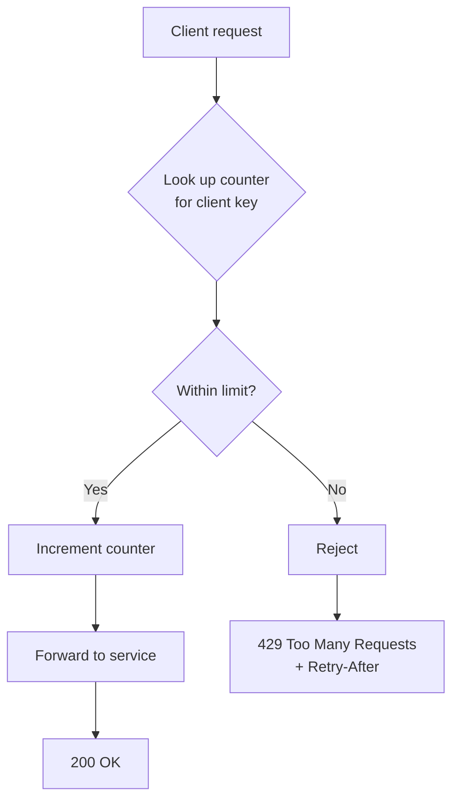
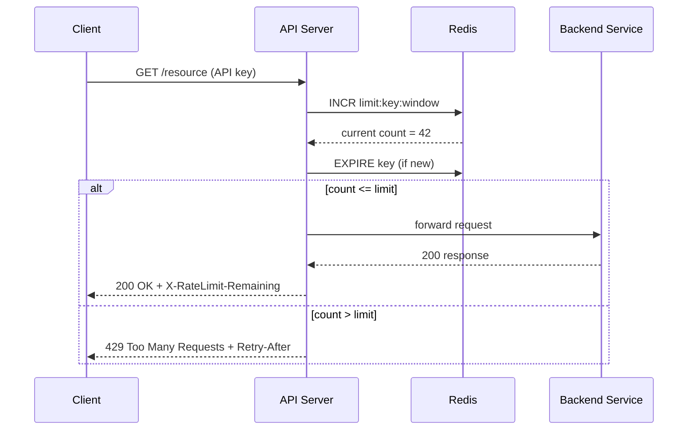

# Rate Limiting

> Difficulty: 🟢 Easy

## TL;DR

Rate limiting controls how many requests a client can make to a service within a time window, protecting systems from abuse, overload, and runaway costs. The four canonical algorithms are token bucket, leaky bucket, fixed window, and sliding window; in distributed systems they're typically enforced with a shared store like Redis. Clients that exceed their limit receive HTTP `429 Too Many Requests`, ideally with a `Retry-After` header.

## Overview

Every service has finite capacity. Without limits, a single misbehaving client, a buggy retry loop, a scraper, or a denial-of-service attack can saturate CPU, memory, database connections, or downstream dependencies — degrading service for everyone. Rate limiting is the mechanism that caps request throughput per client (per API key, user ID, IP, or tenant) so that resources are shared fairly and the system degrades gracefully instead of collapsing.

Beyond protection, rate limiting enforces business rules: free-tier vs. paid-tier quotas, per-endpoint cost controls (an expensive search endpoint may allow fewer calls than a cheap health check), and protection of scarce downstream resources (a third-party API you pay per call). It's a foundational reliability primitive that appears in nearly every API design interview because it forces you to reason about counters, concurrency, time windows, and distributed state.

## Key Concepts

- **Rate limit**: The maximum number of requests allowed per unit of time, e.g. `100 req/min`.
- **Throttling**: The act of rejecting or delaying requests that exceed the limit.
- **Quota**: A longer-term allowance (e.g. 10,000 requests/day) vs. a short-burst rate.
- **Burst**: A short spike of traffic above the steady-state rate; some algorithms tolerate bursts, others smooth them out.
- **Client identity / key**: What you rate-limit on — API key, user ID, IP address, or tenant. Choosing the wrong key (e.g. IP behind a NAT/proxy) breaks fairness.
- **Sliding vs. fixed window**: Whether the counting period moves continuously with time or resets at fixed boundaries.
- **`429 Too Many Requests`**: The HTTP status returned when a client is throttled.
- **`Retry-After`**: A response header telling the client how long to wait before retrying.
- **Distributed rate limiting**: Enforcing a single global limit across many server instances, requiring shared state.

## How It Works

At its core, a rate limiter maintains a counter (or set of timestamps) keyed by client identity. On each request it checks whether the client is within budget, decrements/increments the counter, and either allows the request or returns `429`. In a distributed fleet, this counter lives in a shared, fast datastore (commonly Redis) so all API nodes see the same view.

The sequence below shows a distributed limiter backed by Redis, where multiple API servers coordinate through one shared counter:

The atomicity of the check-and-increment matters: under concurrency, a naive `GET` then `SET` can let two requests both read `99` and both proceed past a limit of `100`. Redis solves this with atomic `INCR` or, for multi-step logic, a Lua script that executes server-side without interleaving.

## Types / Patterns / Strategies

| Algorithm | How it works | Burst handling | Memory | Notes |
|-----------|--------------|----------------|--------|-------|
| **Token Bucket** | Bucket holds up to N tokens, refilled at a fixed rate; each request consumes a token. | Allows bursts up to bucket size, then smooths to refill rate. | Low (2 numbers: tokens + last-refill time) | Most popular; used by AWS, Stripe. Flexible and cheap. |
| **Leaky Bucket** | Requests enter a queue (bucket) that "leaks"/processes at a fixed rate; overflow is dropped. | Smooths bursts into a constant outflow — no bursts downstream. | Moderate (queue) | Good when downstream needs steady, even load. |
| **Fixed Window Counter** | Count requests per fixed interval (e.g. per minute); reset at boundary. | Poor — allows 2x burst at window edges. | Low (1 counter) | Simplest to implement; edge-burst problem. |
| **Sliding Window Log** | Store timestamp of every request; count those within the trailing window. | Accurate, smooth. | High (one entry per request) | Precise but memory-heavy at scale. |
| **Sliding Window Counter** | Weighted blend of current + previous fixed windows to approximate a sliding window. | Good approximation, avoids edge burst. | Low | Best practical balance; used by Cloudflare. |

**Token bucket** is the default choice for most APIs: it's memory-efficient, supports controlled bursts, and maps cleanly to "X requests per second with a burst allowance of Y."

**Fixed window's edge problem**: with a limit of 100/min, a client can send 100 requests at 11:00:59 and another 100 at 11:01:00 — 200 requests in ~1 second. The **sliding window counter** fixes this by weighting the previous window's count: `count = current_window + previous_window * (overlap_fraction)`.

## When to Use / When to Avoid

**Use rate limiting when:**
- You expose a public or partner-facing API and need to enforce per-client quotas.
- You must protect a scarce or expensive downstream resource (a paid third-party API, a database).
- You want defense-in-depth against DoS, credential-stuffing, and scraping.
- You need to enforce tiered pricing (free vs. paid).

**Prefer a specific algorithm:**
- **Token bucket** — general-purpose APIs that should tolerate bursts.
- **Leaky bucket** — when the downstream requires a smooth, constant rate (e.g. writing to a rate-sensitive external system).
- **Sliding window counter** — when accuracy near window boundaries matters and memory is constrained.

**Avoid or reconsider when:**
- The limiter itself becomes a single point of failure — plan for fail-open vs. fail-closed behavior.
- Internal, trusted, low-volume service-to-service traffic where the overhead isn't justified (use circuit breakers/backpressure instead).
- You'd rate-limit on IP alone for authenticated users behind shared NATs/proxies — you'll punish innocent users.

## Trade-offs

| Pros | Cons |
|------|------|
| Protects services from overload and abuse | Adds latency and a dependency (e.g. Redis) to every request |
| Enables fair resource sharing across clients | Distributed accuracy vs. performance is a hard trade-off |
| Enforces business/quota tiers | Wrong client key (IP, NAT) causes unfair throttling |
| Cheap algorithms (token bucket) use minimal memory | Central store can become a bottleneck / SPOF |
| Improves system predictability and cost control | Clients need retry/backoff logic to behave well |

## Real-World Examples

- **Stripe** — publishes per-account request limits and returns `429` with rate-limit headers; uses token-bucket-style limiting.
- **GitHub API** — 5,000 requests/hour for authenticated users, exposed via `X-RateLimit-Limit`, `X-RateLimit-Remaining`, and `X-RateLimit-Reset` headers.
- **AWS API Gateway** — token bucket with configurable steady-state rate and burst capacity; also account-level throttling.
- **Cloudflare** — edge rate limiting using a sliding window counter across its global network.
- **NGINX** — the `limit_req` module implements a leaky-bucket algorithm (`rate=` plus optional `burst=`).
- **Redis** — the de-facto backing store for distributed limiters; `redis-cell` module and Lua scripts (e.g. Kong, Envoy) are common patterns.
- **Envoy / Istio** — global rate limiting service that calls out to a Redis-backed rate limit server.

## Common Pitfalls

- **Non-atomic check-and-set**: reading a counter then writing it back allows races that leak requests past the limit. Use `INCR` or Lua scripts.
- **Fixed-window edge bursts**: forgetting that a fixed window lets ~2x the limit through at boundaries.
- **Wrong identity key**: limiting by IP when clients sit behind a corporate NAT or CDN throttles everyone together.
- **No `Retry-After` header**: clients then retry immediately and aggressively, amplifying the overload (a "retry storm").
- **Rate limiter as SPOF**: if Redis is down and you fail-closed, you reject all traffic; if you fail-open, you lose protection. Decide deliberately.
- **Ignoring clock skew** across nodes when windows depend on wall-clock time.
- **Setting limits too tight** for legitimate bursty clients, or too loose to actually protect the backend — always load-test.
- **Not returning remaining/limit headers**, forcing clients to discover limits by hitting `429`.

## Interview Questions & Answers

**Q:** What's the difference between token bucket and leaky bucket?
**A:** Both cap the average rate, but they differ in burst behavior. Token bucket accumulates tokens up to a capacity and lets a client spend them in a burst, so short spikes pass through as long as tokens remain. Leaky bucket processes requests out of a queue at a fixed rate regardless of arrival pattern, smoothing bursts into a constant outflow (excess overflows and is dropped). Choose token bucket when bursts are acceptable/desirable; choose leaky bucket when the downstream needs a steady, even load.

**Q:** Why is the fixed window counter problematic, and how does the sliding window fix it?
**A:** A fixed window resets counts at hard boundaries, so a client can send the full quota just before the boundary and again just after — up to 2x the limit within a short span straddling the boundary. A sliding window log fixes this precisely by counting only requests within the trailing window, but at high memory cost. The sliding window counter approximates it cheaply by weighting the previous window's count by how much of it still overlaps the current sliding window, avoiding the edge burst without storing every timestamp.

**Q:** How would you implement distributed rate limiting across many API servers?
**A:** Keep the counter in a shared, low-latency store like Redis, keyed by client + window. Use an atomic operation — `INCR` with `EXPIRE`, or a Lua script for token-bucket math — so concurrent requests across nodes don't race. Each node consults Redis on every request. To reduce latency and Redis load at very high scale, you can shard keys, use local approximate counters that periodically sync, or push limiting to the edge (CDN). You must also decide fail-open vs. fail-closed if Redis is unavailable.

**Q:** What HTTP status and headers do you return when throttling?
**A:** Return `429 Too Many Requests`. Include `Retry-After` (seconds or an HTTP date) so clients know when to retry, and ideally `X-RateLimit-Limit`, `X-RateLimit-Remaining`, and `X-RateLimit-Reset` so well-behaved clients can self-throttle. For some abusive traffic you might prefer `503` with `Retry-After`, but `429` is the semantically correct client-side signal.

**Q:** Should the rate limiter fail open or fail closed when the backing store is down?
**A:** It depends on the priority. Fail-open (allow requests when Redis is unreachable) preserves availability but temporarily removes protection — appropriate when the service can absorb some overload and uptime matters most. Fail-closed (reject requests) preserves protection of a fragile downstream but hurts availability. Many production systems fail-open with alerting, plus a local in-memory fallback limiter so there's still coarse protection while the shared store recovers.

**Q:** How do you choose what to rate-limit on (the key)?
**A:** Prefer the most specific authenticated identity you have: API key or user/account ID for authenticated traffic. For unauthenticated endpoints (login, signup) fall back to IP, but be aware of shared NATs and proxies — you may combine IP with other signals or use lower limits with challenge (CAPTCHA) escalation. Often you layer multiple limits: per-user, per-IP, and per-endpoint, applying the strictest that matches.

**Q:** How do you rate-limit a very expensive endpoint differently from a cheap one?
**A:** Use weighted or cost-based limiting: assign each endpoint a token cost proportional to its resource usage (a search costing 10 tokens, a health check costing 1), and deduct that many tokens from the client's bucket. This is cleaner than maintaining separate counters per endpoint and naturally lets clients spend their budget where they need it. GitHub's "points" and many GraphQL APIs use this cost-based model.

**Q:** Why must the counter update be atomic, and how do you achieve it in Redis?
**A:** Under concurrency, a read-modify-write (GET then SET) can interleave: two requests both read 99, both decide they're under the limit of 100, and both write 100 — leaking an extra request. Atomicity guarantees the check and update happen as one indivisible operation. In Redis, `INCR` is atomic for simple counters; for multi-step logic like token-bucket refill-and-consume, use a Lua script (`EVAL`) which Redis runs single-threaded and uninterrupted.

## Further Reading

- *System Design Interview – An Insider's Guide* (Alex Xu), Chapter 4: "Design a Rate Limiter."
- Stripe Engineering Blog — "Scaling your API with rate limiters."
- Cloudflare Blog — "How we built rate limiting capable of scaling to millions of domains" (sliding window counter).
- NGINX docs — "Rate Limiting with NGINX" (`limit_req` module).
- MDN Web Docs — `429 Too Many Requests` and the `Retry-After` header specification (RFC 6585 / RFC 9110).
