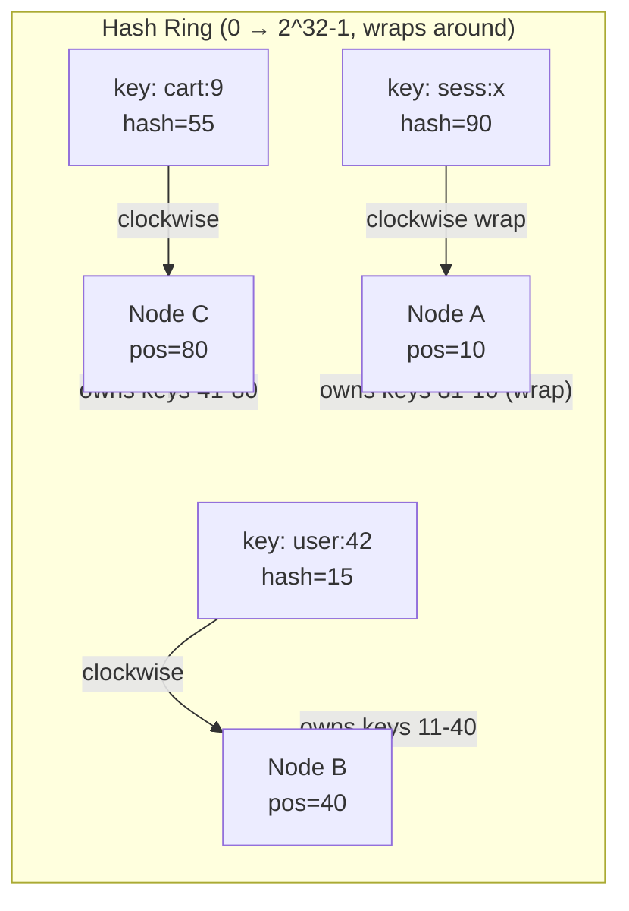
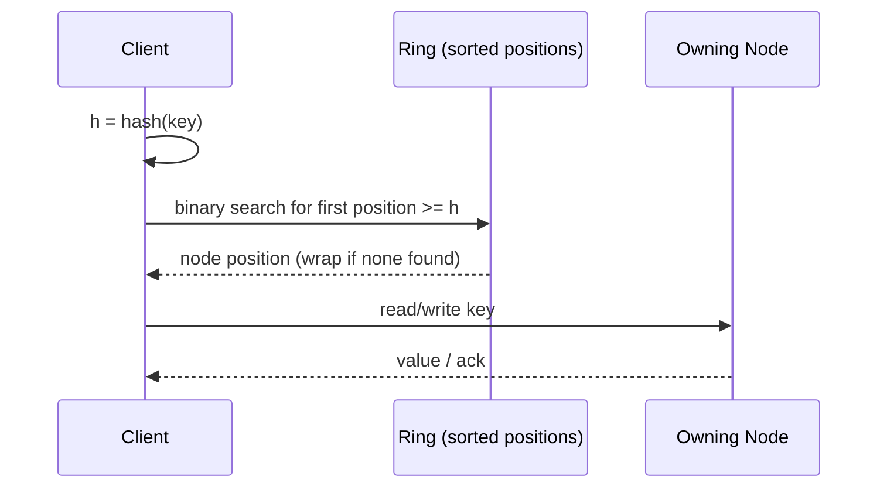

# Consistent Hashing

> Difficulty: 🔵 Moderate

## TL;DR

Consistent hashing maps both data keys and server nodes onto the same circular hash space (a "ring") so that adding or removing a node only remaps a small fraction of keys (roughly `K/N`) instead of nearly all of them. It is the foundational technique behind distributed caches, sharded databases, and load balancers that need to scale elastically without triggering a full data reshuffle.

## Overview

The core problem: distribute `K` keys across `N` nodes and be able to find which node owns any key in O(1)–O(log N) time.

The naive approach is **modulo hashing**: `node = hash(key) % N`. This works perfectly until `N` changes. Add one server (`N → N+1`) and the modulus changes for almost every key, so nearly *all* keys must move to a different node. For a cache this means a mass cache miss storm (a "thundering herd" hitting your database); for a sharded DB it means moving terabytes of data during a routine scale-up.

Consistent hashing, introduced by Karger et al. (1997) for web caching and popularized by Amazon's Dynamo paper (2007), solves this. By hashing nodes and keys into the same fixed space and assigning each key to the "next node clockwise," a membership change only affects keys between the changed node and its neighbor. On average only `K/N` keys move. This property — **minimal disruption on scaling** — is what makes elastic distributed systems practical.

## Key Concepts

- **Hash ring / hash space**: A fixed range of hash values (e.g., `0` to `2^32 − 1`) treated as a circle where the maximum value wraps back to zero.
- **Node placement**: Each server is hashed (e.g., `hash(server_ip)`) to one or more points on the ring.
- **Key placement & ownership**: A key is hashed to a point; its owner is the first node encountered walking **clockwise** from that point.
- **Virtual nodes (vnodes / replicas)**: Each physical node is placed at many points (e.g., 100–500) on the ring to smooth out load imbalance and skew.
- **Rebalancing**: The act of moving keys when a node joins or leaves. With consistent hashing this is localized to neighbors.
- **Partition/token**: In systems like Cassandra, a node owns a contiguous "token range" of the ring.
- **Bounded loads**: A refinement (Google, 2016) that caps how much load any single node can take, redirecting overflow to the next node.

## How It Works

1. Choose a hash function with good uniform distribution (MD5, SHA-1, or MurmurHash are common; cryptographic strength is not required, uniformity is).
2. Hash each node onto the ring. With virtual nodes, hash `nodeA#1`, `nodeA#2`, … `nodeA#V`.
3. To locate a key, hash it, then find the first node position **≥** the key's hash, wrapping around at the top of the ring. This is a binary search over a sorted list of ring positions → **O(log V·N)**.
4. When a node is added, it "steals" only the key range between itself and its counter-clockwise neighbor. When a node is removed, its keys fall through to the next clockwise node. All other keys are untouched.

The lookup sequence for a client resolving a key:

## Types / Patterns / Strategies

| Strategy | How it works | Best for |
|---|---|---|
| **Basic consistent hashing** | One point per node on the ring | Small clusters, teaching; suffers load skew |
| **Virtual nodes (vnodes)** | Each node mapped to V points | Nearly all production systems (Dynamo, Cassandra, Riak) — smooths load |
| **Consistent hashing with bounded loads** | Vnodes + a hard cap per node; overflow spills clockwise | Load balancers where hot keys must not overwhelm one node (used by Vimeo/HAProxy, Google) |
| **Rendezvous (HRW) hashing** | For each key, compute `hash(key, node)` for all nodes, pick max | Small node counts; no ring structure needed, simpler code |
| **Jump consistent hashing** | Google algorithm mapping key→bucket with no memory overhead | Fixed or monotonically growing bucket counts; very fast, minimal memory |
| **Maglev hashing** | Lookup-table based (Google) | Software load balancers needing fast, even, connection-consistent routing |

## When to Use / When to Avoid

**Use it when:**
- Nodes join/leave frequently (autoscaling caches, spot instances).
- You need to minimize data movement on resize (sharded DBs, object stores).
- You want to route requests stickily to the same backend (sticky sessions, cache affinity).

**Avoid or reconsider when:**
- The node set is small and static — plain modulo or a fixed shard map is simpler.
- You need range queries across ordered keys — hashing destroys key locality (use range partitioning instead).
- A central coordinator can cheaply maintain an explicit shard-to-node map (some systems prefer directory-based sharding for finer control).
- Extreme hot keys dominate — consistent hashing alone won't fix a single scorching key; you need replication or key-splitting.

## Trade-offs

| Pros | Cons |
|---|---|
| Only ~K/N keys move on membership change | More complex to implement than modulo |
| Scales elastically without full reshuffle | Basic version has load skew without vnodes |
| Decentralized — clients can compute ownership locally | Vnodes add memory (ring metadata) and lookup cost |
| Works well with replication (walk N nodes clockwise) | Doesn't preserve key ordering → no efficient range scans |
| Predictable, testable placement | Hot keys still overload a single owner unless combined with bounded loads/replication |

## Real-World Examples

- **Amazon DynamoDB / Dynamo paper**: Original large-scale use; ring + vnodes + preference lists for replication.
- **Apache Cassandra**: Token ring with vnodes (`num_tokens`); data replicated to the next N nodes clockwise.
- **Riak**: Ring of 2^N partitions (vnodes) distributed across physical nodes.
- **Memcached clients (ketama)** & **Redis Cluster** (16384 hash slots, a related slot-map approach): consistent placement so a node loss evicts only a slice of the cache.
- **Discord**: Uses consistent hashing to route to sessions/guild nodes.
- **HAProxy / Envoy / NGINX**: Support consistent-hashing load-balancing (e.g., `hash-type consistent`, ring-hash) for backend affinity.
- **Google Maglev**: Load balancer using consistent-hashing-style lookup tables at datacenter scale.

## Common Pitfalls

- **Skipping virtual nodes**: With one point per node, load can vary 2–3×; distribution is only smooth in expectation for many points.
- **Poor hash function**: Using a hash with clustering (or hashing sequential IDs) causes uneven ring occupancy. Use MurmurHash/SHA, not `String.hashCode()`.
- **Ignoring replication direction**: For fault tolerance, keys should replicate to the *next distinct physical nodes* clockwise — naive vnode walk can place all replicas on the same physical machine.
- **Assuming it fixes hot keys**: A single popular key always lands on one owner. Combine with replication or client-side caching.
- **Forgetting the wrap-around**: Off-by-one at the top of the ring is a classic bug — the last position must wrap to the first node.
- **Rehashing everything on config change**: Changing V (vnode count) or the hash function reshuffles the whole ring — treat these as migrations, not tweaks.

## Interview Questions & Answers

**Q:** Why not just use `hash(key) % N` to shard data?
**A:** Because when `N` changes (a node is added or removed), the modulus changes for almost every key, so ~all keys remap and must move. For a cache that's a massive miss storm; for a DB it's a full data reshuffle. Consistent hashing changes ownership for only ~K/N keys on a membership change.

**Q:** How much data moves when you add the Nth+1 node?
**A:** On average `K/(N+1)` keys — the new node claims one node's worth of the keyspace, pulled from the ranges of its ring neighbors. With virtual nodes the moved keys come from many existing nodes in small slices, so no single node is overloaded during rebalancing.

**Q:** What problem do virtual nodes solve, and what's the cost?
**A:** With one point per node, random placement produces uneven arc lengths → load skew (some nodes own 2–3× more than others). Giving each node many points (e.g., 128–256) makes each node's total owned arc converge to `1/N` of the ring, smoothing load and also spreading rebalancing across many nodes. Cost: more ring metadata (memory) and slightly slower lookups (larger sorted structure), plus more bookkeeping.

**Q:** How do you handle replication with consistent hashing?
**A:** After finding the primary owner (first node clockwise), continue walking clockwise and place replicas on the next `R−1` **distinct physical** nodes (skipping additional vnodes of the same machine). Dynamo calls this the "preference list." This keeps replicas deterministic and co-located near the primary on the ring.

**Q:** Does consistent hashing solve hot keys?
**A:** No. A single hot key always hashes to one owner. Consistent hashing balances *many* keys, not the traffic to one key. Fixes are orthogonal: replicate the hot key across nodes and read from any replica, split the key, or add a caching layer in front. "Consistent hashing with bounded loads" helps by capping per-node load and spilling overflow to the next node.

**Q:** What are the trade-offs versus rendezvous (HRW) hashing?
**A:** Rendezvous hashing computes `hash(key, node)` for every node and picks the max — no ring to maintain, and it distributes evenly without vnodes. It's simple and great for small node counts, but lookup is O(N) per key versus O(log N) for a ring. For thousands of nodes the ring (or Maglev/jump hashing) scales better; for tens of nodes HRW is often cleaner.

**Q:** How would you pick the hash function and ring size?
**A:** Pick a fast, well-distributed non-cryptographic hash (MurmurHash3, xxHash) for speed, or MD5/SHA if you want stability across languages (ketama uses MD5). Ring size is typically 2^32 or 2^64 — large enough that collisions are negligible. The *number of vnodes per node* is the tuning knob: more vnodes = smoother load but more memory; 100–500 is a common range.

**Q:** A client and a server compute ownership independently — how do they stay consistent?
**A:** They must share the same view of ring membership and the same hash function. This is handled by a membership/gossip protocol (Cassandra, Dynamo use gossip) or a coordination service (ZooKeeper/etcd) that propagates the node list. Stale views cause temporary misrouting, which systems tolerate via hinted handoff or read-repair rather than blocking.

## Further Reading

- Karger et al., *"Consistent Hashing and Random Trees: Distributed Caching Protocols for Relieving Hot Spots on the World Wide Web"* (STOC 1997) — the original paper.
- DeCandia et al., *"Dynamo: Amazon's Highly Available Key-value Store"* (SOSP 2007) — vnodes and preference lists in production.
- Lamping & Veach, *"A Fast, Minimal Memory, Consistent Hash Algorithm"* (Jump hashing, Google 2014).
- Mirrokni, Thorup, Zadimoghaddam, *"Consistent Hashing with Bounded Loads"* (Google Research, 2016) — plus the Vimeo/HAProxy engineering blog on applying it.
- *Designing Data-Intensive Applications* by Martin Kleppmann — Chapter 6, "Partitioning," for practical context in sharded databases.

---

## 🛠️ Open-Source Tools & Projects (Used in Production)

These are real, widely-adopted projects that implement or depend on consistent hashing. Databases and load balancers use it as a core partitioning/routing primitive; the libraries let you drop it into your own service.

| Project | GitHub | What it does / Why it's used |
|---|---|---|
| **Apache Cassandra** | [apache/cassandra](https://github.com/apache/cassandra) | Distributed wide-column DB (~8.8k★). Partitions data over a token ring with virtual nodes (`num_tokens`); replicates to the next N nodes clockwise. The canonical production consistent-hashing datastore. |
| **Envoy Proxy** | [envoyproxy/envoy](https://github.com/envoyproxy/envoy) | L7 proxy / service-mesh data plane (~26k★). Ships `ring_hash` and `maglev` load-balancing policies for sticky, connection-consistent backend routing. Used by Istio, and at Lyft/Google scale. |
| **buraksezer/consistent** | [buraksezer/consistent](https://github.com/buraksezer/consistent) | Go library implementing **consistent hashing with bounded loads** (Google's algorithm). Clean, well-documented; a common reference implementation for Go services. |
| **ketama** | [RJ/ketama](https://github.com/RJ/ketama) | The original C library (from Last.fm) for consistent hashing of memcached pools, with language bindings. The de-facto "ketama" compatibility standard many clients follow. |
| **uhashring** | [ultrabug/uhashring](https://github.com/ultrabug/uhashring) | Full-featured Python consistent-hashing library, **ketama-compatible**. Popular for Python caching/sharding layers. |
| **groupcache** | [golang/groupcache](https://github.com/golang/groupcache) | Google's Go caching library (~13k★) that uses consistent hashing (`consistenthash`) to pick the peer that owns a key. Used inside Google-scale services. |
| **allgood-consistent-hash** | [ishugaliy/allgood-consistent-hash](https://github.com/ishugaliy/allgood-consistent-hash) | Lightweight Java consistent-hash **ring with virtual nodes**, customizable hash & partition rate. Good, readable production-style Java implementation. |
| **AnchorHash** | [domodwyer/anchorhash](https://github.com/domodwyer/anchorhash) | Go implementation of the AnchorHash algorithm — low memory, 10s–100s of millions of lookups/sec, optimal disruption and uniform balance. A modern alternative to ring hashing. |
| **Redis / Redis Cluster** | [redis/redis](https://github.com/redis/redis) | In-memory data store (~68k★). Redis Cluster uses 16384 hash slots (a slot-map variant closely related to consistent hashing) so node loss evicts only a slice of keyspace. |
| **java-consistent-hashing-algorithms** | [SUPSI-DTI-ISIN/java-consistent-hashing-algorithms](https://github.com/SUPSI-DTI-ISIN/java-consistent-hashing-algorithms) | Benchmark suite of the most prominent CH algorithms (Ring, Jump, Maglev, AnchorHash, Dx, …) in Java — great for comparing trade-offs empirically. |

## 📖 Blogs, Articles & Learning Resources

- [Consistent Hashing and Random Trees (Karger et al., STOC 1997)](https://www.cs.princeton.edu/courses/archive/fall09/cos518/papers/chash.pdf) — The original paper that introduced consistent hashing for web caching. Read for the foundational theory.
- [Dynamo: Amazon's Highly Available Key-value Store (SOSP 2007)](https://www.allthingsdistributed.com/files/amazon-dynamo-sosp2007.pdf) — How Amazon uses the ring + virtual nodes + preference lists in production. The paper that popularized CH.
- [Consistent Hashing with Bounded Loads — Google Research blog](https://research.google/blog/consistent-hashing-with-bounded-loads/) — Google's refinement that caps per-node load and spills overflow clockwise; explains why plain CH still overloads nodes.
- [Consistent Hashing with Bounded Loads (arXiv 1608.01350)](https://arxiv.org/abs/1608.01350) — The full paper behind the blog above, with the max-load guarantees and proofs.
- [Improving load balancing with a new consistent-hashing algorithm — Vimeo Engineering](https://medium.com/vimeo-engineering-blog/improving-load-balancing-with-a-new-consistent-hashing-algorithm-9f1bd75709ed) — Real-world story of applying bounded-load CH in HAProxy for video caching.
- [Maglev: A Fast and Reliable Software Network Load Balancer (Google, NSDI 2016)](https://www.usenix.org/system/files/conference/nsdi16/nsdi16-paper-eisenbud-update.pdf) — Google's datacenter LB using consistent hashing + connection tracking; the basis for Envoy's `maglev` mode.
- [Network Load Balancing with Maglev — The Paper Trail](https://www.the-paper-trail.org/post/2020-06-23-maglev/) — An approachable walkthrough of the Maglev paper and why lookup-table hashing beats a plain ring for LBs.
- [Envoy: Supported load balancers (ring hash & Maglev)](https://www.envoyproxy.io/docs/envoy/latest/intro/arch_overview/upstream/load_balancing/load_balancers) — Official docs on configuring consistent-hashing LB policies in a real proxy.
- [A Fast, Minimal Memory, Consistent Hash Algorithm — Jump hashing (Lamping & Veach, Google 2014)](https://arxiv.org/abs/1406.2294) — The "jump" algorithm: key→bucket with zero memory overhead; great for fixed/growing bucket counts.
- [Consistent Hashing Explained — systemdesign.one](https://systemdesign.one/consistent-hashing-explained/) — A clear, diagram-heavy tutorial covering the ring, vnodes, and why modulo hashing fails.
- [Designing Data-Intensive Applications — Ch. 6 "Partitioning" (Martin Kleppmann)](https://dataintensive.net/) — Best book chapter for practical partitioning context (hash vs range, rebalancing) in real databases.
- [Consistent Hashing — System Design Interview (YouTube, Gaurav Sen)](https://www.youtube.com/watch?v=zaRkONvyGr8) — Popular 10-minute video that visually builds the ring from scratch; great first watch.

## 🗺️ Learning Plan — Google & Learn (Step by Step)

1. **Understand why modulo hashing breaks on scaling.** Learn how `hash(key) % N` remaps almost everything when `N` changes. Search: `` `why hash mod N fails when adding servers` ``
2. **Learn the hash ring model.** Both keys and nodes hashed onto a circular keyspace; owner = first node clockwise. Search: `` `consistent hashing ring clockwise explained` ``
3. **Learn the minimal-movement property.** Why only ~K/N keys move on membership change. Search: `` `consistent hashing minimal key movement K/N` ``
4. **Learn virtual nodes (vnodes) and why they exist.** Fixing load skew by placing each node at many points. Search: `` `consistent hashing virtual nodes explained` ``
5. **Learn how lookups are implemented.** Sorted ring + binary search for the first position ≥ hash, with wrap-around. Search: `` `consistent hashing binary search sorted ring implementation` ``
6. **Learn replication on the ring.** Walking clockwise to the next R distinct physical nodes (Dynamo "preference list"). Search: `` `dynamo preference list replication consistent hashing` ``
7. **Study the Dynamo paper's real-world design.** Vnodes, gossip membership, hinted handoff, read repair. Search: `` `Amazon Dynamo paper consistent hashing virtual nodes` ``
8. **Study how Cassandra partitions data.** Token ranges, `num_tokens`, Murmur3 partitioner. Search: `` `Cassandra token ring num_tokens partitioner` ``
9. **Learn the hot-key problem and its limits.** Why CH doesn't fix a single scorching key; replication/splitting fixes. Search: `` `consistent hashing hot key problem load skew` ``
10. **Learn consistent hashing with bounded loads.** Capping per-node load and spilling overflow clockwise. Search: `` `consistent hashing with bounded loads google` ``
11. **Compare alternative algorithms.** Rendezvous (HRW), Jump hashing, Maglev, AnchorHash and their trade-offs. Search: `` `rendezvous vs jump vs maglev consistent hashing comparison` ``
12. **Learn how load balancers use it.** Envoy `ring_hash` / `maglev`, HAProxy `hash-type consistent`, session affinity. Search: `` `Envoy ring hash maglev load balancing consistent hashing` ``
13. **Hands-on: build a toy consistent-hash ring.** Implement a ring with vnodes + binary-search lookup in your language; verify ~K/N keys move when adding a node. Search: `` `build consistent hashing ring with virtual nodes tutorial python` ``
14. **Hands-on: benchmark distribution & rebalancing.** Add/remove nodes, measure key-movement and per-node load; try bounded loads. Search: `` `simulate consistent hashing key distribution rebalancing benchmark` ``
15. **Hands-on: use it in a real system.** Configure Envoy/HAProxy consistent-hash LB locally, or run a 3-node Cassandra cluster and inspect the token ring. Search: `` `configure Envoy ring hash load balancing example docker` ``

**✅ You'll know you understand this when:** you can (1) explain on a whiteboard why only ~K/N keys move on a membership change and what vnodes fix, (2) implement a ring with virtual nodes and O(log N) lookup from scratch, and (3) name at least two production systems (e.g. Cassandra, Envoy/Maglev) and the specific CH variant each uses.
