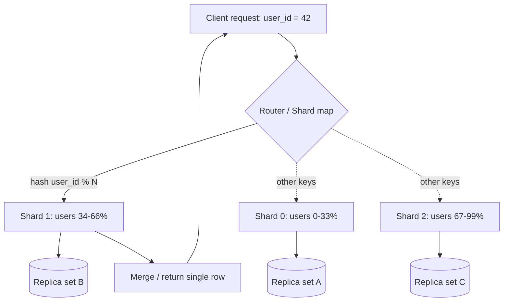
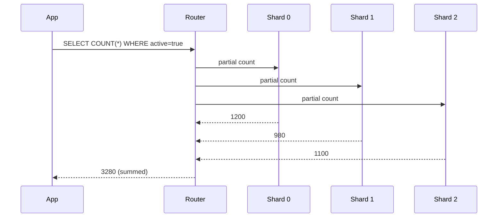

# Database Sharding

> Difficulty: 🔵 Moderate

## TL;DR

Database sharding splits a single logical dataset across multiple independent database instances (shards), so that no single node holds all the data or serves all the traffic. It lets you scale writes and storage horizontally past the limits of one machine, but it trades away easy cross-shard joins, transactions, and simple operations — so the choice of **shard key** and **sharding strategy** is the decision that makes or breaks the design.

## Overview

A single database server has hard ceilings: CPU, RAM, disk IOPS, connection count, and the size a table can grow before indexes stop fitting in memory. **Vertical scaling** (a bigger box) buys time but eventually hits physical and cost limits, and it does nothing for a single-node failure domain.

Sharding solves this by **partitioning data horizontally across many nodes**, each responsible for a subset of rows. Ten shards each holding 10% of the data give you roughly 10x the storage, write throughput, and cache headroom of one node. This is why every hyperscale system — social graphs, payment ledgers, messaging — is sharded under the hood.

The catch: once your data lives on many machines, operations that were trivial on one node (a `JOIN`, a `COUNT(*)`, a multi-row transaction) become distributed problems. Sharding is therefore a deliberate trade of *operational and query simplicity* for *scale and fault isolation*. In interviews, the signal they look for is whether you understand that trade and can reason about shard-key selection.

## Key Concepts

- **Shard (partition):** An independent database holding a disjoint subset of the total data. Each shard is typically itself replicated for HA.
- **Shard key (partition key):** The column(s) whose value determines which shard a row lives on. The single most important design decision.
- **Horizontal partitioning:** Splitting *rows* across shards (all shards have the same schema). This is what "sharding" usually means.
- **Vertical partitioning:** Splitting *columns* / tables across databases by feature or access pattern (e.g., a `users` DB and an `orders` DB). No single row is split by value.
- **Logical vs physical shard:** A logical shard is a bucket of keys; multiple logical shards can live on one physical node, which makes rebalancing much easier.
- **Routing / lookup layer:** The component that maps a key to a shard (application logic, a proxy like Vitess, or a directory service).
- **Resharding (rebalancing):** Redistributing data when you add/remove shards or a shard gets hot.
- **Hotspot / hot shard:** A shard receiving disproportionate load because the key distribution is skewed.
- **Cross-shard query / scatter-gather:** A query that must touch multiple shards and merge results.
- **Fan-out:** Sending one logical request to many shards in parallel.

## How It Works

The application (or a routing tier) computes a shard from the shard key, then sends the query to the shard that owns that key. Reads and writes for a single key hit exactly one shard; queries without the shard key must fan out to all shards.

For a single-key lookup the router resolves one shard and returns directly. For an analytics query like "count active users," the router must scatter to every shard and gather partial counts:

The key insight: a good shard key makes the *common* access pattern a single-shard operation and keeps scatter-gather rare.

## Types / Patterns / Strategies

| Strategy | How the shard is chosen | Strengths | Weaknesses |
|---|---|---|---|
| **Range sharding** | Contiguous key ranges (e.g., A–M, N–Z; or by date) | Efficient range scans; simple to reason about | Prone to hotspots (sequential IDs/timestamps flood the newest shard) |
| **Hash sharding** | `hash(key) % N` or bucket into hash slots | Even distribution, avoids hotspots | Range queries impossible; `% N` makes adding shards painful |
| **Consistent hashing** | Keys and nodes placed on a ring | Adding/removing a node moves only ~1/N of keys | More complex; needs virtual nodes to balance |
| **Directory / lookup sharding** | A lookup table maps key → shard | Full flexibility; can move any key anytime | Lookup service is a new dependency and potential SPOF/bottleneck |
| **Geo / entity sharding** | By region or tenant | Data locality, compliance (data residency) | Uneven tenant sizes cause imbalance |

Two orthogonal decisions:
1. **What to shard on** (the shard key) — driven by your dominant query pattern.
2. **How to map key → shard** (the strategy above).

Vertical partitioning is a related-but-different move: instead of splitting rows, you split *tables/columns* by concern. It's often the first step (separate the write-heavy `orders` from `users`) before horizontal sharding within a hot table.

## When to Use / When to Avoid

**Use sharding when:**
- A single primary can't keep up with **write throughput** (read load alone is better solved with read replicas).
- The dataset (or a single hot table) exceeds what one node can store or cache efficiently.
- You need **fault isolation** — one shard failing shouldn't take down all users.
- You have a natural, high-cardinality, evenly-distributed key (e.g., `user_id`, `tenant_id`).

**Avoid or defer sharding when:**
- Vertical scaling, read replicas, or caching still have headroom — sharding adds permanent operational complexity.
- Your workload is join-heavy across many entities with no clean partition boundary.
- You can't identify a shard key that matches your dominant access pattern.
- The data is small enough that a modern single node (or a managed distributed DB like Spanner/CockroachDB/DynamoDB that shards for you) is fine.

Rule of thumb: **shard as late as you responsibly can**, but design the schema so a shard key exists when you need it.

## Trade-offs

| Pros | Cons |
|---|---|
| Scales writes and storage horizontally, near-linearly | Cross-shard joins/transactions are hard or impossible |
| Fault isolation — one shard down ≠ full outage | Choosing/changing the shard key is expensive to get wrong |
| Smaller per-node datasets = better cache hit rates | Resharding is complex and risky |
| Parallelism for scatter-gather analytics | Hotspots from skewed keys degrade one shard |
| Cost efficiency via commodity nodes | Operational overhead: backups, schema migrations ×N |
| Enables data residency / geo-locality | Loss of global secondary indexes and easy `COUNT(*)` |

## Real-World Examples

- **Vitess** — sharding middleware born at YouTube for MySQL; powers Slack, GitHub, and others by presenting sharded MySQL as one logical DB.
- **MongoDB** — native sharding with a config server directory, supports ranged and hashed shard keys.
- **Amazon DynamoDB** — transparently shards by partition key using consistent hashing; adaptive capacity splits hot partitions automatically.
- **Cassandra / ScyllaDB** — partition key + consistent hashing (token ring) with virtual nodes.
- **Google Spanner / CockroachDB / YugabyteDB** — auto-shard rows into ranges ("splits"/"tablets") and rebalance automatically.
- **Instagram** — famously shards Postgres by mapping logical shards into schemas, embedding shard ID into 64-bit IDs.
- **Discord** — sharded Cassandra (later ScyllaDB) for trillions of messages, bucketed by channel + time.

## Common Pitfalls

- **Picking a low-cardinality or skewed shard key** (e.g., `country`, `status`, or a boolean) → a few shards get all the load.
- **Sharding on a monotonically increasing key** (auto-increment ID, timestamp) with range sharding → all writes hammer the newest shard.
- **Using `hash % N`** → adding one shard remaps almost every key. Use consistent hashing or a fixed large number of logical shards instead.
- **Ignoring the dominant query** → if you shard by `user_id` but most queries are by `order_id`, everything becomes scatter-gather.
- **Assuming cross-shard transactions are free** → they require 2PC or saga patterns and hurt latency/availability.
- **Not planning resharding from day one** → retrofitting rebalancing under production load is painful.
- **Sharding too early** → paying complexity costs before you have the scale to justify them.

## Interview Questions & Answers

**Q:** What's the difference between horizontal and vertical partitioning?
**A:** Horizontal partitioning (sharding) splits *rows* of the same table across nodes — every shard has the same schema but a different subset of rows, chosen by shard key. Vertical partitioning splits *columns or tables* across databases by concern (e.g., a profile DB vs an orders DB), so different attributes of the same entity live in different places. Horizontal scaling addresses row-count/write-volume growth; vertical addresses coupling and per-feature load. They're often combined.

**Q:** How do you choose a shard key?
**A:** Optimize for three properties: **high cardinality** (many distinct values so data spreads out), **even distribution** (no value dominates traffic), and **alignment with the dominant query pattern** (so the hot path is single-shard). For a chat app, sharding messages by `channel_id` keeps a channel's history on one shard; sharding by random UUID would spread it and force fan-out for "get channel messages." The key should also rarely need to change, since re-keying means moving rows.

**Q:** Compare range vs hash sharding. When would you pick each?
**A:** Range sharding keeps contiguous keys together, so range scans and time-window queries are efficient — but sequential keys create hotspots on the newest range. Hash sharding distributes keys uniformly to avoid hotspots, but destroys locality so range queries must scatter-gather. Pick range when you need ordered scans (time-series, alphabetical browse) and can mitigate hotspots; pick hash when access is by exact key and even load matters most.

**Q:** Why is consistent hashing preferred over `hash(key) % N`?
**A:** With `% N`, changing the number of shards from N to N+1 changes the modulus for nearly every key, forcing a near-total data reshuffle. Consistent hashing places both keys and nodes on a ring, so adding/removing a node only moves the keys between adjacent points — roughly 1/N of the data. Virtual nodes (multiple ring positions per physical node) smooth out distribution and make rebalancing incremental and cheap.

**Q:** How do you handle a hotspot on one shard?
**A:** First diagnose whether it's a skewed key (one tenant/celebrity dominating) or a monotonic key issue. Mitigations: **salt/composite keys** to spread a hot entity across sub-buckets; **split the hot shard** (range split) and rebalance; add a **cache** in front for hot reads; or for a hot tenant, give it a dedicated shard. Systems like DynamoDB do "adaptive capacity" and automatic partition splitting to handle this.

**Q:** How would you execute a cross-shard query like "top 10 orders by amount" or "count all users"?
**A:** Use scatter-gather: fan the query out to all shards in parallel, have each return its local partial result (its local top-10 or local count), then merge/reduce at the router or app layer (merge-sort the partial top-10s, sum the counts). It's expensive and latency is bounded by the slowest shard, so for frequent global queries you'd instead maintain a **denormalized aggregate**, a search index (Elasticsearch), or an OLAP/data-warehouse copy rather than querying shards live.

**Q:** How do cross-shard transactions work, and how do you avoid them?
**A:** A transaction spanning shards needs a distributed protocol — two-phase commit (2PC), which blocks and reduces availability, or an application-level **saga** with compensating actions for eventual consistency. Both are costly, so the better answer is design: choose a shard key so that entities that must be transactionally consistent (e.g., a user and their wallet) live on the **same shard**. If truly unavoidable, prefer sagas for availability or a DB with native distributed transactions (Spanner, CockroachDB).

**Q:** Walk through resharding a live system with zero downtime.
**A:** Typical approach: (1) provision new shards; (2) start **dual-writing** to old and new mappings; (3) **backfill** historical data to the new shards; (4) verify consistency between old and new; (5) **flip reads** to the new mapping gradually (canary), monitoring; (6) stop writing to old shards and decommission. Using many fixed **logical shards** mapped onto fewer physical nodes makes this far easier — you move whole logical shards rather than re-keying individual rows. Vitess and MongoDB automate much of this.

## Further Reading

- *Designing Data-Intensive Applications* — Martin Kleppmann, Chapter 6 ("Partitioning"). The canonical treatment of shard keys, rebalancing, and secondary indexes.
- "Consistent Hashing and Random Trees" — Karger et al., 1997. The foundational paper behind consistent hashing.
- Vitess documentation — [vitess.io/docs](https://vitess.io/docs/) — real-world sharding, resharding workflows, and VReplication.
- Amazon DynamoDB Developer Guide — partition keys, adaptive capacity, and best practices for avoiding hot partitions.
- Instagram Engineering — "Sharding & IDs at Instagram" — a classic, readable case study of Postgres logical sharding and ID design.

---

## 🛠️ Open-Source Tools & Projects (Used in Production)

| Project | GitHub | What it does / Why it's used |
|---|---|---|
| **Vitess** | [vitessio/vitess](https://github.com/vitessio/vitess) | CNCF sharding middleware for MySQL, born at YouTube (~19k★). Presents many sharded MySQL instances as one logical DB, automates resharding via VReplication. Used by **YouTube, Slack, GitHub, HubSpot, Square, Etsy**. |
| **Citus** | [citusdata/citus](https://github.com/citusdata/citus) | PostgreSQL extension that transparently shards tables across a cluster of Postgres nodes (~11k★). Powers multi-tenant SaaS and real-time analytics; now the engine behind **Azure Cosmos DB for PostgreSQL** (Microsoft). |
| **Apache ShardingSphere** | [apache/shardingsphere](https://github.com/apache/shardingsphere) | "Database Plus" ecosystem (JDBC driver + proxy) that adds sharding, scaling, and encryption on top of any database (~20k★). Widely adopted in China's fintech/enterprise stacks. |
| **CockroachDB** | [cockroachdb/cockroach](https://github.com/cockroachdb/cockroach) | Distributed SQL DB that auto-shards rows into "ranges" and rebalances them; Spanner-inspired, strongly consistent (~30k★). Used by **DoorDash, Netflix, Bose**. |
| **YugabyteDB** | [yugabyte/yugabyte-db](https://github.com/yugabyte/yugabyte-db) | Distributed SQL DB (Postgres-compatible) that auto-shards data into tablets with consistent hashing/range splits (~9k★). |
| **TiDB** | [pingcap/tidb](https://github.com/pingcap/tidb) | MySQL-compatible distributed SQL DB (~37k★). Auto-shards into Regions via the TiKV key-value layer; used by **PayPay, Pinterest, Databricks, Shopee**. |
| **Apache Cassandra** | [apache/cassandra](https://github.com/apache/cassandra) | Wide-column NoSQL store using partition key + consistent-hashing token ring with virtual nodes (~9k★). Used by **Apple, Netflix, Instagram, Uber**. |
| **ScyllaDB** | [scylladb/scylladb](https://github.com/scylladb/scylladb) | C++ rewrite of Cassandra (shard-per-core architecture) for low, predictable latency (~14k★). **Discord** migrated trillions of messages to it. |
| **MongoDB** | [mongodb/mongo](https://github.com/mongodb/mongo) | Document DB with native sharding via a config-server directory; supports ranged and hashed shard keys and automatic chunk balancing (~27k★). |

## 📖 Blogs, Articles & Learning Resources

- [Vitess Documentation — Sharding & Resharding](https://vitess.io/docs/user-guides/configuration-advanced/sharding/) — Official guide to shard schemes (VSchema), resharding workflows, and atomic cutovers on real MySQL clusters.
- [Lessons learned from sharding Postgres at Notion](https://www.notion.com/blog/sharding-postgres-at-notion) — Canonical case study: why they sharded, how they chose the shard key (workspace ID → 32 shards), and the migration pain points.
- [Notion — The Great Re-shard (scaling to 96 instances with zero downtime)](https://www.notion.com/blog/the-great-re-shard) — Follow-up on adding Postgres capacity live with dual-writes and backfills; a masterclass in resharding a running system.
- [How Discord Stores Trillions of Messages](https://discord.com/blog/how-discord-stores-trillions-of-messages/) — Real-world partitioning by channel+time bucket on Cassandra/ScyllaDB, hot-partition handling, and a Rust data-services layer.
- [Sharding & IDs at Instagram](https://instagram-engineering.com/sharding-ids-at-instagram-1cf5a71e5a5c) — Classic post on Postgres logical sharding via schemas and encoding shard IDs into 64-bit IDs.
- [AWS — DynamoDB best practices for partition keys & hot partitions](https://docs.aws.amazon.com/amazondynamodb/latest/developerguide/bp-partition-key-design.html) — How a managed system shards by partition key, adaptive capacity, and write-sharding techniques to avoid hotspots.
- [MongoDB Manual — Sharding](https://www.mongodb.com/docs/manual/sharding/) — Official docs on shard keys, ranged vs hashed sharding, config servers, and the balancer.
- [Citus — Choosing a distribution/shard key](https://docs.citusdata.com/en/stable/sharding/data_modeling.html) — Practical shard-key modeling for multi-tenant vs real-time-analytics workloads on Postgres.
- ["Consistent Hashing and Random Trees" — Karger et al., 1997 (PDF)](https://www.cs.princeton.edu/courses/archive/fall09/cos518/papers/chash.pdf) — The foundational paper behind consistent hashing, the algorithm most sharded systems rely on.
- [Designing Data-Intensive Applications — Ch. 6 "Partitioning" (Martin Kleppmann)](https://dataintensive.net/) — The canonical book treatment of shard keys, rebalancing strategies, and partitioning secondary indexes.
- [ByteByteGo — How Discord Stores Trillions of Messages (video/article)](https://blog.bytebytego.com/p/how-discord-stores-trillions-of-messages) — Accessible walkthrough of Discord's sharding evolution, good for visual learners.
- [Grokking the shard key — DesignGurus Guide to Database Sharding for Interviews](https://designgurus.substack.com/p/the-complete-guide-to-database-sharding) — Interview-focused synthesis of strategies, trade-offs, and shard-key selection.

## 🗺️ Learning Plan — Google & Learn (Step by Step)

1. **Why scale beyond one node** — understand vertical scaling limits vs horizontal partitioning. Search: `` `vertical vs horizontal scaling database when to shard` ``
2. **Sharding vs partitioning vs replication** — clarify the vocabulary before anything else. Search: `` `database sharding vs partitioning vs replication difference` ``
3. **Choosing a shard key** — cardinality, even distribution, and matching the dominant query. Search: `` `how to choose a shard key high cardinality even distribution` ``
4. **Range sharding** — contiguous key ranges, range scans, and their hotspot risk. Search: `` `range based sharding hotspots monotonic key problem` ``
5. **Hash sharding** — even spread, and why `hash % N` breaks when you add nodes. Search: `` `hash sharding modulo N resharding problem explained` ``
6. **Consistent hashing + virtual nodes** — the fix for cheap, incremental rebalancing. Search: `` `consistent hashing virtual nodes explained` ``
7. **Directory / lookup-based sharding** — flexible key→shard maps and their SPOF trade-off. Search: `` `directory based sharding lookup table pros cons` ``
8. **Cross-shard queries (scatter-gather & fan-out)** — how global COUNT/top-N work and why they're slow. Search: `` `scatter gather query sharded database fan out` ``
9. **Cross-shard transactions** — 2PC vs sagas, and designing to keep related data co-located. Search: `` `cross shard transaction two phase commit vs saga` ``
10. **Resharding a live system with zero downtime** — dual-write, backfill, verify, cutover. Search: `` `zero downtime resharding dual write backfill cutover` ``
11. **Hotspot mitigation** — salting keys, splitting hot shards, adaptive capacity. Search: `` `database hot partition mitigation write sharding salting` ``
12. **Study a real production case** — read how a real company did it end to end. Search: `` `sharding Postgres at Notion lessons learned` ``
13. **Hands-on: deploy Vitess locally** — shard a MySQL DB and run a resharding workflow. Search: `` `Vitess local example sharding tutorial docker` ``
14. **Hands-on: build a toy consistent-hash router** — code a ring with virtual nodes that maps keys to N nodes and re-test distribution after adding a node. Search: `` `build consistent hashing ring from scratch tutorial` ``

**✅ You'll know you understand this when:** you can (1) pick and justify a shard key for a given workload and predict its hotspots, (2) explain why consistent hashing beats `hash % N` for rebalancing, and (3) sketch a zero-downtime resharding plan (dual-write → backfill → verify → cutover).
