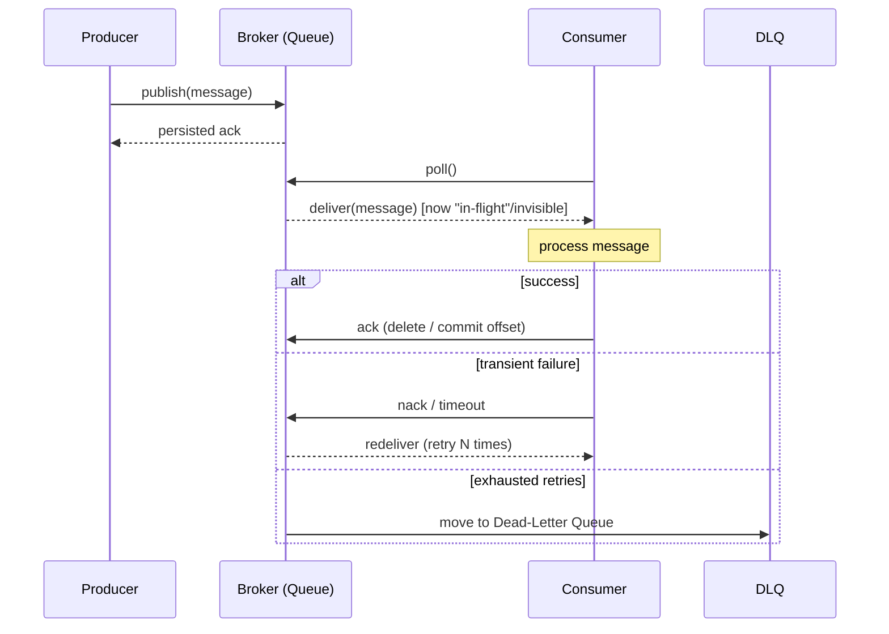
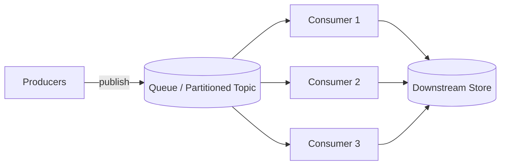

# Message Queues

> Difficulty: 🔵 Moderate

## TL;DR

Message queues let services communicate asynchronously by passing messages through an intermediary broker, decoupling producers from consumers in time, load, and failure. The hard parts of using them well are delivery guarantees (at-least/at-most/exactly-once), ordering, handling poison messages via dead-letter queues, and applying backpressure so a slow consumer doesn't collapse the system. Kafka, RabbitMQ, and SQS make different trade-offs across throughput, ordering, retention, and operational cost.

## Overview

In a naive synchronous architecture, Service A calls Service B directly and waits. If B is slow, A is slow. If B is down, A fails. If B can handle 100 req/s and A produces 1,000 req/s during a spike, requests are dropped. This tight coupling makes systems brittle and hard to scale independently.

A message queue inserts a durable buffer between producers and consumers. The producer writes a message and moves on; the consumer reads and processes it when ready. This solves three problems at once:

- **Temporal decoupling** — producer and consumer don't need to be up at the same time.
- **Load leveling / buffering** — traffic spikes are absorbed by the queue instead of overwhelming downstream services.
- **Independent scaling & failure isolation** — a crash or slowdown in the consumer doesn't propagate back to the producer.

Message queues are foundational to event-driven architectures, background job processing, stream processing, and microservice communication. In interviews, they show up whenever you need to "smooth out" spiky load, run work asynchronously (emails, image processing, notifications), or fan out events to many consumers.

## Key Concepts

- **Producer (publisher):** the service that writes messages to the queue/topic.
- **Consumer (subscriber):** the service that reads and processes messages.
- **Broker:** the server/cluster that stores and routes messages (Kafka broker, RabbitMQ node, SQS service).
- **Queue vs. Topic:** a *queue* typically delivers each message to one consumer (point-to-point / competing consumers); a *topic* supports publish/subscribe fan-out to many independent subscribers.
- **Message / Event:** the unit of data. An event is usually an immutable fact ("OrderPlaced"); a command tells a consumer to do something ("SendEmail").
- **Acknowledgement (ack):** a signal from the consumer that a message was processed successfully so the broker can delete/advance it. A *nack* or timeout triggers redelivery.
- **Offset (Kafka):** a monotonically increasing position of a consumer within a partition; committing an offset marks progress.
- **Visibility timeout (SQS):** a window during which a received message is hidden from other consumers; if not deleted in time, it reappears.
- **Consumer group:** a set of consumers that share the work of a topic/queue, each partition/message going to one member.
- **Dead-Letter Queue (DLQ):** a secondary queue where messages that repeatedly fail processing are diverted for inspection.
- **Backpressure:** mechanisms that slow or pause producers when consumers can't keep up.
- **Idempotency:** processing the same message twice yields the same result — the key to surviving at-least-once delivery.

## How It Works

A producer sends a message to the broker, which persists it (to disk or replicated storage). Consumers pull (poll) or are pushed messages, process them, and acknowledge. Until acknowledged, the broker retains the message so it can be redelivered after a crash. Delivery semantics emerge from *when* and *whether* the ack happens relative to processing.

The competing-consumers pattern scales throughput horizontally: add more consumers to the same queue/group and the broker distributes messages among them.

**Delivery semantics** hinge on ack placement:
- Ack *before* processing → **at-most-once** (crash after ack = message lost).
- Ack *after* processing → **at-least-once** (crash before ack = redelivery / duplicate).
- Ack after processing + dedup/transactions → **effectively exactly-once**.

## Types / Patterns / Strategies

| Pattern | Description | Use case |
|---|---|---|
| Point-to-point (work queue) | One message → one consumer among competing workers | Background jobs, task distribution |
| Publish/Subscribe (fan-out) | One message → all subscribers | Event broadcasting, cache invalidation |
| Request/Reply | Async RPC via a correlation ID and reply queue | Decoupled synchronous-feeling calls |
| Streaming log | Durable, replayable, ordered log of events | Event sourcing, analytics, CDC (Kafka) |
| Priority queue | Higher-priority messages delivered first | Mixed-urgency workloads |
| Delay / scheduled | Deliver after a delay | Retries with backoff, reminders |

**Delivery guarantees:**

| Guarantee | Meaning | Cost / trade-off |
|---|---|---|
| At-most-once | Fire and forget; may drop | Fast, no dedup; unacceptable if loss matters |
| At-least-once | Never lost, may duplicate | Requires **idempotent** consumers; most common default |
| Exactly-once | Processed once, no dup/loss | Expensive; needs transactions or idempotency keys; often "effectively-once" |

> Reality check: true end-to-end exactly-once across systems is impossible without idempotency or transactional coordination. Kafka offers exactly-once *within* Kafka (idempotent producer + transactions); crossing into an external DB still needs an idempotency key or the transactional outbox pattern.

**Ordering strategies:** global ordering kills parallelism. Practical systems use *partition/key-based ordering* — messages with the same key (e.g., `user_id`) go to the same partition and stay ordered relative to each other, while different keys process in parallel.

## When to Use / When to Avoid

**Use a message queue when:**
- Work can be done asynchronously (emails, thumbnails, notifications, indexing).
- Traffic is spiky and you need to buffer/level load.
- You need to decouple services so they scale and fail independently.
- You need fan-out: many consumers react to the same event.
- You need durable, replayable event history (use a log like Kafka).

**Avoid or reconsider when:**
- You need an immediate synchronous response with low latency (a direct RPC/gRPC call is simpler).
- Strict total global ordering across all messages is required at high volume (fights horizontal scaling).
- The workload is trivial and adding a broker introduces more operational complexity than it removes.
- You need strong read-after-write consistency for the caller — queues are eventually consistent by nature.

## Trade-offs

| Pros | Cons |
|---|---|
| Decouples producers/consumers in time and load | Adds operational complexity (a broker to run/monitor) |
| Absorbs spikes; smooths downstream load | Introduces eventual consistency & harder end-to-end tracing |
| Enables independent scaling & failure isolation | Duplicate delivery forces idempotency work |
| Durable buffering survives consumer outages | Ordering guarantees are limited/partition-scoped |
| Fan-out to many consumers cheaply | Debugging async flows is harder than synchronous calls |
| Replayability (log-based systems) | Unbounded queue growth if consumers lag (needs backpressure/monitoring) |

## Real-World Examples

- **Apache Kafka** — distributed commit log; LinkedIn, Uber, Netflix use it for event streaming, metrics pipelines, and CDC. Retains data for replay; extreme throughput.
- **RabbitMQ** — mature AMQP broker with flexible routing (exchanges, bindings); popular for task queues and microservice RPC.
- **Amazon SQS** — fully managed queue (Standard = at-least-once/best-effort order; FIFO = exactly-once processing + ordering). Widely used for serverless/Lambda fan-in.
- **Amazon SNS + SQS fan-out** — SNS publishes to many SQS queues for pub/sub on AWS.
- **Google Pub/Sub**, **Azure Service Bus / Event Hubs** — managed cloud equivalents.
- **Celery + Redis/RabbitMQ** — Python background task processing.
- **Kafka Connect / Debezium** — change-data-capture streaming DB changes into topics.

## Common Pitfalls

- **Assuming exactly-once for free.** Most systems are at-least-once; not making consumers idempotent leads to double charges, duplicate emails, etc.
- **Ignoring the DLQ.** Poison messages retry forever, block partitions, or silently vanish. Always configure a DLQ + alarms and inspect it.
- **No backpressure / unbounded queues.** A slow consumer causes the queue to grow without limit until it exhausts storage or memory.
- **Expecting global ordering.** Standard SQS and multi-partition Kafka don't give total order; order is per-partition/per-key only.
- **Committing offsets before processing.** Causes silent message loss (accidental at-most-once).
- **Too-short visibility timeout (SQS).** Long-running processing exceeds the timeout, the message reappears, and two workers process it concurrently.
- **Large messages in the queue.** Put big payloads in object storage (S3) and pass a reference (claim-check pattern).
- **No monitoring of consumer lag.** Lag is the single most important health metric for a queue-based system.

## Interview Questions & Answers

**Q: What's the difference between at-least-once, at-most-once, and exactly-once delivery, and which should I choose?**
**A:** At-most-once acks before processing so messages can be lost but never duplicated — acceptable only for disposable data (e.g., some metrics). At-least-once acks after processing, so a crash before ack causes redelivery and possible duplicates — the pragmatic default for most systems, paired with idempotent consumers. Exactly-once means no loss and no duplicates; it's expensive and, end-to-end across systems, effectively requires idempotency keys or transactional coordination (e.g., Kafka's idempotent producer + transactions, or the transactional outbox). In practice I'd pick at-least-once + idempotency for reliability with reasonable cost.

**Q: How do you make a consumer idempotent?**
**A:** Attach a stable unique ID to each message (or derive an idempotency key from its content, like `order_id`). Before applying an effect, check whether that ID was already processed — e.g., a dedup table with a unique constraint, a Redis SET of seen IDs with TTL, or an `INSERT ... ON CONFLICT DO NOTHING`. Make the side effect itself idempotent where possible (upserts instead of inserts, conditional writes). The goal is that reprocessing the same message produces no additional change.

**Q: How do message queues preserve ordering, and what are the limits?**
**A:** Total global ordering across a high-throughput queue is impractical because it serializes everything. Systems instead offer partition/key-scoped ordering: messages sharing a key (e.g., `user_id`) are routed to the same partition (Kafka) or message group (SQS FIFO) and stay ordered relative to each other, while different keys process in parallel. So you get ordering *where it matters* without sacrificing all concurrency. Standard SQS gives no ordering guarantee at all; SQS FIFO gives per-message-group ordering.

**Q: What is a Dead-Letter Queue and when does a message go there?**
**A:** A DLQ is a separate queue that receives messages which can't be processed successfully after a configured number of retries (a "poison message" — malformed payload, a bug, or a permanently failing downstream). Diverting them prevents infinite retry loops and head-of-line blocking, and preserves the messages for debugging or manual replay. You should alarm on DLQ depth, inspect the contents to find root causes, and have a replay path once the bug is fixed.

**Q: What is backpressure and how do you implement it?**
**A:** Backpressure is preventing a fast producer from overwhelming a slow consumer. Approaches: bound the queue size and reject/block producers when full; use pull-based consumers so they fetch only what they can handle (Kafka/SQS poll); limit in-flight messages via prefetch (RabbitMQ) or visibility timeout; auto-scale consumers based on queue depth/lag; and as a last resort shed load or apply rate limiting at the producer. Monitoring consumer lag is what tells you backpressure is needed.

**Q: Compare Kafka, RabbitMQ, and SQS. When would you pick each?**
**A:** *Kafka* is a distributed, partitioned commit log built for very high throughput, durable retention, and replay — ideal for event streaming, analytics pipelines, event sourcing, and CDC; ordering is per-partition. *RabbitMQ* is a traditional broker with rich routing (exchanges/bindings), per-message acks, and low-latency delivery — great for task queues, RPC, and complex routing at moderate scale; messages are typically consumed and gone. *SQS* is fully managed with near-zero ops: Standard for high-throughput at-least-once best-effort ordering, FIFO for ordering + dedup. I'd pick SQS when I'm on AWS and want zero operational burden, RabbitMQ when I need flexible routing/RPC on-prem, and Kafka when I need scale, retention, replay, or streaming.

**Q: How do you achieve reliable messaging when writing to a database and publishing an event together?**
**A:** You can't atomically write to a DB and a broker in one transaction reliably (dual-write problem). Use the **transactional outbox pattern**: within the same DB transaction, write the business row and an "outbox" event row. A separate relay process (or CDC via Debezium) reads the outbox and publishes to the queue, marking rows as sent. This guarantees the event is published if and only if the DB commit succeeded, giving at-least-once delivery downstream (consumers still dedup).

**Q: A consumer is falling behind and lag is growing. How do you diagnose and fix it?**
**A:** First confirm via consumer lag metrics (Kafka lag, SQS `ApproximateNumberOfMessages`/age). Check whether the cause is slow processing (downstream DB latency, external API), too few consumers/partitions, poison messages causing retries, or a spike in producer volume. Fixes: scale out consumers (up to partition count for Kafka), increase partitions if that's the ceiling, batch processing, optimize the slow downstream call, route poison messages to a DLQ, and add autoscaling on lag. Long-term, add backpressure and capacity headroom so bursts don't accumulate.

## Further Reading

- *Designing Data-Intensive Applications* — Martin Kleppmann, Ch. 11 (Stream Processing).
- Apache Kafka official documentation — "Design" and "Exactly Once Semantics" sections.
- Amazon SQS Developer Guide — Standard vs. FIFO, visibility timeout, and DLQ configuration.
- RabbitMQ documentation — tutorials on work queues, pub/sub, and acknowledgements/prefetch.
- Confluent blog: "Exactly-Once Semantics Are Possible" and microservices articles on the transactional outbox pattern (also on microservices.io).
