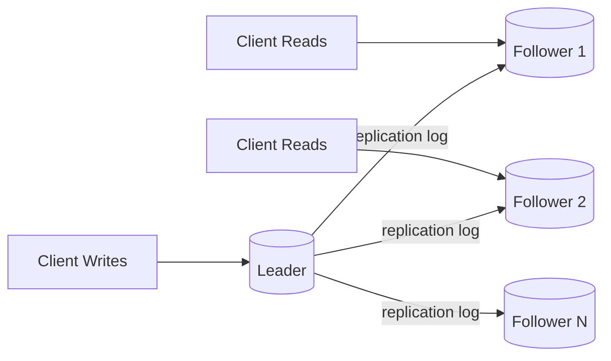
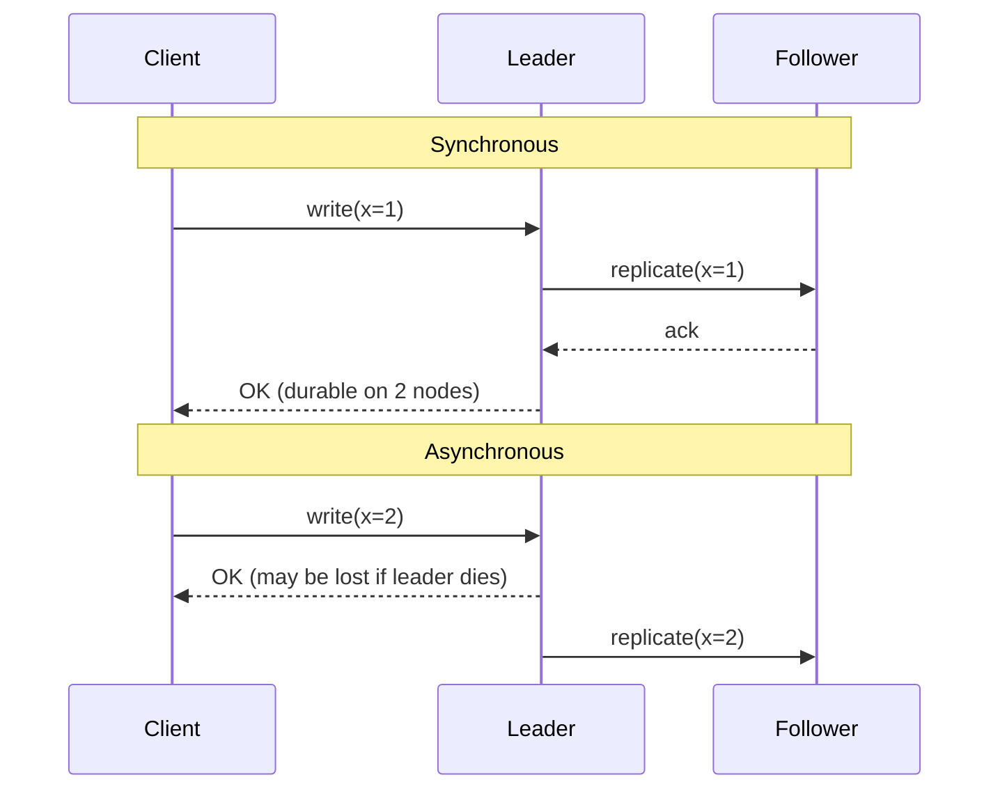

# Replication

> Difficulty: 🔵 Moderate

## TL;DR

Replication keeps copies of the same data on multiple machines so that a system can survive failures, serve reads from nearby nodes, and scale read throughput. The core design decisions are *where* writes are accepted (single leader, multiple leaders, or no leader) and *when* replicas are considered up to date (synchronous vs. asynchronous), and every choice trades consistency against availability and latency.

## Overview

A single database node is a single point of failure and a hard ceiling on throughput. Replication solves three distinct problems at once:

- **High availability / fault tolerance** — if one node dies, another already has the data and can take over.
- **Read scalability** — spread read traffic across many copies instead of hammering one machine.
- **Locality / latency** — put a copy geographically close to users to cut round-trip time.

The hard part is not copying data once; it is keeping copies consistent *while writes keep arriving* and while nodes and networks fail. That tension — consistency vs. availability vs. latency — is what interviewers probe. Replication is the mechanism behind read replicas, cross-region deployments, and most highly available data stores, so it shows up in almost every system design discussion.

## Key Concepts

- **Replica / node:** A machine holding a copy of the dataset.
- **Leader (primary/master):** The node that accepts writes and is the source of truth in leader-based schemes.
- **Follower (replica/secondary/standby):** A node that receives changes from a leader and typically serves reads.
- **Replication log:** The ordered stream of changes (statement-based, write-ahead log shipping, or logical/row-based) shipped from leader to followers.
- **Synchronous replication:** Leader waits for one or more followers to acknowledge a write before confirming to the client. Stronger durability, higher latency.
- **Asynchronous replication:** Leader confirms immediately and propagates changes in the background. Lower latency, risk of data loss on failover.
- **Semi-synchronous:** At least one follower must acknowledge; the rest are async. A common middle ground.
- **Replication lag:** The delay between a write committing on the leader and being visible on a follower.
- **Quorum (W, R, N):** In leaderless systems, `N` = replicas per item, `W` = replicas that must ack a write, `R` = replicas read from. `W + R > N` gives strong overlap.
- **Failover:** Promoting a follower to leader when the leader fails.
- **Split-brain:** Two nodes both believe they are leader and accept conflicting writes.
- **Read-your-writes / monotonic reads:** Consistency guarantees that mitigate the confusing effects of lag.

## How It Works

In the most common model, **leader-follower (primary-replica)**, all writes go to the leader. The leader appends the change to a replication log and streams it to followers, which apply the changes in the same order. Reads can be served by any node.

The synchronous vs. asynchronous decision determines *when the client hears "OK"* relative to follower acknowledgement:

On leader failure, a **failover** process runs: detect the failure (usually a timeout/heartbeat), choose the most up-to-date follower, and reroute clients. This is where async replication bites — any writes that hadn't reached the new leader are lost.

## Types / Patterns / Strategies

| Pattern | Where writes go | Conflict handling | Typical use |
| --- | --- | --- | --- |
| **Leader-follower (single-leader)** | One leader only | No conflicts (single write path) | Most relational DBs, default choice |
| **Multi-leader** | Multiple leaders (often per region) | Must resolve write conflicts | Multi-datacenter, offline-capable apps |
| **Leaderless (quorum)** | Any replica | Version vectors / read repair / hinted handoff | High-availability KV stores |

**Replication log formats:**
- *Statement-based:* ships the SQL; fragile with `NOW()`, `RAND()`, auto-increment.
- *Write-ahead log (WAL) shipping:* ships low-level byte changes; tightly couples storage versions.
- *Logical (row-based):* ships row changes; version-independent and the modern default (e.g., MySQL row-based binlog, Postgres logical replication).

**Conflict resolution (multi-leader / leaderless):** Last-Write-Wins (LWW, lossy), version vectors, CRDTs, or application-level merge (like Git).

## When to Use / When to Avoid

**Use single-leader replication when:**
- You need strong consistency and simple semantics.
- Read load dominates write load (add read replicas).
- One region is sufficient for write latency.

**Use multi-leader when:**
- You have multiple datacenters and need low write latency in each.
- You need offline writes (mobile apps, collaborative editors) that sync later.
- You can tolerate and resolve write conflicts.

**Use leaderless when:**
- Availability during node failures matters more than strict consistency.
- Writes must never block on a single node.
- The workload tolerates eventual consistency and tunable quorums.

**Avoid / be careful when:**
- You add replicas expecting *write* scaling — single-leader does not scale writes; you need sharding for that.
- The app reads immediately after writing and can't tolerate lag (needs read-your-writes routing).
- You enable full synchronous replication across regions — WAN latency will dominate every write.

## Trade-offs

| Pros | Cons |
| --- | --- |
| Fault tolerance — survive node/DC loss | Consistency is hard; lag causes stale reads |
| Read scalability via read replicas | Does not scale writes (except leaderless/sharding) |
| Lower read latency with geo-local replicas | Async replication risks data loss on failover |
| Enables zero/low-downtime maintenance | Failover is error-prone (split-brain, lost writes) |
| Sync replication gives strong durability | Sync adds write latency and reduces availability |
| Multi-leader enables offline & multi-region writes | Multi-leader/leaderless require conflict resolution |

## Real-World Examples

- **PostgreSQL** — streaming replication (WAL), synchronous and async modes, logical replication for selective/cross-version replication.
- **MySQL** — binlog replication (row/statement based); powers read-replica fleets everywhere; Group Replication for HA.
- **Amazon Aurora / RDS Read Replicas** — up to 15 low-lag read replicas sharing a distributed storage layer; multi-AZ failover.
- **Amazon DynamoDB & Apache Cassandra** — leaderless, quorum-based (tunable `W`/`R`), hinted handoff and read repair. DynamoDB Global Tables use multi-region multi-leader with LWW.
- **MongoDB** — replica sets with a single primary, automatic election-based failover (Raft-like).
- **Apache Kafka** — partition leaders + follower replicas with an in-sync-replica (ISR) set; `acks=all` is effectively synchronous durability.
- **Redis** — async primary-replica replication with Sentinel/Cluster for failover.
- **etcd / ZooKeeper / Consul** — consensus-based (Raft/Zab) replication for strongly consistent metadata.

## Common Pitfalls

- **Reading your own write from a lagging follower** and seeing stale data (e.g., user updates profile, refresh shows the old value). Fix with read-your-writes routing.
- **Assuming replicas scale writes.** They don't — all writes still funnel through the leader. Sharding scales writes.
- **Full synchronous replication everywhere**, which means one slow follower blocks all writes and reduces availability. Use semi-sync instead.
- **Ignoring split-brain during failover.** Without fencing (STONITH, leases, quorum), two leaders accept divergent writes.
- **Trusting Last-Write-Wins.** LWW silently discards concurrent writes; clock skew makes "last" ambiguous.
- **Unbounded replication lag** under write spikes or long-running follower queries, causing cascading staleness.
- **Not monitoring lag.** Lag is invisible until a customer complains; it must be a first-class metric with alerts.

## Interview Questions & Answers

**Q: What's the difference between synchronous and asynchronous replication, and which would you choose?**
**A:** Synchronous means the leader waits for follower acknowledgement before confirming the write, guaranteeing the data exists on ≥2 nodes but adding latency and reducing availability (a down follower blocks writes). Asynchronous confirms immediately and replicates in the background — fast and highly available, but writes can be lost if the leader fails before propagating. In practice most systems use **semi-synchronous**: one follower is synchronous (durability guarantee) and the rest are async (performance). I'd choose based on the cost of losing a recent write vs. the latency budget.

**Q: How do read replicas help scaling, and what's their key limitation?**
**A:** They offload read traffic from the leader, so a read-heavy workload can scale horizontally by adding followers. The key limitation is that they **don't scale writes** — every write still goes through the single leader — and they introduce **replication lag**, so reads may be stale. For write scaling you need sharding/partitioning.

**Q: What is replication lag and how do you deal with the "read-your-own-writes" problem?**
**A:** Lag is the delay between a write committing on the leader and appearing on a follower. To guarantee read-your-writes: route a user's reads to the leader for a short window after they write, track a per-user timestamp/log-sequence-number and only read from replicas that have caught up to it, or pin the user's session to the leader. Related guarantees are monotonic reads (never go backwards in time) and consistent-prefix reads.

**Q: Compare single-leader, multi-leader, and leaderless replication.**
**A:** Single-leader has one write node — simple, no write conflicts, strong consistency, but a write bottleneck and failover complexity. Multi-leader allows writes in multiple locations (great for multi-region/offline) but requires conflict resolution because two leaders can accept conflicting writes. Leaderless (Dynamo-style) lets any replica take writes and uses quorums (`W + R > N`) plus read repair and hinted handoff for consistency — maximizes availability but pushes conflict handling (version vectors) to the system/app.

**Q: In a quorum system with N=3, what W and R give strong consistency, and what's the trade-off?**
**A:** Strong consistency requires `W + R > N`, so the read and write quorums overlap on at least one up-to-date replica. With N=3, common choices are W=2, R=2 (balanced), or W=3,R=1 (fast reads, slow/less-available writes), or W=1,R=3 (fast writes, slow reads). Lower W or R improves latency and availability but risks reading stale data; you tune per workload.

**Q: What is split-brain and how do you prevent it during failover?**
**A:** Split-brain is when two nodes both believe they're the leader and accept conflicting writes — usually after a network partition where the old leader wasn't truly dead. Prevention: require a **quorum/majority** to elect a leader (so a minority partition can't self-promote), use **fencing tokens** or leases so the old leader is rejected when it returns, and STONITH ("shoot the other node in the head") to forcibly isolate the suspected-dead node. Consensus protocols like Raft build this in.

**Q: A user updates their profile picture but still sees the old one after refresh. What's happening and how do you fix it?**
**A:** Classic replication-lag / stale-read issue: the write hit the leader, but the refresh read hit a follower that hasn't applied it yet. Fixes: route reads to the leader briefly after a write, track the write's log position and only serve the read from a caught-up replica, or use sticky sessions. It's a read-your-writes consistency problem, not a bug in the write path.

**Q: How does Kafka's ISR (in-sync replicas) model relate to sync vs. async replication?**
**A:** Each Kafka partition has a leader and follower replicas; the ISR set is the followers currently caught up. With `acks=all`, a produce request is acknowledged only after all ISR members replicate it — effectively synchronous durability scoped to the ISR. `min.insync.replicas` sets the floor, so you balance durability (more replicas must ack) against availability (fewer available replicas can stall writes). It's a tunable semi-synchronous design.

## Further Reading

- Martin Kleppmann, *Designing Data-Intensive Applications* — Chapter 5 (Replication) is the canonical treatment.
- DeCandia et al., *"Dynamo: Amazon's Highly Available Key-value Store"* (2007) — foundational leaderless/quorum paper.
- Ongaro & Ousterhout, *"In Search of an Understandable Consensus Algorithm (Raft)"* (2014) — leader election and consistent replication.
- PostgreSQL documentation — *"High Availability, Load Balancing, and Replication"*.
- Apache Kafka documentation — *"Replication"* and *"Designing for Durability"*.

---

## 🛠️ Open-Source Tools & Projects (Used in Production)

| Project | GitHub | What it does / Why it's used |
| --- | --- | --- |
| **Debezium** | [debezium/debezium](https://github.com/debezium/debezium) | CDC platform (~11k★) that streams row-level changes from MySQL/Postgres/Mongo/etc. by reading the transaction log (WAL/binlog). The de-facto OSS way to do logical replication into Kafka. Used at scale for cross-system replication and data pipelines. |
| **PostgreSQL** | [postgres/postgres](https://github.com/postgres/postgres) | Ships built-in **streaming (WAL) replication** and **logical replication** (publish/subscribe). The reference implementation of leader-follower replication in the relational world. |
| **MySQL / Percona** | [percona/percona-server](https://github.com/percona/percona-server) | MySQL-compatible server with enhanced **binlog (row/statement) replication**, Group Replication, and semi-sync. Powers read-replica fleets across the industry. |
| **pglogical** | [2ndQuadrant/pglogical](https://github.com/2ndQuadrant/pglogical) | Logical streaming replication extension for Postgres (pub/sub), enabling selective, cross-version, and bidirectional replication — faster than Slony/Bucardo/Londiste. |
| **Vitess** | [vitessio/vitess](https://github.com/vitessio/vitess) | MySQL clustering/sharding system (~19k★) built at YouTube, now CNCF-graduated. Manages replication topologies + failover; used by Slack, GitHub, HubSpot. |
| **etcd** | [etcd-io/etcd](https://github.com/etcd-io/etcd) | Strongly-consistent distributed KV store (~48k★) using **Raft** for replicated, consensus-based log replication. Backs Kubernetes control plane. |
| **Apache Kafka** | [apache/kafka](https://github.com/apache/kafka) | Distributed log with partition-leader + follower replicas and the **ISR (in-sync-replica)** model; `acks=all` gives synchronous durability. Ubiquitous for streaming replication. |
| **MongoDB** | [mongodb/mongo](https://github.com/mongodb/mongo) | Replica sets with a single primary and Raft-like election-based automatic failover. Common reference for HA document-store replication. |
| **Maxwell's Daemon** | [zendesk/maxwell](https://github.com/zendesk/maxwell) | Lightweight MySQL binlog → JSON CDC producer (~4k★) from Zendesk. Simpler alternative to Debezium for MySQL replication into Kafka/Kinesis. |
| **Canal** | [alibaba/canal](https://github.com/alibaba/canal) | Alibaba's MySQL binlog subscription & CDC framework (~29k★), widely used in China for real-time replication and cache invalidation. |

## 📖 Blogs, Articles & Learning Resources

- [Designing Data-Intensive Applications — Ch. 5 (Replication)](https://dataintensive.net/) — Kleppmann's canonical, must-read treatment of single/multi/leaderless replication and consistency.
- [Dynamo: Amazon's Highly Available Key-value Store (2007 paper)](https://www.allthingsdistributed.com/files/amazon-dynamo-sosp2007.pdf) — foundational leaderless/quorum + hinted-handoff + read-repair paper.
- [In Search of an Understandable Consensus Algorithm (Raft paper)](https://raft.github.io/raft.pdf) — leader election and consistent log replication, the basis of etcd/Consul.
- [The Raft interactive visualization](https://raft.github.io/) — watch leader election and log replication happen step by step.
- [PostgreSQL Docs — High Availability, Load Balancing & Replication](https://www.postgresql.org/docs/current/high-availability.html) — authoritative on streaming vs. logical replication, sync modes, failover.
- [Debezium Documentation](https://debezium.io/documentation/) — how log-based CDC works per connector; the practical guide to logical replication pipelines.
- [Apache Kafka — Replication & Design for Durability](https://kafka.apache.org/documentation/#replication) — ISR, `min.insync.replicas`, and acks trade-offs explained by the source.
- [AWS Database Blog — Cross-Region Read Replicas & DR](https://aws.amazon.com/blogs/database/) — real production patterns for multi-region RDS/Aurora replicas and disaster recovery.
- [MySQL Reference — Replication](https://dev.mysql.com/doc/refimg/8.0/en/replication.html) — binlog formats (row/statement/mixed), semi-sync, and Group Replication.
- [Jepsen analyses](https://jepsen.io/analyses) — rigorous, real-world consistency/replication failure tests of Postgres, Mongo, etcd, Kafka, etc.
- [Martin Kleppmann — "Please stop calling databases CP or AP"](https://martin.kleppmann.com/2015/05/11/please-stop-calling-databases-cp-or-ap.html) — sharpens how to reason about replication consistency guarantees.
- [MIT 6.824 Distributed Systems (video lectures + labs)](https://pdos.csail.mit.edu/6.824/) — build Raft and a replicated KV store yourself; the gold-standard free course.

## 🗺️ Learning Plan — Google & Learn (Step by Step)

1. **Why replicate at all** (HA, read scaling, locality). Search: `` `why database replication high availability read scaling` ``
2. **Leader-follower (primary-replica) basics.** Search: `` `leader follower replication explained` ``
3. **Sync vs. async vs. semi-synchronous replication.** Search: `` `synchronous vs asynchronous replication tradeoffs` ``
4. **Replication log formats** (statement, WAL shipping, logical/row-based). Search: `` `statement based vs row based vs logical replication` ``
5. **Replication lag & read-your-writes consistency.** Search: `` `replication lag read your own writes monotonic reads` ``
6. **Failover, heartbeats, and split-brain.** Search: `` `database failover split brain fencing STONITH` ``
7. **Multi-leader replication & conflict resolution.** Search: `` `multi leader replication conflict resolution LWW CRDT` ``
8. **Leaderless / quorum replication (Dynamo-style).** Search: `` `quorum W R N read repair hinted handoff dynamo` ``
9. **Consensus-based replication with Raft.** Search: `` `raft consensus log replication leader election explained` ``
10. **Hands-on: set up Postgres streaming + logical replication.** Search: `` `postgresql streaming replication primary standby setup tutorial` ``
11. **Hands-on: MySQL binlog replication + read replica.** Search: `` `mysql set up replication binlog read replica step by step` ``
12. **Hands-on: log-based CDC with Debezium + Kafka.** Search: `` `debezium kafka postgres CDC tutorial docker` ``
13. **Hands-on / capstone: implement Raft yourself.** Search: `` `MIT 6.824 raft lab implement leader election log replication` ``

**✅ You'll know you understand this when:** you can (1) explain when to pick single-leader vs. multi-leader vs. leaderless and defend the consistency/availability trade-off; (2) diagnose a stale-read complaint as replication lag and prescribe read-your-writes routing; and (3) stand up a working Postgres/MySQL replica (or a Debezium CDC pipeline) and reason about what happens on failover.
