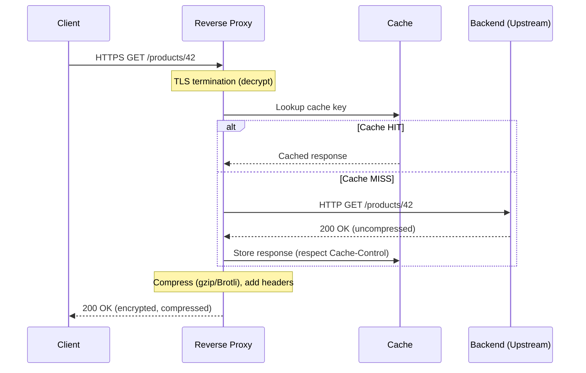

# Reverse Proxy

> Difficulty: 🔵 Moderate

## TL;DR

A reverse proxy is a server that sits in front of one or more backend servers and forwards client requests to them, returning the responses as if it were the origin. It centralizes cross-cutting concerns like TLS termination, caching, compression, load balancing, and security, so backends stay simpler and clients only ever talk to a single, controlled entry point.

## Overview

When you expose application servers directly to the internet, every server has to independently handle TLS certificates, gzip compression, rate limiting, IP filtering, and health checking. That duplicates logic, leaks internal topology to clients, and makes scaling painful.

A reverse proxy solves this by acting as an intermediary on the **server side**. Clients connect to the proxy; the proxy connects to the real backends. This creates a clean seam where you can:

- Terminate TLS once and speak plaintext (or re-encrypted TLS) to internal services.
- Cache responses to shed load off origins.
- Compress responses centrally.
- Hide backend IPs, ports, and technology stacks.
- Route and load-balance traffic across a fleet.

It matters because it is one of the most common building blocks in system design. Almost every non-trivial architecture has *something* in the reverse-proxy family (NGINX, Envoy, an ALB, an API gateway, a CDN edge) between clients and services. Interviewers use it to probe whether you understand where cross-cutting concerns belong.

## Key Concepts

- **Forward proxy:** Sits in front of *clients*, acting on their behalf toward the internet (e.g., a corporate egress proxy). The origin server does not know the real client.
- **Reverse proxy:** Sits in front of *servers*, acting on their behalf toward clients. The client does not know which backend actually served the request.
- **Origin / upstream server:** The real backend application server the proxy forwards to. NGINX calls these "upstreams."
- **TLS termination:** Decrypting inbound HTTPS at the proxy so backends receive plaintext HTTP. The proxy owns the certificate and private key.
- **TLS re-encryption (end-to-end / passthrough):** Re-encrypting to the backend (termination + new TLS) or passing encrypted bytes straight through (SNI-based routing without decryption).
- **Caching:** Storing responses (keyed by URL, headers, etc.) so repeat requests are served without hitting the origin.
- **Compression:** Shrinking response bodies (gzip, Brotli, zstd) to reduce bandwidth and latency.
- **Upstream pool:** The set of backends the proxy can route to, with health checks and a load-balancing policy.
- **Health check:** Active (proxy probes `/health`) or passive (proxy observes failed requests) detection of unhealthy backends.
- **Layer 4 vs Layer 7:** L4 proxies route by IP/port (TCP/UDP) without understanding the payload; L7 proxies parse HTTP and can route by path, header, or cookie.

## How It Works

A client resolves your domain to the proxy's IP. The proxy accepts the connection, optionally terminates TLS, inspects the request (for L7), checks its cache, and if there's a miss, selects a healthy upstream and forwards the request. The response flows back through the proxy, which may compress and cache it before returning it to the client. The client believes it talked to a single server.

**TLS termination** is often the headline feature. The proxy holds the certificate, does the expensive handshake and symmetric crypto, and forwards plaintext to backends inside a trusted network. This centralizes cert rotation (one place to renew Let's Encrypt certs) and offloads CPU from application servers. When compliance requires encryption in transit everywhere, the proxy instead *re-encrypts* to the backend.

**Caching** at the proxy keys on the request (typically method + URL + `Vary` headers) and honors `Cache-Control`, `Expires`, and `ETag`. A well-tuned cache can absorb the vast majority of read traffic for static or slowly-changing content.

**Compression** is applied on the response path, negotiated via the client's `Accept-Encoding` header. Doing it at the proxy means backends emit raw payloads and don't burn CPU per instance.

## Types / Patterns / Strategies

| Pattern | What it does | Typical tool |
|---|---|---|
| **TLS-terminating proxy** | Decrypts HTTPS, forwards plaintext internally | NGINX, HAProxy, ALB |
| **TLS passthrough (SNI routing)** | Routes encrypted connections by SNI without decrypting | HAProxy, Envoy, NLB |
| **Caching proxy / CDN edge** | Serves cached responses close to users | Varnish, NGINX, Cloudflare, CloudFront |
| **API gateway** | L7 proxy plus auth, rate limiting, request transformation, aggregation | Kong, Amazon API Gateway, Apigee |
| **Load balancer** | Distributes traffic across a pool with health checks | AWS ALB/NLB, HAProxy, Envoy |
| **Sidecar / service mesh proxy** | Per-pod proxy handling mTLS, retries, observability | Envoy (Istio, Linkerd) |
| **Ingress controller** | Kubernetes-native reverse proxy for cluster traffic | ingress-nginx, Envoy Gateway, Traefik |

**Load balancing strategies** at the proxy: round-robin, least-connections, weighted, IP-hash (sticky sessions), and consistent hashing (for cache affinity).

## When to Use / When to Avoid

**Use a reverse proxy when:**
- You need to terminate TLS in one place and rotate certs centrally.
- You want to cache or compress responses without touching every backend.
- You need to hide backend topology and present a single hostname.
- You're load-balancing across multiple instances or doing blue/green and canary routing.
- You need centralized rate limiting, WAF, or request/response rewriting.

**Avoid or reconsider when:**
- You have a single backend with trivial traffic and no TLS/caching needs — the extra hop adds latency and an operational component for little gain.
- You require true end-to-end encryption with zero decryption in the middle *and* the proxy can't do L7 features on encrypted traffic (passthrough limits you to L4 routing).
- The proxy would become an unmonitored single point of failure — if you can't make it redundant, you're trading one risk for another.

## Trade-offs

| Pros | Cons |
|---|---|
| Centralizes TLS, caching, compression, security | Adds a network hop → extra latency |
| Hides backend topology and simplifies backends | Becomes a critical component; needs HA/redundancy |
| Enables load balancing, canary, blue/green | TLS termination means plaintext exists inside the perimeter |
| One place for cert rotation and observability | Misconfiguration (caching private data, header handling) is high-blast-radius |
| Offloads CPU (crypto, gzip) from app servers | Operational overhead: config, scaling, patching the proxy itself |
| Can absorb read traffic via caching | Stateful features (sticky sessions, cache) complicate scaling the proxy tier |

## Real-World Examples

- **NGINX / NGINX Plus** — the canonical reverse proxy; TLS termination, caching, and load balancing in one binary.
- **HAProxy** — high-performance L4/L7 proxy, popular for TLS passthrough and precise load balancing.
- **Envoy** — modern L7 proxy powering **Istio** and **Linkerd** service meshes and **AWS App Mesh**; sidecar model with rich observability.
- **AWS Application Load Balancer (ALB)** — managed L7 reverse proxy with TLS termination and path/host routing; **NLB** is the L4 counterpart.
- **Varnish** — specialized HTTP caching reverse proxy used by many high-traffic content sites.
- **Cloudflare / Amazon CloudFront / Fastly** — CDNs that are globally distributed reverse-proxy/caching edges.
- **Kong / Amazon API Gateway / Apigee** — API gateways layering auth, rate limiting, and transformation on top of proxying.
- **Traefik / ingress-nginx** — Kubernetes ingress controllers.

## Common Pitfalls

- **Caching private/personalized responses** because `Cache-Control: private` or `Vary: Authorization` was missing — one user sees another user's data. A classic and dangerous bug.
- **Forgetting `X-Forwarded-For` / `X-Forwarded-Proto`** so backends log the proxy's IP instead of the client's, and generate `http://` redirect URLs after TLS was terminated at the proxy.
- **No timeouts / retries tuned** — a slow backend ties up proxy connections and cascades into resource exhaustion. Retrying non-idempotent requests can double-charge or double-write.
- **Buffering large uploads/downloads** in the proxy causing memory pressure; streaming should be configured for big payloads.
- **Treating the proxy as stateless when it isn't** — sticky sessions and local caches make horizontal scaling and failover non-trivial.
- **Single point of failure** — deploying one proxy instance with no redundancy or health-checked failover.
- **Header smuggling / request smuggling** — inconsistent parsing between proxy and backend (Content-Length vs Transfer-Encoding) enables serious attacks; keep proxy and backend HTTP parsing aligned and patched.

## Interview Questions & Answers

**Q:** What is the difference between a forward proxy and a reverse proxy?
**A:** A forward proxy sits in front of clients and acts on their behalf toward the internet — the origin server sees the proxy, not the client (e.g., corporate egress filtering, anonymity). A reverse proxy sits in front of servers and acts on their behalf toward clients — the client sees the proxy, not the backend. The distinction is *whose side* the proxy represents: forward = client side, reverse = server side.

**Q:** What is TLS termination and what are its trade-offs?
**A:** TLS termination is decrypting inbound HTTPS at the proxy so backends receive plaintext HTTP. Benefits: centralized certificate management and rotation, offloaded crypto CPU from app servers, and the ability to inspect/route/cache at L7. Trade-off: plaintext now exists between the proxy and backends, so that network segment must be trusted or you must re-encrypt (TLS bridging) to satisfy end-to-end encryption requirements. Passthrough avoids decryption entirely but limits you to L4 routing.

**Q:** How does caching at a reverse proxy work, and how do you avoid serving stale or private data?
**A:** The proxy stores responses keyed by request attributes (method, URL, and any headers listed in `Vary`) and honors origin directives like `Cache-Control`, `Expires`, and `ETag`. To avoid staleness, use short TTLs, `ETag`/`Last-Modified` revalidation, and explicit purges/invalidation on writes. To avoid serving private data, mark personalized responses `Cache-Control: private` or `no-store`, and `Vary` on `Authorization`/`Cookie`. The dangerous failure mode is caching an authenticated response and serving it to another user.

**Q:** Reverse proxy vs load balancer vs API gateway — how are they related?
**A:** They overlap heavily. A **load balancer** focuses on distributing traffic across a pool with health checks (L4 or L7). A **reverse proxy** is the general category — any server-side intermediary that forwards requests and can add TLS termination, caching, and compression; most load balancers are reverse proxies. An **API gateway** is a specialized L7 reverse proxy for APIs that adds application concerns: authentication/authorization, rate limiting, request/response transformation, API key management, and sometimes response aggregation. Rule of thumb: load balancer = "spread traffic," reverse proxy = "server-side intermediary with cross-cutting features," API gateway = "reverse proxy that also understands and governs your API."

**Q:** Where should compression happen — at the proxy or the backend?
**A:** Usually at the proxy. It negotiates `Accept-Encoding` centrally, applies gzip/Brotli/zstd once, and keeps backends emitting raw payloads (simpler, lower per-instance CPU). Exceptions: if the proxy does TLS passthrough and can't see the payload, or if the backend already stores pre-compressed assets. Also avoid double-compression and don't compress already-compressed formats (JPEG, video) — you spend CPU for no gain.

**Q:** Why is a reverse proxy a risk, and how do you mitigate it?
**A:** It's a critical path component and can become a single point of failure and a security-sensitive chokepoint (it holds TLS keys and sees plaintext). Mitigations: run it redundantly behind a highly-available L4 layer or DNS/anycast, health-check and auto-heal instances, set aggressive timeouts and circuit breaking, keep the proxy patched (request-smuggling CVEs are common), scope its blast radius, and monitor it heavily since all traffic flows through it.

**Q:** How does a reverse proxy handle client IP and protocol information after TLS termination?
**A:** Because the backend now sees a connection *from the proxy*, the proxy must inject headers: `X-Forwarded-For` (original client IP), `X-Forwarded-Proto` (original scheme, e.g., `https`), and `X-Forwarded-Host`. The modern standard is the `Forwarded` header (RFC 7239). Backends must trust these only from known proxies (otherwise clients can spoof them) and use `X-Forwarded-Proto` to build correct absolute/redirect URLs, or you'll get redirect loops between http and https.

**Q:** When would you choose L4 (TCP) proxying over L7 (HTTP) proxying?
**A:** Choose L4 when you need raw throughput and low latency, when you don't need to inspect or route on HTTP content, or when you must preserve end-to-end TLS (passthrough by SNI). Choose L7 when you need path/host/header-based routing, caching, compression, header rewriting, or WAF — all of which require parsing the application-layer payload, which means terminating TLS.

## Further Reading

- *High Performance Browser Networking* — Ilya Grigorik (O'Reilly) — TLS, HTTP, and proxy/caching internals.
- NGINX documentation — "Reverse Proxy," "Content Caching," and "Load Balancing" guides (nginx.org / docs.nginx.com).
- Envoy Proxy documentation — architecture, L4/L7 filters, and service-mesh usage (envoyproxy.io).
- RFC 7234 (HTTP Caching) and RFC 7239 (`Forwarded` HTTP Extension) — canonical specs.
- Cloudflare Learning Center — "What is a reverse proxy?" and CDN/caching articles.
