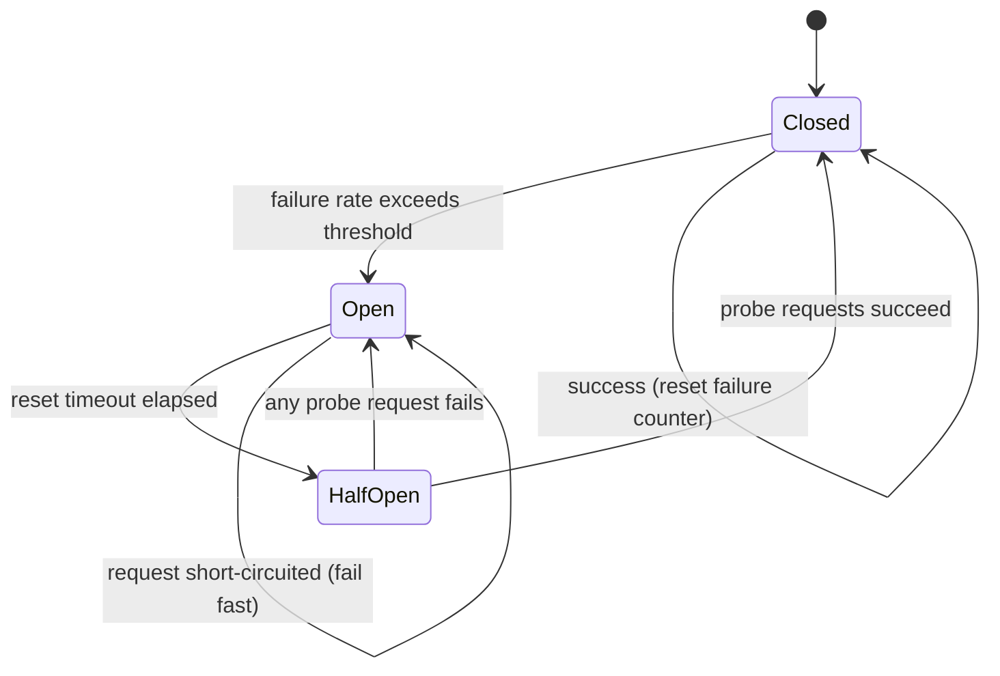
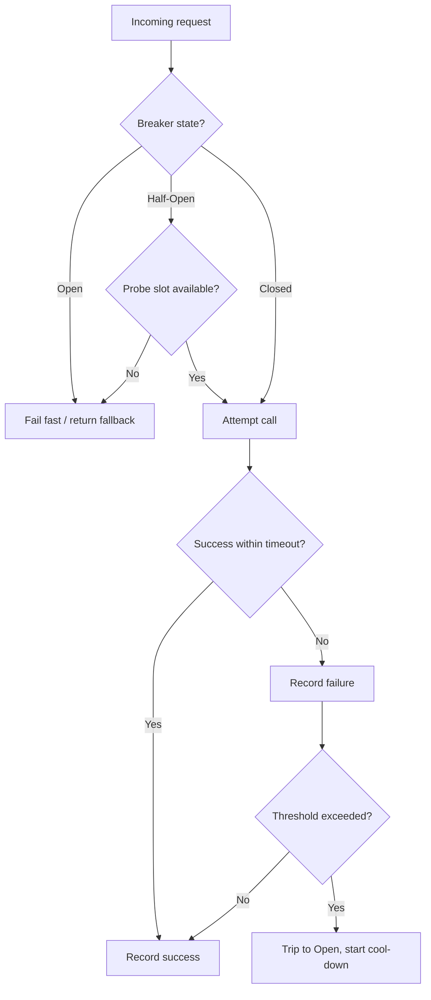

# Circuit Breakers

> Difficulty: 🟠 Hard

## TL;DR

A circuit breaker is a stability pattern that wraps a remote call and stops sending traffic to a failing dependency once errors exceed a threshold, "tripping open" to fail fast instead of piling up doomed requests. It moves through **Closed → Open → Half-Open** states, giving a struggling downstream service time to recover while protecting upstream latency, threads, and connection pools. In production it is almost always paired with timeouts, retries-with-backoff, bulkheads, and fallbacks to form a complete resilience strategy.

## Overview

In a distributed system, one slow dependency can take down an entire service. When a downstream call hangs, the caller's threads block, connection pools drain, queues back up, and latency propagates upstream until the whole request path collapses — a **cascading failure**. Naively retrying makes it worse: a retry storm hammers an already-overloaded service and prevents it from recovering.

The circuit breaker, popularized by Michael Nygard in *Release It!*, borrows the electrical metaphor: when current is dangerous, the breaker trips and cuts the circuit. In software, once a dependency looks unhealthy, the breaker **fails fast** — returning an error or fallback immediately without even attempting the call. This does two things: it protects the *caller* from wasting resources on calls that will likely fail, and it protects the *callee* by shedding load so it can recover.

Circuit breakers matter most in service meshes and microservice architectures where a single user request may fan out to dozens of downstream calls. They are the difference between one degraded dependency causing graceful partial degradation versus a full site outage.

## Key Concepts

- **Closed:** Normal operation. Requests pass through; the breaker counts failures/successes.
- **Open:** The breaker has tripped. Requests fail immediately (or hit a fallback) without calling the dependency. Lasts for a configured **reset timeout / cool-down**.
- **Half-Open:** After the cool-down, the breaker allows a limited number of trial requests through to probe whether the dependency has recovered.
- **Failure threshold:** The condition that trips the breaker — e.g., a rolling error rate (>50% over 20 requests) or a consecutive failure count. Rate-based over a rolling window is generally preferred over raw counts.
- **Reset timeout (cool-down):** How long the breaker stays Open before transitioning to Half-Open.
- **Timeout:** The maximum time a caller waits for a response. Without timeouts, a breaker can't detect "slow" failures — timeouts turn hangs into countable failures.
- **Retry with backoff:** Re-attempting a failed call after a growing delay, ideally with **jitter** to avoid synchronized retry storms.
- **Bulkhead:** Isolating resources (thread pools, connection pools, semaphores) per dependency so one saturated dependency can't starve others.
- **Fallback:** The degraded response returned when the breaker is open or a call fails — cached data, a default value, or a "service unavailable" message.
- **Slow-call detection:** Treating calls that exceed a latency threshold as failures even if they eventually succeed, since slow calls exhaust resources just like errors.

## How It Works

A breaker instruments each protected call. On success it records a success; on error or timeout it records a failure. When the failure metric crosses the threshold, it transitions Closed → Open and starts the reset timer. While Open, calls short-circuit instantly. When the timer expires, it moves to Half-Open and lets a small number of probe requests through. If those succeed, it closes; if any fail, it re-opens and restarts the timer (often with an increased cool-down).

The request-path decision logic per call looks like this:

The critical insight: the breaker is a **feedback loop**. Timeouts feed failure signals into it, the threshold decides when to trip, and the Half-Open state is a controlled experiment to test recovery without re-flooding the dependency.

## Types / Patterns / Strategies

| Strategy | What it does | When it helps |
|---|---|---|
| **Count-based breaker** | Trips after N consecutive failures | Simple, low-traffic services; can be noisy |
| **Rate-based breaker** | Trips when error % over a rolling window exceeds threshold | Preferred for high-traffic; robust to occasional blips |
| **Slow-call breaker** | Counts calls slower than a latency threshold as failures | Dependencies that degrade (get slow) before erroring |
| **Timeouts** | Cap wait time per call | Always — turns hangs into fast, countable failures |
| **Retry + exponential backoff + jitter** | Re-attempt transient failures with growing, randomized delays | Idempotent operations; transient/network errors |
| **Bulkhead (thread pool / semaphore)** | Isolate concurrency per dependency | Prevent one dependency from starving others |
| **Fallback** | Return degraded/cached/default response | Graceful degradation, maintaining partial availability |
| **Rate limiter / load shedder** | Cap inbound request volume | Protect a service from being overwhelmed in the first place |

These compose in layers: **timeout → retry (with backoff+jitter) → circuit breaker → bulkhead → fallback**. A common ordering mistake is retrying *outside* the breaker; retries should be bounded and the breaker should count exhausted retries as failures.

## When to Use / When to Avoid

**Use when:**
- Calling a remote dependency over the network (another microservice, a database, a third-party API).
- Failures are likely to be temporary and the dependency benefits from reduced load to recover.
- You need to prevent cascading failures and cap tail latency in a fan-out request path.
- The dependency has clear, observable health signals (error rate, latency).

**Avoid or reconsider when:**
- The call is a fast, in-process, local operation — the breaker overhead and false trips aren't worth it.
- Failures are permanent/deterministic (bad input, auth errors); a breaker won't help and may mask the real bug. Distinguish 4xx (don't trip) from 5xx/timeouts (do trip).
- Very low traffic makes statistical thresholds meaningless — a single failure can trip a rate-based breaker. Use minimum-throughput gates.
- You can't provide a sensible fallback and failing fast is worse than failing slow (rare, but consider the UX).

## Trade-offs

| Pros | Cons |
|---|---|
| Prevents cascading failures across services | Adds configuration complexity (thresholds, timeouts, windows) |
| Fails fast — frees threads/connections/memory | Poorly tuned thresholds cause false trips or fail to trip |
| Gives struggling dependencies room to recover | Introduces a new failure mode (breaker itself misbehaving) |
| Improves tail latency and user-perceived stability | Fallbacks can mask real problems if not monitored/alerted |
| Enables graceful degradation via fallbacks | Half-open probing needs care to avoid re-tripping storms |
| Provides rich health metrics for observability | Shared/global breaker state across instances is hard to coordinate |

## Real-World Examples

- **Netflix Hystrix** — the canonical library that popularized breakers + bulkheads (thread-pool isolation) + fallbacks; now in maintenance mode but hugely influential.
- **Resilience4j** — the modern JVM standard (Hystrix's successor): functional, lightweight, combines CircuitBreaker, RateLimiter, Retry, Bulkhead, TimeLimiter modules.
- **Envoy / Istio service mesh** — implement outlier detection and circuit breaking (max connections, pending requests, retries) at the sidecar/mesh level, transparent to app code.
- **AWS SDKs & App Mesh** — retry with exponential backoff and jitter is built into the SDKs; the AWS Architecture Blog's "Exponential Backoff and Jitter" post is a foundational reference.
- **NGINX / HAProxy** — passive health checks eject failing upstreams (a breaker-like behavior) from the load-balancing pool.
- **Polly (.NET)** and **gobreaker (Go)** — widely used breaker implementations in their ecosystems.

## Common Pitfalls

- **No timeouts:** A breaker can't trip on a hang if the call never returns. Always set aggressive, tuned timeouts first.
- **Retrying without backoff/jitter:** Synchronized retries create thundering-herd storms that keep the dependency down.
- **Tripping on client errors:** Counting 4xx (bad request, auth) as failures trips the breaker on problems a breaker can't fix.
- **Retries stacked at every layer:** N layers each retrying 3× yields 3^N amplification. Retry at one layer, ideally the edge closest to the failure.
- **Thresholds without minimum throughput:** A single failure in a low-traffic window trips a percentage-based breaker.
- **Fallbacks that call other remote services:** The fallback can fail too, or become the new bottleneck. Prefer cached/static fallbacks.
- **No bulkhead:** One saturated dependency exhausts the shared thread pool and starves healthy ones — the breaker on X does nothing for Y.
- **Ignoring breaker metrics:** An open breaker silently serving fallbacks can hide an outage for hours. Alert on state transitions and fallback rates.
- **Global vs per-instance state confusion:** Each instance usually has its own breaker; a per-instance breaker won't reflect fleet-wide health without shared state.

## Interview Questions & Answers

**Q:** Walk me through the three circuit breaker states and the transitions between them.
**A:** **Closed** is normal operation — requests flow and the breaker tracks the failure rate. When failures exceed the threshold (e.g., >50% over a rolling window with a minimum request count), it transitions to **Open**, where all calls fail fast without touching the dependency for a cool-down period. After the reset timeout, it moves to **Half-Open** and permits a limited number of probe requests. If those succeed, it returns to Closed; if any fail, it goes back to Open and typically extends the cool-down. Half-Open is the key safety mechanism — it tests recovery with minimal load instead of instantly re-flooding a fragile dependency.

**Q:** Why do you need timeouts for a circuit breaker to work well?
**A:** Breakers trip on *failures*, but the most dangerous failure mode is a slow/hung dependency, not an outright error. Without a timeout, a call can block a thread indefinitely, so the breaker never sees a failure to count and threads leak until the pool is exhausted. A tuned timeout converts a hang into a fast, countable failure, feeding the breaker's threshold logic and freeing resources. Ideally you also add slow-call detection so calls that are technically successful but too slow still count against health.

**Q:** How would you set the failure threshold, and why is a rate-based threshold usually better than a count-based one?
**A:** I'd use a rolling-window rate — e.g., trip if error rate > 50% over the last 20 requests in a 10-second window — plus a minimum-throughput gate so the breaker doesn't trip on tiny samples. Count-based ("N consecutive failures") is simple but brittle: under high traffic a handful of unrelated failures can trip it, and it doesn't reflect actual health proportion. Rate-based adapts to traffic volume and tolerates transient blips. The exact numbers depend on the dependency's baseline error rate and SLO; I'd tune them from real latency/error distributions, not guess.

**Q:** How do retries and circuit breakers interact? What's the danger if you get the ordering wrong?
**A:** Retries handle *transient* failures; breakers handle *sustained* ones. They must be layered carefully: retry (with exponential backoff + jitter, bounded attempts) sits inside the breaker, and once retries are exhausted the breaker counts that as a single failure. The danger is retry amplification — if every layer of a call chain retries independently, you get exponential load multiplication (a retry storm) that keeps the dependency down and defeats the breaker's load-shedding purpose. Best practice: retry at one layer only, always with jitter, and let the breaker cut retries entirely once it's open.

**Q:** What is a bulkhead and how does it complement a circuit breaker?
**A:** A bulkhead isolates resources per dependency — separate thread pools, connection pools, or concurrency semaphores — so one saturated dependency can't consume all shared resources and starve healthy calls. It's named after ship compartments that stop one breach from sinking the vessel. The breaker decides *whether* to call a dependency based on its health; the bulkhead limits *how much* concurrency any single dependency can ever consume. Together, a breaker prevents cascading failures over time and a bulkhead prevents resource contention across dependencies at any instant. Hystrix combined both; Resilience4j offers them as composable modules.

**Q:** What makes a good fallback, and what are common fallback anti-patterns?
**A:** A good fallback degrades gracefully and is cheap and reliable — serving stale cached data, a sensible default, a queued write for later, or a clear "temporarily unavailable" message. Anti-patterns: fallbacks that call *another* remote service (which can also fail or become the new bottleneck), fallbacks that silently return wrong data masking an outage, and fallbacks with no monitoring so nobody notices the breaker has been open for hours. Fallbacks should be observable — alert on fallback rate — and idempotent/side-effect-free where possible.

**Q:** In a service mesh like Istio/Envoy, where does circuit breaking live, and what's the trade-off vs an in-app library like Resilience4j?
**A:** In a mesh, breaking (outlier detection, connection/request limits) lives in the sidecar proxy, transparent to application code and consistent across languages — great for polyglot fleets and central policy control. The trade-off is that the sidecar only sees network-level signals, not application semantics (it can't easily distinguish a business-logic degradation or apply a rich in-process fallback). An in-app library like Resilience4j has full application context and can implement custom fallbacks and slow-call logic, but it's language-specific and must be configured per service. Many teams use both: mesh-level breaking as a coarse safety net plus in-app breakers for fine-grained, semantic control.

**Q:** How do you avoid a "thundering herd" when a circuit breaker goes half-open across many instances?
**A:** Two problems: retry synchronization and simultaneous half-open probing. For retries, add full jitter to backoff so instances don't align. For half-open, limit the number of concurrent probe requests (Resilience4j's `permittedNumberOfCallsInHalfOpenState`) so only a trickle tests the dependency, and stagger reset timeouts slightly across instances. You can also use randomized/exponential cool-downs so all breakers don't re-open in lockstep. The goal is to test recovery with the minimum load that still yields a reliable health signal.

## Further Reading

- Michael T. Nygard, *Release It! Design and Deploy Production-Ready Software* (2nd ed.) — origin of the circuit breaker stability pattern.
- Martin Fowler, "CircuitBreaker" — martinfowler.com/bliki/CircuitBreaker.html.
- AWS Architecture Blog, "Exponential Backoff and Jitter" — the canonical reference on retry backoff.
- Resilience4j official documentation — resilience4j.readme.io (CircuitBreaker, Bulkhead, Retry, TimeLimiter modules).
- Netflix Tech Blog, "Making the Netflix API More Resilient" (Hystrix) — real-world breaker + bulkhead + fallback design.
