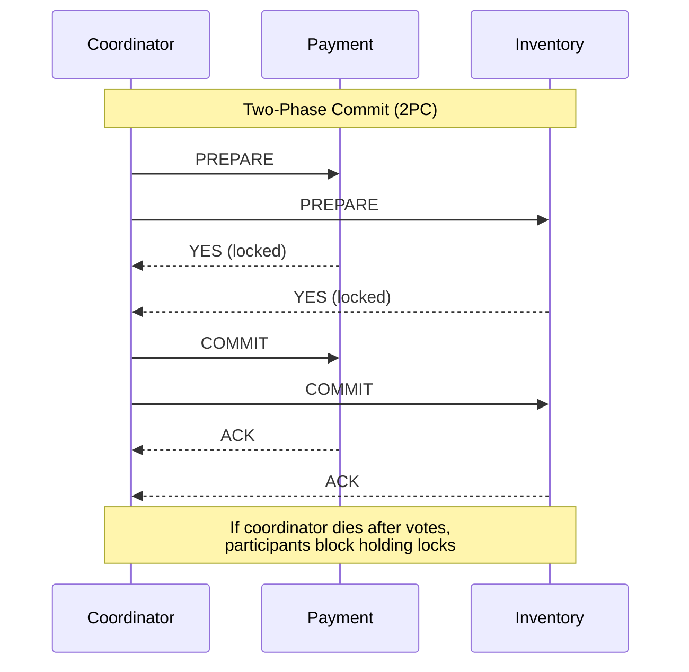
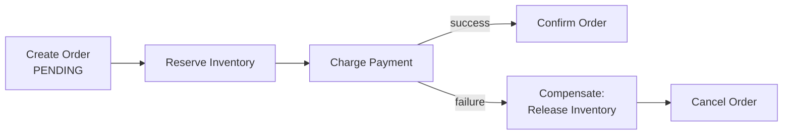

# Distributed Transactions

> Difficulty: 🟠 Hard

## TL;DR

A distributed transaction coordinates atomic state changes across multiple independent services or databases that don't share a single transaction manager. Because you can't get ACID guarantees "for free" across the network, you choose a protocol that trades availability, latency, and consistency: blocking coordination (2PC/3PC) or eventual consistency with compensations (Saga). In modern microservice architectures, the Saga + Outbox + idempotency combination is the dominant, resilient pattern — 2PC is largely avoided.

## Overview

In a monolith with one database, atomicity is trivial: `BEGIN; ...; COMMIT;` and the database guarantees all-or-nothing. The moment your data lives in **multiple databases or services** (Order service, Payment service, Inventory service), a single local transaction can no longer span them. If Payment succeeds but Inventory fails, you have money charged with no goods reserved — a broken, inconsistent system.

Distributed transactions solve the problem of **maintaining data consistency across service/database boundaries** without a shared transaction log. This matters because:

- Microservices intentionally decouple data ownership (database-per-service).
- The network is unreliable — messages get lost, duplicated, and reordered; nodes crash mid-operation.
- The CAP theorem forces a choice: during a partition you get either consistency **or** availability, not both.

The core tension is between **strong consistency** (everyone agrees immediately, at the cost of blocking and reduced availability) and **eventual consistency** (fast and available, but with temporary anomalies you must design around).

## Key Concepts

- **Atomicity across boundaries**: all participants commit or all abort — the hard property to preserve without a shared transaction manager.
- **2PC (Two-Phase Commit)**: a blocking consensus protocol with a coordinator; phases are *prepare* (vote) and *commit*.
- **3PC (Three-Phase Commit)**: adds a *pre-commit* phase and timeouts to reduce blocking; rarely used in practice.
- **Saga**: a sequence of **local** transactions where each step publishes an event/command; failures trigger **compensating transactions** that semantically undo prior steps.
- **Compensating transaction**: a business-level "undo" (e.g., refund a payment) — not a rollback, since the original commit already happened.
- **Choreography**: Saga coordination via events; services react to each other with no central brain.
- **Orchestration**: Saga coordination via a central orchestrator that tells each service what to do next.
- **Outbox pattern**: write the business change and an "event to publish" row in the *same* local DB transaction, then relay the event asynchronously — solving the dual-write problem.
- **Dual-write problem**: the risk of updating a database and publishing to a message broker as two separate operations that can partially fail.
- **Idempotency**: an operation can be applied multiple times with the same effect as once — essential for at-least-once delivery.
- **Isolation anomalies**: because Sagas expose intermediate state, other transactions can read partial/uncommitted-in-spirit data (dirty reads, lost updates).

## How It Works

**2PC** relies on a coordinator. In the prepare phase, the coordinator asks every participant "can you commit?"; each participant does the work, durably writes to a prepare log, locks resources, and votes YES/NO. If all vote YES, the coordinator sends COMMIT; any NO (or timeout) yields ABORT. The fatal flaw: if the coordinator crashes after participants voted YES but before sending the decision, participants are **blocked** holding locks indefinitely.

**Saga** avoids distributed locks entirely. Each service commits its own local transaction and emits an event. If a downstream step fails, the saga runs compensating transactions in reverse to restore business consistency. It sacrifices isolation (intermediate states are visible) for availability and low latency.



The Saga alternative below shows a compensating flow when a later step fails:



**Outbox** makes event publishing reliable. Instead of "save order, then publish to Kafka" (two systems, can partially fail), you do "save order AND insert into outbox table" in one local transaction. A separate relay (polling or Change Data Capture) reads the outbox and publishes to the broker, marking rows sent. Because the relay may retry, consumers must be **idempotent**.

```mermaid
sequenceDiagram
    participant App
    participant DB as Local DB (Orders + Outbox)
    participant Relay as CDC / Poller
    participant Broker as Kafka
    App->>DB: BEGIN; insert order; insert outbox; COMMIT
    Relay->>DB: read unsent outbox rows
    Relay->>Broker: publish event
    Relay->>DB: mark outbox row as sent
    Note over Relay,Broker: at-least-once → consumers must be idempotent
```

## Types / Patterns / Strategies

| Approach | Coordination | Consistency | Blocking? | Typical Use |
|---|---|---|---|---|
| **2PC** | Central coordinator, locks | Strong (atomic commit) | Yes — blocks on coordinator failure | Single-vendor DBs, XA transactions, financial ledgers within one trust domain |
| **3PC** | Coordinator + pre-commit + timeouts | Strong (non-blocking in theory) | Reduced, but fails under network partitions | Almost never in production |
| **Saga — Choreography** | Events; no central controller | Eventual | No | Simple flows, few services, loose coupling |
| **Saga — Orchestration** | Central orchestrator/state machine | Eventual | No | Complex flows, many steps, need visibility/observability |
| **Outbox** | Transactional event publishing | Supports Saga reliability | No | Any event-driven system needing exactly-effectively-once publishing |

**Choreography vs Orchestration**: Choreography is decentralized — Order publishes `OrderCreated`, Inventory reacts, Payment reacts. It's loosely coupled but the overall flow is implicit and hard to trace as steps grow (cyclic event chains). Orchestration centralizes the workflow in a state machine (e.g., "on `PaymentCharged`, do `ConfirmOrder`"), giving explicit, testable, observable flow at the cost of a central component that must not become a bottleneck or god-service.

## When to Use / When to Avoid

**Use 2PC when**: you're within a single database technology or an XA-capable transaction manager, transactions are short, the network is reliable and low-latency (same datacenter), and correctness outweighs availability (e.g., a bank's internal ledger). Avoid across microservices or over WANs.

**Use Saga (orchestration) when**: you span multiple services with independent databases, need high availability, can tolerate brief inconsistency, and the workflow has several steps that benefit from central visibility. Prefer orchestration once you have 3+ steps or conditional branching.

**Use Saga (choreography) when**: the flow is short (2–3 services), teams want maximum decoupling, and event chains stay simple and acyclic.

**Always use Outbox + idempotency when** publishing events after a state change — this is table stakes for correctness in event-driven systems.

**Avoid distributed transactions entirely when** you can redesign the boundary: sometimes the "right" fix is to co-locate the data in one service so a single local transaction suffices. The cheapest distributed transaction is the one you don't have.

## Trade-offs

| Pros | Cons |
|---|---|
| 2PC gives true atomic consistency across participants | 2PC blocks and holds locks; coordinator is a single point of failure |
| Saga is highly available and non-blocking | Saga sacrifices isolation — intermediate states are visible (dirty reads) |
| Saga scales to many services with local transactions only | Compensations are complex, must be idempotent, and some actions can't be undone (e.g., sent email) |
| Outbox eliminates the dual-write problem reliably | Outbox adds a relay component and at-least-once (duplicate) delivery |
| Orchestration gives clear, observable, testable workflows | Orchestrator can become a bottleneck or a coupling god-object |
| Choreography maximizes decoupling | Choreography's implicit flow is hard to debug and prone to cyclic dependencies |

## Real-World Examples

- **Kafka + Debezium**: the canonical Outbox/CDC stack — Debezium tails the DB transaction log and streams outbox rows to Kafka.
- **AWS Step Functions** and **Temporal**: durable orchestration engines widely used to implement orchestrated Sagas with retries, timeouts, and compensation logic.
- **Netflix Conductor**: an orchestration engine built specifically for microservice workflows/Sagas.
- **Uber Cadence** (predecessor to Temporal): powers long-running, fault-tolerant business transactions.
- **Axon Framework / Eventuate Tram**: Java frameworks providing Saga and Outbox support out of the box (Chris Richardson's Eventuate).
- **Google Spanner / CockroachDB**: use variants of 2PC combined with Paxos/Raft (and TrueTime in Spanner) to make distributed commit practical and non-blocking within one database system.
- **X/Open XA & JTA**: the classic 2PC standard used by app servers with relational databases and message queues.

## Common Pitfalls

- **Treating a compensation as a rollback**: the original transaction already committed; you must design a *business* undo (refund, release, cancel), and account for non-compensatable actions.
- **Ignoring idempotency**: with at-least-once delivery, a duplicate `ChargePayment` double-charges the customer. Every handler needs an idempotency key or dedup store.
- **The dual-write trap**: "save to DB, then publish to Kafka" outside a transaction — a crash in between loses or fabricates events. Use Outbox.
- **Using 2PC across microservices/WAN**: reintroduces tight coupling, cross-service locks, and cascading unavailability.
- **Assuming Saga gives isolation**: it does not. Design for the "semantic lock" / pending-state anomalies (e.g., an order in `PENDING` that others can see).
- **Unbounded compensations**: if a compensation itself fails, you need retries with backoff and a dead-letter / manual intervention path.
- **Choreography sprawl**: adding "just one more event listener" until nobody can reason about the flow; migrate to orchestration before it becomes unmanageable.

## Interview Questions & Answers

**Q:** Why is 2PC generally avoided in microservice architectures?
**A:** Because it's a *blocking* protocol that holds locks across services. If the coordinator crashes after participants vote YES but before broadcasting the decision, participants are stuck holding locks with no safe way to proceed, hurting availability. It also creates tight coupling and a single point of failure, and performs poorly over WAN latencies. Microservices favor availability and loose coupling, so Sagas with eventual consistency are preferred.

**Q:** What problem does the Outbox pattern solve, and how?
**A:** The dual-write problem: you can't atomically update your database *and* publish to a message broker, since they're separate systems. Outbox inserts the event into an `outbox` table within the *same local DB transaction* as the business change, guaranteeing they commit together. A separate relay (polling or CDC like Debezium) then reads the outbox and publishes to the broker, marking rows sent. Delivery is at-least-once, so consumers must be idempotent.

**Q:** Choreography vs orchestration for Sagas — how do you choose?
**A:** Choreography (event-driven, no central controller) maximizes decoupling and suits short flows of 2–3 services, but the overall workflow is implicit and becomes hard to trace and debug as event chains grow, risking cycles. Orchestration centralizes the flow in a state machine, giving explicit, observable, testable logic — better for complex, multi-step, or conditional workflows. I default to orchestration (Temporal/Step Functions) once there are 3+ steps or branching, accepting the orchestrator as a managed dependency.

**Q:** How do you achieve idempotency in a Saga step?
**A:** Assign each request a unique idempotency key (e.g., `orderId` + operation). Before applying, check a dedup store or a unique constraint: if the key was already processed, return the prior result instead of re-executing. For money movement, record the key in the same transaction as the effect so a retry can't double-apply. This makes at-least-once delivery safe.

**Q:** Sagas sacrifice isolation. What anomalies arise and how do you mitigate them?
**A:** Because each step commits locally, intermediate states are visible: other transactions can see partial results (analogous to dirty reads), and concurrent Sagas can cause lost updates. Mitigations include *semantic locks* (a `PENDING` status that signals "in progress"), *commutative updates* (order-independent operations), *reread values* before acting, and *versioning* to detect concurrent modification. You essentially move isolation from the database into your application design.

**Q:** How does 3PC try to fix 2PC, and why isn't it widely used?
**A:** 3PC inserts a *pre-commit* phase between prepare and commit, plus timeouts, so participants can make progress (default to a decision) if the coordinator fails, avoiding indefinite blocking. But it assumes a synchronous network with bounded delays and no partitions — assumptions that don't hold in real distributed systems. Under a network partition it can produce inconsistent decisions, so it's mostly theoretical; production systems use Paxos/Raft-based commit (as in Spanner/CockroachDB) instead.

**Q:** What happens if a compensating transaction fails?
**A:** You can't just give up — the system would be left inconsistent. You retry the compensation with exponential backoff (it must be idempotent). If retries are exhausted, route it to a dead-letter queue for alerting and manual/automated remediation. Critically, design steps so compensations are always possible; for irreversible actions (sending an email, shipping goods), reorder the Saga so those happen last, after all reversible steps have committed (the "pivot transaction" concept).

**Q:** How do Spanner and CockroachDB make distributed commit practical when 2PC "doesn't work"?
**A:** They combine 2PC for atomic commit *with* a consensus protocol (Paxos in Spanner, Raft in CockroachDB) to replicate each participant's state, so no single coordinator failure blocks progress — the coordinator role is itself fault-tolerant and its decision is durably replicated. Spanner additionally uses TrueTime (tight clock bounds) to assign globally consistent commit timestamps, enabling external consistency. So it's 2PC's atomicity without 2PC's single-point blocking.

## Further Reading

- Chris Richardson, *Microservices Patterns* (Manning) — chapters on Saga, Outbox, and transactional messaging (also microservices.io/patterns).
- Martin Kleppmann, *Designing Data-Intensive Applications* (O'Reilly) — Chapter 9 on distributed transactions, 2PC, and consensus.
- Google Research, *"Spanner: Google's Globally-Distributed Database"* (OSDI 2012) — practical distributed commit with TrueTime.
- Hector Garcia-Molina & Kenneth Salem, *"Sagas"* (ACM SIGMOD 1987) — the original Saga paper.
- Debezium documentation — Outbox Event Router pattern; and Temporal.io / AWS Step Functions docs for orchestrated Sagas.

---

## 🛠️ Open-Source Tools & Projects (Used in Production)

| Project | GitHub | What it does / Why it's used |
|---|---|---|
| **Apache Seata** | [apache/incubator-seata](https://github.com/apache/incubator-seata) | High-performance distributed transaction framework (~25k★) supporting AT, TCC, Saga, and XA modes. Born at Alibaba/Ant and battle-tested at massive scale; the de-facto choice in the Java/Spring Cloud + Dubbo ecosystem. |
| **DTM** | [dtm-labs/dtm](https://github.com/dtm-labs/dtm) | Language-agnostic distributed transaction manager (~11k★) implementing Saga, TCC, XA, 2-phase message, and outbox patterns. Popular in Go microservices; provides cross-service eventual consistency with SDKs for many languages. |
| **Temporal** | [temporalio/temporal](https://github.com/temporalio/temporal) | Durable-execution / workflow engine (~14k★) used to build orchestrated Sagas with automatic retries, timeouts, and compensation. Used by Netflix, Snap, Datadog, Coinbase, Stripe. Successor to Uber Cadence. |
| **Uber Cadence** | [cadence-workflow/cadence](https://github.com/cadence-workflow/cadence) | Uber's original fault-tolerant, stateful workflow engine (~8k★) for long-running business transactions and Sagas. Still runs at Uber scale; Temporal is its community fork. |
| **Netflix Conductor (OSS)** | [conductor-oss/conductor](https://github.com/conductor-oss/conductor) | Durable workflow/orchestration engine built at Netflix (~13k★), now maintained by Orkes. Used in production at Netflix, Tesla, LinkedIn, and J.P. Morgan to orchestrate microservice Sagas. |
| **Debezium** | [debezium/debezium](https://github.com/debezium/debezium) | Change Data Capture platform (~11k★) with a built-in **Outbox Event Router** SMT. The canonical way to reliably relay outbox rows from the DB transaction log to Kafka, solving the dual-write problem. |
| **Eventuate Tram** | [eventuate-tram/eventuate-tram-core](https://github.com/eventuate-tram/eventuate-tram-core) | Chris Richardson's transactional messaging library implementing the transactional outbox + CDC and Saga orchestration/choreography for Spring Boot microservices. Reference implementation for *Microservices Patterns*. |
| **Axon Framework** | [AxonFramework/AxonFramework](https://github.com/AxonFramework/AxonFramework) | Java framework (~3k★) for CQRS/Event Sourcing with first-class **Saga** support, deadlines, and compensation. Widely used for event-driven distributed transactions in the JVM world. |
| **MassTransit** | [MassTransit/MassTransit](https://github.com/MassTransit/MassTransit) | .NET distributed application framework (~6k★) with built-in **state-machine Sagas**, outbox, and retry/redelivery over RabbitMQ/Azure Service Bus/Kafka. The go-to for Saga orchestration in .NET. |
| **NServiceBus** | [Particular/NServiceBus](https://github.com/Particular/NServiceBus) | Mature .NET messaging platform with saga persistence, outbox, and reliable messaging; used in production for long-running distributed business processes. |

## 📖 Blogs, Articles & Learning Resources

- [Saga pattern — microservices.io](https://microservices.io/patterns/data/saga.html) — Chris Richardson's canonical definition of the Saga pattern, choreography vs orchestration, and its trade-offs.
- [Transactional outbox — microservices.io](https://microservices.io/patterns/data/transactional-outbox.html) — The reference write-up on solving the dual-write problem with an outbox table.
- [Reliable Microservices Data Exchange With the Outbox Pattern — Debezium blog](https://debezium.io/blog/2019/02/19/reliable-microservices-data-exchange-with-the-outbox-pattern/) — Hands-on walkthrough of implementing outbox + CDC with Debezium and Kafka.
- [Saga Orchestration for Microservices Using the Outbox Pattern — InfoQ](https://www.infoq.com/articles/saga-orchestration-outbox/) — Combines orchestrated Sagas with the outbox pattern end-to-end.
- [Outbox Event Router — Debezium docs](https://debezium.io/documentation/reference/stable/transformations/outbox-event-router.html) — Official configuration reference for the CDC-based outbox relay.
- [Designing Data-Intensive Applications, Ch. 9 (Martin Kleppmann)](https://dataintensive.net/) — Definitive treatment of distributed transactions, 2PC, linearizability, and consensus.
- [Sagas (Garcia-Molina & Salem, 1987) — the original paper](https://www.cs.cornell.edu/andru/cs711/2002fa/reading/sagas.pdf) — The foundational academic paper that introduced the Saga concept.
- [Spanner: Google's Globally-Distributed Database (OSDI 2012)](https://research.google/pubs/pub39966/) — How Google combines 2PC with Paxos and TrueTime for practical distributed commit.
- [Life beyond Distributed Transactions (Pat Helland)](https://www.ics.uci.edu/~cs223/papers/cidr07p15.pdf) — Influential essay on why you scale by avoiding distributed transactions and using entities + workflows instead.
- [Temporal — What is a Saga? / docs](https://docs.temporal.io/encyclopedia/) — Practical guide to implementing Sagas with a durable-execution engine, including compensation.
- [Patterns for distributed transactions within a microservices architecture — Red Hat Developer](https://developers.redhat.com/blog/2018/10/01/patterns-for-distributed-transactions-within-a-microservices-architecture) — Compares 2PC, event-driven, and Saga approaches with concrete guidance.
- [Distributed Transactions & Two-Phase Commit — Martin Kleppmann (video lecture)](https://www.youtube.com/watch?v=-_Mdo1Fc9Nc) — Clear video explanation of 2PC, its blocking failure mode, and alternatives.

## 🗺️ Learning Plan — Google & Learn (Step by Step)

1. **Foundations: ACID & why local transactions are easy.** Understand atomicity/isolation before going distributed. `` `ACID properties transactions explained` ``
2. **The problem: database-per-service & the dual-write problem.** Learn why microservices break single-DB atomicity. `` `microservices database per service dual write problem` ``
3. **CAP theorem & consistency models.** Understand the availability-vs-consistency trade-off that forces protocol choice. `` `CAP theorem consistency vs availability partition` ``
4. **Two-Phase Commit (2PC) & why it blocks.** Learn prepare/commit phases and the coordinator-failure blocking problem. `` `two phase commit protocol blocking coordinator failure` ``
5. **Three-Phase Commit & XA/JTA.** Learn 3PC's pre-commit phase and the classic XA standard for DB/MQ transactions. `` `three phase commit XA transaction JTA explained` ``
6. **The Saga pattern fundamentals.** Learn local transactions + compensating transactions. `` `saga pattern compensating transaction microservices` ``
7. **Choreography vs Orchestration.** Learn the two Saga coordination styles and when each fits. `` `saga choreography vs orchestration tradeoffs` ``
8. **The Transactional Outbox pattern.** Learn to atomically persist state and an event to publish. `` `transactional outbox pattern kafka explained` ``
9. **Change Data Capture (CDC) with Debezium.** Learn how CDC relays outbox rows reliably. `` `debezium outbox event router kafka tutorial` ``
10. **Idempotency & exactly-once semantics.** Learn idempotency keys and dedup for at-least-once delivery. `` `idempotency key exactly once messaging design` ``
11. **Saga isolation anomalies & countermeasures.** Learn semantic locks, commutative updates, versioning. `` `saga pattern lack of isolation countermeasures semantic lock` ``
12. **Modern distributed commit: Spanner & CockroachDB.** Learn how consensus (Paxos/Raft) + 2PC + TrueTime make commit practical. `` `spanner cockroachdb distributed transaction paxos raft truetime` ``
13. **Durable execution engines: Temporal / Cadence / Conductor.** Learn how orchestrators implement resilient Sagas. `` `temporal workflow saga compensation tutorial` ``
14. **Hands-on: build a toy orchestrated Saga (Order → Payment → Inventory) with compensations.** `` `saga orchestration spring boot payment inventory example github` ``
15. **Hands-on: run the outbox + CDC stack locally with Debezium, Kafka, and Postgres via Docker Compose.** `` `debezium postgres kafka outbox docker compose example` ``

**✅ You'll know you understand this when:** you can (1) explain why 2PC blocks and why microservices prefer Sagas + eventual consistency; (2) design an orchestrated Saga with correct compensating transactions and identify non-compensatable steps; and (3) implement an idempotent consumer fed by a transactional outbox + CDC relay without any dual-write.
