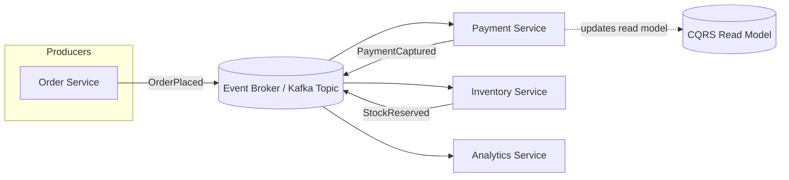
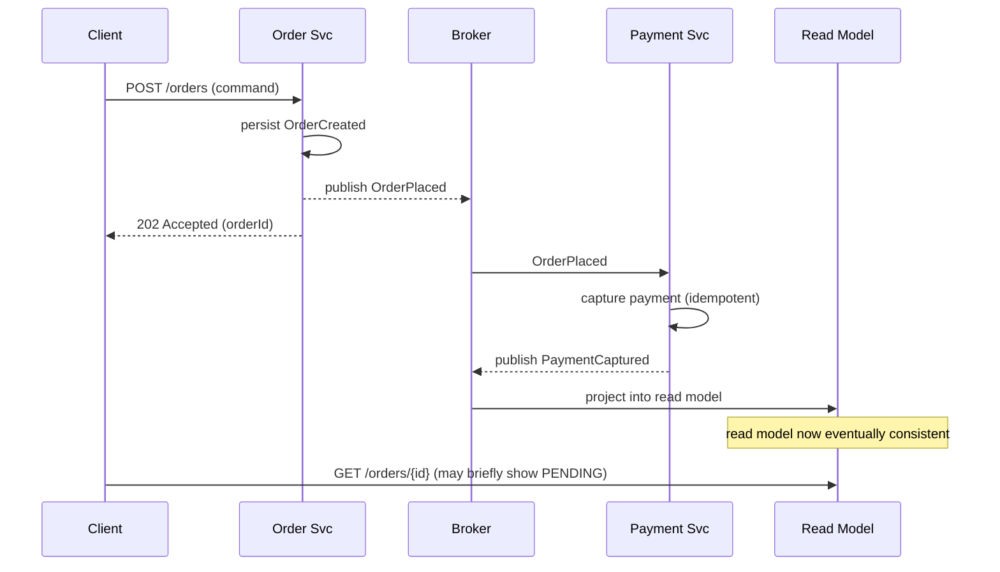

# Event Driven Architecture

> Difficulty: 🟠 Hard

## TL;DR

Event-Driven Architecture (EDA) is a style where services communicate by producing and consuming **events** — immutable facts about something that happened — instead of calling each other directly. It decouples producers from consumers in time and space, enabling scalability, resilience, and extensibility, at the cost of harder debugging, eventual consistency, and operational complexity. The hard parts of EDA in interviews are almost always about ordering, idempotency, delivery guarantees, and consistency — not about the message broker itself.

## Overview

In a synchronous, request/response system (REST/gRPC), the caller must know *who* to call, *wait* for a response, and *fail* if the callee is down. This creates tight temporal coupling: every service in a call chain must be available simultaneously, and adding a new consumer of some data means modifying the producer.

EDA inverts this. A producer emits an event ("OrderPlaced") to a broker and forgets about it. Any number of consumers can react — the payment service charges the card, the inventory service reserves stock, the analytics service updates a dashboard — without the producer knowing they exist. This solves three concrete problems:

- **Decoupling** — producers and consumers evolve independently; new consumers are added without touching producers.
- **Scalability & resilience** — the broker buffers load spikes; a slow or down consumer doesn't block the producer.
- **Extensibility** — new capabilities are bolted on by subscribing to existing event streams.

The trade-off is that you give up the simplicity of a synchronous "call and know the answer now." Flows become distributed, asynchronous, and eventually consistent, which is why EDA sits firmly in the "hard" tier.

## Key Concepts

- **Event** — an immutable record of something that *already happened* in the past tense (`PaymentCaptured`, `UserRegistered`). It states a fact; it does not tell anyone what to do.
- **Command** — a request for something to happen in the future, imperative (`CapturePayment`, `RegisterUser`). It is directed at a specific handler and can be rejected.
- **Producer / Publisher** — the service that emits events.
- **Consumer / Subscriber** — a service that reacts to events.
- **Broker / Event Bus** — the infrastructure that transports events (Kafka, RabbitMQ, SNS/SQS, Pulsar).
- **Topic / Stream** — a named channel to which events are published.
- **Event Sourcing** — persisting state as an ordered log of events rather than as current-state rows; the log is the source of truth.
- **CQRS (Command Query Responsibility Segregation)** — separating the write model (commands) from one or more read models (queries), often projected from an event stream.
- **Choreography** — decentralized coordination where each service reacts to events autonomously.
- **Orchestration** — centralized coordination where a single orchestrator directs the workflow.
- **Eventual consistency** — replicas/read models converge to the same state *after* some delay, not instantly.
- **Idempotency** — processing the same event more than once produces the same result (essential under at-least-once delivery).
- **Delivery semantics** — at-most-once, at-least-once, exactly-once (the last is effectively "effectively-once" via idempotency/dedup).

## How It Works

A producer writes an event to a topic on the broker. The broker durably stores it (Kafka keeps an append-only, partitioned, replicated log). Consumers subscribe and pull (or are pushed) events, tracking their position via an **offset**. Because the broker persists events, consumers can be offline and catch up, replay from the beginning, or have multiple independent consumer groups reading the same stream at their own pace.

Ordering is only guaranteed *within a partition*. To keep related events ordered (e.g., all events for `order-123`), you use a **partition key** so they land on the same partition. Delivery is typically **at-least-once**, so consumers must be **idempotent** — deduplicating by event ID or using conditional writes.

The sequence below shows a choreographed order flow, including the asynchronous, eventually-consistent nature of the read model update.

## Types / Patterns / Strategies

| Pattern | What it is | When it shines |
|---|---|---|
| **Simple Pub/Sub** | Fan-out of events to many independent subscribers | Notifications, cache invalidation, analytics |
| **Event Notification** | Thin event ("OrderChanged") — consumer calls back for details | Low coupling on payload schema; avoids fat events |
| **Event-Carried State Transfer** | Event carries all data the consumer needs, no callback | Reduce chatty synchronous calls; consumer autonomy |
| **Event Sourcing** | Store the event log as source of truth; rebuild state by replay | Full audit, temporal queries, rebuildable projections |
| **CQRS** | Separate write model from read model(s) | Read/write scale independently; polyglot read stores |
| **Choreography** | Services react to events, no central brain | Loose coupling, easy to add consumers |
| **Orchestration (Saga)** | Central orchestrator drives steps + compensations | Complex, long-running transactions needing visibility |
| **Transactional Outbox** | Write event + state in one DB tx, relay to broker | Avoids dual-write inconsistency between DB and broker |

**Events vs Commands (the classic distinction):** a command is addressed to *one* handler and may be rejected ("CapturePayment"); an event is broadcast to *zero-to-many* and is a statement of fact that cannot be rejected ("PaymentCaptured"). Commands express intent; events express outcome.

## When to Use / When to Avoid

**Use EDA when:**
- Multiple independent services need to react to the same business fact.
- You need to absorb bursty, spiky load with buffering/backpressure.
- Workflows are long-running or span many services (order fulfillment, onboarding).
- You need a strong audit trail or the ability to replay history (event sourcing).
- Teams need to deploy and scale independently.

**Avoid or limit EDA when:**
- You need a strongly consistent, immediate read-after-write (e.g., "did this transfer succeed *right now*?"). Synchronous is simpler.
- The workflow is a simple, short request/response with a single owner.
- Your team lacks the operational maturity to run brokers, monitor lag, and debug distributed traces.
- Strict global ordering across all entities is required (hard and expensive to achieve).

A pragmatic rule: use EDA at service boundaries where decoupling pays off; keep strong consistency *inside* a single service/aggregate.

## Trade-offs

| Pros | Cons |
|---|---|
| Loose coupling; producers unaware of consumers | Harder to reason about end-to-end flow |
| Independent scaling and deployment | Eventual consistency complicates UX and logic |
| Resilience — broker buffers, consumers catch up | Debugging is distributed; needs tracing/correlation IDs |
| Easy extensibility (add a subscriber) | At-least-once delivery forces idempotency everywhere |
| Natural audit trail (esp. event sourcing) | Ordering only per-partition; global ordering is costly |
| Absorbs load spikes / smooths backpressure | Schema evolution & versioning are ongoing burdens |
| Replay enables new read models & recovery | Operational complexity: brokers, DLQs, lag monitoring |

## Real-World Examples

- **Apache Kafka** — the de facto durable, partitioned event log; backbone of EDA at LinkedIn (its origin), Uber, and thousands of others.
- **AWS** — SNS (pub/sub fan-out) + SQS (queues), EventBridge (event bus with routing/filtering), Kinesis (streaming), DynamoDB Streams.
- **Netflix** — event-driven microservices; Keystone pipeline on Kafka for trillions of events/day; heavy use of async messaging.
- **Uber** — Kafka-based event streaming for trip events, pricing, and its Cadence/Temporal orchestration engine for sagas.
- **RabbitMQ / Apache Pulsar / NATS / Google Pub/Sub** — alternative brokers.
- **Temporal & AWS Step Functions** — orchestration engines for sagas/long-running workflows.
- **EventStoreDB** — a database purpose-built for event sourcing.
- **Confluent + Debezium** — Change Data Capture (CDC) to turn DB changes into event streams (transactional outbox in practice).

## Common Pitfalls

- **Ignoring idempotency** — assuming exactly-once delivery. Under at-least-once, duplicate processing corrupts state. Dedupe by event ID or use conditional/upsert writes.
- **Dual-write problem** — writing to the DB and publishing to the broker as two separate steps; a crash between them loses or invents events. Fix with the **transactional outbox** or CDC.
- **Fat events / leaking internal schema** — over-stuffing events couples consumers to producer internals. Version schemas and use a schema registry.
- **Expecting global ordering** — Kafka only orders within a partition. Design partition keys around your ordering needs.
- **No poison-message handling** — a bad event blocks the partition forever. Use retries + **dead-letter queues (DLQ)**.
- **Treating events as commands** — naming an event `DoPayment` couples the producer to a specific consumer's action, defeating decoupling.
- **Event sourcing everything** — it's powerful but adds huge complexity (snapshots, replay, schema versioning). Use it where audit/replay matters, not by default.
- **Unbounded consumer lag** — not monitoring lag; consumers silently fall behind and reads go stale.
- **Building distributed transactions** — trying to force 2PC across services instead of embracing sagas and compensation.

## Interview Questions & Answers

**Q: What's the difference between an event and a command, and why does it matter?**
**A:** A command is an imperative request directed at exactly one handler and can be rejected (`CapturePayment`). An event is a past-tense, immutable fact broadcast to zero-or-more consumers that cannot be rejected (`PaymentCaptured`). It matters because commands imply the sender knows and depends on the receiver (coupling), while events let the producer stay ignorant of consumers (decoupling). Mislabeling — emitting a "command-shaped event" — reintroduces the coupling EDA is meant to remove.

**Q: How do you handle duplicate message delivery?**
**A:** Assume at-least-once delivery and make consumers idempotent. Techniques: attach a unique event ID and track processed IDs (dedup table with TTL), use conditional writes / upserts keyed on business identity, or make operations naturally idempotent (setting a status is idempotent; incrementing a counter is not — so store deltas keyed by event ID). "Exactly-once" in Kafka is really idempotent producers + transactions within Kafka; across external side effects you still need application-level idempotency.

**Q: Explain the dual-write problem and how to solve it.**
**A:** When a service must update its database *and* publish an event, doing them as two independent operations risks inconsistency: the DB commit succeeds but the publish fails (or vice versa) on a crash. The fix is the **transactional outbox**: within the same DB transaction, write the state change and an "outbox" row; a separate relay (or CDC tool like Debezium) reads the outbox and publishes to the broker. This makes the state change and the event atomic from the DB's perspective, with the broker publish being at-least-once + idempotent downstream.

**Q: Choreography vs orchestration — when do you pick each?**
**A:** Choreography (each service reacts to events, no central coordinator) maximizes decoupling and is great for simple, additive flows. But as steps grow, the overall business process becomes implicit and hard to observe or change. Orchestration (a central coordinator issues commands and tracks state, e.g., Temporal/Step Functions) gives visibility, explicit error handling, and easier compensation for long-running sagas — at the cost of a central component and some coupling. Rule of thumb: choreography for a few loosely related reactions; orchestration when the workflow is complex, long-running, or needs clear compensation logic.

**Q: What is a saga and how does it maintain consistency without distributed transactions?**
**A:** A saga breaks a distributed transaction into a sequence of local transactions, each publishing an event/command that triggers the next step. If a step fails, the saga runs **compensating transactions** to semantically undo prior steps (e.g., refund a payment, release reserved stock). It provides *eventual* consistency, not ACID atomicity — there's no isolation, so you handle intermediate states explicitly. Sagas come in choreography (event chain) and orchestration (central coordinator) flavors.

**Q: How does event sourcing relate to CQRS, and what are the downsides of event sourcing?**
**A:** They're independent but synergistic. Event sourcing stores state as an append-only log of events; the current state is derived by replaying them. CQRS separates writes from reads; with event sourcing, read models (projections) are built by consuming the event log, so different read stores can be optimized per query. Downsides of event sourcing: schema/versioning of old events is hard, replaying long histories is slow (needs snapshots), queries against raw events are awkward (hence you *need* projections), and eventual consistency of those projections complicates reads. It's justified when auditability, temporal queries, or rebuildable state are first-class requirements.

**Q: How do you guarantee ordering in Kafka, and what are the limits?**
**A:** Kafka guarantees order only *within a partition*. You route related events to the same partition using a partition key (e.g., `orderId`), so all events for one order stay ordered. Across partitions there is no ordering. Trade-off: fewer partitions per key = stronger ordering but less parallelism; more partitions = more throughput but ordering only per key. Global total ordering requires a single partition (killing scalability) or a downstream sequencing mechanism, which is why designs choose a partition key aligned to the entity that needs ordering.

**Q: A user places an order and immediately refreshes to see it — but it shows "pending." Is this a bug?**
**A:** Usually not; it's eventual consistency. The write model accepted the order and emitted `OrderPlaced`, but the read model (projection) hasn't caught up. Mitigations: return the created resource optimistically from the write side, use client-side "read your own writes" (serve from the write model or a session cache until the projection catches up), show explicit pending states in the UX, or reduce projection lag. The interview point is recognizing the async boundary and designing UX/reads around it rather than assuming a failure.

## Further Reading

- Martin Fowler — *"What do you mean by 'Event-Driven'?"* and *"Event Sourcing"* / *"CQRS"* articles (martinfowler.com).
- Chris Richardson — *Microservices Patterns* (Manning); microservices.io patterns: Saga, Transactional Outbox, CQRS, Event Sourcing.
- Gregor Hohpe & Bobby Woolf — *Enterprise Integration Patterns* (the canonical messaging patterns catalog).
- *Designing Data-Intensive Applications* — Martin Kleppmann (Ch. 11 on stream processing; logs, ordering, consistency).
- Confluent documentation & blog — Apache Kafka design, exactly-once semantics, and event-driven microservices.

---

## 🛠️ Open-Source Tools & Projects (Used in Production)

| Project | GitHub | What it does / Why it's used |
|---|---|---|
| **Apache Kafka** | [apache/kafka](https://github.com/apache/kafka) | The de facto durable, partitioned, replicated event log (~29k★). Backbone of EDA at LinkedIn (its origin), Uber, Netflix, and 80%+ of the Fortune 100. The default choice for high-throughput event streaming. |
| **RabbitMQ** | [rabbitmq/rabbitmq-server](https://github.com/rabbitmq/rabbitmq-server) | Battle-tested AMQP message broker (~13k★) for queues, routing, and pub/sub. Great for task queues, RPC, and flexible routing topologies where per-message ordering across queues isn't required. |
| **Apache Pulsar** | [apache/pulsar](https://github.com/apache/pulsar) | Cloud-native distributed pub/sub + streaming (~14k★), originally from Yahoo!. Separates compute from storage (BookKeeper), supports multi-tenancy, geo-replication, and tiered storage. Used by Yahoo!, Tencent, Splunk. |
| **NATS / JetStream** | [nats-io/nats-server](https://github.com/nats-io/nats-server) | Lightweight, high-performance messaging (~16k★). JetStream adds persistence, streaming, and replay. Popular for edge, IoT, and microservice-to-microservice messaging where simplicity and latency matter. |
| **Redpanda** | [redpanda-data/redpanda](https://github.com/redpanda-data/redpanda) | Kafka-API-compatible streaming platform written in C++ (~10k★), no JVM/ZooKeeper. Drop-in Kafka replacement optimized for lower latency and simpler ops. |
| **Debezium** | [debezium/debezium](https://github.com/debezium/debezium) | Change Data Capture (CDC) platform (~11k★). Streams row-level database changes into Kafka — the practical way to implement the transactional outbox and turn DB changes into events. |
| **Temporal** | [temporalio/temporal](https://github.com/temporalio/temporal) | Durable workflow/orchestration engine (~14k★) for sagas and long-running processes. Descendant of Uber's Cadence; used by Uber, Netflix, Stripe, Coinbase, Snap for reliable async workflows. |
| **EventStoreDB (KurrentDB)** | [EventStore/EventStore](https://github.com/EventStore/EventStore) | Database purpose-built for event sourcing (~5k★). Stores immutable event streams as the source of truth with built-in projections and subscriptions. |
| **NSQ** | [nsqio/nsq](https://github.com/nsqio/nsq) | Realtime distributed messaging platform in Go (~25k★), built at Bitly. Simple, no single point of failure, great for decoupled at-least-once delivery. |
| **CloudEvents** | [cloudevents/spec](https://github.com/cloudevents/spec) | CNCF specification (~5k★) for describing event data in a common, vendor-neutral format. Standardizes event envelopes across brokers, clouds, and languages. |

## 📖 Blogs, Articles & Learning Resources

- [Martin Fowler — What do you mean by "Event-Driven"?](https://martinfowler.com/articles/201701-event-driven.html) — Untangles the four distinct meanings of "event-driven" (notification, state transfer, event sourcing, CQRS); essential vocabulary before anything else.
- [Martin Fowler — Event Sourcing](https://martinfowler.com/eaaDev/EventSourcing.html) & [CQRS](https://martinfowler.com/bliki/CQRS.html) — The canonical, still-relevant definitions of the two patterns most conflated with EDA.
- [microservices.io — Pattern catalog (Saga, Transactional Outbox, CQRS, Event Sourcing)](https://microservices.io/patterns/index.html) — Chris Richardson's reference catalog; each pattern with problem/solution/trade-offs and diagrams.
- [Confluent — How Netflix Uses Kafka for Distributed Streaming](https://www.confluent.io/blog/how-kafka-is-used-by-netflix/) — Real-world look at trillions of events/day through Kafka at Netflix.
- [Confluent — Event-Driven Microservices blog series & docs](https://developer.confluent.io/patterns/) — Practical patterns for events, streams, exactly-once, and stream processing with worked examples.
- [Uber Engineering — Introducing Cadence (durable workflow orchestration)](https://www.uber.com/blog/cadence/) — Why Uber built a fault-tolerant orchestration engine for sagas (predecessor to Temporal).
- [AWS — Event-Driven Architecture (whitepaper & Prescriptive Guidance)](https://docs.aws.amazon.com/prescriptive-guidance/latest/modernization-integrating-microservices/eda.html) — EDA patterns using SNS/SQS/EventBridge/Kinesis, with routing and filtering guidance.
- [Kafka — The Log: What every software engineer should know (Jay Kreps)](https://engineering.linkedin.com/distributed-systems/log-what-every-software-engineer-should-know-about-real-time-datas-unifying-abstraction) — Foundational essay on the log as the unifying data abstraction; the intellectual root of Kafka.
- [Debezium blog — Event Sourcing vs. Change Data Capture](https://debezium.io/blog/2020/02/10/event-sourcing-vs-cdc/) — Clear comparison of two approaches to producing reliable event streams from state changes.
- *Designing Data-Intensive Applications* — Martin Kleppmann (Ch. 11, Stream Processing) — Rigorous treatment of logs, ordering, delivery semantics, and stream/table duality. [Book site](https://dataintensive.net/)
- *Enterprise Integration Patterns* — Gregor Hohpe & Bobby Woolf — The canonical messaging patterns catalog. [enterpriseintegrationpatterns.com](https://www.enterpriseintegrationpatterns.com/)
- [Video — "Kafka in 100 Seconds" + Confluent's free Apache Kafka 101 course](https://developer.confluent.io/courses/apache-kafka/events/) — Fast conceptual intro plus a structured free course to go hands-on with topics, partitions, and consumers.

## 🗺️ Learning Plan — Google & Learn (Step by Step)

1. **Grasp what an "event" is and how EDA differs from request/response.** Search: `` `event driven architecture vs request response explained` ``
2. **Learn the four flavors of event-driven (notification, state transfer, event sourcing, CQRS).** Search: `` `Martin Fowler what do you mean by event driven` ``
3. **Distinguish events from commands and understand producers/consumers/brokers.** Search: `` `event vs command message difference microservices` ``
4. **Understand the log abstraction: topics, partitions, offsets, consumer groups.** Search: `` `kafka topics partitions offsets consumer groups explained` ``
5. **Study delivery semantics: at-most-once, at-least-once, exactly-once.** Search: `` `at least once vs exactly once delivery kafka` ``
6. **Master idempotency and deduplication for consumers.** Search: `` `idempotent consumer pattern deduplication event id` ``
7. **Learn ordering guarantees and partition keys.** Search: `` `kafka message ordering partition key guarantee` ``
8. **Solve the dual-write problem with the Transactional Outbox + CDC.** Search: `` `transactional outbox pattern debezium cdc` ``
9. **Compare choreography vs orchestration for multi-service workflows.** Search: `` `choreography vs orchestration saga microservices` ``
10. **Learn the Saga pattern and compensating transactions.** Search: `` `saga pattern compensating transaction distributed` ``
11. **Understand Event Sourcing and CQRS together (and their downsides).** Search: `` `event sourcing cqrs projections snapshots downsides` ``
12. **Handle failures: retries, dead-letter queues, poison messages, consumer lag.** Search: `` `dead letter queue poison message consumer lag monitoring` ``
13. **Study schema evolution and event versioning with a schema registry.** Search: `` `kafka schema registry avro event versioning compatibility` ``
14. **Hands-on: run Kafka locally and build a toy pub/sub order pipeline.** Search: `` `docker compose kafka quickstart producer consumer tutorial` ``
15. **Hands-on: implement a saga with an orchestrator (Temporal) or outbox + Debezium.** Search: `` `temporal workflow saga tutorial getting started` ``

**✅ You'll know you understand this when:** you can (1) explain why at-least-once delivery forces idempotent consumers and implement dedup by event ID; (2) design partition keys that preserve ordering for a given entity while still scaling out; and (3) choose choreography vs orchestration for a concrete workflow and justify the trade-off, including how you'd solve the dual-write problem.
