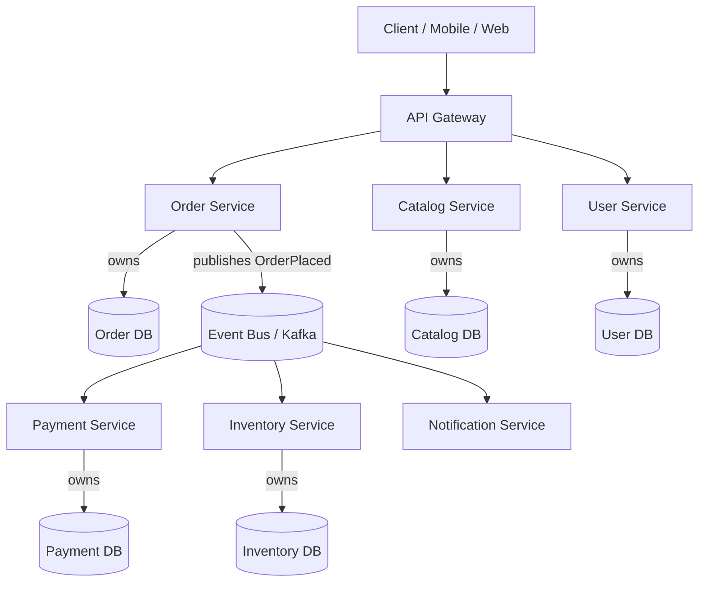

# Microservices

> Difficulty: 🟠 Hard

## TL;DR

Microservices decompose a system into independently deployable services organized around business capabilities, each owning its data and communicating over the network. They trade the simplicity of a monolith for team autonomy and independent scaling — at the cost of significant operational, data-consistency, and debugging complexity. Adopt them to solve organizational and scaling problems, not for technical fashion.

## Overview

As a codebase and the team behind it grow, a single deployable unit (a monolith) starts to hurt: every change requires coordinating and redeploying the whole system, one team's bug can crash unrelated features, scaling means scaling everything, and release cadence slows to the pace of the slowest reviewer. Microservices address this by splitting the system into small, autonomous services that map to business domains. Each can be developed, deployed, scaled, and even rewritten in a different language by a small team without lockstep coordination.

The key insight is that microservices are primarily an **organizational and operational** solution, not a performance one. They let independent teams ship independently (Conway's Law working *for* you rather than against you). The catch is that you replace in-process function calls — fast, reliable, transactional — with network calls that are slow, unreliable, and eventually consistent. You are trading a set of local, well-understood problems for a set of distributed-systems problems that are genuinely hard. Interviewers probe whether you understand that trade honestly.

## Key Concepts

- **Bounded Context (DDD):** A boundary within which a particular domain model is consistent and terms have a single meaning. In Domain-Driven Design, bounded contexts are the strongest candidate for service boundaries — a "Customer" in Billing differs from a "Customer" in Support.
- **Service Boundary:** The seam along which you split services. Good boundaries follow business capabilities and minimize cross-service chattiness; bad boundaries follow technical layers (a "database service", a "UI service").
- **Data Ownership / Database-per-Service:** Each service exclusively owns its data store. No other service reads or writes it directly — access happens only through the owning service's API. This is what makes services truly independent.
- **Synchronous vs Asynchronous Communication:** Sync = request/response (REST, gRPC), caller blocks and is coupled to callee availability. Async = messaging/events (Kafka, SQS), producer and consumer are temporally decoupled.
- **Saga:** A pattern for managing a business transaction that spans multiple services using a sequence of local transactions plus compensating actions, replacing distributed ACID transactions.
- **Service Mesh:** Infrastructure layer (e.g., Istio, Linkerd) that handles service-to-service concerns — mTLS, retries, timeouts, observability — via sidecar proxies, outside application code.
- **API Gateway:** A single entry point for clients that handles routing, auth, rate limiting, and aggregation, hiding the internal service topology.
- **Eventual Consistency:** Data across services converges to a consistent state over time rather than being globally consistent at every instant — an unavoidable consequence of database-per-service.
- **Conway's Law:** Systems mirror the communication structure of the organizations that build them. Team topology and service topology are two views of the same thing.

## How It Works

A client request enters through an **API Gateway**, which authenticates it and routes to the appropriate service. A service handling the request may need data from peers — it either calls them synchronously or reacts to events they emitted asynchronously. Each service owns a private database; cross-service workflows are coordinated with sagas and events rather than distributed transactions. A service mesh or shared libraries handle retries, timeouts, and telemetry.



The following sequence shows an order flow coordinated by a saga using events, where each service performs a local transaction and emits an event that triggers the next step:

```mermaid
sequenceDiagram
    participant C as Client
    participant O as Order Service
    participant K as Event Bus
    participant P as Payment Service
    participant I as Inventory Service

    C->>O: POST /orders
    O->>O: Create order (PENDING)
    O->>K: publish OrderPlaced
    K->>P: OrderPlaced
    P->>P: Charge card (local tx)
    P->>K: publish PaymentCaptured
    K->>I: PaymentCaptured
    I->>I: Reserve stock (local tx)
    I->>K: publish StockReserved
    K->>O: StockReserved
    O->>O: Mark order CONFIRMED
    Note over P,I: If Payment fails, publish PaymentFailed;<br/>Order Service compensates (cancel order)
```

## Types / Patterns / Strategies

| Pattern | Purpose | When it fits |
|---|---|---|
| **Database per Service** | True data ownership & independence | Almost always for real microservices |
| **API Gateway** | Single client entry point, edge concerns | Any non-trivial multi-service system |
| **Backend-for-Frontend (BFF)** | Tailored gateway per client type (web/mobile) | Divergent client needs |
| **Saga (Choreography)** | Distributed workflow via events, no central coordinator | Simple flows, loose coupling |
| **Saga (Orchestration)** | Central coordinator drives the workflow | Complex flows needing visibility/control |
| **CQRS** | Separate read and write models | Read-heavy services, complex queries across data |
| **Event Sourcing** | Store state as an event log | Strong audit needs, temporal queries |
| **Strangler Fig** | Incrementally replace a monolith | Migrating legacy systems safely |
| **Sidecar / Service Mesh** | Offload cross-cutting concerns | Large fleets needing uniform networking/security |
| **Outbox Pattern** | Atomically persist state + publish event | Guaranteeing event delivery without dual-write bugs |

**Communication strategies:**

| Style | Tech | Trade-off |
|---|---|---|
| Sync request/response | REST/JSON, gRPC | Simple, but tight availability coupling & latency stacking |
| Async messaging | Kafka, RabbitMQ, SQS/SNS | Resilient & decoupled, but eventual consistency & harder debugging |

## When to Use / When to Avoid

**Use microservices when:**
- Multiple teams need to deploy independently and are blocked by a shared release train.
- Parts of the system have very different scaling profiles (e.g., search vs. checkout) and you want to scale them independently.
- Different components genuinely benefit from different tech stacks or data stores.
- The domain is well-understood enough to draw stable boundaries.
- You already have (or will invest in) mature CI/CD, observability, and on-call practices.

**Avoid / defer microservices when:**
- You are a startup or small team seeking product-market fit — a **modular monolith** ships faster and pivots easier.
- The domain is not yet understood; premature boundaries become expensive to move.
- You lack the operational maturity (automated deploys, centralized logging, tracing, container orchestration).
- The system is small enough that one team owns all of it — the coordination cost microservices solve doesn't exist yet.

A widely respected default is "**monolith first**": start with a well-modularized monolith, extract services along proven seams only when pain justifies it.

## Trade-offs

| Pros | Cons |
|---|---|
| Independent deployment → faster, safer releases | Distributed systems complexity (partial failure, network) |
| Independent scaling per service | Data consistency becomes eventual; no cross-service ACID |
| Team autonomy; aligns with Conway's Law | Operational overhead: orchestration, mesh, observability |
| Fault isolation (one service down ≠ whole app down) | Harder debugging & end-to-end tracing across hops |
| Polyglot tech & storage per service | Higher infra + cognitive cost; more moving parts |
| Smaller, comprehensible codebases per service | Latency accumulates across synchronous call chains |
| Easier to reason about a single capability | Testing (integration/contract) is significantly harder |

## Real-World Examples

- **Netflix** — a canonical large-scale microservices adopter; open-sourced Eureka (discovery), Hystrix (circuit breaking), and Zuul (gateway).
- **Amazon** — the "two-pizza team" model and service-oriented architecture famously mandated by Bezos; each team owns its services end to end.
- **Uber** — evolved from a monolith to thousands of services, then consolidated toward "Domain-Oriented Microservice Architecture" (DOMA) to tame sprawl.
- **Kafka** — the de facto event backbone for async inter-service communication and event sourcing.
- **Istio / Linkerd / Envoy** — service mesh and sidecar proxies for mTLS, retries, and telemetry.
- **Kubernetes** — the standard platform for deploying, scaling, and orchestrating service fleets.
- **gRPC / Protocol Buffers** — high-performance synchronous inter-service RPC with typed contracts.
- **DynamoDB / PostgreSQL** — examples of per-service data stores chosen per workload.

## Common Pitfalls

- **Distributed monolith:** Services that must be deployed together, share a database, or call each other synchronously in long chains — you got all the costs of distribution with none of the independence.
- **Shared database:** The single most common boundary violation; it recreates tight coupling and destroys autonomy.
- **Wrong boundaries too early:** Splitting before understanding the domain leads to chatty services and painful re-splits. Boundaries follow business capabilities, not technical layers.
- **Ignoring the network:** Assuming calls are fast and reliable. Every hop can time out, retry, and duplicate; design for idempotency and failure.
- **Dual-write problem:** Writing to a DB and publishing an event as two separate operations; a crash between them loses consistency. Use the **transactional outbox**.
- **No observability investment:** Without distributed tracing, centralized logs, and metrics, debugging is nearly impossible.
- **Nano-services:** Splitting too finely so that a single business action fans out across dozens of services, exploding latency and ops burden.
- **Synchronous chains for everything:** Coupling availability so that one slow dependency degrades the entire request path; prefer async where the workflow allows.

## Interview Questions & Answers

**Q: How do you decide where to draw service boundaries?**
**A:** Start from business capabilities and DDD bounded contexts, not technical layers. Group logic and data that change together and are owned by one team; minimize the data and calls that must cross a boundary. A good boundary means most changes stay inside one service. I'd validate boundaries against real workflows — if a common operation requires chatty back-and-forth across three services, the seam is likely wrong. When the domain is immature, I favor a modular monolith and extract services only along seams proven stable by usage.

**Q: Why database-per-service, and how do you handle queries that need data from several services?**
**A:** Shared databases recreate coupling — a schema change in one service breaks others, and you lose independent deployability. So each service owns its store and exposes data only via its API. For cross-service reads, options include: API composition (the gateway or a service calls several and joins in memory) for simple cases; CQRS with a read-optimized materialized view built from events for complex or high-volume queries; or data replication via events. Each accepts eventual consistency as the price of decoupling.

**Q: How do you maintain data consistency without distributed transactions?**
**A:** Two-phase commit across services doesn't scale and couples availability, so we avoid it. Instead we use the **Saga** pattern: a business transaction becomes a series of local transactions, each emitting an event that triggers the next step; failures trigger **compensating transactions** that semantically undo prior steps (e.g., refund a charge). Choreography (event-driven, no coordinator) suits simple flows; orchestration (a central saga coordinator) suits complex ones needing visibility. We accept eventual consistency and design UIs/APIs to tolerate in-flight states.

**Q: Synchronous (REST/gRPC) vs asynchronous (messaging) — how do you choose?**
**A:** Use synchronous when the caller genuinely needs an immediate answer to proceed (e.g., "is this user authorized?"). Use asynchronous when work can happen in the background or be reacted to (e.g., "order placed → notify, bill, reserve stock"). Async decouples availability — the producer doesn't fail if a consumer is down — and absorbs load spikes, at the cost of eventual consistency and harder debugging. In practice, mature systems lean async for workflows and reserve sync for queries and hard dependencies, keeping synchronous chains short to avoid latency stacking and cascading failures.

**Q: What is a "distributed monolith" and how do you avoid one?**
**A:** It's the anti-pattern where services are physically separate but logically coupled — they share a database, must deploy together, or call each other in tight synchronous chains. You get distribution's costs (network, ops, eventual consistency) without its benefits (independence). Avoid it by enforcing database-per-service, versioned backward-compatible contracts, async communication where possible, and the acid test: can each service be deployed independently without coordinating with others? If not, it's a distributed monolith.

**Q: How do you handle a service failure so it doesn't cascade?**
**A:** Design for partial failure. Use **timeouts** on every network call, **retries with exponential backoff and jitter** (only for idempotent operations), **circuit breakers** to stop hammering a failing dependency, and **bulkheads** to isolate resource pools. Provide graceful degradation and fallbacks (cached or default responses). Make operations **idempotent** so retries are safe. A service mesh (Istio/Linkerd) can enforce timeouts, retries, and circuit breaking uniformly outside application code.

**Q: How do you debug and observe a request that spans many services?**
**A:** You need the three pillars plus correlation: **distributed tracing** (OpenTelemetry, Jaeger) to follow a request across hops via a propagated trace ID; **centralized structured logging** with that same correlation ID; and **metrics** (RED/USE: rate, errors, duration) with dashboards and alerting. Without these, microservices are effectively undebuggable — which is why you must invest in observability *before* going multi-service, not after.

**Q: When would you recommend NOT using microservices?**
**A:** For a small team or an early-stage product still finding product-market fit. The problems microservices solve — team coordination overhead, independent scaling, deployment bottlenecks — don't exist at small scale, while the costs (ops, consistency, debugging) hit immediately. I'd start with a modular monolith: clean internal module boundaries, one deployable, one database. That preserves the *option* to extract services later (Strangler Fig) once boundaries and pain points are proven, without paying distributed-systems tax prematurely.

## Further Reading

- Sam Newman, *Building Microservices, 2nd Edition* (O'Reilly, 2021) — the definitive practical guide.
- Chris Richardson, *Microservices Patterns* (Manning) and the pattern catalog at microservices.io.
- Eric Evans, *Domain-Driven Design* — the foundation for bounded contexts and service boundaries.
- Martin Fowler, "Microservices" and "MonolithFirst" articles (martinfowler.com).
- Uber Engineering, "Introducing Domain-Oriented Microservice Architecture (DOMA)" — real-world lessons on taming service sprawl.
