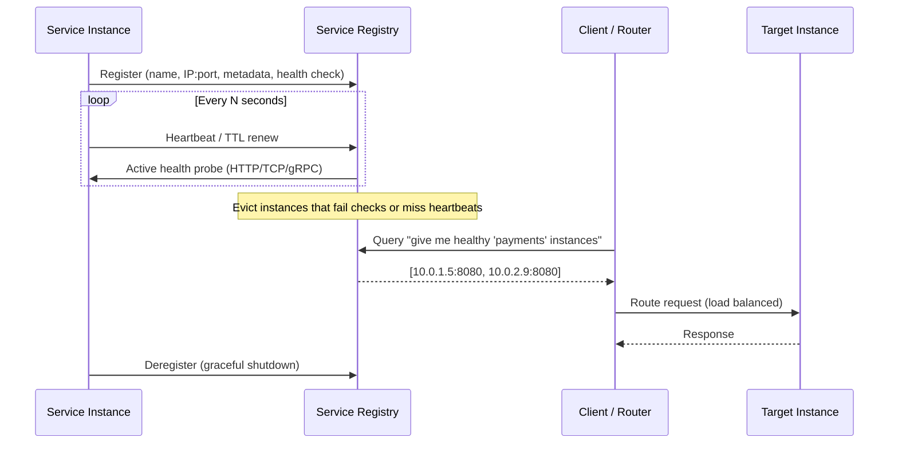
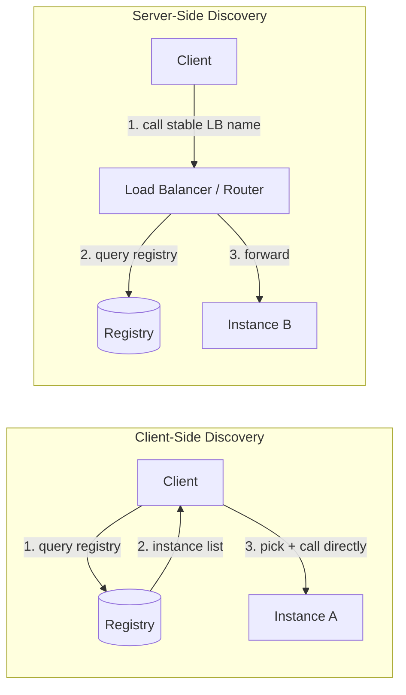

# Service Discovery

> Difficulty: 🟠 Hard

## TL;DR

Service discovery lets services find each other's network locations (IP:port) dynamically instead of relying on hardcoded addresses, which is essential when instances are ephemeral (autoscaling, container restarts, rolling deploys). It revolves around a **service registry** that tracks healthy instances, populated by registration and pruned by **health checks**, and consumed via **client-side** or **server-side** discovery patterns. The hard parts are consistency vs. availability trade-offs in the registry, avoiding stale/thundering-herd behavior, and choosing between tools like Consul, Eureka, etcd, and Kubernetes DNS.

## Overview

In a monolith, components call each other via in-process function calls. In a distributed/microservices system, "calling another service" means opening a network connection to some IP:port — but in cloud environments those endpoints are **not stable**. Autoscaling adds and removes instances, containers get rescheduled onto new hosts, deployments cycle every pod, and failures kill nodes. Hardcoding IPs or maintaining static config files becomes untenable at scale.

Service discovery solves the question: *"Given a logical service name (e.g., `payments`), what are the current, healthy network endpoints I can send traffic to?"* It decouples callers from the physical topology, enabling elasticity, fault tolerance, and zero-downtime deploys. It matters because it sits on the critical path of nearly every request in a microservices architecture — get it wrong and you get cascading failures, black-hole routing to dead instances, or a registry that becomes a single point of failure.

## Key Concepts

- **Service Registry** — A database of available service instances and their locations/metadata. The source of truth for discovery. Must be highly available and reasonably consistent.
- **Service Registration** — How an instance publishes itself to the registry. Can be **self-registration** (the instance registers itself) or **third-party registration** (a separate registrar/agent watches the platform and registers on the instance's behalf).
- **Client-Side Discovery** — The client queries the registry, gets the list of instances, and picks one itself (client does load balancing).
- **Server-Side Discovery** — The client hits a stable intermediary (load balancer / router / DNS name); that component queries the registry and forwards the request.
- **Health Check** — A mechanism to verify an instance is alive and ready. Types: **liveness** (is it running?), **readiness** (can it serve traffic?), and **startup** checks. Failing checks cause deregistration/eviction.
- **TTL / Heartbeat** — Registration entries expire unless renewed by periodic heartbeats. Prevents dead instances from lingering.
- **Deregistration** — Removing an instance on graceful shutdown or after failed health checks.
- **Sidecar / Agent** — A co-located process (e.g., Consul agent, service mesh sidecar) that handles registration and health checking on behalf of the app.
- **Stale reads** — Serving an out-of-date instance list; a fundamental tension when the registry favors availability over consistency.

## How It Works

The lifecycle: an instance **registers** (with metadata + a health check), the registry monitors health via **heartbeats or active probes**, clients **query/watch** the registry to discover healthy endpoints, and instances **deregister** on shutdown or eviction.

Client-side vs server-side differ in *who does the lookup and balancing*:

## Types / Patterns / Strategies

| Dimension | Option A | Option B | Notes |
|---|---|---|---|
| Discovery pattern | Client-side (Netflix Eureka + Ribbon) | Server-side (AWS ELB/ALB, K8s Service) | Client-side removes an extra hop but couples clients to registry + balancing logic in every language. |
| Registration | Self-registration | Third-party registration | Third-party (e.g., Registrator, K8s controller) keeps app code clean; self-reg is simpler but couples app to registry API. |
| Health checking | Push (heartbeat/TTL) | Pull (active probe HTTP/TCP/gRPC) | Push scales better (registry doesn't probe everyone); pull is more accurate. Many systems combine both. |
| Registry consistency | CP (etcd, Consul default, ZooKeeper) | AP (Eureka) | CP may reject reads/writes during partitions; AP always answers but may serve stale data. |
| Resolution mechanism | DNS-based (K8s DNS, Consul DNS) | API/SDK-based (Eureka client, etcd watch) | DNS is universal but suffers from TTL caching; API gives real-time watches and richer metadata. |

Common concrete strategies:
- **DNS-based discovery**: services resolve `payments.default.svc.cluster.local` — simple, language-agnostic, but caching/TTL causes staleness and it can't easily express health at fine granularity.
- **Service mesh (Istio, Linkerd, Consul Connect)**: sidecar proxies handle discovery, load balancing, mTLS, and retries — pushes complexity out of app code into the data plane.
- **API-driven watch**: clients subscribe to change streams (etcd `watch`, Consul blocking queries) for near real-time updates.

## When to Use / When to Avoid

**Use service discovery when:**
- You run microservices with dynamic/ephemeral instances (containers, autoscaling groups, spot instances).
- You need zero-downtime deploys, blue/green, or canary routing.
- Instance counts and locations change frequently enough that static config or manual DNS updates can't keep up.

**Prefer server-side discovery when:**
- You have polyglot clients (don't want to implement discovery logic in every language).
- You already run a managed load balancer or a platform like Kubernetes that provides it.

**Prefer client-side discovery when:**
- You want to eliminate an extra network hop and need sophisticated, client-aware load balancing (e.g., zone-affinity, weighted).

**Avoid / keep it simple when:**
- You have a small, static set of services — DNS or config files may be enough; a full registry adds operational burden.
- You're a monolith or have a handful of long-lived VMs behind a fixed load balancer.
- The team can't operate a consistent distributed system (running your own etcd/Consul cluster is real work) — use a managed offering instead.

## Trade-offs

| Pros | Cons |
|---|---|
| Enables elasticity and self-healing (dead instances routed around automatically) | Registry is a critical dependency; failure can break the whole mesh |
| Decouples callers from physical topology | Consistency vs. availability trade-off leads to stale reads or unavailability during partitions |
| Supports zero-downtime deploys, canaries, blue/green | Health-check tuning is tricky: too aggressive → flapping/evicting healthy nodes; too lax → routing to dead ones |
| Client-side gives smart, low-latency load balancing | Client-side couples every service to registry logic (per-language libraries) |
| Server-side keeps clients thin and polyglot-friendly | Server-side adds a network hop and another component to scale/operate |
| DNS-based is universal and language-agnostic | DNS TTL caching causes stale routing and slow failover |

## Real-World Examples

- **Netflix Eureka** — AP-oriented client-side discovery registry; paired with Ribbon (client LB) and historically the backbone of Netflix's microservices. Prioritizes availability: serves possibly-stale data during partitions rather than failing.
- **HashiCorp Consul** — Registry + health checking + DNS and HTTP interfaces + KV store; Raft-based (CP by default) with multi-datacenter support and Consul Connect service mesh.
- **etcd** — Strongly consistent (Raft) key-value store; the backing store for **Kubernetes** and a common discovery/coordination primitive.
- **Kubernetes DNS (CoreDNS) + Services** — The de facto standard: `kube-proxy`/Services provide server-side discovery via stable ClusterIPs, and CoreDNS resolves service names. Endpoints are updated as pods pass readiness probes.
- **Apache ZooKeeper** — CP coordination service used for discovery in ecosystems like Kafka (historically), HBase, and older SOA stacks.
- **AWS Cloud Map / ELB + Auto Scaling** — Managed discovery; ALB/NLB target groups act as server-side discovery with health checks.
- **Istio / Linkerd** — Service meshes that layer discovery, load balancing, retries, and mTLS via sidecar proxies (often on top of Kubernetes).

## Common Pitfalls

- **Treating the registry as always-consistent.** Eureka is AP and can serve stale data; etcd is CP and can *reject* operations during quorum loss. Know your tool's behavior under partition.
- **Bad health-check tuning.** Overly sensitive checks cause flapping (instances repeatedly evicted/re-added), triggering rebalancing storms. Too-lenient checks route traffic to dead instances (black holes).
- **Confusing liveness and readiness.** A liveness failure restarts the pod; a readiness failure just removes it from the pool. Using liveness for slow-startup checks causes restart loops.
- **DNS TTL staleness.** Aggressive client-side DNS caching (or JVM `networkaddress.cache.ttl` set to infinity) means failover doesn't happen; clients keep hitting dead IPs.
- **No graceful deregistration.** Instances killed without deregistering linger until health checks time out, causing a window of failed requests.
- **Thundering herd / retry storms.** When a service is briefly down, all clients retry simultaneously; combine with jittered backoff, circuit breakers, and load-based ejection.
- **Registry as a hard single point of failure.** Not clustering it, or not caching last-known-good endpoints on the client so a registry outage doesn't take down all traffic.
- **Ignoring the split-brain / self-preservation mode.** Eureka's self-preservation stops evicting instances during suspected network partitions — good for availability, but can retain dead instances longer than expected.

## Interview Questions & Answers

**Q: Compare client-side and server-side discovery. When would you choose each?**
**A:** In client-side discovery the client queries the registry, gets the full instance list, and load-balances itself (Eureka + Ribbon). It removes a network hop and enables smart, client-aware balancing (zone affinity, weighting), but every client — in every language — must embed registry and LB logic. In server-side discovery the client calls a stable endpoint (a load balancer, K8s Service ClusterIP, or DNS name) that queries the registry and forwards the request. It keeps clients thin and polyglot-friendly at the cost of an extra hop and another component to operate. Choose client-side when you control the clients, want minimal latency, and need sophisticated balancing; choose server-side for polyglot fleets or when the platform (K8s, ALB) already provides it.

**Q: The service registry is a critical dependency. How do you keep it from becoming a single point of failure?**
**A:** Run it as a clustered, quorum-based system (Raft/Paxos — etcd, Consul, ZooKeeper) across multiple availability zones. On the client side, cache the last-known-good instance list so a registry outage doesn't immediately break traffic — clients keep routing to previously discovered endpoints. Choose the consistency model deliberately: AP systems (Eureka) stay available and serve stale data during partitions, which is often the right call for discovery since stale-but-available beats correct-but-down. Add health checks with sane timeouts, and degrade gracefully rather than failing hard.

**Q: Explain CP vs AP registries in the context of a network partition.**
**A:** A CP registry (etcd, Consul default) prioritizes consistency: during a partition, the minority side loses quorum and will refuse writes (and possibly reads) to avoid returning divergent data — availability suffers. An AP registry (Eureka) prioritizes availability: every node keeps answering queries even if it might return stale membership data, accepting temporary inconsistency. For service discovery, AP is frequently preferred because routing to a *mostly correct, slightly stale* set of instances is usually better than being unable to discover anyone; the client's retries and health checks paper over the staleness. Kubernetes uses etcd (CP) for its control plane because cluster state correctness is paramount, but the data-path discovery (Endpoints/DNS) tolerates brief staleness.

**Q: How do health checks work, and what's the difference between liveness and readiness?**
**A:** Health checks determine whether an instance should receive traffic. **Liveness** answers "is the process healthy?" — a failure means the orchestrator restarts it. **Readiness** answers "can it serve requests right now?" — a failure removes it from the load-balancing pool without restarting (useful during warmup, or when a downstream dependency is temporarily unavailable). There are also **startup** probes for slow-booting apps to avoid premature liveness kills. Registries implement checks via push (heartbeat/TTL renewal) or pull (active HTTP/TCP/gRPC probes). Key pitfall: using a liveness probe for slow startup causes restart loops; and overly aggressive intervals cause flapping.

**Q: How does service discovery work in Kubernetes?**
**A:** Kubernetes uses server-side, DNS-based discovery. Pods pass **readiness probes** to be added to a Service's **Endpoints** (now EndpointSlices). A **Service** gets a stable virtual ClusterIP; `kube-proxy` (via iptables/IPVS) or the CNI load-balances traffic across the current endpoints. **CoreDNS** resolves names like `payments.default.svc.cluster.local` to the ClusterIP. Headless Services (`clusterIP: None`) return the pod IPs directly for client-side balancing. The whole control-plane state lives in **etcd**. This means apps just call a DNS name and never talk to a registry API directly.

**Q: How do you handle stale entries and dead instances in the registry?**
**A:** Combine TTL-based heartbeats with active health probes and graceful deregistration. Instances renew a lease periodically; if the lease expires (missed heartbeats) or active probes fail past a threshold, the entry is evicted. On graceful shutdown, instances should call deregister and drain in-flight requests (connection draining) before exiting. On the client side, add retries with jittered exponential backoff, circuit breakers, and outlier/passive ejection so that a transiently bad instance is dropped even before the registry catches up. Beware Eureka's self-preservation mode, which deliberately stops evicting during suspected partitions.

**Q: Why might DNS-based discovery be problematic, and how do you mitigate it?**
**A:** DNS is universal and language-agnostic, but it was designed for relatively static records. Clients and resolvers cache based on TTL, so when an instance dies or scales down, callers may keep resolving to stale IPs until the TTL expires — slow failover. Some runtimes (e.g., older JVM defaults) cache DNS indefinitely. DNS also can't natively express per-request health or rich metadata, and A-record round-robin gives crude balancing. Mitigations: short TTLs (with awareness of increased query load), configure runtime DNS caching (`networkaddress.cache.ttl`), use SRV records or a service mesh/API-driven watch for real-time updates, and rely on the load balancer's own health checks rather than DNS alone.

**Q: How does a service mesh change the discovery story?**
**A:** A service mesh (Istio, Linkerd, Consul Connect) moves discovery, load balancing, retries, timeouts, and mTLS out of application code into **sidecar proxies** (Envoy) deployed next to each service. A control plane feeds each proxy the current endpoint set and routing rules; the app just makes a normal request to localhost/service name and the sidecar handles resolution and balancing. This gives consistent, language-agnostic behavior, fine-grained traffic control (canary, mirroring), and observability — at the cost of added latency per hop, resource overhead per sidecar, and significant operational complexity.

## Further Reading

- *Microservices Patterns* by Chris Richardson — chapters on Service Discovery (client-side/server-side, registry, registration patterns); also microservices.io pattern catalog.
- Netflix Tech Blog — "Eureka at a glance" and posts on Ribbon/Eureka resilience and the AP design rationale.
- HashiCorp Consul documentation — service discovery, health checks, and the consistency model.
- Kubernetes official docs — "Service", "DNS for Services and Pods", and "Configure Liveness, Readiness and Startup Probes".
- etcd documentation and the Raft paper ("In Search of an Understandable Consensus Algorithm", Ongaro & Ousterhout) for the consistency foundations behind CP registries.
