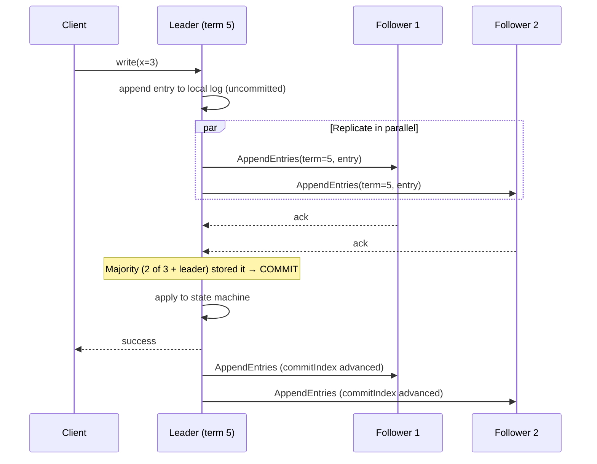
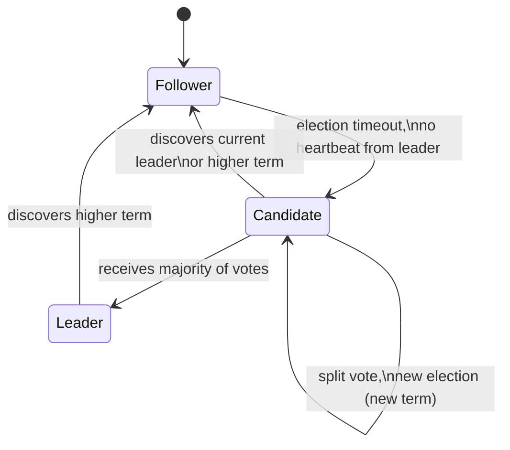

# Consensus Algorithms

> Difficulty: 🔴 Very Hard

## TL;DR

Consensus algorithms let a group of unreliable, distributed nodes agree on a single value (or an ordered log of values) despite crashes, network delays, and message loss. Paxos and Raft are the dominant crash-fault-tolerant protocols and both rely on **majority quorums** to guarantee safety; the **FLP impossibility** result proves no deterministic protocol can guarantee both safety and liveness in a fully asynchronous network, so real systems trade perfect liveness for practical progress using timeouts and leaders. Byzantine fault-tolerant (BFT) consensus additionally handles malicious/arbitrary faults but needs more nodes (typically 3f+1) and more expensive protocols.

## Overview

Distributed systems need multiple machines to behave as if they were one reliable machine. The moment you replicate state across nodes for fault tolerance, you face a hard question: **when nodes disagree (or can't reach each other), how do they agree on what happened and in what order?**

Consensus is the primitive that answers this. It underpins:

- **Replicated state machines** — every replica applies the same commands in the same order, so they stay consistent (this is how databases like etcd, Spanner, and CockroachDB stay correct).
- **Leader election** — pick exactly one coordinator without a split brain.
- **Distributed locks, configuration stores, and metadata** — ZooKeeper, etcd, Consul.
- **Atomic commit and membership changes.**

Getting this wrong causes the worst class of production incidents: **split brain** (two nodes both think they're leader and diverge) and **lost writes** (an acknowledged write disappears). Consensus algorithms exist to make these impossible under a defined fault model.

## Key Concepts

- **Consensus:** Multiple processes agree on a single value. Formally requires **Agreement** (no two correct nodes decide differently), **Validity** (the decided value was proposed by some node), and **Termination** (every correct node eventually decides — the liveness property).
- **Replicated State Machine (RSM):** If all replicas start in the same state and apply the same deterministic commands in the same order, they end in the same state. Consensus is used to agree on the command *order* (the log).
- **Quorum:** A subset of nodes large enough that any two quorums intersect. For a cluster of `N` nodes, a **majority quorum** is `⌊N/2⌋ + 1`. Intersection guarantees that a new decision "sees" any prior committed decision.
- **Safety:** "Nothing bad happens" — the system never returns a wrong/inconsistent result (e.g., two different committed values at the same log index). Consensus protocols never sacrifice safety.
- **Liveness:** "Something good eventually happens" — the system eventually makes progress and decides.
- **FLP Impossibility (Fischer, Lynch, Paterson, 1985):** In a fully asynchronous system (no bounds on message delay) with even one crash-faulty process, no deterministic protocol can guarantee consensus with both safety *and* guaranteed termination.
- **Crash fault (fail-stop):** A node stops (or is partitioned) but never lies. Handled by Paxos/Raft. Tolerates `f` failures with `2f+1` nodes.
- **Byzantine fault:** A node behaves arbitrarily/maliciously — sends conflicting or forged messages. Handled by BFT protocols. Tolerates `f` failures with `3f+1` nodes.
- **Term / Ballot / Epoch:** A monotonically increasing number identifying a leader's reign. Prevents stale leaders from committing.
- **Split brain:** Two nodes both believe they are the leader — the failure mode quorums are designed to prevent.

## How It Works

The core insight shared by Paxos and Raft: **use monotonically increasing terms plus majority quorums so any decision is "witnessed" by a majority, and any future majority must overlap with — and therefore learn about — that decision.** A leader coordinates proposals to avoid the dueling-proposer livelock.

**Raft** decomposes consensus into three sub-problems: **leader election**, **log replication**, and **safety**. A leader for a term accepts client commands, appends them to its log, replicates to followers, and commits an entry once a majority has stored it.

**Raft leader election** uses randomized election timeouts. If a follower hears nothing from the leader before its timeout fires, it increments its term, becomes a **candidate**, and requests votes. A node grants at most one vote per term, so only a candidate with majority votes wins — guaranteeing at most one leader per term.

**Paxos** (single-decree) works in two phases driven by a proposer:

1. **Prepare/Promise (Phase 1):** Proposer picks a ballot number `n`, sends `Prepare(n)` to acceptors. Each acceptor promises not to accept anything below `n` and returns any value it has already accepted.
2. **Accept/Accepted (Phase 2):** If a majority promised, the proposer sends `Accept(n, v)`, where `v` is the highest-ballot previously accepted value (or its own if none). A value is **chosen** once a majority accepts it.

The quorum-intersection property is what makes this safe: because any two majorities share at least one acceptor, a new proposer's Phase 1 is guaranteed to discover any already-chosen value and re-propose it — so the chosen value can never change.

**Multi-Paxos** amortizes cost by electing a stable leader that skips Phase 1 for subsequent entries — which is essentially what Raft formalizes with a clear leader and contiguous log.

## Types / Patterns / Strategies

| Protocol | Fault model | Nodes for `f` faults | Key idea | Notes |
|---|---|---|---|---|
| **Basic Paxos** | Crash | `2f+1` | Two-phase ballots + majority | Correct but famously hard to implement for a full log |
| **Multi-Paxos** | Crash | `2f+1` | Stable leader skips Phase 1 | Basis of many real systems (Chubby, Spanner) |
| **Raft** | Crash | `2f+1` | Strong leader, contiguous log, terms | Designed for understandability; dominant today |
| **Zab** | Crash | `2f+1` | Leader-based atomic broadcast | Powers Apache ZooKeeper |
| **Viewstamped Replication** | Crash | `2f+1` | View changes + primary | Predates Paxos work; conceptually close to Raft |
| **PBFT** | Byzantine | `3f+1` | 3-phase (pre-prepare/prepare/commit) | Classic BFT; O(n²) messages |
| **Tendermint / HotStuff** | Byzantine | `3f+1` | BFT with leader rotation | HotStuff is linear-message; used in blockchains |
| **EPaxos** | Crash | `2f+1` | Leaderless, commutative commands | Lower latency for geo-distributed, no single leader bottleneck |

## When to Use / When to Avoid

**Use consensus when:**

- You need **linearizable / strongly consistent** replicated state (config, metadata, leases, coordination).
- You must elect a single leader safely (avoid split brain).
- Correctness of ordering matters more than raw throughput — distributed locks, membership, transaction coordination.

**Avoid or reconsider when:**

- You need **high write throughput / low latency at massive scale** for bulk data — consensus serializes through a majority round-trip per decision. Use it for the control plane, not every data-plane write.
- **Eventual consistency is acceptable** — a Dynamo-style AP system (CRDTs, quorum reads/writes without ordering) is cheaper and more available under partitions.
- Your cluster is a **single data center with a reliable primary/replica** setup and you can tolerate manual failover — full consensus may be overkill.
- You're tempted to run consensus across **high-latency WAN links** with a large quorum — every commit pays the cross-region round-trip. Consider fewer voters or leader placement near writers.

## Trade-offs

| Pros | Cons |
|---|---|
| Strong consistency & linearizability | Every commit needs a majority round-trip → higher latency |
| Prevents split brain and lost writes | Throughput bounded by the leader and slowest quorum member |
| Well-understood, proven safety guarantees | Complex to implement correctly (edge cases, membership changes) |
| Tolerates minority failures automatically | Availability lost if you can't form a quorum (majority down) |
| Clear fault model & recovery semantics | Even-sized clusters give no extra fault tolerance (5 nodes tolerate 2, same as needing majority) |
| BFT variants tolerate malicious nodes | BFT is far more expensive (3f+1 nodes, O(n²) messages) |

## Real-World Examples

- **etcd** (Raft) — the consistent key-value store behind **Kubernetes**; stores all cluster state.
- **Consul** and **HashiCorp Nomad** (Raft) — service discovery, config, and scheduling.
- **Apache ZooKeeper** (Zab) — coordination for **Kafka** (historically), HBase, and many Hadoop-ecosystem tools.
- **Google Chubby** (Multi-Paxos) — lock service that inspired ZooKeeper.
- **Google Spanner** & **CockroachDB** & **YugabyteDB** (Raft/Paxos per shard) — globally distributed SQL with strong consistency; Spanner pairs consensus with TrueTime.
- **TiKV / TiDB** (Raft, Multi-Raft) — one Raft group per data range.
- **Kafka KRaft** (Raft) — Kafka's replacement for its ZooKeeper dependency (KIP-500).
- **Blockchains** — Bitcoin/Ethereum use Nakamoto/PoS consensus; permissioned chains (Hyperledger Fabric, Diem) use BFT variants like PBFT/HotStuff.

## Common Pitfalls

- **Even-numbered clusters:** A 4-node cluster still needs 3 for majority — you tolerate only 1 failure, same as 3 nodes, but with more coordination cost. Use odd sizes (3, 5, 7).
- **Assuming reads are free/safe:** A stale leader can serve stale reads after a partition. Use leader leases, ReadIndex, or quorum reads for linearizable reads.
- **Ignoring FLP:** Expecting guaranteed termination in a truly asynchronous network. Real systems only get liveness under partial synchrony (eventual timeliness) via timeouts.
- **Unsafe membership changes:** Naively adding/removing nodes can create two disjoint majorities. Use **joint consensus** (Raft) or single-server changes done carefully.
- **Confusing consensus with 2PC:** Two-phase commit blocks forever if the coordinator dies; consensus tolerates coordinator failure. Don't substitute one for the other.
- **Running consensus for bulk data:** Pushing every high-volume write through a single Raft leader creates a bottleneck; shard into many groups (Multi-Raft) or keep consensus on the control plane.
- **Clock dependence for correctness:** Relying on wall-clock time for safety (rather than just liveness/timeouts) — clock skew then breaks correctness. Only Spanner-style TrueTime bounds this explicitly.
- **Believing quorum writes alone give linearizability:** Dynamo-style `R+W>N` avoids some staleness but does not order concurrent writes like a real consensus log does.

## Interview Questions & Answers

**Q:** What problem does consensus solve, and what are its formal correctness properties?
**A:** It lets a set of distributed processes agree on a single value or an ordered log despite failures. The properties are **Agreement** (no two correct nodes decide differently), **Validity** (the decided value was actually proposed), and **Termination** (every correct node eventually decides). Agreement + Validity are safety; Termination is liveness. Consensus is the building block for replicated state machines, where agreeing on command order keeps replicas identical.

**Q:** Explain the FLP impossibility result and how real systems live with it.
**A:** FLP proves that in a fully **asynchronous** system (no upper bound on message/processing delay) with even one crash fault, no deterministic algorithm can guarantee both safety and termination — you can't reliably distinguish a crashed node from a slow one. Real systems don't violate this; they relax the model to **partial synchrony** (the network is eventually timely) and use **timeouts, leaders, and randomization** to achieve liveness in practice. They always keep safety and only give up guaranteed liveness during bad periods (e.g., an ongoing partition just stalls progress rather than corrupting data).

**Q:** Why do consensus protocols use majority quorums specifically?
**A:** Because any two majorities of `N` nodes must overlap in at least one node (`⌊N/2⌋+1 + ⌊N/2⌋+1 > N`). That intersection guarantees a new leader/proposer's quorum contains at least one node that witnessed any previously committed value, so it can never "forget" or overwrite a committed decision. This is the mechanism that prevents split brain and lost writes. `2f+1` nodes tolerate `f` crash failures while still being able to form a majority.

**Q:** How does Raft differ from Paxos, and why was it created?
**A:** Basic Paxos solves single-value consensus and is notoriously hard to turn into a correct, complete log-replication system; the paper leaves many practical gaps. Raft was designed for **understandability**: it uses a **strong single leader**, a **contiguous log** (no holes), and clear **terms** for leader reigns, decomposing the problem into leader election, log replication, and safety. Multi-Paxos with a stable leader ends up functionally similar, but Raft specifies the mechanics (heartbeats, log matching, membership via joint consensus) explicitly, which is why most modern systems (etcd, Consul, TiKV) chose it.

**Q:** Walk me through how Raft elects a leader and prevents two leaders in the same term.
**A:** Each node has a randomized election timeout. If a follower gets no heartbeat before it expires, it increments its **term**, transitions to **candidate**, votes for itself, and requests votes from others. A node grants **at most one vote per term** and only to a candidate whose log is at least as up-to-date as its own. A candidate becomes leader only with a **majority** of votes. Since two different candidates can't both get a majority in the same term (each voter votes once), there's at most one leader per term. Randomized timeouts make simultaneous candidacies (split votes) rare and self-correcting.

**Q:** What's the difference between crash faults and Byzantine faults, and how does the node requirement change?
**A:** A **crash (fail-stop)** node simply stops or is unreachable but never sends wrong information — Paxos/Raft handle this with `2f+1` nodes for `f` faults. A **Byzantine** node can behave arbitrarily: lie, send conflicting messages, or collude. Tolerating `f` Byzantine faults requires `3f+1` nodes and protocols like PBFT or HotStuff, because nodes must cross-check messages to detect lies, needing a supermajority (more than two-thirds) of honest nodes to agree. BFT is much more expensive (extra round and O(n²) or O(n) messaging), so it's reserved for adversarial settings like permissioned blockchains.

**Q:** How do you get linearizable reads from a Raft cluster without hurting correctness?
**A:** Reading from the leader isn't automatically safe — a partitioned old leader might still think it's leader and return stale data. Options: (1) **ReadIndex** — the leader records its commit index, confirms leadership via a heartbeat round-trip with a majority, then serves the read once its state machine has applied up to that index; (2) **Leader leases** — the leader holds a time-bounded lease (relying on bounded clock drift) so it can serve reads locally without a round-trip; (3) route reads through the log like writes (simplest, slowest). Most systems use ReadIndex or leases to avoid a full log append per read.

**Q:** When would you choose an eventually-consistent (AP) system over a consensus-based (CP) one?
**A:** When availability under partitions and low latency matter more than a single strict order — e.g., shopping carts, session data, counters, feeds. Dynamo-style systems use tunable quorums (`R+W>N`) plus conflict resolution (last-write-wins, CRDTs) and stay writable even when a majority is unreachable. Consensus (CP) is the right choice for coordination, metadata, leader election, and anything needing linearizability, but it becomes unavailable when it can't form a quorum. The decision follows CAP/PACELC: consensus picks consistency over availability during partitions and generally pays more latency even in normal operation.

## Further Reading

- Leslie Lamport, *"Paxos Made Simple"* (2001) — the accessible Paxos explanation.
- Diego Ongaro & John Ousterhout, *"In Search of an Understandable Consensus Algorithm (Raft)"* (USENIX ATC 2014), plus the interactive visualization at raft.github.io.
- Fischer, Lynch, Paterson, *"Impossibility of Distributed Consensus with One Faulty Process"* (1985) — the FLP paper.
- Castro & Liskov, *"Practical Byzantine Fault Tolerance"* (OSDI 1999) — foundational BFT.
- Martin Kleppmann, *Designing Data-Intensive Applications* (O'Reilly), Chapter 9 ("Consistency and Consensus") — the best single-chapter synthesis for interviews.

---

## 🛠️ Open-Source Tools & Projects (Used in Production)

| Project | GitHub | What it does / Why it's used |
|---|---|---|
| **etcd** | [etcd-io/etcd](https://github.com/etcd-io/etcd) | Distributed, strongly-consistent key-value store built on Raft (~48k★). The backing store for **Kubernetes** cluster state; the de-facto reference for production Raft. |
| **etcd raft library** | [etcd-io/raft](https://github.com/etcd-io/raft) | Standalone, battle-tested Raft library extracted from etcd. Embedded by **CockroachDB, TiKV, Dgraph** and many others as their consensus core. |
| **HashiCorp Raft** | [hashicorp/raft](https://github.com/hashicorp/raft) | Go Raft library (~8k★) powering **Consul, Nomad, and Vault** for leader election and replicated state. Clean FSM + log-store abstraction. |
| **TiKV** | [tikv/tikv](https://github.com/tikv/tikv) | Distributed transactional key-value store (~15k★, CNCF graduated) using **Multi-Raft** (one Raft group per data region). Storage engine behind **TiDB**. |
| **Dragonboat** | [lni/dragonboat](https://github.com/lni/dragonboat) | High-performance **multi-group Raft** library in pure Go (~5k★). Designed for many concurrent Raft groups with low latency. |
| **SOFAJRaft** | [sofastack/sofa-jraft](https://github.com/sofastack/sofa-jraft) | Production-grade Java Raft with Multi-Raft-Group support (~3.6k★), from **Ant Group**; used in high-load financial systems. |
| **Apache ZooKeeper** | [apache/zookeeper](https://github.com/apache/zookeeper) | Coordination service using the **Zab** atomic-broadcast protocol (~12k★). Historically the coordination layer for **Kafka, HBase, Hadoop**. |
| **Apache Kafka (KRaft)** | [apache/kafka](https://github.com/apache/kafka) | KRaft mode (~29k★) replaces Kafka's ZooKeeper dependency with a self-managed **Raft** metadata quorum (KIP-500). |
| **CockroachDB** | [cockroachdb/cockroach](https://github.com/cockroachdb/cockroach) | Distributed SQL DB (~30k★) running an independent Raft group **per data range** — a real-world Multi-Raft at massive scale. |
| **BFT-SMaRt** | [bft-smart/library](https://github.com/bft-smart/library) | Mature Java **Byzantine fault-tolerant** (PBFT-style) state-machine replication library, widely cited in BFT research and used in Hyperledger Fabric ordering. |

---

## 📖 Blogs, Articles & Learning Resources

- [In Search of an Understandable Consensus Algorithm (Raft paper)](https://raft.github.io/raft.pdf) — Ongaro & Ousterhout's original paper; the single best source for how Raft actually works.
- [The Raft website + interactive visualization](https://raft.github.io/) — Official Raft hub with the live node-animation demo and a huge list of implementations.
- [The Secret Lives of Data — Raft](https://thesecretlivesofdata.com/raft/) ([source](https://github.com/benbjohnson/thesecretlivesofdata)) — Scrolling, animated walkthrough of leader election and log replication; the friendliest first exposure.
- [Paxos Made Simple (Lamport, 2001)](https://lamport.azurewebsites.net/pubs/paxos-simple.pdf) — Lamport's own "accessible" explanation of Paxos; short and foundational.
- [Impossibility of Distributed Consensus with One Faulty Process (FLP, 1985)](https://groups.csail.mit.edu/tds/papers/Lynch/jacm85.pdf) — The FLP impossibility result every engineer should understand conceptually.
- [Practical Byzantine Fault Tolerance (PBFT, Castro & Liskov, 1999)](https://pmg.csail.mit.edu/papers/osdi99.pdf) — The foundational practical BFT protocol; basis for many blockchain consensus schemes.
- [Paxos vs Raft: Have we reached consensus on distributed consensus?](https://arxiv.org/abs/2004.05074) — Rigorous comparison showing the two are more alike than folklore suggests (differ mainly in leader election).
- [CockroachDB — Scaling Raft](https://www.cockroachlabs.com/blog/scaling-raft/) & [Consensus, Made Thrive](https://www.cockroachlabs.com/blog/consensus-made-thrive/) — How Cockroach runs hundreds of thousands of Raft groups (Multi-Raft) in production.
- [CockroachDB — Joint Consensus for membership changes](https://www.cockroachlabs.com/blog/joint-consensus-raft/) — Real-world treatment of the hardest part of Raft: safe reconfiguration.
- [etcd Raft library README & design docs](https://github.com/etcd-io/raft/blob/main/README.md) — How a real, embeddable Raft is structured (proposals, snapshots, ReadIndex, membership).
- [Martin Kleppmann — *Designing Data-Intensive Applications*, Ch. 9 "Consistency and Consensus"](https://dataintensive.net/) — The best single-chapter synthesis linking linearizability, total order broadcast, and consensus.
- [MIT 6.824 Distributed Systems (video lectures + labs)](https://pdos.csail.mit.edu/6.824/) — Free graduate course where you implement Raft yourself; the gold-standard hands-on path.

---

## 🗺️ Learning Plan — Google & Learn (Step by Step)

1. **Why consensus exists** — replicated state machines and the problems (split brain, lost writes). Search: `` `replicated state machine consensus explained` ``
2. **Correctness properties** — Agreement, Validity, Termination; safety vs liveness. Search: `` `consensus safety liveness agreement validity termination` ``
3. **Quorums & majorities** — why any two majorities intersect and why that guarantees safety. Search: `` `majority quorum intersection consensus 2f+1` ``
4. **FLP impossibility** — what it proves and why real systems use partial synchrony + timeouts. Search: `` `FLP impossibility distributed consensus explained` ``
5. **Basic Paxos** — Prepare/Promise and Accept/Accepted phases for a single value. Search: `` `Paxos made simple prepare accept phases explained` ``
6. **Multi-Paxos** — stable leader skipping Phase 1 for a log of values. Search: `` `multi-paxos stable leader log replication` ``
7. **Raft fundamentals** — leader election, log replication, terms; play with the animation. Search: `` `raft.github.io interactive visualization leader election` ``
8. **Raft safety & log matching** — commit rules, log matching property, up-to-date vote restriction. Search: `` `raft log matching property commit safety` ``
9. **Membership changes** — joint consensus and single-server changes done safely. Search: `` `raft joint consensus membership change` ``
10. **Linearizable reads** — ReadIndex, leader leases, and stale-read pitfalls. Search: `` `raft linearizable read ReadIndex leader lease` ``
11. **Multi-Raft / sharded consensus** — running many Raft groups (TiKV, CockroachDB). Search: `` `multi-raft sharding one raft group per range` ``
12. **Zab & Viewstamped Replication** — how ZooKeeper and VR compare to Raft. Search: `` `Zab protocol vs raft zookeeper atomic broadcast` ``
13. **Byzantine fault tolerance** — PBFT and modern HotStuff/Tendermint, 3f+1 requirement. Search: `` `PBFT byzantine fault tolerance 3f+1 hotstuff` ``
14. **Hands-on: implement Raft (MIT 6.824)** — build leader election + log replication + persistence. Search: `` `MIT 6.824 raft lab implementation guide` ``
15. **Hands-on: run a real cluster** — bootstrap a 3-node etcd cluster, kill the leader, watch re-election. Search: `` `etcd 3 node cluster setup leader election demo` ``

**✅ You'll know you understand this when:** you can (1) explain why an odd-sized cluster of `2f+1` nodes tolerates exactly `f` failures using quorum intersection, (2) trace a Raft write from client request → majority ack → commit → apply and explain how a stale leader is prevented from committing, and (3) articulate why FLP doesn't stop real systems and what assumption they add to get liveness.
