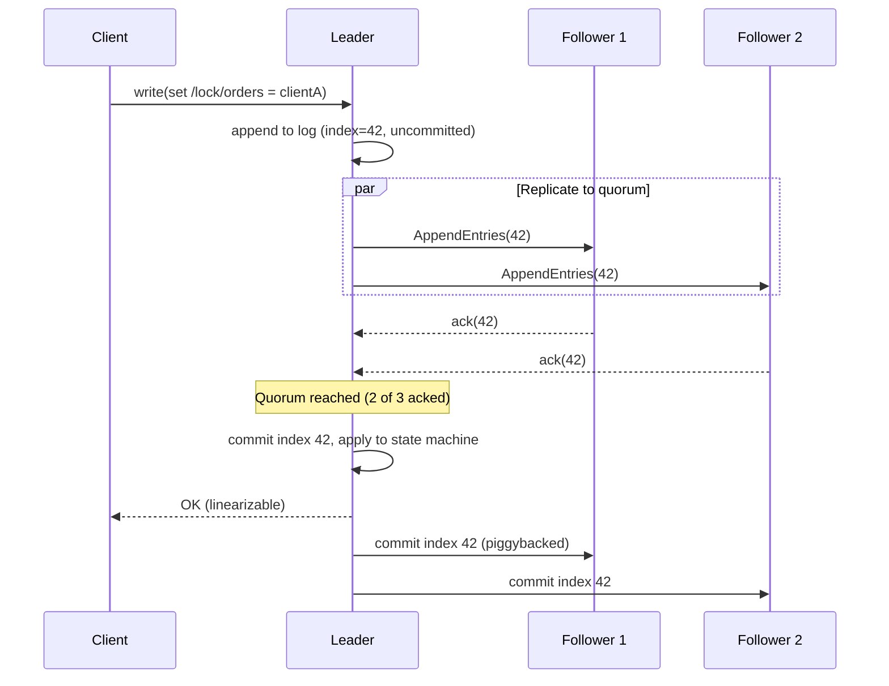
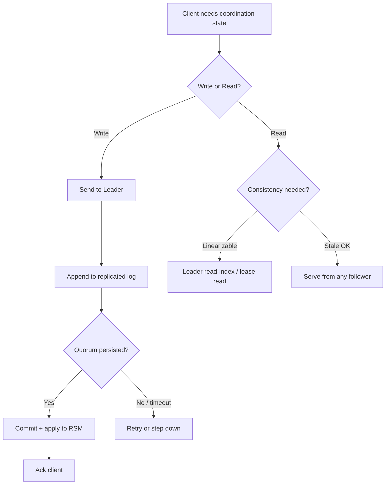

# Distributed Consensus

> Difficulty: 🔴 Very Hard

## TL;DR

Distributed consensus lets a cluster of machines agree on a single value (or an ordered log of values) despite crashes, network delays, and message loss. In practice you rarely implement Raft or Paxos yourself — you use battle-tested coordination systems like **ZooKeeper**, **etcd**, or **Consul** to build **replicated state machines** that provide **linearizable** reads/writes for leader election, config, locks, and metadata. This guide is about *applying* consensus: how these systems are wired, how they scale reads, and where they fit in real architectures.

## Overview

Many distributed systems need a small amount of *strongly consistent* shared state: "who is the current leader?", "what is the cluster membership?", "which shard owns this key range?", "is this lock held?". Getting these wrong causes split-brain, double-writes, and data corruption — the worst kind of outage.

You *could* solve this with a single database, but that's a single point of failure. You *could* let each node decide independently, but they'll disagree. **Consensus** solves this: a majority (**quorum**) of replicas agree on an ordered sequence of operations, so every non-faulty node sees the same state in the same order.

The key insight for interviews: **consensus is expensive, so you use it sparingly.** You don't run your entire product database through Raft. Instead you carve out the *coordination* problem — the small, critical, must-be-correct state — and delegate it to a purpose-built system. Everything else (bulk data, high-throughput writes) uses cheaper replication with weaker guarantees.

This guide contrasts with a pure *consensus algorithms* treatment (Paxos/Raft/Multi-Paxos internals). Here the focus is **applied**: replicated state machines, the Zab protocol behind ZooKeeper, etcd's Raft, linearizability semantics, read-scaling techniques, and the coordination patterns you'll be asked to design.

## Key Concepts

- **Replicated State Machine (RSM):** The foundational pattern. Every replica runs the same deterministic state machine and applies the *same ordered log of commands*. Given identical logs, all replicas reach identical state. Consensus's job is to agree on the log order.
- **Consensus log / replicated log:** An append-only, totally-ordered sequence of commands agreed by the cluster. Each entry has an index and a term/epoch.
- **Quorum:** A majority of nodes (⌊N/2⌋+1). Any two quorums intersect, which guarantees no two conflicting decisions. A 5-node cluster tolerates 2 failures; 3 nodes tolerate 1.
- **Leader:** A single elected node that sequences all writes for a term/epoch, simplifying agreement. Raft, Zab, and Multi-Paxos are all leader-based.
- **Linearizability:** The strongest single-object consistency model. Every operation appears to take effect atomically at some point between its invocation and response, consistent with real-time ordering. "Once a write completes, all subsequent reads see it."
- **Zab (ZooKeeper Atomic Broadcast):** ZooKeeper's totally-ordered broadcast protocol. Similar goals to Raft; guarantees primary-order and total-order delivery of state changes.
- **Raft:** A consensus algorithm designed for understandability, used by etcd, Consul, CockroachDB, TiKV. Leader election + log replication + safety via term numbers.
- **znode / key:** The data unit. ZooKeeper stores a hierarchical namespace of *znodes*; etcd stores a flat, sorted key-value space.
- **Ephemeral node:** A ZooKeeper znode tied to a client session that auto-deletes when the session ends — the primitive behind locks, leader election, and liveness detection.
- **Lease / TTL:** A time-bounded grant. etcd keys can attach to a lease; when the lease expires (client stops renewing), keys are deleted. Used for locks and service registration.
- **Watch:** A one-shot (ZooKeeper) or streaming (etcd) notification when a key/znode changes — lets clients react to state changes without polling.
- **Read index / lease read:** Techniques to serve linearizable reads without writing to the log on every read.
- **Fencing token:** A monotonically increasing number issued with a lock so a stale lock holder can be rejected by downstream resources.

## How It Works

A coordination cluster (say 3 or 5 nodes) elects a **leader**. Clients send writes to the leader, which appends the command to its log and replicates it to followers. Once a **quorum** has persisted the entry, the leader **commits** it, applies it to its state machine, and responds to the client. Followers apply committed entries in the same order. Reads can be served by the leader (linearizable) or by followers (with extra care).

**Leader election & epochs:** Each leadership term is a monotonically increasing number (Raft *term*, Zab *epoch*, Paxos *ballot*). If the leader crashes, followers time out and start an election; a candidate needs a quorum of votes and an up-to-date log to win. The epoch number lets nodes reject messages from stale leaders — this is what prevents split-brain even during a partition.

**Why quorum matters:** Because any two majorities overlap in at least one node, a committed entry is guaranteed to survive into any future quorum. A new leader must contact a quorum and adopt the most up-to-date log, so committed data is never lost.

## Types / Patterns / Strategies

| System | Protocol | Data model | Typical use | Notable trait |
|---|---|---|---|---|
| **ZooKeeper** | Zab | Hierarchical znodes | Kafka/HBase metadata, leader election, locks | Mature, session/ephemeral nodes, watches |
| **etcd** | Raft | Flat sorted KV | Kubernetes control plane store | gRPC, leases, MVCC, range watches |
| **Consul** | Raft | KV + service catalog | Service discovery, health checks, mesh | Built-in DNS/health, multi-DC |
| **Chubby** | Multi-Paxos | Coarse locks/files | Google-internal lock service | Original inspiration for ZooKeeper |

**Read-scaling strategies (the crux of "read scaling" in coordination systems):**

| Strategy | Consistency | How it works | Cost |
|---|---|---|---|
| **Leader read (log write)** | Linearizable | Route read through the log | Slowest, safest |
| **Read index** | Linearizable | Leader confirms it's still leader via a quorum heartbeat, then reads local state at the committed index | 1 round-trip, no disk write |
| **Lease read** | Linearizable (clock-bounded) | Leader relies on a time lease that no other leader can be elected within; reads locally with no round-trip | Fastest linearizable; needs bounded clock drift |
| **Follower / stale read** | Sequential / eventual | Read from any replica; may be behind | Cheapest; scales reads horizontally |
| **Observer / learner nodes** | Stale | Non-voting replicas that receive the log but don't participate in quorum | Scale reads without hurting write quorum latency |

Coordination patterns built on these primitives:
- **Leader election:** Contend to create an ephemeral node / smallest sequential znode; the winner leads, others watch the predecessor.
- **Distributed lock:** Create an ephemeral+sequential node; lowest sequence holds the lock. Always pair with a **fencing token**.
- **Service discovery / membership:** Register an ephemeral node or lease-backed key; watchers get add/remove events.
- **Configuration management:** Store config as keys; clients watch for live updates (Kubernetes does this via etcd).
- **Barrier / queue:** Coordinate phased computation using znode presence and watches.

## When to Use / When to Avoid

**Use consensus-backed coordination when:**
- You need **exactly one** of something: one leader, one owner of a shard, one holder of a lock.
- You need strongly consistent, low-volume metadata: cluster membership, config, schema versions, topology.
- Correctness during partitions matters more than availability (you accept CP behavior).
- You need reliable change notifications (watches) to trigger reconfiguration.

**Avoid it when:**
- You're tempted to store **high-throughput or large data** in it. etcd/ZooKeeper are for kilobytes of critical metadata, not your event stream or user table. They have hard size limits (etcd default ~8 GB, ZooKeeper keeps data in memory).
- You need **write throughput** beyond a few thousand ops/sec — every write is a quorum round-trip with fsync.
- **Eventual consistency is acceptable** — use cheaper replication (Dynamo-style, leaderless quorums, async replicas) instead.
- You want **maximum availability** during partitions — a minority partition of a CP system becomes unavailable by design.
- You'd be adding a whole ZooKeeper/etcd cluster just for one feature — consider whether a single-writer database or a managed lock service suffices.

## Trade-offs

| Pros | Cons |
|---|---|
| Strong (linearizable) consistency for critical state | Every write is a quorum round-trip + fsync → high latency, low throughput |
| Tolerates minority failures (N/2 nodes can die) | Minority partition becomes unavailable (CP: sacrifices availability) |
| Eliminates split-brain via epochs + quorum intersection | Operationally complex: odd-node clusters, quorum sizing, disk/network sensitivity |
| Mature, well-understood primitives (locks, election, watches) | Sensitive to clock/GC pauses; leases and stale locks need fencing tokens |
| Watches enable reactive, poll-free architectures | Not for bulk data — tight storage limits |
| Reads can be scaled via followers/observers/lease reads | Linearizable reads still cost a round-trip unless you weaken guarantees |

## Real-World Examples

- **Kubernetes** stores all cluster state (pods, services, secrets, config) in **etcd**; the API server is the only client, and controllers watch for changes to reconcile state.
- **Apache Kafka** historically used **ZooKeeper** for controller election, topic metadata, and ISR tracking. Modern Kafka (**KRaft**, GA since 3.3) replaces ZooKeeper with a self-managed **Raft** metadata quorum — a real-world example of folding consensus *into* the product to remove an external dependency.
- **HBase** and **Apache Hadoop HDFS HA** use ZooKeeper for master/NameNode failover and locking.
- **CockroachDB** and **TiKV/TiDB** use **Raft per data range** — consensus is the storage layer itself, replicated across many Raft groups for horizontal scale (Multi-Raft).
- **HashiCorp Consul / Vault / Nomad** use Raft for their server clusters (service discovery, secrets HA, scheduling).
- **Google Chubby** (Multi-Paxos) provides coarse-grained locks and small-file storage used for GFS/Bigtable master election — the archetype of a consensus lock service.
- **Netflix** and others use ZooKeeper (historically via Curator/Exhibitor) for leader election in batch and stream-processing coordinators.

## Common Pitfalls

- **Treating a lock as guaranteed mutual exclusion without fencing.** A client can hold a lock, then pause (GC/VM stall) past its session/lease expiry; another client acquires the lock; the first wakes up and writes. Only **monotonic fencing tokens** validated by the downstream resource prevent this corruption.
- **Even-numbered clusters.** 4 nodes tolerate the same failures as 3 (1) but need a larger quorum and cost more latency. Always use **odd counts** (3, 5, 7).
- **Storing too much / too-large data.** Dumping high-churn or large blobs into etcd/ZooKeeper causes latency spikes, snapshot bloat, and outages. Keep it to small, critical metadata.
- **Assuming follower reads are linearizable.** Followers can lag. If you read a stale follower after a write, you can violate read-your-writes. Use leader/read-index/lease reads when you need linearizability.
- **Ignoring clock assumptions in lease reads.** Lease-based reads are only safe if clock drift is bounded; otherwise two leaders can believe they hold valid leases.
- **Cross-datacenter quorums.** Spanning a Raft/Zab quorum across high-latency regions makes every write pay WAN RTT. Prefer per-region clusters or learner replicas; use dedicated multi-region designs (e.g., Spanner-style) only when required.
- **Watch storms / herd effects.** Thousands of clients watching one znode and all reacting to a change can overwhelm the cluster. Use sequential-node "watch your predecessor" patterns for locks.
- **Session/TTL misconfiguration.** Too-short sessions cause spurious lock releases and reelection churn; too-long delays failure detection.

## Interview Questions & Answers

**Q:** What is a replicated state machine and why is it the foundation of consensus systems?
**A:** An RSM is a deterministic state machine replicated across nodes that all apply the *same commands in the same order*. If every replica starts identical and applies an identical, totally-ordered log, they end up in identical state. Consensus's actual job is narrow: agree on the order of the log. This decouples "what the service does" (any deterministic logic) from "how we agree" (the consensus protocol), and it's why ZooKeeper, etcd, and databases like CockroachDB can all reuse the same Raft/Zab machinery under different state machines.

**Q:** ZooKeeper vs etcd — how do you choose?
**A:** Both provide linearizable, consensus-backed coordination (Zab vs Raft) with watches and ephemeral/lease semantics. Choose **etcd** for cloud-native/Kubernetes ecosystems — it's the K8s standard, has a clean gRPC API, MVCC, leases, and range watches. Choose **ZooKeeper** when integrating with the JVM/Hadoop ecosystem (Kafka legacy, HBase, Solr) or when you need its mature hierarchical namespace and rich client (Curator). Functionally they're close; the decision is usually ecosystem fit, operational familiarity, and API model (hierarchical znodes vs flat sorted KV).

**Q:** How do you serve linearizable reads without writing to the log on every read?
**A:** Two main techniques. **Read-index:** the leader records the current commit index, sends a heartbeat to confirm a quorum still recognizes it as leader (proving no newer leader committed anything), waits until its state machine has applied up to that index, then serves the read locally — one round-trip, no disk write. **Lease read:** the leader holds a time-bounded leadership lease during which no other leader can be elected; within the lease it reads locally with zero round-trips. Lease reads are fastest but depend on bounded clock drift. Both preserve linearizability while avoiding a full log append per read.

**Q:** How would you scale reads on a consensus cluster?
**A:** Writes are inherently limited by quorum round-trips, but reads have options. Add **non-voting learner/observer nodes** that receive the replicated log and serve reads without joining the write quorum (so write latency isn't hurt). For strong reads, use **read-index or lease reads** on the leader. For workloads tolerating staleness, allow **follower/stale reads** and scale horizontally. If you truly need high-throughput strongly-consistent reads *and* writes, shard the keyspace into many independent consensus groups (**Multi-Raft**, as CockroachDB/TiKV do) so throughput scales with the number of groups.

**Q:** A team uses a ZooKeeper/etcd lock to guard writes to a database, but they still see corruption. What's wrong and how do you fix it?
**A:** The classic **stale lock holder** problem. A client acquires the lock, then suffers a long GC or VM pause exceeding its session/lease TTL. The coordination service expires its session and grants the lock to a second client. The first client wakes up believing it still holds the lock and writes — now two writers race. The lock alone can't prevent this because the *database* has no idea the lock expired. Fix: issue a **monotonically increasing fencing token** with each lock grant and have the database (or storage layer) reject any write carrying a token lower than the highest it has seen. This turns "I think I hold the lock" into a verifiable, ordered claim.

**Q:** Why do consensus clusters use odd numbers of nodes, and what does a 5-node cluster buy you over 3?
**A:** Quorum is ⌊N/2⌋+1, and any two quorums must intersect to guarantee safety. Odd counts maximize fault tolerance per node: 3 nodes tolerate 1 failure (quorum 2), 5 tolerate 2 (quorum 3), 7 tolerate 3. An even count wastes a node — 4 also only tolerates 1 failure but needs a quorum of 3, so it's *less* available than 3 while costing more. A 5-node cluster survives two simultaneous failures (e.g., a node down for maintenance while another crashes), at the cost of higher write latency since each commit must reach 3 nodes' disks instead of 2.

**Q:** Where does consensus sit in the CAP theorem, and what are the practical consequences?
**A:** Consensus systems are **CP**: during a network partition they preserve **C**onsistency and **P**artition tolerance by sacrificing **A**vailability. Concretely, the partition that *lacks a quorum* cannot elect a leader or commit writes, so it becomes unavailable rather than risk split-brain. The majority side keeps operating. The practical consequence: you should only put your *small, must-be-correct* coordination state in a consensus system, and design the rest of your architecture (bulk data, user-facing paths) to degrade gracefully — often with AP/eventually-consistent stores — when the coordination cluster is unreachable.

**Q:** Kafka moved from ZooKeeper to KRaft. What problem does that solve?
**A:** Running Kafka meant operating *two* distributed systems — the brokers and a separate ZooKeeper ensemble — with their own scaling, failure, and versioning concerns, plus ZooKeeper became a metadata bottleneck at large partition counts. **KRaft** embeds a **Raft**-based metadata quorum directly into Kafka, so controllers manage metadata via an internal replicated log. Benefits: one system to operate, faster controller failover and metadata propagation, and much higher partition scalability. It's a good illustration of the design choice between *depending on an external coordination service* versus *internalizing consensus* when coordination is core to your product.

## Further Reading

- Diego Ongaro & John Ousterhout, *"In Search of an Understandable Consensus Algorithm (Raft)"* (2014) — the Raft paper.
- Patrick Hunt et al., *"ZooKeeper: Wait-free coordination for Internet-scale systems"* (USENIX ATC 2010).
- Martin Kleppmann, *Designing Data-Intensive Applications* — Chapters 8–9 (consistency, consensus, linearizability, fencing tokens).
- etcd official docs — "Learner nodes", "Linearizable reads", and the Raft implementation notes (etcd.io/docs).
- Mike Burrows, *"The Chubby lock service for loosely-coupled distributed systems"* (Google, OSDI 2006).
