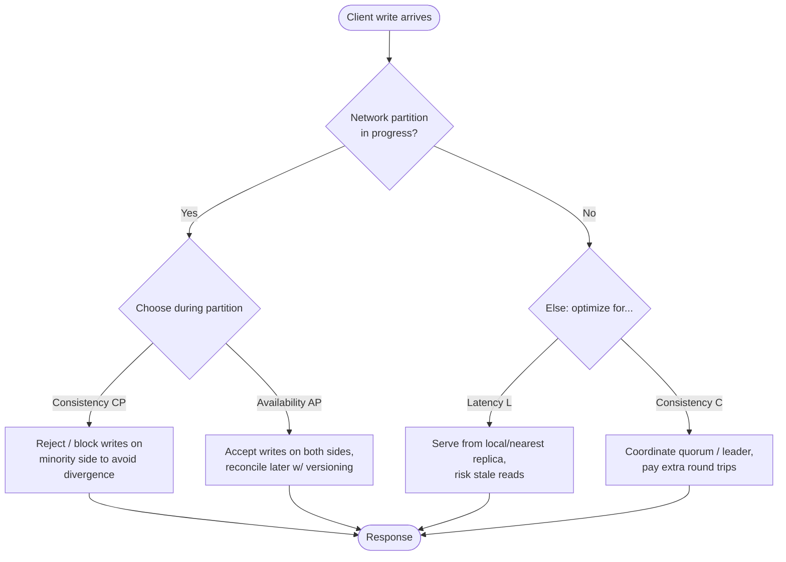
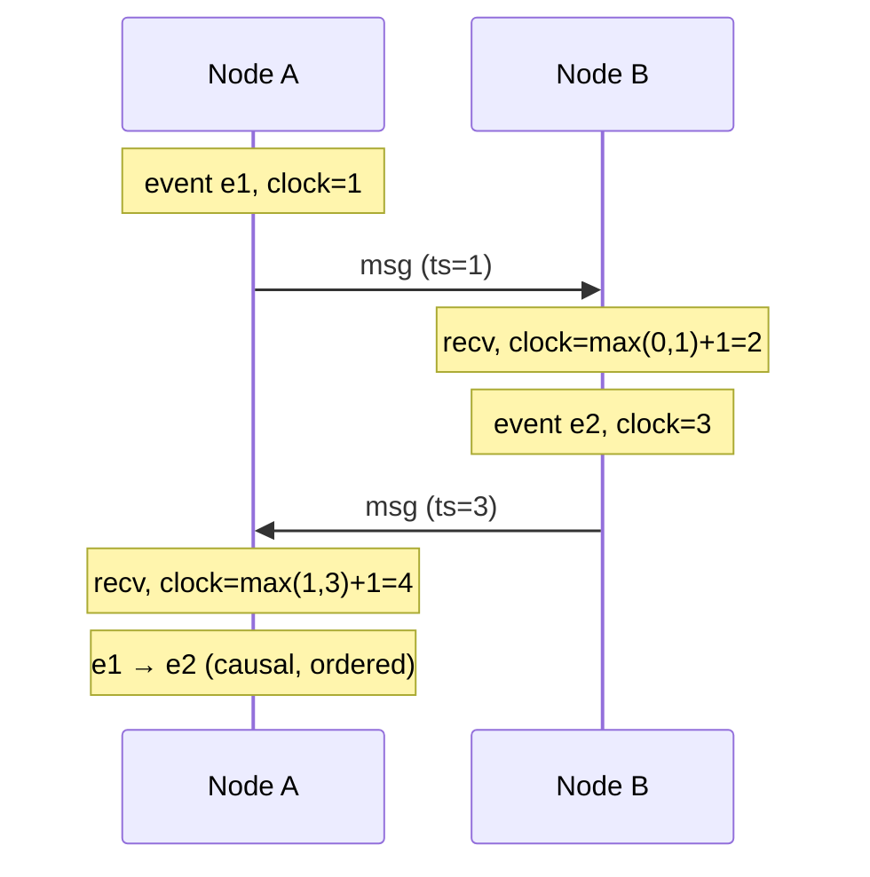

# Distributed Systems

> Difficulty: 🔴 Very Hard

## TL;DR

A distributed system is a collection of independent nodes that communicate over an unreliable network and appear to users as one coherent system. Because networks partition, clocks drift, and nodes fail independently, you cannot have perfect consistency, availability, and partition tolerance simultaneously — CAP and its refinement PACELC force you to choose. Mastering distributed systems means reasoning about consistency models, time/ordering, partial failure, and the fallacies engineers keep rediscovering the hard way.

## Overview

Single-machine software has a comforting property: components either all work or all fail together, memory is coherent, and time is a single monotonic clock. Distributed systems throw all of that away. The moment your data or computation spans more than one machine connected by a network, you inherit a set of unavoidable problems:

- **The network is unreliable** — messages are lost, delayed, duplicated, or reordered, and you cannot tell a slow node from a dead one.
- **There is no global clock** — each node has its own drifting clock, so "what happened first?" becomes genuinely hard to answer.
- **Failure is partial** — some nodes work while others don't, and the working nodes may not know which is which.

These problems matter because virtually every system at scale is distributed: databases replicate across regions, microservices call each other over RPC, caches sit in front of stores, and message queues buffer between services. Interviewers probe this topic to see whether you can reason about *correctness under failure* rather than just happy-path throughput. The core skill is making explicit, defensible trade-offs — knowing that choosing availability means accepting stale reads, or that strong consistency costs you latency and availability during partitions.

## Key Concepts

- **CAP theorem** — During a network **P**artition, a system must choose between **C**onsistency (every read sees the latest write) and **A**vailability (every request gets a non-error response). You cannot have both while partitioned.
- **PACELC** — Extends CAP: *if* **P**artition, choose **A** or **C**; **E**lse (normal operation), choose between **L**atency and **C**onsistency. Captures the everyday tension CAP ignores.
- **Linearizability** — Strongest single-object consistency: operations appear to take effect instantaneously at some point between invocation and response, consistent with real-time ordering.
- **Serializability** — Transactions appear to execute in *some* serial order (a multi-object property from databases). Strict serializability = serializability + linearizability.
- **Eventual consistency** — If writes stop, all replicas eventually converge to the same value. Says nothing about *when* or what you read in the meantime.
- **Causal consistency** — Operations that are causally related are seen in the same order by all nodes; concurrent operations may be seen in different orders.
- **Read-your-writes / monotonic reads** — Session (client-centric) guarantees weaker than linearizability but usable in practice.
- **Physical vs. logical clocks** — Wall-clock time (NTP-synced, drifts) vs. logical counters (Lamport clocks, vector clocks) that capture ordering without real time.
- **Happens-before (→)** — Lamport's partial order: causally related events are ordered; unrelated events are concurrent.
- **Partial failure** — A subset of components fails or becomes unreachable while others continue.
- **The two generals / Byzantine problem** — You cannot achieve certain agreement over an unreliable channel; and some nodes may fail in arbitrary (malicious) ways.
- **Fallacies of distributed computing** — Eight false assumptions (network is reliable, latency is zero, bandwidth is infinite, network is secure, topology doesn't change, one administrator, transport cost is zero, network is homogeneous).

## How It Works

The defining event in a distributed system is the **network partition**: a node cannot distinguish between a peer that has crashed, a peer that is slow, and a network link that dropped the message. When this happens, a system serving writes to two sides of a partition must decide: reject requests to stay consistent (CP), or accept them and reconcile later (AP).

The reason there is no global "who wrote first" answer is that clocks disagree. Lamport clocks give a logical ordering: every node keeps a counter, increments it on each event, and piggybacks it on messages; on receipt a node sets its counter to `max(local, received) + 1`. This preserves **happens-before**, but two events with `L(a) < L(b)` are not necessarily causally related. **Vector clocks** fix that by tracking a per-node counter vector, letting you detect true concurrency (used for conflict detection in Dynamo-style stores).

Because agreement over an unreliable network is fundamentally hard (the FLP result proves no deterministic consensus is *guaranteed* to terminate in an asynchronous network with even one crash), real systems use **consensus protocols** (Paxos, Raft, Zab) with timeouts and leader election to make progress in practice, accepting that they trade guaranteed termination for practical liveness.

## Types / Patterns / Strategies

| Category | Options | When it fits |
|---|---|---|
| CAP posture | **CP** (MongoDB majority, HBase, etcd/ZooKeeper), **AP** (Cassandra, Dynamo, Riak) | CP for correctness-critical (config, locks, balances); AP for high-availability, tolerant reads |
| Consistency model | Linearizable → Sequential → Causal → Eventual | Stronger = simpler reasoning, higher cost; weaker = cheaper, more concurrency |
| Replication | Single-leader, Multi-leader, Leaderless (quorum) | Leader for strong ordering; leaderless (R+W>N) for availability |
| Ordering / time | Lamport clocks, Vector clocks, Hybrid Logical Clocks (HLC), TrueTime | Vector clocks for conflict detection; TrueTime/HLC for externally consistent timestamps |
| Consensus | Paxos, Multi-Paxos, Raft, Zab | Leader election, replicated logs, config stores |
| Conflict resolution | Last-Write-Wins, version vectors, CRDTs, app-level merge | CRDTs for automatic convergence (collaborative editing, counters) |
| Failure detection | Heartbeats, phi-accrual detectors, gossip | Gossip (SWIM) for large membership; phi-accrual for tunable suspicion |

## When to Use / When to Avoid

**Choose strong consistency (CP / linearizable) when:**
- Correctness errors are unacceptable: financial ledgers, inventory decrements, unique-username registration, distributed locks, leader election, configuration/service discovery.
- The read-after-write contract must hold globally.

**Choose high availability / eventual consistency (AP) when:**
- The workload tolerates brief staleness: social feeds, product catalogs, view counts, shopping carts (mergeable), telemetry.
- Availability and low latency across regions matter more than immediate global agreement.

**Avoid distribution entirely when you can:** a single well-provisioned node (with backups/failover) is dramatically simpler than a distributed cluster. Don't shard or replicate for consistency you don't need. Reserve consensus systems for the small "control plane" of truly critical state and keep the "data plane" as loosely coupled as possible.

## Trade-offs

| Pros | Cons |
|---|---|
| Horizontal scalability beyond one machine | Every network hop adds latency and failure modes |
| Fault tolerance via replication (survive node/AZ loss) | Partial failure is hard to detect and reason about |
| Geographic locality / lower latency for global users | Consistency vs. availability is an unavoidable trade-off |
| Independent deployment and scaling of components | Debugging spans multiple nodes/clocks; observability is expensive |
| Can tune consistency per-use-case (quorum knobs) | Weak consistency pushes conflict handling into the app |
| No single point of failure (if designed well) | Distributed transactions/consensus are slow and complex |

## Real-World Examples

- **Amazon DynamoDB / Apache Cassandra** — Dynamo-lineage AP stores using quorum reads/writes (`R + W > N`), tunable consistency, and (historically) vector clocks / LWW for conflict resolution.
- **Google Spanner** — Externally consistent (strict serializability) globally, enabled by **TrueTime**, which exposes clock uncertainty as an interval and waits it out (commit-wait) to order transactions.
- **etcd / ZooKeeper / Consul** — CP consensus systems (Raft / Zab) used for service discovery, config, and distributed locks.
- **Apache Kafka** — Partitioned, replicated log; per-partition total order via a leader and in-sync replicas (ISR); `acks=all` trades latency for durability.
- **CockroachDB / YugabyteDB** — Raft-per-range, HLC-based ordering, serializable transactions on commodity hardware.
- **Redis** — Async replication (AP-leaning by default); Redis Sentinel/Cluster failover can drop acknowledged writes during partitions unless configured carefully.
- **Netflix** — Chaos Engineering (Chaos Monkey) explicitly injects partial failure to validate resilience assumptions in production.

## Common Pitfalls

- **Treating the network as reliable** — retries without idempotency, no timeouts, assuming a response means the operation didn't happen twice.
- **Trusting wall-clock timestamps for ordering** — NTP drift and clock skew make "latest timestamp wins" silently lose data.
- **Confusing "no response" with "failure"** — a timed-out write may have succeeded; without idempotency keys you double-charge or double-create.
- **Assuming CAP means "pick 2 of 3 permanently"** — partitions are rare events; the real daily choice is PACELC's latency-vs-consistency in the *else* case.
- **Distributed locks for correctness without fencing tokens** — a paused lock holder resumes after its lease expired and corrupts state (Kleppmann's critique of naive Redlock use).
- **Ignoring partial failure in fan-out calls** — one slow downstream stalls the whole request; missing timeouts, bulkheads, and circuit breakers cause cascading failure.
- **Over-distributing** — introducing microservices/sharding before scale demands it, paying the distributed-systems tax for no benefit.
- **Retry storms** — synchronized retries after an outage amplify load; always add jitter and backoff.

## Interview Questions & Answers

**Q:** Explain CAP and why "pick two of three" is misleading.
**A:** CAP says that during a network partition you must sacrifice either consistency or availability — you can't have both. It's misleading because partition tolerance isn't optional: on real networks partitions *will* happen, so you don't get to "choose" P. The real choice is C vs. A *when partitioned*. And when there's no partition, CAP says nothing — which is why PACELC adds the everyday trade-off of latency vs. consistency during normal operation.

**Q:** What does PACELC add, and give an example of each posture.
**A:** PACELC: if **P**artition then **A** or **C**, **E**lse **L** or **C**. It captures that even without partitions you trade latency for consistency. Cassandra is **PA/EL** — available during partitions, low-latency (possibly stale) otherwise. A strongly consistent store like Spanner or an etcd cluster is **PC/EC** — it prefers consistency both during partitions and normally, paying latency (commit-wait, quorum round trips).

**Q:** Difference between linearizability and serializability?
**A:** Linearizability is a *single-object*, real-time recency guarantee: once a write completes, all later reads see it, and operations respect wall-clock order. Serializability is a *multi-object transaction* guarantee: transactions appear to run in some serial order, but that order need not match real time. They're orthogonal — combining both gives **strict serializability** (what Spanner provides). A DB can be serializable but not linearizable (a transaction reads a stale snapshot) and vice versa.

**Q:** Why can't we just use timestamps to order events across nodes?
**A:** Physical clocks drift and are only loosely synchronized (NTP is tens of ms off, worse under load), so timestamps can disagree with causality — an effect can appear "before" its cause. Logical clocks (Lamport) preserve happens-before ordering without relying on real time, and vector clocks additionally detect concurrency. If you need real-time ordering, you must handle clock *uncertainty* explicitly — Spanner's TrueTime exposes an error interval and waits it out before committing.

**Q:** How do quorum systems (`R + W > N`) provide consistency, and where do they fall short?
**A:** With N replicas, if every write reaches W replicas and every read queries R replicas with `R + W > N`, the read and write sets overlap by at least one replica, so a read sees the latest acknowledged write. It gives tunable consistency without a leader. It falls short because it's not truly linearizable without extra work — concurrent writes can create conflicting versions (needing vector clocks/CRDTs/LWW), read repair is asynchronous, and "sloppy quorums" with hinted handoff trade the overlap guarantee for availability, permitting stale reads.

**Q:** A client sends a write, the connection times out, and it gets no response. What should it do?
**A:** Treat the outcome as *unknown* — the write may have committed, may have failed, or may commit later. Blind retry risks duplication. The correct pattern is **idempotency**: attach an idempotency key / request ID so the server dedupes, or design the operation to be naturally idempotent (set-to-value rather than increment). Combine with bounded retries, exponential backoff plus jitter, and a way to reconcile (read-back or a saga/compensation) so you converge to a correct state.

**Q:** Why are distributed locks dangerous, and what makes them safer?
**A:** A process can acquire a lock, then stall (GC pause, VM freeze, network delay) past its lease expiry; another process acquires the lock; the first wakes up believing it still holds it and writes — corrupting shared state. The fix is **fencing tokens**: the lock service hands out a monotonically increasing token with each grant, and the protected resource rejects any write carrying a token lower than the highest it has seen. This makes stale lock holders harmless regardless of pauses.

**Q:** List the fallacies of distributed computing and why they matter in a design review.
**A:** The eight: the network is reliable; latency is zero; bandwidth is infinite; the network is secure; topology doesn't change; there is one administrator; transport cost is zero; the network is homogeneous. They matter because most production incidents trace back to one of them — no timeout (reliable/latency), chatty APIs (bandwidth/latency), no auth between services (secure), hardcoded IPs (topology), inconsistent protocols (homogeneous). In a review I use them as a checklist: for each network call, ask what happens when it's slow, lost, duplicated, or attacked.

## Further Reading

- Martin Kleppmann, *Designing Data-Intensive Applications* (O'Reilly) — the canonical treatment of replication, consistency, and consensus.
- Seth Gilbert & Nancy Lynch, "Brewer's Conjecture and the Feasibility of Consistent, Available, Partition-Tolerant Web Services" (2002) — the formal CAP proof.
- Daniel Abadi, "Consistency Tradeoffs in Modern Distributed Database System Design" (2012) — the PACELC paper.
- Leslie Lamport, "Time, Clocks, and the Ordering of Events in a Distributed System" (1978) — happens-before and logical clocks.
- Peter Deutsch & James Gosling, "The Eight Fallacies of Distributed Computing"; and Martin Kleppmann, "How to do distributed locking" (fencing tokens) blog post.
