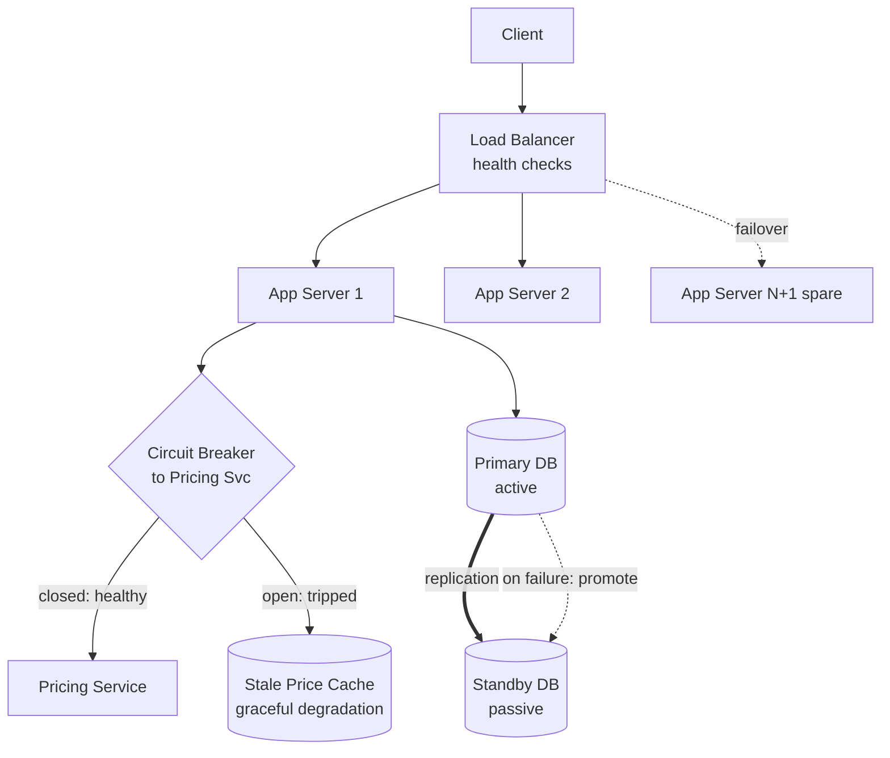
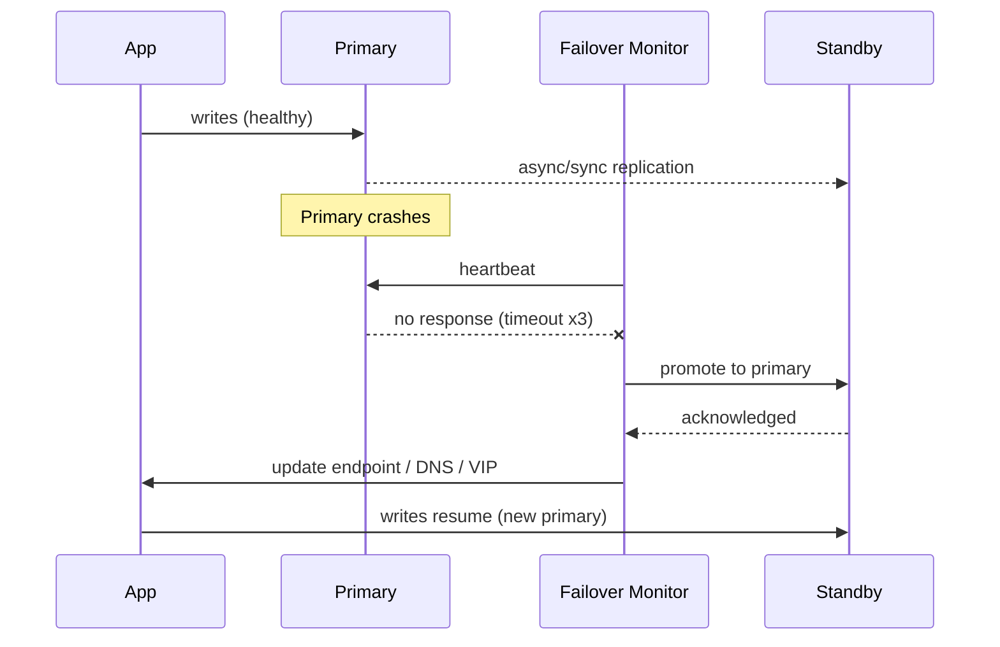

# Fault Tolerant Systems

> Difficulty: 🔴 Very Hard

## TL;DR

Fault tolerance is the property of a system to keep operating correctly — possibly at reduced capacity — despite the failure of one or more of its components. It is achieved by combining redundancy (spare capacity), failover (automatically shifting work off broken parts), and graceful degradation (shedding non-critical features instead of crashing), then continuously *proving* those mechanisms work through chaos engineering while keeping the blast radius of any single failure small.

## Overview

At scale, failure is not an edge case — it is the steady state. Disks die, networks partition, deployments introduce bugs, dependencies time out, and entire availability zones go dark. A single machine might offer 99.9% availability, but a request touching 100 such components would be lucky to see 90% end-to-end. Fault-tolerant design exists to convert *inevitable component failures* into *tolerable, invisible-to-the-user events*.

The core insight: you cannot prevent failures, so you must **contain and absorb** them. This is distinct from *high availability* (minimizing downtime) and *reliability* (correct behavior over time) — fault tolerance is the mechanism that delivers both. Getting it right is the difference between one bad disk causing a 4-hour outage versus a self-healing failover the on-call engineer reads about in a Slack alert the next morning. It matters most for systems where downtime is expensive or dangerous: payment rails, healthcare, aviation, ad exchanges, and any customer-facing platform with an SLA.

## Key Concepts

- **Fault vs. Error vs. Failure**: A *fault* is a defect (a bad disk sector). An *error* is the fault manifesting in system state (corrupt data read). A *failure* is the system deviating from its spec (user gets wrong balance). Fault tolerance breaks the fault → failure chain.
- **Redundancy**: Deploying more resources than the minimum needed, so spares can absorb failures. Can be spatial (extra machines), temporal (retries), or informational (error-correcting codes, replicas).
- **Failover**: The act of automatically redirecting traffic/work from a failed component to a healthy standby.
- **Failback**: Returning to the original (repaired) component after recovery.
- **Graceful Degradation**: Continuing to serve a reduced but useful subset of functionality when full service is impossible (e.g., show cached prices when the pricing service is down).
- **Fail-fast vs. Fail-safe vs. Fail-silent**: Fail-fast surfaces errors immediately; fail-safe defaults to a safe state on failure; fail-silent stops emitting output rather than emitting wrong output.
- **Blast Radius**: The scope of impact when a component fails — how many users, requests, or downstream systems are affected. Minimizing it is a primary design goal.
- **Single Point of Failure (SPOF)**: Any component whose failure takes down the whole system. The enemy of fault tolerance.
- **MTBF / MTTR**: Mean Time Between Failures and Mean Time To Recovery. Availability ≈ MTBF / (MTBF + MTTR). You improve availability by increasing MTBF *or* decreasing MTTR — the latter is usually cheaper.
- **Redundancy Models**: N+1, N+M, 2N, active-active, active-passive — differing amounts and modes of spare capacity.
- **Chaos Engineering**: The discipline of deliberately injecting failures in production-like environments to validate that fault tolerance actually works.
- **Bulkhead / Cell**: Isolation boundary that prevents a failure in one partition from consuming resources needed by others (named after ship compartments).
- **Quorum**: A majority (or configured threshold) of replicas that must agree, enabling correct operation despite a minority of failures.

## How It Works

Fault tolerance is layered. At each layer you (1) **detect** the failure, (2) **isolate** it to bound the blast radius, (3) **recover** via redundancy/failover, and (4) **degrade gracefully** if recovery isn't possible.

Detection uses health checks, heartbeats, timeouts, and circuit breakers. Isolation uses bulkheads, cells, and rate limits. Recovery uses redundant standbys and load balancer reconfiguration. Degradation uses fallbacks, caches, and feature flags.

The diagram below shows a request path with an active-passive database, a circuit breaker guarding a flaky dependency, and a graceful-degradation fallback:

The failover sequence for the database, showing detection via missed heartbeats and promotion of the standby:

## Types / Patterns / Strategies

| Model | Spare Capacity | Failover Speed | Cost | Notes |
|-------|---------------|----------------|------|-------|
| **N+1** | 1 spare for N active units | Fast | Low overhead | Tolerates a single simultaneous failure. Common for stateless app tiers. |
| **N+M** | M spares for N active | Fast | Moderate | Tolerates M concurrent failures; tune M to your risk model. |
| **2N** | Full duplicate of capacity | Instant | High (2x) | Each active unit has a dedicated standby. Used where a single failure must never reduce capacity. |
| **2N+1** | Full duplicate plus one | Instant | Highest | Survives a failure *during* maintenance of the redundant set. |
| **Active-Passive** | Standby idle until needed | Seconds–minutes | Moderate | Simpler consistency; standby may be cold/warm/hot. Wasted idle capacity. |
| **Active-Active** | All nodes serve traffic | Instant | Efficient | No wasted capacity, but needs conflict resolution, careful capacity headroom (each side must absorb the other's load), and often multi-region. |

Complementary resilience patterns:

- **Retries with exponential backoff + jitter** — absorb transient faults without creating retry storms.
- **Circuit breaker** — stop hammering a failing dependency; fail fast and give it time to recover.
- **Bulkhead** — dedicate thread pools/connection pools per dependency so one slow dependency can't exhaust all resources.
- **Timeouts + deadlines** — never wait forever; propagate deadlines across calls.
- **Load shedding** — reject excess traffic early to protect the core.
- **Quorum / consensus (Raft, Paxos)** — tolerate minority failures while preserving consistency.
- **Cell-based architecture** — partition users into isolated cells so a failure affects only one cell.
- **Erasure coding / replication** — data-layer redundancy.

## When to Use / When to Avoid

**Use aggressive fault tolerance when:**
- The system has a meaningful SLA/SLO or revenue-per-minute of uptime (payments, checkout, ads).
- Failures are frequent enough that unhandled ones would breach targets (large fleets, unreliable networks).
- Recovery must be faster than a human can react (sub-minute RTO).
- Regulatory or safety requirements demand continuity (healthcare, finance, telecom).

**Avoid / scale back when:**
- The workload is internal, batch, or easily retried by users (a nightly report can just re-run).
- Cost of 2N/active-active redundancy dwarfs the cost of the rare outage it prevents — do the math on MTBF vs. dollars.
- Added complexity would *reduce* reliability (failover logic that's more likely to misfire than the thing it protects — a real and common trap).
- You're early-stage and haven't found product-market fit; premature multi-region is a classic over-engineering mistake.

Rule of thumb: match redundancy investment to the tier of the dependency. Tier-1 (checkout) gets active-active multi-AZ; tier-3 (recommendations) gets graceful degradation and can be down without paging anyone.

## Trade-offs

| Pros | Cons |
|------|------|
| Survives component failures with little/no user impact | Redundancy costs money (idle 2N capacity, cross-region traffic) |
| Reduces MTTR, improving availability | Failover mechanisms add complexity and new failure modes |
| Bounds blast radius — one failure ≠ total outage | Distributed redundancy introduces consistency challenges (split-brain, replication lag) |
| Enables zero-downtime deploys and maintenance | Testing/validation requires ongoing investment (chaos engineering) |
| Builds organizational confidence and better SLOs | Over-engineering can *decrease* reliability and slow delivery |
| Graceful degradation preserves core UX under stress | Fallbacks can mask real problems if not observable/alerting |

## Real-World Examples

- **Netflix** — Pioneered chaos engineering with **Chaos Monkey / Simian Army** (now **Chaos Monkey** + internal **ChAP**), and built **Hystrix** (circuit breaker/bulkhead library; now in maintenance, superseded by **Resilience4j**). Their **Zuul** gateway and regional evacuation ("failover" across AWS regions) are canonical fault-tolerance case studies.
- **Amazon DynamoDB / S3** — Multi-AZ replication with quorum reads/writes; S3 uses erasure coding for 11 nines of durability. AWS **cell-based architecture** and **Availability Zones** are blast-radius controls.
- **Apache Kafka** — Partition replicas with a leader and in-sync replicas (ISR); `min.insync.replicas` + acks=all provides quorum durability and automatic leader failover.
- **etcd / Consul / CockroachDB / Spanner** — Use **Raft/Paxos** consensus for quorum-based fault tolerance surviving minority node loss.
- **NGINX / HAProxy / AWS ELB** — Health-check-driven failover, removing unhealthy upstreams from rotation.
- **PostgreSQL + Patroni**, **Redis Sentinel**, **MySQL Group Replication** — Active-passive/automated failover for databases.
- **Gremlin, AWS Fault Injection Service (FIS), LitmusChaos, Chaos Mesh** — Modern chaos-engineering platforms used in 2024–2026 production practice.
- **Google SRE** — Popularized error budgets, graceful degradation, and the MTTR-focused reliability model.

## Common Pitfalls

- **Untested failover.** A standby that has never been promoted will fail when you need it. If you don't test failover, you don't have failover.
- **Split-brain.** Both nodes think they're primary after a partition, causing divergent writes. Requires fencing (STONITH), quorum, or a witness/arbiter.
- **Shared fate hidden in the stack.** "Redundant" servers on the same power rail, rack, AZ, or dependent on the same config service — the SPOF just moved.
- **Retry storms / metastable failures.** Naive retries amplify load on a struggling system, turning a blip into a full outage. Always use backoff + jitter and circuit breakers.
- **Capacity not sized for failover.** In active-active, if each side runs at 70% and one dies, the survivor needs to absorb 140% — and can't. Size for N-1 (or N-M) load.
- **Fallbacks that silently rot.** A cache fallback that's been serving stale data for a week because the primary is down and nobody alerted.
- **Ignoring correlated failures.** Redundancy protects against *independent* failures; a bad deploy or poison message hits all replicas at once. Use canary/staged rollouts and cell isolation.
- **Failover slower than the outage.** DNS-based failover with long TTLs, or health checks with 5-minute intervals, defeat the purpose.
- **Confusing durability with availability.** Data is safe (replicated) but unreachable (no failover). Both matter.

## Interview Questions & Answers

**Q: What's the difference between fault tolerance, high availability, and disaster recovery?**
**A:** Fault tolerance is the *mechanism* — redundancy and failover that let the system keep running through component failures, often with zero user impact. High availability is the *outcome/metric* — minimizing downtime, measured in nines. Disaster recovery deals with large-scale, rarer catastrophes (region loss, data-center fire) and is characterized by RPO (max acceptable data loss) and RTO (max acceptable downtime); it often tolerates brief downtime and some data loss where fault tolerance aims for none. In practice HA is achieved *via* fault-tolerance techniques, while DR is a separate, coarser-grained plan (backups, cross-region replicas, runbooks).

**Q: Compare active-active and active-passive. When would you choose each?**
**A:** Active-passive keeps standbys idle until failover — simpler consistency (one writer), lower coordination, but wastes capacity and has non-zero failover time (promotion + traffic redirect). Active-active runs all nodes live — no wasted capacity, instant failover, and it exercises the redundant path continuously so it's known-good — but you must handle concurrent writes (conflict resolution, or partition data by key/region), and you must reserve headroom so survivors can absorb failed nodes' load. Choose active-passive for stateful systems where a single writer simplifies correctness (classic RDBMS primary/replica) and failover-time SLAs are lenient. Choose active-active for stateless tiers, read-heavy workloads, or globally distributed systems needing sub-second failover and low latency to multiple regions.

**Q: What is blast radius and how do you reduce it?**
**A:** Blast radius is the scope of damage from a single failure — how many users, requests, shards, or downstream services are affected. Reduce it with: **cell-based architecture** (partition users into independent cells so a failure hits one cell's users only), **bulkheads** (isolate resource pools per dependency), **AZ/region isolation** (a failure is contained to one AZ), **shuffle sharding** (assign each customer a random subset of workers so any single failed worker set overlaps minimally with others), **canary/staged deploys** (limit bad-deploy blast radius to 1%), and **rate limiting/load shedding** to stop one noisy tenant from starving others.

**Q: How do you prevent split-brain during failover?**
**A:** Split-brain happens when a network partition leaves two nodes both believing they're primary. Prevention: (1) **Quorum** — require a majority to elect a leader, so a minority partition can't self-promote (Raft/Paxos, or an odd number of nodes/witness). (2) **Fencing / STONITH** — the new primary forcibly disables the old one (revoke its storage lease, kill its VM, or a shared lock/lease that expires). (3) **Lease-based leadership** — a leader holds a time-bounded lease; it must stop accepting writes before the lease expires, and a new leader only takes over after the old lease is guaranteed dead. The key is never having two writable primaries simultaneously, even at the cost of brief unavailability (CP over AP for the control plane).

**Q: Why is chaos engineering necessary if we already designed for fault tolerance?**
**A:** Because fault-tolerance code paths are rarely exercised in normal operation, so they silently rot — standbys drift, failover scripts break after refactors, retry configs get misconfigured, and hidden shared-fate dependencies creep in. Chaos engineering treats resilience as a hypothesis to be tested: you define steady-state metrics, inject a realistic failure (kill an instance, add latency, drop an AZ) starting small and in a controlled blast radius, and verify the system self-heals. It surfaces the gap between the architecture diagram and reality *before* a real incident does, and it validates both the technical mechanisms and the human/on-call response. Netflix's Chaos Monkey and AWS FIS institutionalize this.

**Q: A downstream dependency starts responding slowly. Walk me through how your service should behave.**
**A:** First, **timeouts** cap how long we wait so slow calls don't pile up. Second, a **bulkhead** isolates the thread/connection pool for that dependency, so its slowness can't exhaust resources needed by unrelated requests. Third, a **circuit breaker** watches the error/latency rate; once it crosses a threshold it *opens*, failing fast for a cool-down period instead of sending doomed requests. While open, we **gracefully degrade** — serve a cached/default response or drop the non-critical feature. Retries (if any) use **exponential backoff with jitter** and are capped to avoid a retry storm. After the cool-down, the breaker goes **half-open**, letting a trickle of requests test recovery before fully closing. All of this is observable — metrics and alerts — so the degradation doesn't become a silent, permanent state.

**Q: How do you calculate whether adding redundancy is worth it?**
**A:** Compare the cost of redundancy against the expected cost of the outages it prevents. Estimate component MTBF and MTTR to get its availability, then model how redundancy improves the composite availability (e.g., two independent 99.9% components in active-active with fast failover approach ~99.9999% for the *both-down* case, assuming truly independent failures). Translate the availability delta into expected downtime minutes/year, multiply by revenue-or-cost per minute, and compare to the annual cost of the extra capacity plus the operational/complexity cost. Crucially, discount for **correlated failures** (shared AZ, bad deploy) which redundancy doesn't help — those often dominate real incidents, so the naive independence math overstates the benefit.

**Q: What is graceful degradation and how does it differ from fault tolerance and fail-fast?**
**A:** Graceful degradation is a *strategy within* fault tolerance: when full service is impossible, deliberately serve a reduced but useful experience rather than erroring out — e.g., an e-commerce site hides personalized recommendations but still lets you check out when the recs service is down. Fault tolerance is the broader goal (survive failures); graceful degradation is what you do when redundancy/failover *can't* fully mask the failure. Fail-fast is almost the opposite reflex — surface the error immediately instead of hanging — and the two compose: you fail fast on the broken dependency (via timeout/circuit breaker) and then degrade gracefully by substituting a fallback. The design decision is per-feature: core paths must stay up (degrade around them), non-core paths can be shed.

## Further Reading

- **"Release It!" (2nd ed.)** by Michael Nygard — the definitive catalog of stability patterns (circuit breaker, bulkhead, timeout) and antipatterns.
- **"Site Reliability Engineering"** by Google (free online at sre.google/books) — error budgets, MTTR, graceful degradation, and managing overload.
- **"Designing Data-Intensive Applications"** by Martin Kleppmann — Ch. 5 (Replication), Ch. 8–9 (faults, consistency, consensus, quorum).
- **"Principles of Chaos Engineering"** (principlesofchaos.org) and Netflix's *Chaos Engineering* O'Reilly book — methodology and hypothesis-driven resilience testing.
- **AWS Well-Architected — Reliability Pillar** and the AWS Builders' Library articles on *cell-based architecture*, *shuffle sharding*, and *timeouts, retries, and backoff with jitter*.
