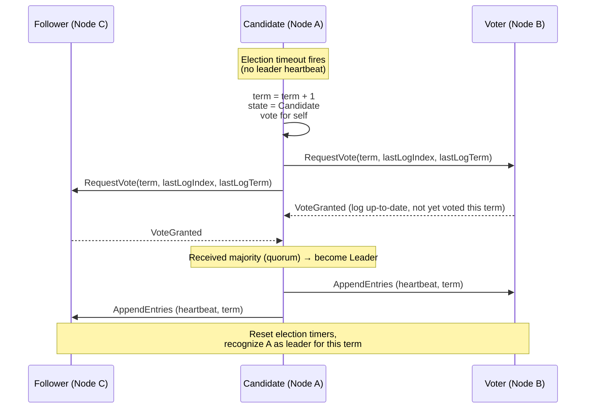
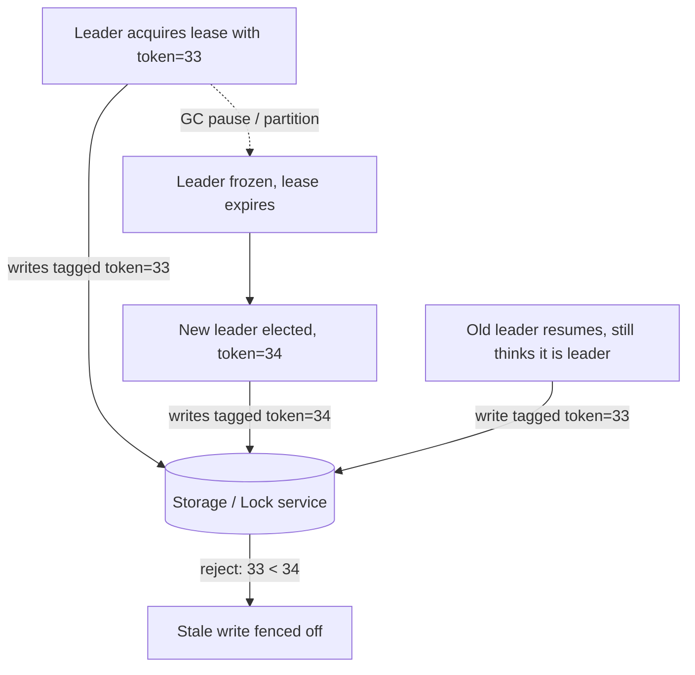

# Leader Election

> Difficulty: 🔴 Very Hard

## TL;DR

Leader election is the process by which a distributed system designates a single node to coordinate work (writes, scheduling, sequencing) so that operations that must be serialized have one authoritative owner. The hard part is not picking a leader — it is guaranteeing that *at most one* leader acts at a time despite network partitions, clock skew, and process pauses, which is why production systems combine a consensus-based election (e.g., Raft) with **leases** and **fencing tokens** to prevent split-brain.

## Overview

Many distributed problems become dramatically simpler if exactly one node is "in charge." A leader can serialize writes, assign monotonic sequence numbers, own a shard, run a cron job once, or coordinate replication. Without a leader you must fall back on more expensive per-operation consensus or CRDTs.

The core problem leader election solves: **turn a symmetric cluster of interchangeable nodes into an asymmetric one with a single coordinator, and re-elect quickly and safely when that coordinator fails.**

The danger is subtle. Detecting failure over an asynchronous network is impossible to do perfectly — you cannot distinguish a crashed node from a slow one or a partitioned one. A naive election can therefore produce **two leaders simultaneously** (split-brain), each accepting conflicting writes, corrupting data. Getting this right is the difference between a system that stays consistent under failure and one that silently loses data.

## Key Concepts

- **Leader (Master/Primary/Coordinator):** the single node authorized to perform coordinated operations at a given time.
- **Term / Epoch:** a monotonically increasing integer identifying an "administration." Every new election increments it. Used to reject stale leaders.
- **Quorum:** a majority (⌊N/2⌋ + 1) of nodes. Requiring a quorum to elect guarantees any two elections overlap in at least one node, preventing two leaders in the same term.
- **Lease:** a time-bounded grant of leadership. The leader must renew before expiry; if it cannot, it must stop acting. Converts "I am leader" into "I am leader *until time T*."
- **Fencing token:** a monotonically increasing number handed out with leadership (or a lock) and validated by downstream resources, so a stale leader's writes are rejected.
- **Split-brain:** the failure mode where two or more nodes each believe they are the leader and act concurrently.
- **Failure detector:** the heartbeat/timeout mechanism that suspects a node has died. Always imperfect on an async network (FLP impossibility).
- **Bully / Ring algorithms:** classic (pre-consensus) election algorithms that assume synchronous, reliable networks — useful for teaching, rarely safe in production as-is.

## How It Works

At a high level: nodes exchange heartbeats; when the current leader's heartbeats stop, a **failure detector** on some node fires a timeout, and that node triggers an **election**. A safe election requires a **quorum** of votes so that only one candidate can win a given term. The winner then broadcasts authority, ideally backed by a **lease** so it self-limits, and downstream systems enforce a **fencing token** so a zombie old leader cannot cause damage.

Below is Raft's leader election, the modern reference implementation.

Key safety rules that make this correct:
- Each node grants **at most one vote per term** → at most one leader per term.
- A candidate needs a **majority** → two candidates cannot both win the same term.
- Votes are only granted to candidates whose log is **at least as up-to-date** → the elected leader has all committed entries (Raft's Leader Completeness).
- **Randomized election timeouts** (e.g., 150–300 ms) reduce the chance of split votes; on a split vote the term ends with no leader and everyone retries.

The lease + fencing layer handles the ugly real world:

## Types / Patterns / Strategies

| Approach | How leader is chosen | Safety model | Typical use |
|---|---|---|---|
| **Bully algorithm** | Highest node ID wins; higher-ID nodes "bully" lower ones during election | Assumes synchronous, reliable network; unsafe under partitions | Textbook / small trusted clusters |
| **Ring algorithm** | Election message circulates the logical ring; highest ID collected wins | Same synchronous assumptions | Textbook / token-ring style systems |
| **Consensus-based (Raft/Paxos/Multi-Paxos/ZAB)** | Quorum vote with terms/epochs | Safe under partitions & async network | etcd, Consul, ZooKeeper, Kafka KRaft |
| **Coordination service / distributed lock** | Ephemeral znode / lease key; whoever holds it leads | Delegates consensus to ZooKeeper/etcd | App-level leader (schedulers, singletons) |
| **Lease-based (single-writer)** | Renewable time-bound lock; often layered on the above | Time-bounded; needs bounded clock skew + fencing | HDFS NameNode, Chubby-style locks |

Rule of thumb: use **Bully/Ring** only to explain concepts in interviews; use **Raft or a coordination service** in real systems; always add **fencing tokens** if a stale leader could touch shared state.

## When to Use / When to Avoid

**Use leader election when:**
- You need a single writer to serialize updates or hand out monotonic IDs.
- Exactly one instance of a job/scheduler/coordinator must run (singleton pattern).
- You own a partitioned system where each shard needs a primary replica.
- You need fast failover with strong consistency (financial ledgers, metadata stores).

**Avoid or reconsider when:**
- The workload is naturally **leaderless / multi-writer** and can tolerate eventual consistency (Dynamo-style, CRDTs) — leaderless avoids the election bottleneck and single point of write.
- Coordination cost dominates: a leader is a throughput ceiling and a failover-latency risk.
- You cannot enforce fencing on the shared resource — then a leader gives you a false sense of safety.
- The problem is embarrassingly parallel and needs no serialization at all.

## Trade-offs

| Pros | Cons |
|---|---|
| Simplifies coordination: one authoritative decision-maker | Single point of write; throughput bounded by the leader |
| Enables strong consistency & linearizable writes | Failover window causes brief unavailability (CP over AP) |
| Monotonic ordering / sequence generation is trivial | Elections add latency and complexity; tuning timeouts is tricky |
| Well-understood, battle-tested (Raft/ZAB) | Requires quorum → needs ≥3 (usually odd) nodes; costs capacity |
| Leases + fencing give provable single-writer safety | Clock skew, GC pauses, and partitions can still cause split-brain if fencing is missing |

## Real-World Examples

- **etcd** (Kubernetes control plane store) — uses **Raft** for leader election; K8s controller-manager and scheduler use etcd leases (`Lease` API) to elect a single active leader.
- **Apache ZooKeeper** — implements **ZAB**; provides the primitives (ephemeral sequential znodes) many systems use for their own leader election.
- **Apache Kafka** — historically used ZooKeeper for controller/partition-leader election; **KRaft** mode (default in Kafka 3.3+/4.0) replaces ZooKeeper with a built-in Raft quorum for controller election.
- **HashiCorp Consul / Nomad / Vault** — use Raft for server leader election.
- **HDFS** — active/standby NameNode failover coordinated via ZooKeeper (ZKFC) with fencing to prevent split-brain of the metadata master.
- **Google Chubby / Spanner** — Chubby is a Paxos-backed lock service used for master election across Google; Spanner uses Paxos groups with leader leases (bounded by TrueTime).
- **Redis Sentinel / Redis Cluster** — quorum-based promotion of a replica to primary on failure.
- **MongoDB** — replica sets run a Raft-like protocol to elect a primary.

## Common Pitfalls

- **No fencing token.** The classic bug: a leader hits a long GC/STW pause, its lease expires, a new leader is elected, then the old leader wakes up and writes — corrupting state. Fencing tokens (rejected if lower than the current) are the fix.
- **Relying on wall-clock time across nodes.** Clock skew makes lease-expiry reasoning wrong. Reason with monotonic clocks and conservative lease margins; assume skew exists.
- **Even number of nodes.** With 4 nodes, quorum is still 3, so you tolerate only 1 failure — same as 3 nodes but more cost and higher split-vote risk. Use **odd** counts (3, 5, 7).
- **Election timeout too short.** Causes flapping / repeated elections under transient latency; too long causes slow failover. Tune relative to network RTT and heartbeat interval.
- **Assuming synchronous networks** (why raw Bully/Ring is dangerous) — they can elect two leaders under partition.
- **Treating "I won the election" as permanent.** Leadership must be continuously reasserted (heartbeats/lease renewal); a leader that loses quorum must **step down**.
- **Split-brain during network partition.** Both sides elect a leader if neither requires a majority. Always require quorum; the minority side must go read-only or reject writes.
- **Confusing liveness with safety.** FLP tells us you can't guarantee an election *always terminates* under pure asynchrony; you trade some liveness (timeouts) but must never trade safety.

## Interview Questions & Answers

**Q: Why do we need a leader at all — why not have every node accept writes?**
**A:** A single leader lets you serialize operations, produce a single ordering (monotonic sequence numbers), and get linearizable writes cheaply. Leaderless/multi-writer designs (Dynamo, CRDTs) avoid the single-writer bottleneck and are more available, but push conflict resolution to the application and typically only offer eventual consistency. You choose a leader when you need strong ordering/consistency and can tolerate the failover window and throughput ceiling.

**Q: How does Raft guarantee at most one leader per term?**
**A:** Each election uses a new, higher **term**. A node votes **at most once per term** and a candidate must collect a **majority (quorum)** to win. Because any two majorities intersect in at least one node, and that node can only vote once, two candidates cannot both gather a majority in the same term. If neither wins (split vote), the term ends leaderless and randomized timeouts trigger a retry with a new term.

**Q: What is split-brain and how do you prevent it?**
**A:** Split-brain is when a network partition (or a slow/paused leader) leads two nodes to each believe they are leader and accept conflicting writes. Prevention: (1) require a **quorum** to elect and to commit, so the minority partition cannot elect or accept writes; (2) use **leases** so a leader that loses contact self-expires; (3) use **fencing tokens** so any stale leader's writes are rejected by the storage/resource layer.

**Q: A leader acquires a lock/lease, then pauses for 30s (GC). The lease expires and a new leader is elected. The old leader wakes up and issues a write. What happens, and how do you make it safe?**
**A:** Without protection, the old leader corrupts data — it still "thinks" it's leader. The fix is **fencing tokens**: each leadership grant includes a monotonically increasing token; every write carries the token; the storage layer records the highest token seen and **rejects any write with a lower token**. The old leader's token (say 33) is now less than the new leader's (34), so its write is fenced off. This is Martin Kleppmann's canonical example.

**Q: Compare the Bully algorithm with Raft. Why isn't Bully used in production?**
**A:** Bully elects the highest-ID reachable node; it assumes a **synchronous, reliable network** and complete failure detection. Under real partitions or slow links it can produce two leaders and gives no term/quorum safety. Raft assumes an **asynchronous** network, uses **terms + quorum voting + log-completeness checks**, and remains safe under partitions (sacrificing some liveness via timeouts). Bully is a teaching tool; Raft (or Paxos/ZAB) is what you actually ship.

**Q: How do you pick election timeout and heartbeat intervals?**
**A:** Heartbeat interval should be well below the election timeout (commonly heartbeat ≈ 1/10 of the timeout). Election timeout should be a few multiples of typical network RTT so transient latency doesn't trigger needless elections, and **randomized** across a range (e.g., 150–300 ms in the Raft paper) to avoid split votes. Trade-off: shorter timeouts = faster failover but more false positives/flapping; longer = stable but slower recovery.

**Q: Why an odd number of nodes?**
**A:** Fault tolerance is determined by quorum = ⌊N/2⌋+1, tolerating N−quorum failures. 3 nodes tolerate 1 failure; 4 nodes *also* tolerate only 1 (quorum jumps to 3) but cost more and split more easily; 5 tolerate 2. So odd counts give the best fault-tolerance-per-node and reduce split-vote/tie probability.

**Q: Can leader election guarantee a leader is always elected quickly? What does FLP say?**
**A:** The **FLP impossibility** result says no deterministic algorithm can guarantee both safety and liveness (termination) in a fully asynchronous network with even one crash failure, because you can't distinguish "slow" from "dead." Practical systems keep **safety** absolute (never two leaders) and get **liveness** in practice by adding timeouts/randomization and assuming partial synchrony — so elections *usually* terminate quickly, but not provably always.

## Further Reading

- Diego Ongaro & John Ousterhout, *"In Search of an Understandable Consensus Algorithm (Raft)"* (2014) — the Raft paper; see also raft.github.io and the interactive visualization.
- Martin Kleppmann, *"How to do distributed locking"* (2016 blog) — the definitive treatment of leases, fencing tokens, and why locks alone aren't enough.
- Martin Kleppmann, *Designing Data-Intensive Applications*, Ch. 8–9 (leaders, consensus, faults) — O'Reilly.
- Mike Burrows, *"The Chubby lock service for loosely-coupled distributed systems"* (Google, 2006).
- Leslie Lamport, *"Paxos Made Simple"* (2001) and *"Impossibility of Distributed Consensus with One Faulty Process"* (Fischer, Lynch, Paterson, 1985).
