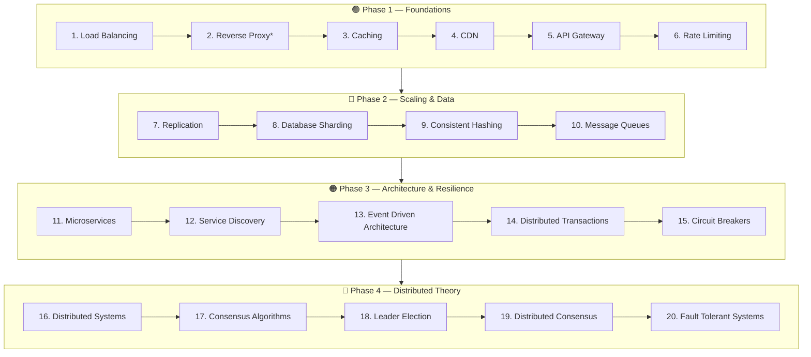

# 🧭 System Design Concepts — A Structured Learning Path

A curated, interview-focused system design study resource covering **20 core concepts** across **4 difficulty tiers**. Each guide is deep, self-contained, and includes Mermaid diagrams, real-world examples, trade-offs, and interview Q&A.

Use this as your go-to reference throughout your software engineering journey — for interview prep, design reviews, and day-to-day architecture decisions.

---

## 📊 Difficulty Ranking

| Tier | Badge | Meaning | Prerequisite mindset |
|------|-------|---------|----------------------|
| Easy | 🟢 | Foundational building blocks in almost every architecture | Basic web/networking knowledge |
| Moderate | 🔵 | Scaling and data-layer patterns | Comfortable with the Easy tier |
| Hard | 🟠 | Architectural styles and failure handling across services | Comfortable with distributed basics |
| Very Hard | 🔴 | Core distributed-systems theory and reliability | Comfortable with the Hard tier |

---

## 📚 The 20 Concepts

### 🟢 Easy — Foundations
| # | Topic | Guide |
|---|-------|-------|
| 1 | Load Balancing | [01-easy/load-balancing.md](01-easy/load-balancing.md) |
| 2 | CDN | [01-easy/cdn.md](01-easy/cdn.md) |
| 3 | Caching | [01-easy/caching.md](01-easy/caching.md) |
| 4 | API Gateway | [01-easy/api-gateway.md](01-easy/api-gateway.md) |
| 5 | Rate Limiting | [01-easy/rate-limiting.md](01-easy/rate-limiting.md) |

### 🔵 Moderate — Scaling & Data
| # | Topic | Guide |
|---|-------|-------|
| 6 | Message Queues | [02-moderate/message-queues.md](02-moderate/message-queues.md) |
| 7 | Database Sharding | [02-moderate/database-sharding.md](02-moderate/database-sharding.md) |
| 8 | Replication | [02-moderate/replication.md](02-moderate/replication.md) |
| 9 | Reverse Proxy | [02-moderate/reverse-proxy.md](02-moderate/reverse-proxy.md) |
| 10 | Consistent Hashing | [02-moderate/consistent-hashing.md](02-moderate/consistent-hashing.md) |

### 🟠 Hard — Architecture & Resilience
| # | Topic | Guide |
|---|-------|-------|
| 11 | Microservices | [03-hard/microservices.md](03-hard/microservices.md) |
| 12 | Event Driven Architecture | [03-hard/event-driven-architecture.md](03-hard/event-driven-architecture.md) |
| 13 | Distributed Transactions | [03-hard/distributed-transactions.md](03-hard/distributed-transactions.md) |
| 14 | Service Discovery | [03-hard/service-discovery.md](03-hard/service-discovery.md) |
| 15 | Circuit Breakers | [03-hard/circuit-breakers.md](03-hard/circuit-breakers.md) |

### 🔴 Very Hard — Distributed Systems Theory
| # | Topic | Guide |
|---|-------|-------|
| 16 | Distributed Systems | [04-very-hard/distributed-systems.md](04-very-hard/distributed-systems.md) |
| 17 | Consensus Algorithms | [04-very-hard/consensus-algorithms.md](04-very-hard/consensus-algorithms.md) |
| 18 | Leader Election | [04-very-hard/leader-election.md](04-very-hard/leader-election.md) |
| 19 | Distributed Consensus (applied) | [04-very-hard/distributed-consensus.md](04-very-hard/distributed-consensus.md) |
| 20 | Fault Tolerant Systems | [04-very-hard/fault-tolerant-systems.md](04-very-hard/fault-tolerant-systems.md) |

---

## 🎯 Suggested Learning Order

Concepts build on each other. Follow this order rather than jumping around — later topics assume vocabulary from earlier ones.

> *Reverse Proxy is filed under Moderate but is conceptually close to Load Balancing — read them back to back.

### Recommended weekly pace
| Week | Focus | Topics |
|------|-------|--------|
| 1 | 🟢 Foundations | Load Balancing → Rate Limiting (1–5) + Reverse Proxy |
| 2 | 🔵 Scaling & Data | Replication, Sharding, Consistent Hashing, Message Queues |
| 3 | 🟠 Architecture | Microservices, Service Discovery, EDA, Distributed Transactions, Circuit Breakers |
| 4 | 🔴 Distributed Theory | Distributed Systems → Fault Tolerant Systems (16–20) |

---

## 🧩 How Each Guide Is Structured

Every guide follows the same template so you always know where to look:

1. **TL;DR** — skim-friendly summary
2. **Overview** — the problem it solves
3. **Key Concepts** — vocabulary
4. **How It Works** — explanation + Mermaid diagram(s)
5. **Types / Patterns / Strategies**
6. **When to Use / When to Avoid**
7. **Trade-offs** — pros vs cons table
8. **Real-World Examples** — named systems
9. **Common Pitfalls**
10. **Interview Questions & Answers**
11. **Further Reading**

---

## 📈 Track Your Progress

See **[PROGRESS.md](PROGRESS.md)** for a checklist to mark topics as you complete them.

---

## 💡 How to Use This Resource

- **Interview prep:** Read the TL;DR + Interview Q&A of each guide first, then deep-dive weak areas.
- **Design reviews:** Jump to the *Trade-offs* and *When to Avoid* sections.
- **Learning from scratch:** Follow the Suggested Learning Order top to bottom.
- **Spaced repetition:** Revisit the Interview Q&A sections periodically.
